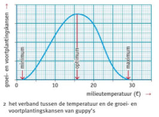

# Duurzaamheid en ecologie

## Voedsel en kringelopen

Het milieu van een organisme is zijn leefomgeving, en een organisme heeft daar invloed op. De ecologie is het deel van de biologie die de relatie tussen organismes en hun milieu onderzoekt.

Biotische factoren zijn levende dingen die invloed hebben op het milieu, abiotische factoren zijn levenloos.

Je hebt verschillende schaalniveau's binnen de ecologie:

- **Individu**: één organisme
- **Populatie**: een soort in een bepaald gebied
- **Levensgemeenschap**: alle populaties (in een gebied) samen
- **Biotoop**: de abiotische factoren
- **Ecosysteem**: levensgemeenschap + biotoop
- **Bioom**: deel van de biosfeer met een kenmerkend klimaat (_bijv. toendra of woestijn_)
- **Biosfeer**: het deel van de aarde die leven bevat (_van 10km hoog tot 10km in de grond_)

Een voedselketen bestaat uit organismes die elkaar eten. De eerste schakel is **altijd** een plant (een producent), want die zet zonlicht om in energie (=fotosynthese met de bladgroenkorrels). De tweede schakel (een consument van de 1e orde) is altijd een planteneter en vanaf daar zijn het canivoren en alleseters (consumenten van de 2e+ orde).

Als dieren doodgaan zonder opgegeten te worden worden ze vaak opgeruimd door afvaleters (ook consumenten). De resten worden vervolgens afgebroken door reducenten (schimmels en bacteriën) en omgezet in voedingsstoffen in de bodem. Hierdoor ontstaat er een kringloop (want de producenten gebruiken de voedingsstoffen weer). Dingen die reducenten kunnen afbreken zijn biologisch afbreekbaar. Dingen die ze niet kunnen afbreken (zoals plastic, glas of metaal) zijn niet-biologisch afbreekbaar.

Meerdere voedselketens gemixt noemen we een voedselweb/voedselnet.

Producenten zijn autoroof, want ze produceren zelf energie. Consumenten zijn heteroroof, want ze moeten zich voeden met andere organismes om energie te verwerven.

Als je een piramide van biomassa tekent is het altijd een piramide (onder groot, boven klein), want je kan nooit meer massa hebben dan de dingen die je eet, want massa kan niet uit het niks ontstaan.

Bij een piramide van aantallen kunnen echter er wel rare vormen ontstaan. Je kan bijv. heel veel vogels voeden met één kersenboom.

Als planten giftige zware metalen, afkomstig uit de industrie, opnemen kunnen ze daar niks mee. De dieren die de planten eten krijgen deze persistente (niet afbreekbare) stoffen ook binnen, en daar wordt het opgeslagen in het vetweefsel. Zo bewegen de persistente stoffen zich naar boven in de voedselketen. Maar omdat de persistente stoffen niet verloren gaan hopen ze zich boven in de voedselketen op. Dit noemen we accumulatie (engels voor verzamelen).

_Dit geld ook voor chemische stoffen of bestrijdingsmiddelen._

## Samenleven

De optimale omstandigheden voor een soort zijn de (a)biotische factoren waarbij een populatie het best groeit (_bijv. veel voedsel en weinig vijanden/concurrentie_).

Vaak schommelt de populatiegrootte van een populatie om een evenwichtspunt. Dit punt noemen we het biologisch evenwicht.

De optimumkromme is een grafiek waarin de overlevingskansen van een soort bij bepaalde factoren staan.

Vaak is er geen sprake van concurrentie tussen soorten omdat ze zich specialiseren. Ze hebben hun eigen rol, hun niche, binnen het ecosysteem.

Je hebt verschillende soorten van samenleven:

- **Samenwerking**: soorten werken samen om een gemeenschappelijk doel te bereiken.
- **Concurrentie**: soorten strijden om hetzelfde doel te bereiken.
- **Symbiose**: een langdurige relatie tussen twee soorten
	- Mutualisme: beide soorten hebben voordeel van de relatie
	- Commensalisme: één van de soorten heeft maar voordeel van de relatie, maar de andere heeft geen nadeel
	- Parasitisme: een soort (de parasiet) heeft voordeel, maar de andere soort (de gastheer) heeft er een nadeel aan.

_Een parasiet leeft in/op zijn gastheer en kan vaak zonder niet overleven._

## Natuurbeheer

De mens heeft de natuur nodig om te overleven. We gebruiken de natuur voor:

- Energiewinning
- Voedselproductie
- Water
- Zuurstof
- Recreatie

Er is in Nederland praktisch geen wilde natuur meer. Heel Nederland is een cultuurlandschap: een landschap dat is gevormd onder de invloed en voor de behoeften van de mens. Dit komt oa. door:

- Waterbeheer
- Landbouw
- Energiewinning
- Woonruimte

De bossen die we nog hebben zijn vrijwel allemaal aangeplant voor bosbouw: het gebruiken van een bos voor houtproductie als bouwmateriaal of brandstof.

De mens gebruikt 75% van het landoppervlak van de aarde. Hierdoor worden de leefgebieden van dieren verkleind of verdwijnen gewoon volledig. Hierdoor nemen ecosystemen af en worden dieren bedreigd (met uitsterven tot gevolg). Hierdoor neemt de biodiversiteit, de variatie in soorten binnen een gebied, af. 

_Dit is ook een bedreiging voor ons, want we hebben de natuur nodig om te overleven._

Herintroductie is het terugbrengen van een soort in een gebied. Dit is een vorm van natuurbeheer: alle maatregelen om de natuur (gebieden niet gebruikt voor wonen, werken, landbouw of verkeer) te behouden, beschermen en herstellen. 

**LET OP: NOG NIET AF. IK HEB BS5 TM 8 NOG NIET SAMENGEVAT.**