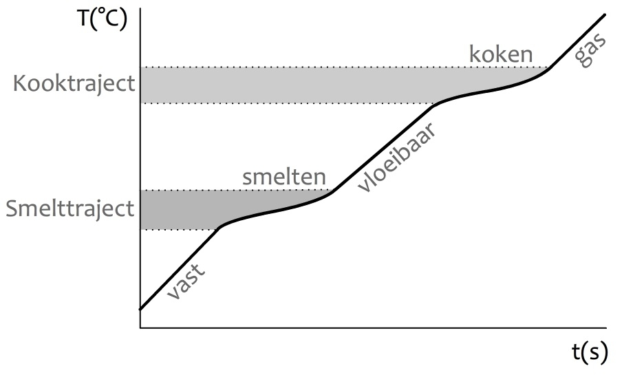
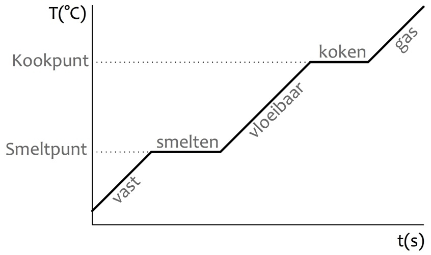

# I fucking <3 chemistry

## Hoofdstuk 1

Stofeigenschappen zijn:

- Fase bij kamertemperatuur
- Geur
- Kleur
- Smaak
- Kookpunt, smeltpunt etc.

Een mengsel heeft een smelttraject, een zuivere stof een smeltpunt (te herkennen aan een horizontaal stuk in de grafiek).

| Mengsel | Zuivere stof |
| ------- | ------------ |
|  |  |

### Mengsels

| Naam      | mengsel van             | helder? |
| --------- | ----------------------- | ------- |
| Emulsie   | vloeistoffen            | troebel |
| Suspensie | vaste stof en vloeistof | troebel |
| Oplossing | vloeistoffen of vaste stof en vloeistof | helder | 
| Rook      | vaste stof en gas       | troebel |
| Schuim    | vloeistof en gas        | troebel |

### Fase overgangen


### Rekenen

```
dichtheid = massa / volume
oplosbaarheid = massa opgeloste stof / volume oplosmiddel
concentratie = massa opgeloste stof / volume oplossing
```

### Scheidingsmethodes

| Scheidingsmethode | verschil in     | gebruikt voor |
| ----------------- | --------------- | ------------- |
| Filtreren/zeven   | deeltjesgrootte | suspensie     |
| Bezinken en afschenken | dichtheid       | suspensie     |
| Centrifugeren     | dichtheid       | suspensie     |
| Extraheren        | oplosbaarheid   | mengsel van vaste stoffen _(remember: theezakje)_
| Indampen          | kookpunt        | oplossing     |
| Adsorberen        | aanhechtingsvermogen | oplossing of gasmengsel
| Destilleren       | kookpunt        | goed mengbare vloeistoffen
| Chromatografie    | aanhechtingsvermogen en oplosbaarheid | oplossing 


## Hoofdstuk 2

```
1 °C = 273 K
1 K = -273 °C
```

**Endotherm**: heeft extra energie nodig. Als je de energiebron wegneemt stopt de reactie.

**Exotherm**: geeft energie af. Als je de energiebron weg haalt blijft de reactie doorgaan. Er is alleen een externe energiebron nodig om de reactie te starten

## Hoofdstuk 3

Een moleculaire stof bestaat uit meerdere niet-metalen en is opgebouwd uit moleculen. In een metaal zitten de atomen in een metaalrooster. Een zout is een combinatie van een niet-metaal en metaal de atomen ervan zitten in een ionenrooster. Bij een zout zeg je niet de mono, di, tri etc. in de systematische naamgeving, want de atomen zitten alleen in een bepaalde verhouding in het ionenrooster en het is dus overbodig.

### Stroomgeleiding

Metalen geleiden in zowel vloeibare en vaste vorm. Zouten alleen in vloeibare vorm en moleculaire stoffen geleiden helemaal niet.

### Niet-systematische namen

| Stof     | formule |
| -------- | ------- |
| water    | H₂O     |
| methaan  | CH<sub>4</sub>
| propaan  | C<sub>3</sub>H<sub>8</sub>
| butaan   | C<sub>4</sub>H<sub>10</sub>
| ammoniak | NH<sub>3</sub>
| glucose  | C<sub>6</sub>H<sub>12</sub>O<sub>6</sub>

## Hoofdstuk 4

### Reagens

| Reagens       | toont aan | waarneming               |
| ------------- | --------- | ------------------------ | 
| custardpoeder | water     | wit -> geel              |
| kopersulfaat  | water     | wit -> blauw             | 
| kalkwater     | CO₂       | helder -> troebel en wit |
| joodoplossing | SO₂       | geelbruin -> kleurloos   |
| joodoplossing | zetmeel   | geelbruin -> zwartblauw  |

### Verbanding

Voor een verbranding heb je minimaal 3 dingen nodig:

- Zuurstof
- Brandstof
- Hoge temperatuur

Een explosie vind plaats als er precies de juiste verhouding brandstof en zuurstof is. Dan verband in één keer alle brandstof, waarbij er veel energie vrijkomt.

Verbrandingsproducten:
- H -> H₂O
- C -> CO₂
- S -> SO₂

#### Blusmiddel kiezen

- Gebruik geen water in de pan of bij elektrische apparaten
- Gebruik blusdeken bij kleding of haar
- Zand, water, poeder, schuim, het blusdeken en CO₂ zorgen er allemaal voor dat er geen zuurstof meer bij de vlam kan komen.
- Poeder geeft veel opruimwerk

### Zuurgraad (pH-waarde)

Hoe zuurder een stof, hoe lager zijn pH-waarde. Hoe hoger de pH-waarde hoe basischer (zeepachtig). 

pH 7 is neutraal, en daar kunnen we het best tegen, dus zijn de meeste producten voor mensen rond de pH 7. 

< 3 of > 11 zijn schadelijk voor mensen.
Zuur kalkt, basisch ontvet.

### Chemische reacties

- **Vormingsreactie**: er zijn meerdere beginproducten en één reactieproduct
- **Synthesereacties**: er ontstaan meerdere reactieproducten uit meerdere beginproducten
- **Ontleding**: er is één beginproduct en meerdere reactieproducten.
	- Thermolyse dmv. temperatuur
	- Fotolyse dmv. licht
	- Elektrolyse dmv. elektriciteit

Verbranding is een reactie met zuurstof. Alle beginstoffen gaan een verbinding met zuurstof aan. 

_Oxidatie is verbranding zonder vuurverschijnselen._