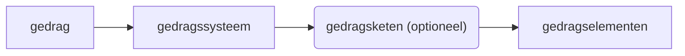

# Gedrag

## §1: Gedrag en dierenwelzijn

Gedrag is alles wat mensen en dieren doen en laten. Het is reageren op veranderende leefomstandigheden. De functie van gedrag is het overleven van het individu, en daarmee ook het voorbestaan van de soort.

Het welzijn van dieren is hoger als ze natuurlijk gedrag kunnen uitoefenen. Varkens moeten bijv. kunnen foerageren (= zoeken naar eten) in hun stal.

Er zijn twee soorten prikkels:

- **Inwendig**: hormonen, honger/dorstgevoel, plassen etc.
- **Uitwendig**: komen binnen via zintuigen

Prikkels verhogen de motivatie om bepaald gedrag uit te voeren. Als de drempelwaarde bereikt is leid dat tot een respons.

Gedrag bestaat uit gedragselementen: handelingen. Verschillenden gedragselementen die samen een gemeenschappelijk doel bereiken heet een gedragssysteem. Een gedragssysteem bestaat uit losse gedragselement, of een gedragsketen. Een keten is een aantal gedragselementen in vaste volgorde. Samenvattend:

### Balts

Balts is gedrag waarbij, vaak overdreven, (soortspecifieke) signalen worden uitgewisseld. Het verminderd agressie en vergroot de bereidheid tot paring.

#### Functies van balts:

- Gelijktijdig bereid voor paring
- Laten zien dat je een geschikte partner bent
- Angst en agressie verminderen

BIj de balts komt veel ritueel gedrag voor. Dit zijn gedragselementen die ooit een functie hadden (bijv. veren poetsen, drinken), maar nu volledig symbolisch geworden zijn.

## §2: Gedrag bestuderen

Een ethogram is een lijst met objectief en nauwkeurige beschreven gedragselementen.
Een protocol laat zien hoe vaak gedragselementen in een bepaalde periode voorkomen.

Onderzoek naar gedrag van dieren valt onder de ethologie. Het werkt dmv. metingen en tellingen.

Een sleutelprikkel is een prikkel waarop altijd hetzelfde gedrag volgt. Bij olifanten is dat bijv. het zoemen van bijen. Een supernormale prikkel is een versterkte versie van de sleutelprikkel die normaalgesproken niet echt in de natuur voorkomt.

## §3: Communicatie

Het kindschema bestaat uit een aantal kenmerken (uiterlijk). Als een mens/dier/cartoon/whatever deze kenmerken heeft roept het gevoelens van vertedering bij ons op (= we vinden het schattig).

- Groot hoofd in relatie tot het lichaam
- Bolle wangen
- Grote ogen

Signalen zijn prikkels die dieren uitzenden om met hun soortgenoten te communiceren. Het is een soortspecifieke manier om informatie over te dragen dmv. houding, kleuren, geur etc.

Vaak hebben dieren ook een rangorde. Vaak betekent een hogere plaats in de rangorde grotere invloed bij de paring. In veel situaties betekent een grotere hoeveelheid testosteron een hogere plaats in de rangorde. Om een hogere plaats in de rangorde te krijgen vertonen dieren dit gedrag:

- Dreiggedrag
- Imponeergedrag
- Verzoeningsgedrag

Een voorbeeld van zo'n rangorde is de pikorde bij kippen. Vaak zorgt een rangorde ervoor dat een groep optimaal functioneert (denk bijv. aan een insectenstaat) en is daarom belangrijk voor het voortbestaan van de soort.

Als dieren tegenstrijdige prikkels binnenkrijgen vertonen zij conflictgedrag. Er zijn 4 typen:

- **Ambivalent gedrag**: als gedragselementen van twee gedragssystemen elkaar afwisselen.
- **Omgericht gedrag**: leid tot agressie, maar niet op de tegenstander, maar de omgeving.
- **Overspronggedrag**: overschakelen op een totaal ander gedragssysteem.
- **Dreiggedrag**: agressieve houding naar de tegenstander zonder aan te vallen. Vaak verkomt dit gevechten, en daarmee dus ook eventuele verwondingen.

## §4: Leren

Je hebt 2 soorten gedrag:

- Aangeboren
- Aangeleerd

Leren is het aanpassen aan veranderende leefomstandigheden. Het vergroot onze overlevingskans.

Er zijn zes manieren van leren:

- **Inprenting** (in de gevoelige periode)
- **Gewenning**: niet langer op een bepaalde prikkel reageren
- **Imitatie**: (soortgenoten) nadoen
- **Inzicht** (en spelen)
  Bij spelen ontwikkelen dieren sociaal gedrag.

- **Conditioneren** (ookwel _associatief leren_ genoemd)
  - **Klassiek**: dmv. reflexen (Pavlov)  
    meerdere prikkels worden gecombineerd
  - **Operatief**: dmv. trial-and-error (Skinnerbox)
    meerdere handelingen worden gecombineerd

## §4: Omgaan met elkaar

Cultuur is het verschijnsel dat verschillende individuen in een groep vergelijkbaar gedrag vertonen (= altijd aangeleerd).

Dieren hebben ook cultuur (denk aan regionale zang bij apen).

Unieke kenmerken van mensen:

- Nadenken over (eigen) gedrag
- (Gedrag) beoordelen
- Inlevingsvermogen
- Voorstellingsvermogen
- Ingewikkelde taal

Dit zorgt ervoor dat mensen normen en waarden kunnen ontwikkelen. Waarden zijn dingen die we belangrijk vinden (zoals eerlijkheid, respect, vrijheid, rechtvaardigheid). Normen zijn de gedragsregels bij die waarden (zoals niet stelen).

Een rolpatroon is gedrag dat andere in een bepaalde situatie van je verwachten. Ze worden bepaald door de cultuur.
