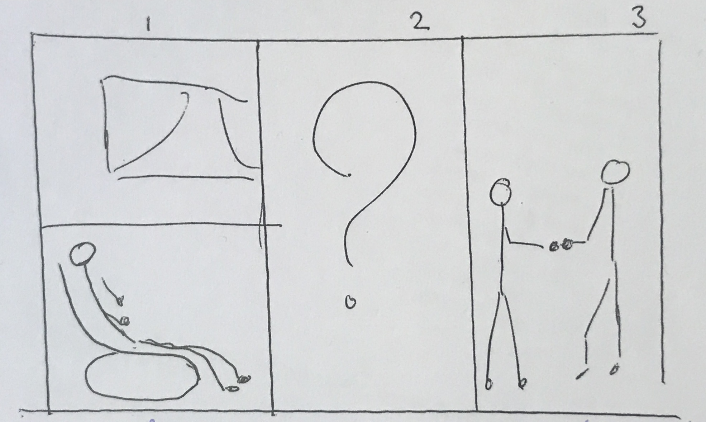

Ik heb dit blok voor filmmuziek gekozen omdat ik nieuwsgierig was hoe muziek in films ons psychologisch gezien beinvloedt. Verder hoopte ik te leren hoe bepaalde motieven/melodiën bepaalde emoties oproepen, al weet ik daar nog steeds erg weinig van.

Ik kende voor deze lessen nog bijna geen filmmuiek, naast de themesongs dan. Ik ken nu iets meer filmmuziek (vooral dankzij [de DWDD video van JunkieXL](https://www.youtube.com/watch?v=uzSHplbvdmU) die we in tijdens de les hebben gekeken en het spel waar je de film bij de muziek moest raden).

Ik had eigen nog nooit gemerkt dat veel filmmuziek uit maar één akkoord bestaat, maar ik vind het wel erg interessant hoe je met zo weinig akkoorden zulke goede muziek kan maken.

Ik heb met Kevin, Sem en Jordy samengewerkt. We hebben het langst gedaan over de analyse van de filmtrailer en (in mijn beleving) de minste tijd besteed aan het componeren van muziek voor [La Linea](https://www.youtube.com/watch?v=I86bXhxkXIA).

We hebben op voor dit blok _[Three Thousand Years of Longing](https://en.wikipedia.org/wiki/Three_Thousand_Years_of_Longing)_ gekeken. Ik vond dat de film niet echt een logische verhaallijn had. Hij begon met hoe de hoofdpersoon een narratoloog is en ze dus de gevaren van wensen doen erg goed kent uit de verhalen die worden verteld. Ze heeft geen verlangens en wil dus eigenlijk geen wens doen. Dan vertelt de Djinn zijn levensverhaal dat dit standpunt bevestigd en goed onderbouwt. Dan komt er ineens een 180 en heeft ze ineens een erg cliché verlangen, waarna de film een beetje onsamenhangend wordt.

Mijn mening over de verhaallijn is natuurlijk niet echt relevant in het kader van filmmuziek. Ik heb geprobeerd op de filmmuziek te letten, maar dat is erg moeilijk. De geluidseffecten vielen met wel heel erg op. Misschien is dit omdat de muziek veel minder bewust binnenkomt, veel subtieler.

Kortom denk ik dat deze periode erg interessant was, al was het wel anders dan ik had verwacht. Ik eigenlijk bijna niks nieuws geleerd, maar het was wel leuk. Ik had alleen gehoopt meer over de opbouw en effecten van filmmuziek te leren, meer concrete informatie. Het zelf maken van muziek is een leuk extraatje, maar was niet de primaire reden dat ik dit onderwerp had gekozen.

## Zelf gecomponeerde muziek

_(praktische opdracht 4)_

We hebben voor de volgende strip muziek gemaakt:

We moesten er eerst een verhaal bij verzinnen. We hebben dit bedacht:

1. Een oude man zit in zijn stoel bij het raam.
2. Hij probeert een kopje koffie te pakken maar valt van zijn stoel.
3. Zijn kleinzoon help hem overeind. De oude man bedankt hem.

De muziek begint rustig, waarna het tempo versnelt om de spanning op te bouwen. Op het laast wordt het tempo weer langzamer en wordt de muziek weer rustig als alles goed komt.

<audio src="strip-muziek.m4a" controls></audio>

_Ons originele stuk had een pitchbend E op een tweede keyboard erdoorheen om de spanning op te bouwen, maar ik heb thuis maar een keyboard en die heeft geen pitchbend, dus zit dat niet in de opname._

## Vorm, inhoud en materiaal

De vorm van filmmuziek staat vast en is natuurlijk audio. De inhoud kan heel erg varieren omdat je met filmmuziek allemaal soorten emoties kan oproepen. Het materiaal verschilt ook heel erg, maar je hebt meestal in ieder geval 1 soort instrument nodig. In veel gevallen werk je met ook iets van post-production/effecten.
