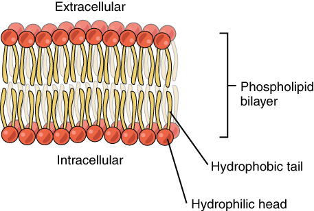
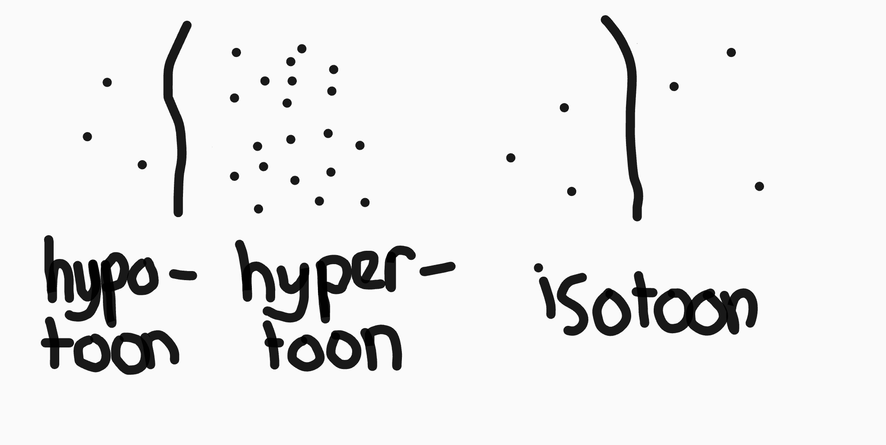

# H2: Cellen

## Organisatieniveau's

De biologie is opgedeeld in verschillende organisatieniveau's:

| Niveau             | Emergente eigenschap                       |
|--------------------|--------------------------------------------|
| Molecuul           | -                                          |
| Organel            | bijv. eiwitten produceren (ribosomen)      |
| Cel                | bijv. stoffen opnemen                      |
| Weefsel            | bijv. samentrekken (spierweefsel)          |
| Orgaan             | bijv. bloed rondpompen (hart)              |
| Organenstelsel     | bijv. voedsel verteren (verteringsstelsel) |
| Organisme          | bijv. rennen                               |
| Populatie          | bijv. groeien / krimpen                    |
| Soort              | bijv. voortbestaan                         |
| Lenvensgemeenschap | bijv. symbiose                             |
| Ecosysteem         | ??                                         |
| systeem Aarde      | ??                                         |

Een emergente eigenschap is een eigenschap is alleen kan bestaan vanaf een bepaald organisatieniveau.

Elk levend organisme voldoet aan deze levenskenmerken:

- Cellen met erfelijk materiaal (DNA)
- Ontwikkeling en groei
- Voortplanting
- Beweging
- Reageren op de omgeving
- Stofwisseling

## Stamcellen

Stamcellen zijn cellen die zich kunnen differenteren (= specialiseren) tot andere cellen. Dat noemen we celdifferentiatie.

Je hebt verschillende soorten stamcellen:

- **Pluripotent:** kunnen zich ontwikkelen tot _elke_ soort cel (dus ook tot cellen in de placenta en navelstreng).
- **Totipotent** (ookwel **embryonale stamcellen** genoemd): kunnen zich tot elke cel in ons lichaam ontwikkelen (maar niet tot cellen in placenta of navelstreng).
- **Multipotent:** kan zich tot 2 of meer cellen _in een weefsel_ ontwikkelen.
- **Unipotent:** kan zich maar tot 1 soort cel ontwikkelen.

De functie van een cel wordt bepaald door het eiwit/de eiwitten die hij produceert.

Hoe groter de oppervlakte van de cel tenopzichte van zijn volume, hoe sneller hij stoffen kan opnemen. Kleinere cellen nemen dus meer stoffen op. Dit heet oppervlaktevergroting.

## Opbouw van cellen

Cellen bestaan uit een celmembraan met daarin cytoplasma of grondplasma. In het cytoplasma bevinden zich organellen:

- **De kern:** vormt ribosomen of centrosoom
	- Het kernlichaampje
	- De kernmembraan (met daarin kernporiën)

- **Mitochondriën:**
	- Hebben een dubbel membraan
	- Verbranden glucose

- **Endoplasmatisch reticulum:** maakt vetten en transporteert moleculen
	- Bevind zich tegen de kern aan
	- Kan wel/geen ribosomen bevatten
		- Wel? ➔ ruw
		- Niet? ➔ glad

- **Ribosomen:** produceren eiwitten

- **Golgieapparaat:** vouwt en sorteer eiwitten
	- Lijkt op ER, maar is los van de kern en kleiner
	- Geen ribosomen

- **Plastiden:**
	- **Chloroplasten** (**bladgroenkorrels**): fotosynthese
	- **Chromoplaten** (**kleurstoffen**)
	- **Leukoplasten** of **amyloplasten** (**zetmeelkorrels**)

- **Lysosomen:** blaasjes met verteringsenzymen

- **Celskelet:** netwerk van eiwitdraden dat voor stevigheid zorgt

- **Centrosoom:** 
	- Bestaat uit 2 centriolen
	- Functie bij celdeling

- **Motoreiwitten:** vervoeren transportblaasjes

_Ribosomen die los in het grondplasma liggen maken eiwitten voor de cel. Die op het ER maken eiwitten voor de export._

### Verschil tussen dierlijke en plantencel

| Dierlijke cel          | Plantencel            |
|------------------------|-----------------------|
| Celmembraan            | Celwand + celmembraan |
| Geen of kleine vacuole | Grote vacuole         |
| Geen chloroplasten     | Chloroplasten         |
| Centrosoom             | Geen centrosoom       |

### Soorten cellen

- **Eukaryoot:** wel een celkern
- **Prokaryoot:** geen celkern
- **Autoroof:** kan zelf organisch materiaal maken van niet-organisch materiaal
- **Heteroroof:** heeft andere organismes nodig om organisch materiaal te maken

#### Schimmelcellen

Schimmels zijn heteroroof en eukaryoot. Ze kunnen eencellig (zoals gisten) of meercellig (paddestoelen) zijn. Bij meercellige schimmels is de scheiding tussen cellen vaak onvolledig zodat ze stoffen kunnen uitwisselen. 

Schimmels hebben een ER, Golgi-apparaat, ribosomen, lysosomen en mitochondriën. Hun celwand is gemaakt van chitine.

#### Bacteriën

Bacteriën zijn eencellige prokaryote organismes. Hun DNA ligt los in de cel. Daarnaast hebben ze ook plasmiden (kleine cirkelvormige DNA bolletjes) die ze met soortgenoten kunnen uitwisselen. 

Ze hebben alleen ribosomen en blaasjes, geen andere organellen. Hun membraan is opgebouwd uit aminozuren en suikers. 

Sommige bacteriën hebben een kapsel (extra beschermende laag rond membraan) of flagellen (lange eiwitdraden waarmee ze zich kunnen voortbewegen). 

De meeste bacteriën zijn heteroroof, maar sommige kunnen autoroof zijn.

## Celmembraan

Een celmembraan is opgebouwd uit fosolipiden. Ze liggen met hun (hydrofiele) koppen en (hydrofobe) staarten naar elkaar. Dit gaat automatisch zodra je ze in een vloeistof legt.

De membraan bevat ook chloresterol. Dat is een vetachtige stof die ervoor zorgt dat de membraan minder beweegt. Daarnaast zijn er ook nog receptoreiwitten die signalen kunnen doorgeven aan de cel.

Om stoffen door het celmembraan te transporteren:

- **Diffusie:** voor kleine stoffen
- **Gefaciliteerd transport** (dmv. *eiwitpoort*): voor grotere stoffen
	- kunnen gesloten worden
- **Fagocytose:** de membraan stulpt uit en neemt het deeltje op
- **Endocytose:** hetzelfde, maar dan met receptoreiwitten
- **Exocytose:** hetzelfde, maar dan andersom: een transportblaasje gaat op in de celmembraan en stoffen verlaten de cel

Stoffen gaan altijd van een plek met hoge concentratie naar een plek met lage concentratie. Dit kost de cel geen energie en heet passief transport (gaat automatisch). Transport tegen het concentratiegradient in kost de cel energie en is dus actief transport.

_Diffusie gaat bij hoge temperatuur sneller._

## Osmose

Sommige membranen zijn semi-permeabel. Dat betekent dat ze alleen het het oplosmiddel (water) doorlaten, en niet de opgeloste stoffen.

De concentratie opgeloste stoffen noem je de osmotische waarde (ow). Water stroomt altijd naar een lage ow om de concentratie overal gelijk te maken. 

In plantencellen zorgt een hypertonische ow in cel tenopzichte van de omgeving voor *turgor*: de cellen zuigen zich vol met water en er komt druk op de celwanden.

_Dit geeft de plant zijn stevigheid._

Bij een hypotonische ow is er sprake van *plasmolyse*: de celmembraan laat los van de celwand.

## DNA

DNA is de stof waarvan chromosomen gemaakt zijn. DNA bestaat uit nucleotiden. Dat zijn moleculen met een fosfaatgroep, suikergroep en stikstofbase. Het aantal waterstofbruggen bepaalt de vaste combinaties: A-T, C-G, A-U.

DNA bestaat uit een dubbele streng met daartussen basen. We noemen het dus dubbelstrengs. DNA bevat genen. Een gen is informatie voor het maken van één eiwit.

Hiervoor moet de informatie uit het DNA naar de ribosomen gebracht worden. De chromosomen kunnen de kern niet uit, dus wordt er een kopietje gemaakt: mRNA. Dat kopiëren noemen we transcriptie. Het mRNA gaat dan naar de ribosomen waar het wordt gebruikt om amonizuren in de juiste volgorde te leggen (translatie).

3 basen coderen voor 1 aminozuur. 3 basen in DNA noemen we een triplet. 3 basen in mRNA noemen we een codon.

Bij het vormen van mRNA wordt de DNA helix opengerists. De matrijsstreng wordt dan gekopieerd, maar dan andersom (transcriptie). Het mRNA bevat dus hetzelfde als de andere streng, die we daarom de coderende streng noemen (met uitzondering van T, want dat wordt U in mRNA).

## Celdeling

Een cel heeft een kringloop:

- **Deling** (meiose):
	- **profase:** membraan verdwijnt
	- **metafase:** orderning in het midden van de cel
	- **anafase:** chromatide uit elkaar getrokken
	- **telofase:** rest van de cel vormt

- **Interfase:**
	- **G1:** de cel groeit en doet zijn taak
	- **S:** DNA wordt gerepliceerd
	- **G2:** cel groeit en synthese van organellen en membraan

In de S fase vind er DNA-replicatie plaats. De strengen vormen dan een lange rits (de helix verdwijnt), die open gaat. Aan beide kanten komt er een DNA-replicatieenzym dat de halve strengen aanvult.

Er onstaat daardoor een chromosoom met 2 chromatiden ipv. 1.

## Fouten

Op verschillende punten in de celcyclus zijn controles of er geen fouten in het DNA zitten. Als die er zijn en de het DNA-herstelenzym het niet kan repareren treed apotose op: de cel dood zichzelf.

Als dit fout gaat kan een tumorcel ontstaan, die zich ongeremd gaat delen. Hiervoor is een opeenstapeling van mutaties nodig (in het apotose gen, de het DNA-herstelenzym en gen dat celdeling regelt). Als een tumor andere weefsels verstoord noem je het een kwaadaardige tumor (kanker). Tumorcellen kunnen in de bloedbanen en lyfmevaten terechtkomen. Dat noem je uitzaaien of metataseren.

# Vragen

Dit is vooral voor mezelf, negeer dit als je geen Robin heet.

- emergente eigenschappen voor niveaus met vraagteken?
- functie kern?
    - u zei ribosomen OF centrosoom maken. welke is het?
- ER transporteert eiwitten hoe?
- receptoreiwitten voor transport door membraan of signalen?