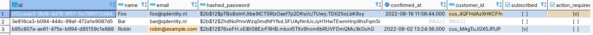

Leren voor de toetsweek: C1-2 en F1

## Informatie

Informatie is data in context. Communicatie is het uitwisselen van informatie.

### Eisen aan informatie

- **Volledigheid:** mist er niks?
- **Relevantie:** is het relevant voor het doel? (is er niet teveel data?)
- **Betrouwbaarheid:** klopt de informatie? is de bron betrouwbaar? is de informatie up-to-date?
- **Overzichtelijkheid:** is de informatie op een makkelijk te begrijpen manier gestructureerd? Staat de informatie op volgorde?
- **Beschikbaarheid** (of tijdigheid): is de informatie beschikbaar als je het nodig hebt?
- **Doelgerichtheid:** is de informatie te gebruiken door de gebruiker? zijn de teksten niet te technisch/omslachtig?

### Eisen informatiesysteem

- **Betrouwbaar**: alleen beschikbaar voor mensen met juiste rechten
- **Continuiteit**: systeem moet niet uitvallen
- **Efficientie**: verhouding tussen kosten en kwaliteit van het systeem
- **Effectiviteit**: het is een hulpmiddel, het moet ons dienen en niks kosten

### Big data

Big data is een hele grote hoeveelheid data (**geen informatie!**) die niet gestructureerd is. Kenmerken van big data zijn:

- **Grote hoeveelheid:** spreekt voor zichzelf
- **Veel verscheidenheid:** het is een grote hoop data uit allemaal verschillende bronnen die vaak niks met elkaar te maken hebben. Het is vaak niet gestructureerd of maar een heel klein beetje.
- **Snelheid:** er wordt heel veel data tegelijk gemaakt en opgeslagen. Het moet snel op te slaan en op te vragen zijn.
- **Complexe data analyze** (ik heb geen idee hoe dit een kenmerk is, het lijkt me meer een toepassing, but who cares): er moeten systemen zijn die met de gigantische hoeveelheid data omgaan en er patronen in kunnen ontdekken.
- **Waardevol:** big data is super veel geld omdat het gebruikt kan worden om mensen te tracken, voorspellen en manipuleren.

De toepassingen van big data zijn:

- beschrijven
- adviseren
- voorspellen

## Database

Een database is een efficiente manier om informatie op te slaan. De meest gebruikte soort database is een rationele database.

Een rationele database is een verzameling tabellen.

Elke tabel is opgebouwd uit kolomen (ookwel columns, fields, attributen, properties of keys genoemd) en rijen (ookwel records, entiteiten of entries genoemd). Je kan je een tabel het best voorstellen als een excel bestand.

Een database wordt beheerd met een DBMS (databasemanagmentsoftware). Voorbeelden daarvan zijn MySQL, SQLite, PostgreSQL, MariaDB, MongoDB.

Je kan verschillende apps aan een DBMS koppelen. Bij mijn werk hebben we bijvoorbeeld twee verschillende projecten (carre.nl en mijn.carre.nl) aan de één database gekoppeld.

Je kan met een database praten mbv SQL. Dat is een taal om data uit databases op te vragen, die bij de meeste DBMS' hetzelfde is,

### Voorbeeld

Dit is een real-life voorbeeld uit van de staging database van mijn werk:

Er zijn verschillende _keys_ zoals `name`, `email` en `subscribed`. Je ziet ze bovenin. Aan de linkerkant zie je genummerde rijen. Elke rij is een _record_ of _entry_.

Je kan zien dat er een gebruiker is met de naam (`name`) _Robin_ en het emailadres (`email`) _robin@example.com_. Hij is klant, want er staat een vinkje in de `subscribed` column.

Er is ook een andere gebruiker genaamd Foo die wel eerder betaald heeft voor het product (hij heeft namelijk een `customer_id` die wordt aangemaakt bij betaling), maar terug is geschakeld naar het “Free” abonnement (je kan dit zien omdat er geen vinkje meer bij de `subscribed` column staat. Ook staat er een vinkje bij `action_required`, hij moet zijn betaalmethode nog instellen).

Daarnaast is ook een andere gebruiker genaamd _Bar_ die wel een account heeft aangemaakt, maar nog nooit ingelogd is geweest; het veld `confirmed_at` is leeg.

## Webservice

Om informatie van de database van een andere organisatie op te vragen gebruik je vaak een _webservice_, omdat je geen directe toegang hebt tot hun database. Een webservice wordt ookwel een API genoemd.

Een webservice is gewoon een webpagina die makkelijk door computers te lezen is. Hiervoor wordt geen HTML (informatie voor mensen) gebruikt, maar XML of JSON (informatie voor computers).

Je kan een request naar de API sturen. De API stuurt dan een response terug met de data die je hebt opgevraagd.

Talen die gebruikt worden om webservices te maken zijn XML, JSON, YAML. Voorbeelden van soorten webservices zijn REST APIs, GraphQL APIs en RSS feeds.

## Usability

Bij het ontwerpen van een product moet je naast de code ook aan de gebruikers denken. Het product moet zo effectief en efficient mogelijk zijn, maar ook confortabel om te gebruiken. Dit zijn de verschillen tussen usability, design en ux:

- **Usability:** is het product bruikbaar? Kan het de taak goed volbrengen?
- **User Experience:** is het product makkelijk en intuitief?
- **Design:** de vormgeving van het product

Om je product zo gebruiksvriendelijk mogelijk te maken hebben we een aantal Heuristieken (bedacht door Jakob Nielsen):

1. **Bied eenvoudige toegang:**

   - De applicatie moet makkelijk te vinden en starten zijn
   - Inloggen (indien nodig) moet snel en makkelijk gaan
   - Informatie moet makkelijk te vinden zijn en overzichtelijk aangeboden worden
     - Maak gebruik van plaatjes
     - Laat de informatie overal op dezelfde manier zien
     - Laat belangrijke dingen opvallen
     - Beperk kleuren tot een paar kleuren

1. **Geef controle:**
   - Goede load indicators (zoals draaiend tandwiel etc.)
   - Zet bijvoorbeeld knoppen die niet gebruikt kunnen worden uit
   - Voorkom errors:
     - Maak invalid input rood voor het opsturen van een formulier
     - Maak gevaarlijke dingen rood.
     - Een zoekbalk op de 404 page
1. **Bied veiligheid:**

   - Geen gebruikers de mogelijkheid te cancellen
   - Bied een help/feedback functie aan

1. **Zorg voor aansluiting:**
   - Skeuomorfisme: laat de interface er als real-life objecten uitzien
   - Maak gebruik van gewoontes en verwachtingen
     - Menu bovenin
     - Niet ineens een kruisje op de save-knop zetten
     - Link naar privacybeleid onderin
