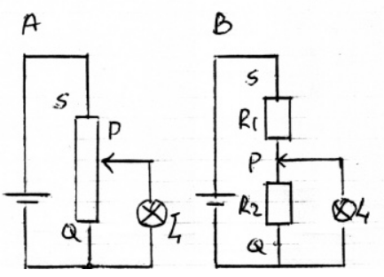
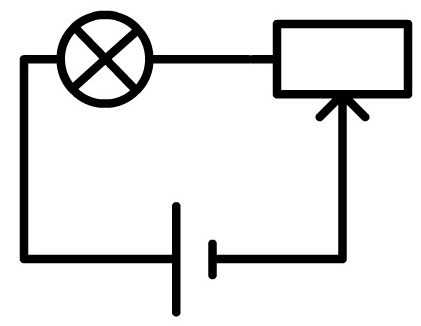

# Elektriciteit

## Formules

$$
P = U*I
$$
$$
R = {U \over I}
$$
$$
E = P*t
$$
$$
I = {Q \over Δt}
$$
$$
U = {J \over Q}
$$
$$
R = ρ * {l \over A}
$$

## Variabele weerstand

Een variabele weerstand kan gebruikt worden als variabele weerstand (waarbij de stroom maar door een deel van de weerstand gaat). Je gebruikt dan maar 2 inputs. Je kan hem ook gebruiken als spanningsdeler. Je gebruikt dan alle (3 de) inputs. De stroom gaat dan door de hele weerstand maar de helft van de weerstand staat in parallel met het onderdeel en de andere helft in serie:

_Variabele weerstand als spanningsdeler_

_Variabele weerstand als variabele weerstand_

## Significantie

Bij vermenigvuldigen of delen: eindantwoord heeft evenveel significante cijfers als de meetwaarde met de minst significante cijfers.

Bij optellen en aftrekken: eindantwoord moet evenveel getallen achter de komma hebben als de meetwaarde met de minste cijfers achter de komma.

Let op:

- Tussenuitkomsten niet (veel) afronden!
- Getallen zonder meetonzekerheid (bijvoorbeeld het aantal lampjes of een symbool zoals π) tellen niet mee voor significantie.

*Als je 1 significant cijfer moet gebruiken en op $0.x$ uitkomt wordt het natuurlijk $x*10^{-1}$*

