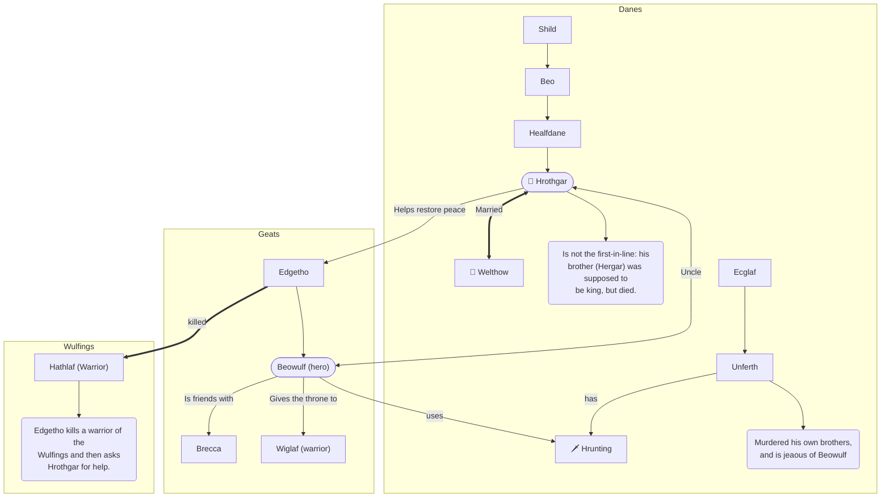

# Medieval literature

## History of the English language

### Proto English

English doesn't exist yet. A few languages that are spoken in the area (by the Britons) are:

- Celtic
- (Short and simple) Latin borrows

The latin words are brought in by the Romans after they invade Britannia.

### Old English

- **Anglo-Saxon** people come:

  - forms an germanic base for the language
  - similar to modern Frissian

- Migrations: **Celtic** speaking people move north

- **Viking invasions**:
  - contribute the sk-sounds
    (skirt, skin etc.)
  - and they/them/their

Not much is written down yet. Most of it is told in oral tradition.

Notable literature from this period: _Beowulf_.

### Middle English

These languages get spoken:

- **Anglo-Norman (French)**: spoken by the nobility in for example the government and law.
- **English**: spoken by the people in local communities.
- **Latin**: used (not spoken) in education and the church by mostly the clergy. Used for science and history.
- **Celtic**: on the outskirts.

Due to intermarriage between the orders of society (people, nobility and clergy) people raise their kids bilingual. This means English is becomes used more widespread.

Notable literature from this period: _The Canterbury Tales_ by Geoffrey Chaucer.

### Early modern English

After the printing press is invented a lot of things are written down. Due to this the English language spreads quickly. This area has:

- the first English dictionaries
- the first English grammar books
- the first English bible (the King James bible)

This period also includes the:

- Renaissance
- Englightment

Notable literature from this period: _William Shakespeare_.

## Beowulf

### Summary

People are feasting in Herot. Then Grendel, who lives in a swamp and is a spawn of Cain, comes to Herot at night and kills a few men. He repeats this every night for 12 years straight. The Geats try everything but can't get rid of him.

Then the strongest warrior of the Geats, Beowulf (who is also king Hrothgar's nephew) comes to help them. He and 14 of his strongest warriors enter a ship to save the Danes.

When they arrive at Herot Beowulf leaves a few of his warriors outside. Then he and the rest take of their weapons and enter Herot to speak with king Hrothgar. Beowulf brags about his experience and strength and asks king Hrothgar for permission to fight Grendel all by himself.

> Potential test question: why does he want to do this?  
> A: possible because he wants the glory all for himself.

They continue to eat a good meal and Beowulf brags more. Unferth says Beowulf is naive and weak. He tells a story about how Beowulf and Brecca had a swimming compition and Beowulf lost. He is clearly jeaous of Beowulf and tries to intimidate him. Beowulf replies by telling Unferth he's drunk (he is) and that his story is incorrect. Beowulf did indeed lose, but that's because he had to fight underwater monsters (and won), and Brecca did not. Then Beowulf exposes that Unferth killed his own brothers.

In the night Grendel arrives again. He kills one of the Geat warriors and then tries to kill Beowulf. Beowulf however, is actually awake and fights Grndel with his bare hands.

> Note: there is a bit of foreshadowing in this fragment ("his last human supper"). Foreshadowing means the writer already let's you know what is going to happen later. In this case Grendel is going to die.

His thirdteen other warriors wake up and try to hurt Grendel, but his skin is bewitched, so they can't hurt him with their swords. Then Beowulf rips off Grendels arm and Grendel escapes to his swamp where he bleeds to dead.

> Note: During this fight the writer emphasizes that Herot is very strong, and even tho there is a fierce battle going on inside, the walls keep standing. This both shows how brutal the battle was and how great Herot is.

Beowulf hangs Grendels arm from the ceiling of Herot. The Geats follow the blood tracks to Grendels swamp and find out he died alone in a lake, where "hell opened up to receive him".

> Fun fact: later the story says he's just lying there on the bottom of the lake, which is a bit of a contradiction with "hell opening up to receive him".

---

> Here follows a shitty sequel to the first part of the story:

Grendels mom is not happy that Beowulf killed her son. So, she goes to Herot and murders Hrothgar's best friend. She also takes Grendel's arm with her.

Beowulf is going to save the day again. He takes Unferth's sword Hrunting and goes to the lake where Grendel died (and his mom apparently lives). He dives in and then sinks for a few hours.

> Note: the fact that he can hold his breath for that long is another example of his superhuman abilities, and thus his being-a-hero.

Grendel's mom tries to kill him but his chainmail armor saves him. She takes him to an underwater battle hall, where other monsters come to look at their fight. Beowulf tries to hit her with his sword, but her skins is just as bewitched as Grendel's was. She bit holes in his helmet, which then breaks.

> Another example of foreshadowing here: "it was the last time anyone would wear it".

Beowulf slips and falls, and Grendel's mom tries to kill him with a dagger (jumps on top of him), but the chainmail saves him once again. Beowulf grabs a sword he sees on the wall. It has been made by giants and is super heavy (but Beowulf is superhumanly strong, remember :D), and using the sword he chops her head of. He then walks to the body of Grendel, which is also laying there apparently, and also chops his head of. He then takes the head to Herot to show everyone how amazing he is.

---

50 years later he has to fight a dragon. The dragon is angry because a thief stole a jeweled cup, and Beowulf needs to protect his people.

Beowulf boasts about beating Grendel, and then goes into the tower where the dragon lives. The dragon is mad and shoots flames at him, but Beowulf uses his shield. Fate (_paganism!_) is not on his side tho, and the shield melts. He stabs the dragon with his sword, but the weapon breaks before it went deep enough.

All of his warriors ran away, except one. Wiglaf is thankful for everything Beowulf has given him, and want to repay his king, so he helps Beowulf. Together they beat the dragon, but Beowulf dies.

> Yet another example of foreshadowing: "For Beowulf, the price of this last victory will be great".

Before he dies he asks Wiglaf to get the treasure (presumably because he wants to give it to his people), and makes Wiglaf his successor (probably king). He also asks to be burried next to the dragon's tower, so that all incoming travellers can see it and remember him.

Wiglaf agrees. After Beowulf dies he berates (= being very very very mad) the "warriors" who ran away and builds the thomb for Beowulf. The story ends with the 12 bravest Geats riding around the tower and mourning over Beowulf.

### Characters

### Oral poetry

Oral (spoken) poetry uses a few common constructions:

- **Stock epithets**: two adjectives (bv+bv). Examples: _strong-hearted, swift-moving hands_.

- **Kennings**: one noun and an adjective (zn+bv). Examples: _ring-prowed fighting ship, ring-giving lord, treasure-full hands_.

- **Alliteration**: using the same letter/sound in multiple words in a row. Example: _tasty tacos_ **(not from Beowulf)**.

### Characteristics of an Epic/Hero

- A hero:
    - Usually noble-birth
    - Usually a man
    - Historic or legendary importance
    - Reflects the ideals of society
    - Helpful/humble
    - Strong (sometimes even superhuman)

- Hero performs courageous/superhuman deeds that reflect **the values of the era**.

- His actions decide the fate of a group/nation.

- The setting is vast.

- The story is written formally/has a serious tone and includes long speeches/monologues.

- Plot involves an superhuman being and/or a dangerous journey.

- The story describes timeless values such as honor and loyalty.

- The story includes timeless/universal themes such as life/death or good/evil.

## Canterbury Tales

- **Setting**: April, Tabard Inn (just outside of London).
- **Story**: Pelgrims go to St. Thomas in Canterbury and tell eachother tales. It's a frame-narrative.

### Characters

#### Knight (nobility)

- Very strong/sturdy
- Heroic
- Modest, chival, humble
- Doesn't wear very knight-y clothes
  - Old and discoloured

##### Appearance

- Strong
- Old discoloured clothes

#### Squire (nobility)

Son of knight.

- Strong, agile
- Very joyful
  - Reads, writes songs, draws and dances
- Clotches with flowers
- In love with a girl
- Chival, good mannered

##### Appearance

- blonde curls
- strong

#### Yeoman (people)

- Good servant
- Has a lot of weapons
- Very rich/fancy decorations
  - on sword
  - on his clothes

##### Appearance

- Short hair

#### Prioress (clergy)

Head of the nuns.  
**Name**: Madame Eglantine

- Modest
- Maybe married? (bc. the text says "Madame")
- Speaks French
- Excellent table manners
- Dignified
- Has little dogs (that she feeds meat, milk and bread)
- Clothes emphasize beauty (and are expensive)
- Bracelet says "Love conquers everything"

> Satire: nuns are not supposed to be this phosh/girly. They shouldn't care about love (for people and animals), prettyness or courtly manners.

##### Appearance

- Fancy clothes
- Beautiful

#### Monk (clergy)

- Handsome
- Is more like the people
- Horseman
- Hunting
- Doesn't follow strict lifestyle, prefers good living (and drinking)
- Looks to phosh

> Satire: he's a horrible monk.

##### Appearance

- Clothes lined with (white) fur
- Gold pin on his clothes
- Bald

#### Friar (clergy)

A friar is a poor kind of monk/religious person who's job it is to collect alms (money/food).

**Name**: Hubert

- Loves pleasure
- Gossips
- Flattery
- Only helps the rich people (and women in exchange for sex)
- Has frequent affairs
- Good at singing and playing harp

> Not really satire: he's described as greedy and as taking advantage of other people. Straight up criticism.

##### Appearance

- Strongish
- Has expensive clothes

#### Merchant (people)

- Looks funny
- Good at trading (very profit-minded)
- Maybe in debt?

> Satire: a merchant who's in debt is not very good. It's not confirmed tho.

##### Appearance

- Forked beard
- Bright colorful clothes
- Beaver hat
- Expensive boots

#### Clerk (clergy)

- Very smart/well-educated
- Doesn't progress in years of study
- Loves books
- Loves moral discussions
- Too spiritual to take on a good job

> Satire(?): you're not very smart if after years of studying logic you don't progress. Also not taking on a job can be seen as not smart.  
> Or just as a sign of being humble

##### Appearance

- Poor
- Hollow-cheecked, thin

#### Sergeant of Law (people)

Laywer.

- Smart
- Takes bribes

##### Appearance

- Green clothes with black fur
- Round cap made of silk
- "Dressed in the robes of authority"

#### Franklin (people)

- Landowner
- Joyful
- Good host (takes good care of others)
- Good person

##### Appearance

- White beard
- Red cheeks

#### Guild folk (rich people)

- Rich
- (A bit) arrogant
- Hired a cook

#### Cook

- Cooks very well
- Is not very hygienic

##### Appearance

- Has a big wound on his leg that is not treated properly

#### Shipman (people)

- Good at navigating
- Courageous
- Steals from the cargo of his ship
- Speaks and looks sea-ish

##### Appearance

- Robe of coarse woolen cloth
- Dagger around his neck
- Sturdy

#### Doctor of Physic (nobility)

- Spiritual/astronomer
- Greedy
- Treats people with poop
- Read ancient texts

> Satire: he's a great doctor! BUT: he treats people with poop and charges them for it. Also his texts are outdated (ancient even) and he's better at atronomy then curing people.

#### Wife of Bath (people)

Makes clothes.

- Very good at making clothes
- A little dead
- Proud/arrogant
- Married 5 times
- Affairs
- Is very sexual

##### Appearance

- Fancy expensive clothes
- Gap-toothed
- Fat
- Has a giant hat

#### Parson (clergy)

- Poor but wise
- Good person
- Patient
- Didn't leave for a better job
  - Not greedy
- Treats the rich/poor equally
- Is not disdainful to sinners
  - Except sex outside of marriage

> Note: the I-person barely spoke to the Parson, so the perspective might be warped.

#### Ploughman (people)

Brother of the parson.

- Good worker
- Painful life
- Fair, pays bills on time etc.

##### Appearance

- Coarse tunic
- Horse: mare

#### Miller (people)

- Strong but stupid
  - Buffoon
- Dirty stories / whores
- Dishonest: steals and then sells for his own profit

##### Appearance

- Sturdy
- Wart on his nose
- Ugly in general
- White coat + blue hat

#### Manciple (people)

Business man.

- Outsmarted his superiors
- Very wise

#### Reeve (people)

- Good estate manager
- Has complete control over the cattle
- Greedy
- Corrupt: steals from his master and then sell back to him

> Note: is always the last rider in the group, could be important later.

##### Appearance

- Slender (= gracefully thin)
- Well-shaved
- Dark blue coat

#### Summoner (clergy)

- Children are afraid of him
- Alcoholist
- Bad diet
- Pretends to be smart
- Maybe a pedophile?

##### Appearance

- Ugly:
  - pimples
  - baby-face
  - swollen eyelids
  - scabby eyebrows

#### Pardoner (clergy)

- Arrogant
- Not manly
- Greedy
- Sings well

##### Appearance

- Thin hair
- Bald
- No hat (not fashionable in his opinion)
- No beard

#### Host (people)

- Joyful
- Good host
- Well educated
- Smart but also [sluw]

> Reasons for proposal to join:
>
> - self-promotion
> - fun?

##### Appearance

- Bright eyes
- Attractive
- Strong
