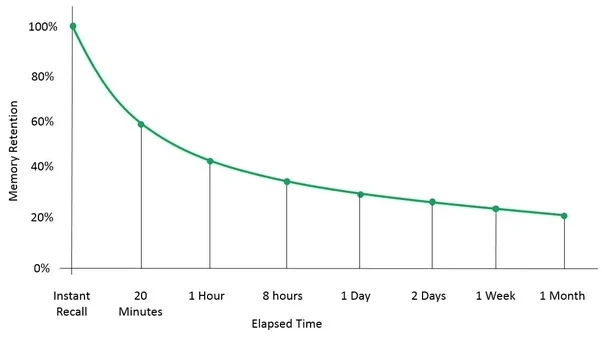

## Metacognitie

De module gaat over metacognitie. Cognitie is een ander woord voor nadenken dmv van cognitieve functies:

- Intelligentie
- Concentratie
- Geheugen
- Taalgebruik
- Probleemoplossend vermogen
- Snelheid van begrip

Metacognitie is dus nadenken over eigen denken.

> Meta = over zichzelf   
> Cognitie = nadenken.

## Geheugen

Geheugen is het vermogen om informatie op te slaan. Het geheugen heeft drie taken:

- Opslaan
- Vasthouden
- Terughalen

Om informatie op te slaan worden er veranderingen in het zenuwstelsel aangebracht. Dat noem je een geheugenspoor.
_Hier later meer over, bij het kopje "onthouden"._

### Vergeetcurve

Ebbinghaus stelde een grafiek op waarin je kan zien hoeveel procent van de informatie onthouden wordt na verloop van tijd. Dit noem je de vergeet- of geheugencurve van Ebbinghaus:

### Atkinson-Shiffrin model

Het Atkinson-Shiffrin geheugenmodel is een manier om naar het geheugen te kijken.
Voor het opslaan van informatie moet die door drie fases:

- **Sensorisch geheugen**: in het sensorisch geheugen wordt de input van je zintuigen voor enkele seconden opgeslagen. Denk bijvoorbeeld aan een geluid dat je terug kan roepen net nadat het geweest is. Je kan onderscheid maken in drie soorten:

    - Iconisch (visueel)
    - Echoïsch (auditief)
    - Haptisch (aanraking)

- **Kortetermijngeheugen**: in het kortetermijngeheugen/werkgeheugen worden dingen waar je mee bezig bent voor minuten tot uren opgeslagen. Er is ruimte voor 5-9 dingen. <!--Dit geheugen regelt ook controle processen zoals beslissingen maken, waaruit een respons voortkomt.-->

- **Langetermijngeheugen**: hier wordt informatie permanent opgeslagen. Er lijken oneindig veel dingen in te passen die oneindig lang opgeslagen kunnen worden. 

### Impliciet vs expliciet

- **Expliciet**: dingen waar aandacht en moeite voor nodig zijn om ze te leren. School is een voorbeeld hiervan.

- **Impliciet**: dingen die je zonder moeite te doen leert, die automatisch gaan. Dit zijn meestal dingen die je interesseren. Ook reclames maken hier slim gebruik van.

Voor ons expliciet geheugen is aandacht nodig. Aandacht kan je richten door je ergens op te focussen, maar je aandacht kan ook automatisch getrokken worden, door betekenisvolle input (input die belangrijk voor je is), zoals:

- Je naam
- Zaken waar sterke emotie aan gekoppeld is (boze leraar, spin)

### Langetermijngeheugen

Je kan het langetermijngeheugen opsplitsen in een aantal categorieën:

- **Declaratief**: dit is een soort database aan kennis waaruit je informatie kan ophalen, zoals namen, vormen of gebeurtenissen.
    
    - **Episodisch**: hier worden herinnerringen die aan een specifieke gebeurtenis zijn gekoppeld, opgeslagen. 
    - **Semantisch**: het semantische geheugen bevat feitelijke kennis die we gewoon weten. Bijvoorbeeld wat een tafel is of hoe een driehoek eruitziet.

Over het algemeen verschuift kennis langzaam van het episodische geheugen naar het semantische geheugen. Je weet dan niet meer waar, van wie, of hoe je de informatie geleerd hebt, maar je kent de informatie nog wel.

- **Procedureel** (of motorisch): hierin worden bewegingen opgeslagen, zoals tekenen, schrijven, handballen, veters strikken etc.

## Leren

Leren is het verwerven van nieuwe kennis, gedrag en vaardigheden.

Je kan leren op verschillende manieren:

- Imitatie
- Trial-and-error
- Gewenning
- Inprenting (tijdens de gevoelige periode)
- Klassieke conditionering  
  (een respons van een bestaande prikkel laten plaatsvinden bij een ongerelateerde prikkel)
- Operand conditioneren  
  (spontaan optredend gedrag afstraffen of belonen zodat het minder of juist vaker voorkomt)
- Inzichtelijk

### Trucs om dingen beter te onthouden

- Loci-methode: je geeft dingen een plek in een ruimte.
- Multitasking is inefficiënt, omdat bij het switchen de aandacht weg is.
- Associatie: verbind nieuwe informatie met informatie die je al kent. Bijvoorbeeld het woord "milk" met "melk".
- Herhaling is goed.
- Splits het op in kleinere onderdelen die je één voor één leert.
- Primacy & receny: de eerste en laatste dingen in een rijtje worden het best onthouden, dus shuffle de rijtjes regelmatig.
- Chunking: informatie groeperen in chunks. 92 45 62 39 is makkelijker te onthouden dan 9 2 4 5 6 2 3 9.

## Het zenuwstelsel

Het zenuwstelsel reguleert ons lichaam door impulsen uit te wisselen. Dat is hoe onze zintuigen werken, we denken en bewegen. Het zenuwstelsel reguleert het lichaam ook via hormonen, in samenwerking met de hypofyse (hormoonklier in de hersenen).

Het zenuwstelsel kan je indelen in verschillende gebieden. Dit kan je doen op basis van _ligging_ of _functie_.

### Ligging

- **Het centrale zenuwstelsel**: de hersenen en het ruggenmerg.

- **Het perifere zenuwstelsel**: 
    
    - De uitlopers van zenuwcellen  
      (ook wel dendrieten en axonen).

    - Grensstrengen links en rechts van het ruggenmerg  
      (bestaan uit ganglia).

_Ganglia_ zijn zenuwcellen met dezelfde functie.

### Functie

- **Het animale zenuwstelsel**: wat wij bewust besturen en waar we controle over hebben.

- **Het autonome zenuwstelsel**: onbewuste functies.

    - **Orthosympatisch**: processen om het lichaam "actief" te maken.

    - **Parasympatisch**: processen die het lichaam in "rust" krijgen.

## Onthouden

Bij het verwerven van informatie vinden er veranderingen in de hersenen plaats, hierbij worden geheugensporen gevormd. Het brein is dus plastisch (vormbaar).

Je brein kan op drie basismanieren veranderen:

- **Het aanmaken of doden van cellen.** Dit noemen we neurogenese en apoptose (celzelfmoord). Fysieke activiteit stimuleert neurogenese, en is daarvoor ook belangrijk voor het beter kunnen onthouden van dingen. Door apoptose verdwijnen hersencellen weer.

- **Het aanmaken of verwijderen van verbindingen** (synapsen). Dit noemen we synaptogenese of synaptische plasticiteit. Dit wordt ook bevorderd door fysieke activiteit en uitdaging. Tegenovergesteld worden verbindingen die je niet meer gebruikt na verloop van tijd weer weggehaald. Dat heet pruning.

- **Myelinisatie.** Als er een myelineschede om een zenuwcel zit kan die 10x sneller reageren op een impuls. Het nadeel is echter dat er veel minder makkelijk nieuwe verbindingen gemaakt kunnen worden. Het proces begint bij je geboorte, maar is vooral actief rond je 50e.

> Het verschil tussen synaptogenese en neurogenese is dys dat neurogenese nieuwe **cellen** aanmaakt, en synaptogenese nieuwe **verbindingen**.

### LTP

Als je een zenuwcel herhaald prikkelt, deze gevoeliger wordt voor die prikkel. Oftewel: als je iets vaak doet, word je er beter in. Dit noem je **langetermijn potentiatie** (LTP).

### Betrokken hersengebieden

#### Thalamus & zintuigelijke gebieden

De thalamus selecteert welke zintuigelijke informatie wordt doorgegeven aan de zintuigelijke gebieden. Daar wordt de informatie verwerkt en geordend, voordat deze naar de prefrontale cortex gestuurd wordt.

#### Amygdala

Informatie die gekoppeld is aan een emotie onthoud je vaak makkelijker. Dit komt doordat er dan allemaal hormonen en neurotransmitters in je brein aanwezig zijn, die ervoor zorgen dat de herinnering makkelijker wordt opgeslagen. Hierbij speelt de amygdala een grote rol.

> Fun fact: de amygdala wordt ook wel het emotionele brein genoemd. Mensen die geen amygdala hebben zijn basically psychopaten (Bron: Emotionele Intelligentie van Daniel Goleman)

Je kan het feit dat emotionele herinneringen beter worden opgeslagen ook gebruiken voor klassiek conditioneren.

#### Cerebellum

Het cerebellum is belangrijk voor bewegingen dmv het procedurele geheugen.

#### Hippocampus & prefrontale cortex

Herinneringen worden verdeeld over de hersenen opgeslagen, in bepaalde gebieden die elk een functie hebben. Zo wordt de geur op één plaats opgeslagen, de visuals op een andere en de gevoelens die je op dat moment had weer op een andere plek. De herinnering is dus opgeslagen als meerdere geheugensporen die over het brein verspreid liggen. <!--Hierbij zorgt de prefrontale cortex dat de herinnering weer "in elkaar gezet" wordt.-->

De hippocampus heeft verschillende functies bij het opslaan en terughalen van herinneringen:

- **De opslag van herinneringen**
- **Het terughalen van gegevens**   
  
  De hippocampus houdt bij waar de verschillende geheugensporen zich bevinden, en zet de herinnering als het ware weer in elkaar. 

- **Het filteren van relevante informatie**  
  
  De hippocampus bepaalt welke informatie wel en niet onthouden en verbonden wordt.

De hippocampus onthoudt waar welk geheugenspoor ligt dmv LTP. Als de hippocampus de herinnering vaak genoeg ophaalt, wordt die steeds sterker. Op den duur heeft de (prefrontale) cortex "geleerd" waar de herinnering ligt en is de hippocampus niet meer nodig voor het ophalen.

Voor het ophalen van "jonge" herinneringen gebruik je dus de hippocampus, en voor "oudere" herinneringen de prefrontale cortex.

### Geheugenconsolidatie

Geheugenconsolidatie is het proces waarbij de herinnering onafhankelijk van de hippocampus wordt opgeslagen. Hierbij is slaap erg belangrijk.

Tijdens diepe slaap wordt namelijk de herinnering "gereplayed". Daardoor wordt de herinnering beter opgeslagen. Je kan dit proces beïnvloeden door de hippocampus gedurende diepe slaap te prikkelen, waardoor de herinnering nog beter wordt opgeslagen.

> Diepe slaap is erg handig voor geheugenconsolidatie, omdat er weinig tot geen nieuwe prikkels zijn.

Ook als je wakker bent kan dit "replay" proces plaatsvinden, maar je bent je daar niet bewust van.

### Schema's & kennisnetwerken

#### Schema's

Bij het opslaan van informatie is het vooral belangrijk dat deze aan andere informatie gelinkt is. Dit noemen we associatie, en zorgt ervoor dat informatie makkelijk op te slaan en weer op te halen is.

Hiervoor is voorkennis erg belangrijk, omdat je informatie beter onthoudt als je het koppelt aan dingen die je al weet. Een ander woord voor voorkennis is een schema.

Als je gebruik maakt van schema's voor het onthouden van dingen integreer je de nieuwe informatie in je schema. Daarbij zijn verschillende hersengebieden, waaronder de mediale prefrontale cortex actief.

Als je compleet nieuwe informatie opslaat, wordt deze als losse herinnering opgeslagen. Dit is natuurlijk moeilijker. Hiervoor gebruik je de parahippocampus (logisch, want de hippocampus wordt gebruikt voor het opslaan van nieuwe herinnering).

#### Kennisnetwerken

De theorie van kennisnetwerken lijkt heel erg op die van schema's. In een kennisnetwerk wordt kennis opgeslagen in het brein als kenniselementen met daartussen verbindingen.

Hierbij is vooral het aantal **zinvolle** verbindingen belangrijk.

Vaak zijn er in kennisnetwerken eilandjes met relatief veel verbindingen (bijv een natuurkunde-eilandje en een minecraft-eilandje), die dan onderling met wat minder verbindingen verbonden zijn.

Als er sprake is van veel geïsoleerde eilandjes noemen we dit _small world network_.

_Door het verbinden van de eilandjes in een kennisnetwerk vergroot je de wendbaarheid/transfer van de kennis. Zie meer bij het kopje "didactiek"._

#### Conceptmaps

Je kan een kennisnetwerk uitbeelden met behulp van een conceptmap. Daarin zet je alle kenniselementen (concepten), bijv begrippen, bij elkaar en verbind je ze onderling met koppelzinnetjes (koppelingen) zoals: "zorgt voor", "wordt gevolgd door", "heeft te maken met", "is belangrijk in" etc.

Een zin die dan gemaakt wordt, zoals "de hersenen zijn belangrijk in het zenuwstelsel", noem je een propositie.

### Superwerkgeheugen

Als je ergens een expert in bent kan je vaak heel veel informatie over dat onderwerp tegelijk onthouden. Dit komt doordat je dan een heel uitgebreid schema in je hoofd hebt, waardoor je informatie in je werkgeheugen makkelijk kan verbinden met die in het langetermijngeheugen. Daardoor onthoud je het beter.

Een heel makkelijk voorbeeld van een superwerkgeheugen is taal. We kunnen allemaal bijvoorbeeld de zin "Ik ben echt een gigantische oempaloempa, want ik viel van de brug en nu ben ik nat" heel makkelijk onthouden, terwijl deze veel meer dan 9 woorden (zo ongeveer de max van ons werkgeheugen) bevat, en nog veel meer letters en klanken.

## Didactiek

In het onderwijs proberen docenten je iets te leren. Leren betekent dan:

> Een mentaal proces waarbij als gevolg van leeractiviteiten een potentiële en relatief stabiele gedragsverandering tot stand komt.

Hierbij heb je twee belangrijke begrippen:

- **Leerresultaten**: het nieuwe gedrag; wat je geleerd hebt.
- **Leerprestaties**: hoeveel van dat gedrag je kan laten zien; wat er getoetst wordt.

### Wendbaarheid & transfer

Als je dingen leert, is het handig dat je ze niet alleen in één situatie of context kan toepassen, maar ook op andere plekken.

Wiskundige formules kunnen bij scheikunde en natuurkunde van pas komen en het atoommodel van scheikunde kan bij bio ook handig zijn.

Als je kennis uit één context of situatie in een andere kan toepassen, noemen we die kennis wendbaar. Een ander woord hiervoor is transfer.

### Leertheorieën

Leertheorieën zijn theorieën over hoe je makkelijk iets kan (aan)leren. In de module kwamen deze drie naar voren:

- Behaviorisme: je kan gedrag beïnvloeden dmv beloningen en straffen. Hierbij is het brein een "black box" (we weten niet precies wat er gebeurt): we kijken vooral naar wat er gebeurt met de output als je de input verandert.

- Cognitivisme: feitenkennis en vaardigheden leren dmv LTP en geheugenconsolidatie.

- Constructivisme: kennis in een kennisnetwerk opslaan. Hierbij vormt elke leerling een eigen, persoonlijk/uniek kennisnetwerk.

- Kennisoverdracht: kennis wordt kant-en-klaar overgedragen aan de leerling (ook wel het transmissiemodel genoemd).

### Instructietheorieën

Docenten gebruiken voor hun onderwijs instructietheorieën, die gebaseerd zijn op de leertheorieën.

Instructietheorieën zijn aanwijzingen om leren te bevorderen. Ze zijn voorschrijvend: "doe X om Y te leren".

Voor verschillende resultaten gebruik je verschillende aanpakken, zoals:

- Verbale informatie, zoals begrippen, concepten, formules en woordjes.
- Toepassen van vaardigheden, zoals het oplossen of uitvoeren van practica of sommen maken.
- Cognitieve leerstrategieën, zoals metacognitie.
- Fysieke vaardigheden, zoals een handstand of sprinten.

### Netwerktheorie

#### Betekenisvol leren

Betekenisvol leren is het principe dat nieuwe informatie die je leert goed moet aansluiten op je voorkennis. Het alternatief is stampen.

Het voordeel van betekenisvol leren is dat de leerling meer inzicht krijgt in de stof en deze daardoor in andere situaties kan toepassen. In andere woorden: de kennis is veel wendbaarder/heeft een grotere transfer.

#### Advance organizers

Advance organizers zijn abstracte begrippen/structuren die je eerst leert, zodat je er later kennis aan kan "ophangen".

Je hebt twee soorten:

- **Uitleggend**: algemene, abstracten/bovenliggende begrippen. Vereenvoudigen latere begrippen.

- **Vergelijkend**: hierbij wordt nieuwe informatie vergeleken met informatie die de leerling al kent. Hiermee veranker je nieuwe kennis in bestaande kennis.

#### Conditionalisering

Er is een verschil tussen het kennisnetwerk van een ondeskundige en dat van een expert. 

Ondeskundigen halen informatie over een onderwerp op door de kenniselementen die direct te maken hebben met de toepassing te doorlopen.

Experts maken daarentegen gebruik van hun gehele kennisnetwerk (het grotere plaatje), en kiezen daaruit de relevante hoogliggende concepten.

Bij hun is namelijk hun kennisnetwerk geconditionaliseerd: bij een toepassing maken ze automatisch gebruik van een samenhangend kennisnetwerk.

#### Contextrijk leren

Contextrijk leren, of concept-contextbenadering, is een manier van leren waarbij er steeds een context of toepassing wordt gekoppeld aan het onderwerp (concept). Dit heeft een aantal voordelen:

- Het is motiverend
- Het versterkt de verbindingen in het kennisnetwerk
- Het zorgt voor grotere wendbaarheid
- Het laat zien waarom kennis relevant is

Hierbij zijn te weinig contexten slecht, maar te veel ook, want het belemmert de transfer.

