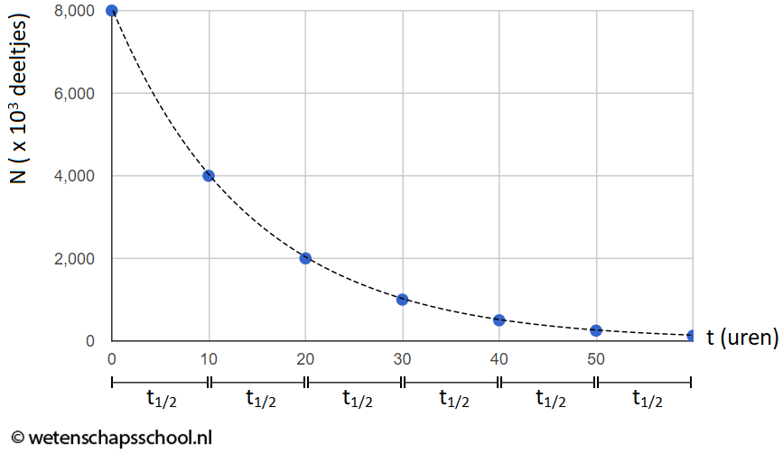

# Straling

<!--
+-----------------------+---------------------------+----------+
| Soort straling        | Radioactief               |          |
|                       +------------------+--------+----------+
|                       | Deeltjes         | Elektromagnetisch |
|                       +-------+----------+--------+----------+
|                       | α     | β        | 𝛾      | röntgen  |
+-----------------------+-------+----------+--------+----------+
| Soort deeltje         | He    | e+ of e- | foton  | foton    |
+-----------------------+-------+----------+--------+----------+
| Ioniserend vermogen   | Groot | Matig    | Klein  | Klein    |
+-----------------------+-------+----------+--------+----------+
| Doordringend vermogen | Klein | Matig    | Groot  | Groot    |
+-----------------------+-------+----------+--------+----------+
-->

<table>
<thead>
  <tr>
    <th rowspan="3">Soort straling</th>
    <th colspan="3">Radioactief</th>
    <th></th>
  </tr>
  <tr>
    <th colspan="2">Deeltjes</th>
    <th colspan="2">Elektromagnetisch</th>
  </tr>
  <tr>
    <th>α</th>
    <th>β</th>
    <th>𝛾</th>
    <th>röntgen</th>
  </tr>
</thead>
<tbody>
  <tr>
    <td>Soort deeltje</td>
    <td>He</td>
    <td>e+ of e-</td>
    <td>foton</td>
    <td>foton</td>
  </tr>
  <tr>
    <td>Ioniserend vermogen</td>
    <td>Groot</td>
    <td>Matig</td>
    <td>Klein</td>
    <td>Klein</td>
  </tr>
  <tr>
    <td>Doordringend vermogen</td>
    <td>Klein</td>
    <td>Matig</td>
    <td>Groot</td>
    <td>Groot</td>
  </tr>
</tbody>
</table>

## Soorten straling

### Deeltjes

- Bestaat uit deeltjes
- Die deeltjes worden uitgezonden met grote snelheid
- Als die deeltjes botsen raken ze hun energie kwijt en stoppen ze
- Tot hoever die deeltjes komen noem je de dracht

### Elektromagnetisch

Elektromagnetische straling bestaat uit fotonen (energiepakketjes), die met de lichtsnelheid (c) bewegen.

Je kan de energie van een foton uitrekenen:

\\[E_{f} = h \cdot f\\]

Waarbij f de frequentie in Hz is en h de **planckconstante** (zie Binas).

Als de fotonen door een stof heen gaan komen ze atomen tegen. Die atomen kunnen de energie van het foton absorberen, en dan verdwijnt het foton. Die noemen we absorptie. Als een foton wel doorgelaten wordt noemen we dat transmissie.

De transmissie wordt gemeten met de intensiteit. Dat is de hoeveelheid energie die per seconde per m2 wordt doorgelaten. Deze hangt af van:

- Het materiaal
- De dikte van het materiaal

De halveringsdikte (d1/2) is de dikte waarop de intensiteit gehalveerd is. Deze verschilt per materiaal.

\\[I = I_{0} \cdot (\frac{1}{2})^{d/d_{1/2}}\\]

## Radioactiviteit

Radioactieve stoffen zijn isotopen (= het aantal neutronen in de kern is anders dan normaal) van de kernen instabiel zijn omdat ze teveel of te weinig neutronen bevatten. Deze kernen kunnen daardoor uit elkaar vallen en daarbij straling uitzenden.

Het aantal vervallen kernen per seconde noemen we de activiteit (in Bq). Deze kan je voor een bepaald moment berekenen:

\\[A = A_{0} \cdot (\frac{1}{2})^{t/t_{1/2}}\\]

Omdat de kernen vervallen blijft er steeds minder van de radioactieve stof over. Na de halveringstijd (t1/2) is de helft van de kernen vervallen.

Je kan ook het aantal overgebleven kernen (N) berekenen:

\\[N = N_{0} \cdot (\frac{1}{2})^{t/t_{1/2}}\\]

> Note:  
> Je kan vervolgens ook de massa uitrekenen door het aantal kernen (N) met
> de atomaire massa (u), van één atoom van een stof te vermenigvuldigen. Je kan
> dit daarna omrekenen naar kg met Binas.

### Vervalkromme

Als je het aantal overgebleven kernen tegen de tijd uitzet krijg je zo'n grafiek:

De activiteit is in deze grafiek de richtingscoëfficient. Hieruit volgt deze formule:

\\[A_{\text{gem}} = - \frac{\Delta N}{\Delta t}\\]

> Note:  
> De min staat daar omdat de grafiek naar beneden gaat

De formule kan je met fancy wiskunde magie ombouwen naar deze formule om de activiteit op een bepaald tijdstip te berekenen:

\\[A = \frac{N\cdot \ln(2)}{t_{1/2}}\\]

### Bestraling vs. besmetting

Als je wordt blootgesteld aan straling noemen we dat bestraling. Je wordt daar zelf niet radioactief van, maar je kan er wel schade door oplopen. Om gevaar te beperken:

- Afstand van de bron nemen (intensiteit kleiner en straling/opp kleiner)
- Tijd met de bron verminderen
- Afschermen met bijv. lood

Als je wordt besmet met een radioactieve bron, komen er radioactieve deeltjes in of op je. Daardoor ben je als het ware zelf een "bron" en kan je een gevaar voor anderen vormen. Plan van aanpak:

- Wassen
- Evacuatie, in het geval van bijv. een nuclaire ramp
- Isoleer de besmette persoon

### Dosis vs equivalente dosis

Het ioniserend vermogen van straling hangt af van de stralingsenergie van de deeltjes, hoe groot de deeltjes zijn, en hoeveel er geabsorbeerd worden.

De dosis (in Gy) is de hoeveelheid energie die er per lichaamsgewicht wordt geabsorbeerd:

\\[D = \frac{E_{\text{abs}}}{m}\\]

Omdat sommige straling schadelijker is dan andere, is de dosis soms geen goede indicator. De equivalente dosis (in Sv) compenseert de dosis voor de schadelijkheid van de straling:

\\[H = \small{W_{\text{R}}} \cdot D\\]

Waarbij de weegfactor (WR) voor alfastraling 20, en voor alle andere straling 1 is.

#### Achtergrondstraling

Soms moet je (bijv. bij experimenten) ook nog comenseren voor de achtergrondstraling. Er is namelijk altijd straling om ons heen, bijvoorbeeld uit:

- de ruimte
- deeltjes uit de lucht
- de bodem
- bouwmaterialen
- in ons lichaam

## Medische beeldvorming

### Röntgen

**Toepassingen**:

- Botbreuken
- Gebit
- Organen of bloedvaten (met contastvloeistof)

**Voor/nadelen**: een röntgenfoto is goedkoop en snel, maar wweefsels zijn vaag en kunnen overlappen. Wel heeft een röntgenfoto een lage dosis.

### CT (röntgen maar 3D)

**Toepassingen**:

- Botbreuken
- Tumoren
- Organen (met contrastvloeistof)

**Voor/nadelen**: een CT-scan heeft hoger contrast dan een röntgenfoto en je kan de diepte van organen zien, maar een CT-scan heeft wel een veel hogere dosis.

### Scintigram

Bij een scintigram gebruik je een radioactieve tracer die je vervolgens met een γ-camera opvangt.

**Toepassingen**:

- Functioneren van organen met verschillende tracers onderzoeken.

**Voor/nadelen**: een scintigram is nuttig, maar erg duur.

### SPECT (scintigram maar 3D)

**Toepassingen**:

- Functioneren van organen met tracers onderzoeken.

**Voor/nadelen**: SPECT is nuttiger dan een scintigram omdat je diepte kan zien, maar de apparatuur nog duurder. Geen verschil in dosis met scintigram, want het enige verschil is dat de camera beweegt.

### PET

PET is ongeveer hetzelfde als SPECT, maar er wordt een tracer met β+-straling gebruikt ipv. γ-straling. De β+-deeltjes kunnen vervolgens elektronen tegenkomen, die elkaar natuurlijk opheffen. Daarbij komen γ-fotonen vrij die je kan opvangen.

### MRI

Bij een MRI-scan wordt gebruik gemaakt van het gedrag van H-atomen in een magnetisch veld.

In een magneetveld is er een evenwichtstoestand voor de H-atomen. Het uitzenden van radiogolf zorgt ervoor dat ze 'flippen'. Dit noemen we resonantie. Ze vallen daarna terug naar de evenwichtstoestand, waarbij ze fotonen van radiogolven uitzenden, die je kan opvangen.

Het terugvallen noemen we relaxatie. Hoe snel dat gaat hangt af van het weefsel. Als dit snel gaat worden er veel fotonen uitgezonden, dus is de intensiteit van de radiostraling groot. Andersom is de intensiteit laag als het lang duurt. De maat hiervoor is de relaxatietijd. Dat is de tijd die het kost voordat 63% van de H-atomen teruggevallen zijn. Doordat de relaxatietijd per weefsel verschilt kan je gedetailleerde foto's maken.

**Toepassingen**:

- Gedetailleerde afbeeldingen van bijna elk soort weefsel
- Hart, longen, hersenen
- Sportblessueres

**Voor/nadelen**: een MRI-scan heeft geen dosis omdat het geen ioniserende straling gebruikt. Het is wel echt fucking duur.

### Echografie

Bij echografie wordt gebruikgemaakt van geluidsgolven, die worden uitgezonden en teruggekaatst. Je vangt dus de "echo's" op. Het beeld noem je een echogram.

**Toepassingen**:

- Zwangerschapsbeelden
- Tumoren vinden
- Onderzoek naar bloedvaten en hart

**Voor/nadelen**: er is geen dosis, want er wordt geen gebruik gemaakt van ioniserende straling. Verder is het goedkoop en is de apparatuur erg mobiel. Wel zijn de beelden erg onduidelijk.
