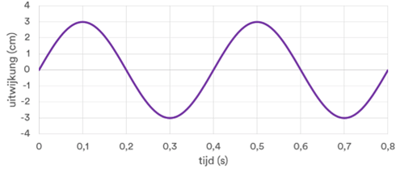
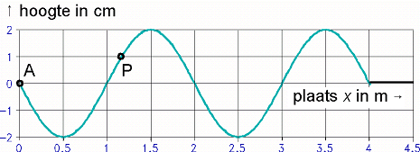
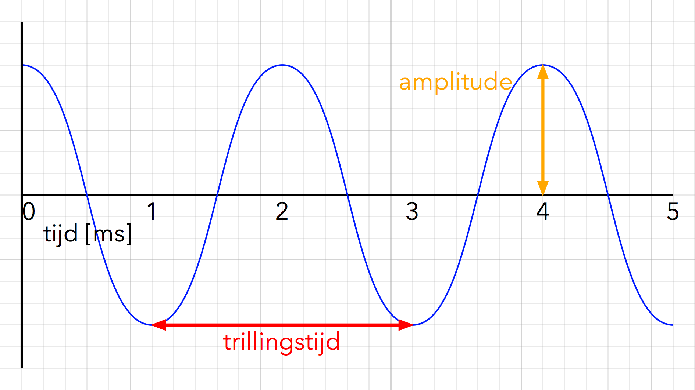
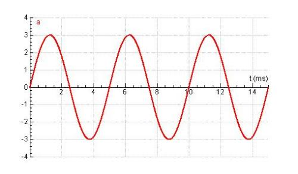
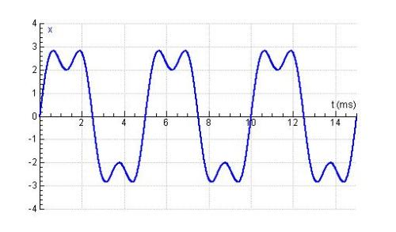
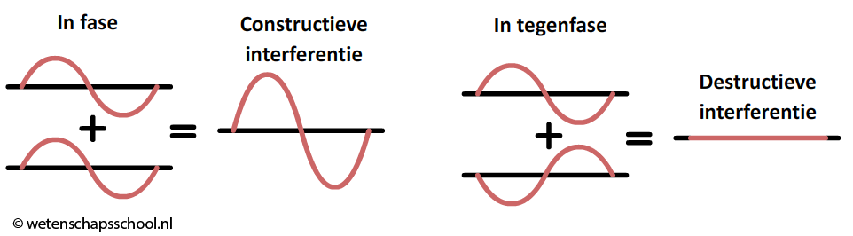
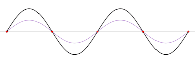
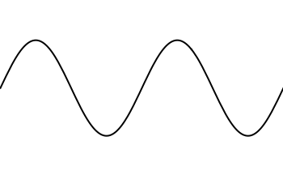
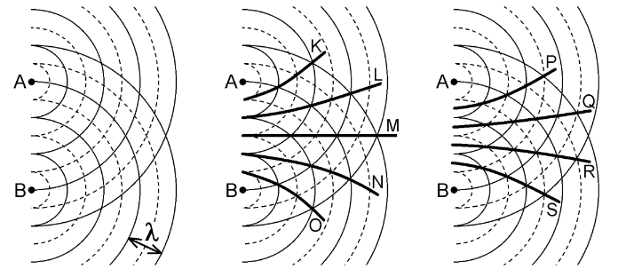
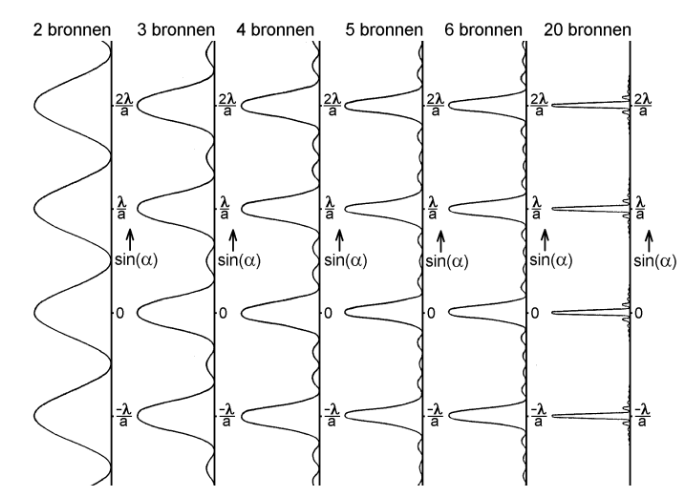

# Geluid & golven

## u,t-diagram

Golven bestaan uit een heleboel punten die op en neer bewegen en elkaar als het ware "meetrekken". De afstand van een punt tot het punt waar hij begon met trillen noem je de uitwijking.

Als je de uitwijking van een punt uitzet tegen de tijd krijg je een u,t-diagram:



_In de u,t-diagram zie je de hoogte van een punt op een bepaald tijdstip. Je ziet hier dus de uitwijking van een op en neer bewegend punt door de tijd._

De formule voor een u,t-diagram is:

\\[u(t) = A \cdot \sin(\frac{2\pi}{T} \cdot t)\\]

_(het is dus eigenlijk gewoon een sinus golf met periode T en amplitude A)_

De maximale snelheid van een trillend punt is als het door de evenwichtsstand gaat (want daar is de helling van de grafiek het stijlst). Je kan dit berekenen met:

\\[v_{max} = \frac{2\pi \cdot A}{T}\\]

Je kan een u,t-diagram ook wel een oscillogram noemen.

## u,x-diagram

In een u,x-diagram zet je de uitwijking van een golf af tegen de afstand die de golf heeft afgelegd. Dit is misschien moelijk te begrijpen, maar in de praktijk is het gewoon alsof je een foto maakt van een golf op een bepaald tijdstip: je ziet de uitwijking van punten op een bepaalde afstand.



De grafiek/diagram die je krijgt lijkt heel erg op een u,t-diagram. Het is alleen **een heel ander concept**. In een u,t-diagram zie je hoe **één punt** door de tijd **op en neer beweegt**. In een u,x-diagram zie je **waar alle punten zich op een specifiek tijdstip bevinden**.

In een u,t-diagram kan je op de x-as de periode van een golf aflezen. In een u,x-diagram kan je daar de golflengte aflezen.

## Eigenschappen van golven

Golven hebben een aantal eigenschappen:

- **Frequentie (f)**: hoe snel de golf trilt.
- **Periode / trillingstijd (T)**: de tijd waarin precies 1 trilling plaatsvindt.
- **Amplitude (A)**: de maximale uitwijking van een golf.
- **Golflengte (λ)**: de afstand die een golf in 1 periode aflegt.
- **Golfsnelheid (v<sub>golf</sub>)**: de snelheid waarmee de golf zich voortbeweegt.



In het geval van een geluidsgolf noemen we de amplitude ook wel het volume of de geluidssterkte, en de frequentie noemen we de toonhoogte. De golfsnelheid van geluidsgolven is de geluidssnelheid. In lucht is dat 343 m/s.

Je kan met deze eigenschappen een aantal dingen uitrekenen:

\\[f = \frac{1}{T}\\]

\\[v_{golf} = f \cdot \lambda\\]
\\[(\implies \lambda = v_{golf} \cdot T)\\]

### Zuivere en samengestelde tonen

Een zuivere toon of harmonische trilling is een golf die 1 vaste periode heeft met steeds dezelfde amplitude. Het u,t-diagram ziet er dan zo uit:



Een samengestelde golf bestaat uit een optelling van andere (zuivere) golven. Een samengestelde golf zou er bijvoorbeeld zo uit kunnen zien:



De frequentie van een samengestelde toon wordt bepaald door de frequentie van de laagste toon die er in voorkomt, die je de grondtoon noemt.

## Fase

De fase (φ) is het aantal afgelegde trillingen sinds het beginpunt van een golf. 

De gereduceerde fase (φ<sub>red</sub>) is het aantal afgelegde trillingen vanaf het begin van de huidige trilling. Je rekent dus de volledige trillingen niet mee.

\\[\delta \phi < 1\\]

<small>Om het gereduceerde faseverschil te krijgen drop je eigenlijk gewoon het volledige getal (het aantal volledige trillingen) van de fase, zodat je alleen de decimalen/breuk overhoud (het deel van de huidige trilling).</small>

Het faseverschil (Δφ) is het verschil in fase tussen twee golven. Het (Δφ<sub>red</sub>) gereduceerde faseverschil is het verschil in gereduceerde fase.

\\[\delta \phi = \frac{\delta t}{t}\\]

Je kan het faseverschil ook berekenen aan de hand van de golflengte en afgelegde afstand:

\\[\delta \phi = \frac{\delta x}{\lambda}\\]

### In fase en tegenfase

Als Δφ<sub>red</sub> = 0, zijn de golven **in fase**. Als je ze dan bij elkaar optelt versterken ze elkaar. Als Δφ<sub>red</sub> = 1/2 echter, zijn ze **in tegenfase** en heffen de golven elkaar op:



Bij elk ander gereduceerd faseverschil versterken de golven elkaar soms en heffen ze elkaar soms op. Dit noem je **zwevingen**.

## Soorten golven

Je hebt twee soorten golven:

- **Longitudinaal**: een golf die heen en weer gaat door uit te rekken en samen te persen (een drukgolf). Bij een longitudionale golf is de trillingsrichting hetzelfde als de voorplantingsrichting van de golf. Een voorbeeld is een geluidsgolf.

- **Transversaal**: een golf die op en neer beweegt. Dit zijn bijvoorbeeld de golven die je in water kan zien. Bij een transversale golf is de trillingsrichting loodrecht op de voortplantingsrichting.

Dit zijn voorbeelden van lopende golven. In een lopende golf heb je een trilling die zich door een medium beweegt. De toppen bewegen als het ware:


Als je twee golven tegen elkaar in laat lopen, kunnen de golven elkaar versterken (als ze beide een maximale uitwijking hebben) en elkaar uitdoven (als ze beide door de evenwichtsstand gaan). Als de golven precies dezelfde frequentie en amplitude hebben, en het faseverschil goed is, krijg je dit patroon:



Je kan zien dat in sommige plekken de golven elkaar maximaal versterken, en in sommige volledig uitdoven. We noemen we maximale versterking een buik en de uitdoving een knoop.

Zoals je ziet blijven de toppen op hun plaats. Daarom noemen we dit een staande golf (hij "staat stil").



## Staande golven in buizen

Je kan in een buis staande golven krijgen. Dat kan alleen als de buis de juiste lengte heeft. Dan gaan de golven resoneren en komen ze zo terug dat er staande golven ontstaan.

In een buis met twee open uiteindes (een open buis) krijg je aan beide kanten een buik met daartussen een knoop:

```
-----------
 B   K   B
-----------
```

In een buis die aan één kant gesloten is (een gesloten buis) krijg je aan de gesloten kant een knoop en aan de open kant een buik:

```
|----------
| K      B
|----------
```

De staande golven die je hierboven ziet noemen we de grondtonen. Er kunnen in een buis oneindig veel boventonen ontstaan. Voor elke boventoon komt er één knoop en één buik bij. De eerste boventoon in een open buis ziet er dus zo uit:

```
---------------
 B  K  B  K  B
---------------
```

En de tweede boventoon:

```
---------------
 B K B K B K B
---------------
```

Tussen een buik en knoop zit altijd 1/4λ (want tussen twee toppen zit 1 golflente). Dat betekent dat de lengte van een open buis gelijk is aan 1/2λ van de grondtoon (van een staande golf in die buis), en voor elke boventoon komt er 1/2λ bij. Op dezelfde manier is de lengte van een gesloten buis gelijk aan 1/4λ van de grondtoon.

In het algemeen geldt deze formule voor open buizen:

\\[l = n \cdot \frac{1}{2} \lambda\\]

En deze formule voor gesloten buizen:

\\[l = n \cdot \frac{1}{2} \lambda - \frac{1}{4} \lambda\\]

Waarbij _n_ = 1 de grondtoon is, en _n_ = 2 de eerste boventoon etc.

### Verhoudingen

Uit de bovenstaande formules volgt:

λ<sub>0</sub> : λ<sub>1</sub> : λ<sub>2</sub> : λ<sub>3</sub> = <br>
1/2 : 2/2 : 3/2 : 4/2 voor open buizen.

λ<sub>0</sub> : λ<sub>1</sub> : λ<sub>2</sub> : λ<sub>3</sub> = <br>
1/4 : 3/4 : 5/4 : 7/4 voor gesloten buizen.

De frequentie is omgekeerd evenredig met de golflengte (f = v/λ), dus hieruit volgt deze verhouding:

f<sub>0</sub> : f<sub>1</sub> : f<sub>2</sub> : f<sub>3</sub> = <br>
1 : 2 : 3 : 4 voor open buizen.

f<sub>0</sub> : f<sub>1</sub> : f<sub>2</sub> : f<sub>3</sub> = <br>
1 : 3 : 5 : 7 voor gesloten buizen.

## Interferentie

**Superpositie** is het optellen van golven. Stel dat je twee geluidsgolven hebt die elkaar kruisen met de één een overdruk van 4 en de ander een onderdruk van 1 dan wordt de uiteindelijke druk dus een overdruk van 3.

Als je twee puntbronnen (met dezelfde frequentie!) naast elkaar zet, ontstaan op de plekken waar twee toppen elkaar kruisen extra hoge toppen en op de plekken waar twee dalen elkaar kruisen een extra diep dal. Op de plekken waar een top en een dal elkaar kruisen doven de golven elkaar uit. 

Door dit verschijnsel ontstaat een **interferentiepatroon**. Daarin kan je lijnen met extra hoge pieken en dalen zien (de buiklijnen) en lijnen waar de bronnen elkaar volledig uitdoven (de knooplijnen).



Als puntbronnen dezelfde constante frequentie en een constant faseverschil hebben noem je ze **coherent**. _Alleen dan kan een (constant) interferentiepatroon optreden_.

Als je de bronnen dichter naar elkaar toe brengt zullen de buik- en knooplijnen divergeren. Als je de bronnen uit elkaar beweegt, convergeren de buik- en knooplijnen juist.

### Knooplijnen

Op knooplijnen is de amplitude niet helemaal nul. Dat kan alleen als de amplitude van beide golven precies even groot is, en dat kan alleen als de golven precies dezelfde afstand hebben afgelegd (want de amplitude neemt geleidelijk af naarmate de golf beweegt). 

Als je langs twee luidsprekers loopt die een interferentiepatroon veroorzaken zou je op sommige plekken het geluid minder goed moeten horen dan op andere plekken. In de praktijk komt dit echter niet zo vaak voor, aangezien je een zuivere toon moet hebben, en die in het echt nauwelijks voor komen (lees: bijna nooit).

### Weglenteverschil

Het weglengteverschil in een punt is het verschil tussen de afstand van bron A tot het punt en de afstand van bron B tot het punt:

\\[x_{weglente} = \| \ AP - BP \ \|\\]

Als het weglenteverschil een volledig aantal keer de golflente (λ) is, ligt het punt op een buiklijn. 

\\[x_{weglente} = n \lambda\\]

Waar _n_ de orde van maximum is.

Als het weglenteverschil precies een oneven meervoud van de halve golflengte (1/2λ) is (0.5λ, 1.5λ, 2.5λ, 3.5λ ...), ligt het punt op een knooplijn.

\\[x_{weglente} = n \lambda + \frac{1}{2} \lambda\\]

### Verre veld

Als je twee bronnen op afstand _a_ op een vlak _heel ver weg_ (tenopzichte van de golflengte) projecteert, zie je de (in het geval van licht) de maxima (de buiklijnen) op het vlak verschijnen. Dit vlak noemen we het verre veld.

Als je _a_ kleiner maakt zullen de buiklijnen divergeren en de maxima op het vlak dus verder uit elkaar verschuiven.

In het verre veld geldt deze formule:

\\[\sin(\alpha) = \frac{n \lambda}{a}\\]

Waarbij _n_ de orde van maximum is, en α de (linker)hoek in de volgende rechthoekige driehoek:


Waarbij _l_ de afstand tussen het middenpunt van _a_ en het verre veld is, en _h_ de afstand tussen de nulde orde maximum en de _n-de_ orde maximum.

### Meerdere bronnen

Het blijkt dat als je veel meer bronnen met dezelfde afstand _a_ van elkaar zet, je hetzelfde patroon krijgt, maar tussen de hoofdmaxima verschijnen nevenmaxima. Deze mogen we in de toets negeren.

Hoe meer bronnen je toevoegd, hoe smaller de hoofdmaxima, en hoe hoger de amplitude in de hoofdmaxima.



## Doppler-effect

Als er iets geluid maakt terwijl het (langs)beweegt klinkt het geluid anders afhankelijk van de positie van de luisteraar. Dat komt omdat de geluidsgolven _voor_ het bewegende object worden _samengedrukt_, terwijl de golven _achter_ het object worden _uitgerekt_. Dit noem je het Dopplet-effect.

### Rekenen met het doppler-effect

Je kan de nieuwe golflengtes van de samengedrukte en uitgerekte golven makkelijk berekenen.

Als je de golflengte achter het object wil weten:

- Bereken de afstand die het object in 1T (de periode van de golf) aflegt.
- Tel de berekende afstand op bij de golflengte.

En de golflengte van de samengedrukte golven voor is precies andersom:

- Bereken de afstand die het object in 1T (de periode van de golf) aflegt.
- Trek de berekende afstand af van de golflengte.

## Snaarinstrumenten

De frequentie waarmee een snaar trilt noem je de eigen frequentie, en hangt af van:

- De **massa** van de snaar,
  die weer afhangt van de dichtheid, dikte en lengte.

- De **spanning**,
  die afhangt van de spankracht waarmee de snaar gespannen is.

Om dit "beter te begrijpen" (lees: ingewikkelder maken), kan je kijken naar een massa-veersysteem. Daarbij hang je gewichtjes aan een veer die je dan laat bouncen, waardoor je trillingen krijgt.

### Massa-veersysteem

De **evenwichtsstand** is de positie van het gewichtje als Fz = Fspan. Als je het gewichtje laat bouncen maakt hij een trilling die je de eigentrilling noemt.

De frequentie van de eigentrilling hangt af van:

- De **massa** van het gewichtje:
  hoe zwaarder, hoe minder snel je snelheid kan veranderen,
  dus hoe lager de frequentie.

- De **stugheid** van de veer:
  hoe stugger, hoe groter de versnelling/vertraging,
  dus hoe hoger de frequentie.

Als je harder aan het gewichtje trekt wordt de amplitude groter. De veer trilt daardoor sneller (je ziet het gewichtje sneller bouncen), maar hij beweegt ook een grotere lengte. Daardoor is de frequentie nog steeds hetzelfde.

#### Rekenen

Voor de periode van een trilling in een massa-veersysteem geldt:

\\[T = 2\pi \sqrt{\frac{m}{C}}\\]

Waarbij de veerconstante (C) in N/m aangeeft hoe sterk/stug de veer is. Je kent
hem waarschijnlijk uit de formule:

\\[F_v = C \cdot u\\]


