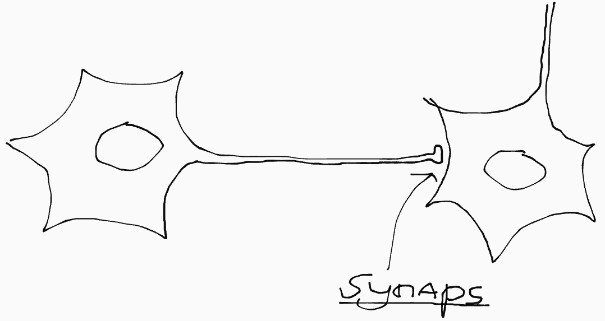
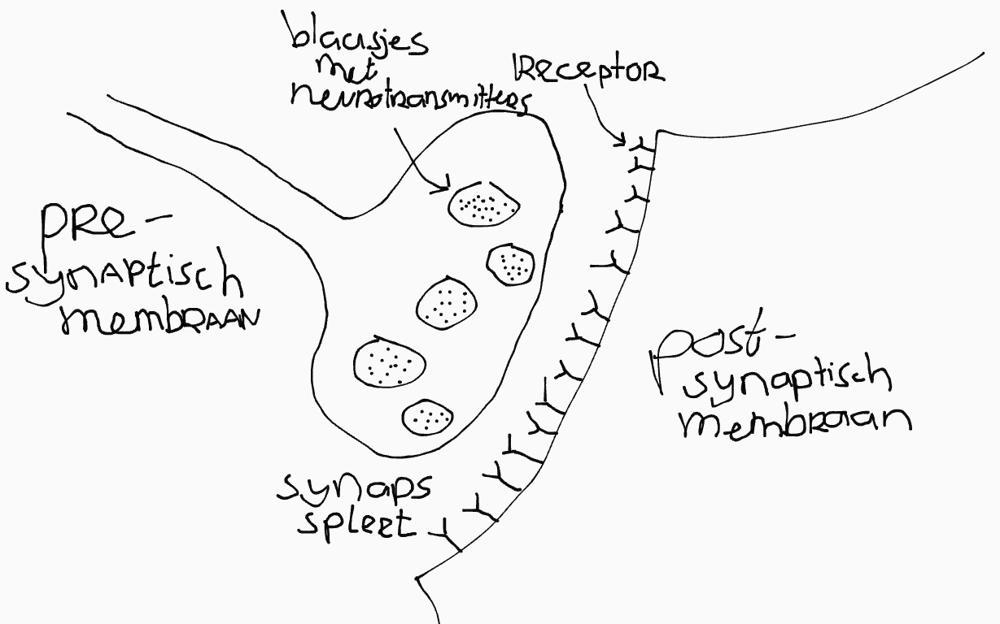
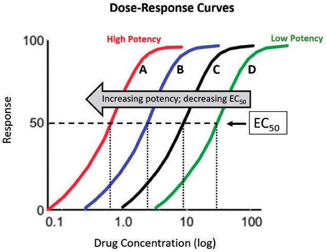
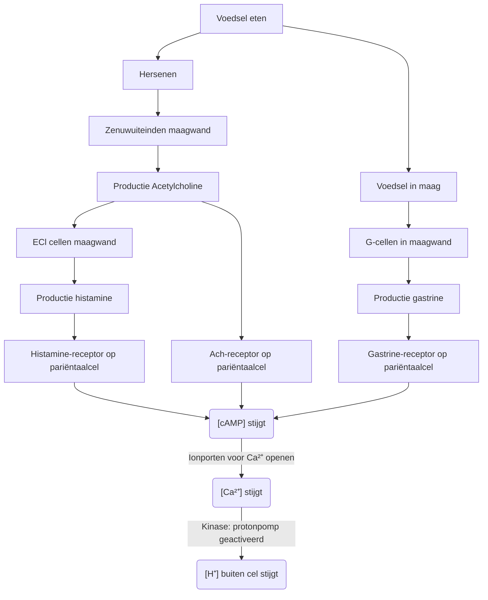
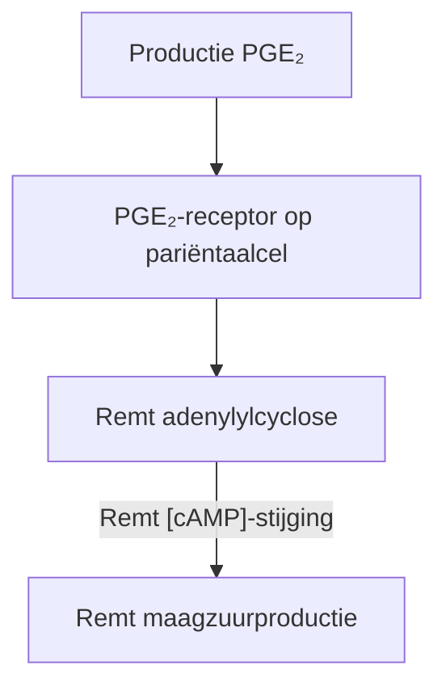
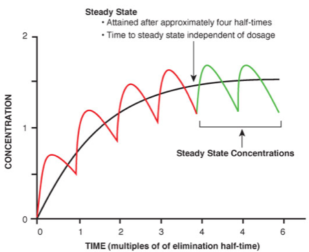

## De ontwikkeling van een medicijn

De ontwikkeling van een medicijn gaat in een aantal stappen:

- Drug discovery
- Preklinish (~4jr)
- Klinish (~6jr)
- Registratie (~2jr)
- Post-marketing surveillance

### Drug discovery

Je begint met het maken van een hypothese, dat is meestal: een ziekte wordt veroorzaakt door een disfunctionerend eiwit. Je noemt dit het doeleiwit. **Target finding** is het uitzoeken welk eiwit dat is.

Daarna komt **lead finding**: het vinden van een biologische verbinding of molecuul dat invloed heeft op het doeleiwit. Je noemt dit het lead molecuul. Dat is een vorm van een biologisch actieve stof: een stof die invloed op de werking van het lichaam heeft.

Als laatste komt lead optimizing, het zo aanpassen van het lead molecuul dat de werking optimaal is, terwijl de bijwerkingen zoveel mogelijk worden beperkt.

### Preklinische ontwikkeling

In de preklinische fase doe je proeven om het lead molecuul te vinden en optimizen. Dit gaat:

- in vitro: het medicijn wordt op menselijke cellen in een lab getest. 
- in vivo: dierproeven met zieke dieren.

Je probeert natuurlijk dierproeven zoveel mogelijk te beperken.

### Klinische ontwikkeling

Klinisch (mensgebonden) onderzoek is het testen op mensen. In de klinische fase doe je dus proeven op mensen. Je bepaald hiermee: 

- De dosis: wat is nodig voor een werkzame concentratie in het bloed en hoe is de verdraagbaarheid.

- De effectiviteit (hoe goed werkt het medicijn). Dit gaat meestal met metingen in het bloed. 

- Toedieningsmethoden, zoals (zet)pillen, injecties, infuus, plijsters, puffers.

Dit gaat in 3 stappen:

1. Je test op een groep gezonde vrijwilligers. Je bepaald hiermee de dosis en toedingingemethodes.

2. Je test op een kleine groep patiënten. Je maakt hiermee een betere inschatting van de dosis.

3. Je test op een grotere groep patiënten. Je gaat dan na of het medicijn werkt aan de hand van een effectmaat. Dat is een (goed meetbare) schaal waaraan je kan zien hoe effectief het medicijn is.

Deze dingen onderzoek je met een dubbelblind onderzoek. Dat is een onderzoek waarbij zowel de patiënten als de artsen niet weten wie een echt medicijn krijgt en wie een placebo. Dat is betrouwbaarder omdat anders de arts onbewuste signalen kan afgeven bij het toedienen, die aan de patiënt verraad dat hij een placebo toegediend heeft gekregen. 

### Registratie

Na veel testen wil je het medicijn op de markt brengen. Daarvoor moet je een paar stappen doorlopen:

- Medicijn registreren
- Handelsvergunning aanvragen 
- Vergoeding zorgverzekering afspreken

### Post-marketing surveillance

Nadat het medicijn op de markt gebracht is wordt het door een hele grote groep mensen gebruikt. Daardoor treden er ineens allemaal extra zeldzame bijwerkingen op die tijdens het testen niet verschenen waren. Die worden bijgehouden (door Lareb) en aan de bijsluiter toegevoegd.

_Let op: in sommige stukken van het boek wordt dit gezien als de "4e" fase van de klinishe ontwikkeling!_

Hierdoor hebben medicijnen die al langer op de markt zijn vaak een veel langere lijst met bijwerkingen. Nieuwe medicijnen hebben ook zo veel bijwerkingen, maar meestal zijn die dus nog niet ontdekt.

## Geld verdienen met medicijnen

Het maken van medicijnen kost veel tijd en is daarom heel duur. Bedrijven willen hun investering (in de ontwikkeling) graag terugverdienen. Dit doen ze door een patent/octrooi aan te vragen. Dit is een papiertje dat 20 jaar geldig is en dat het bedrijf het alleenrecht op de verkoop van het medicijn geeft. Na die tijd mogen andere bedrijven ook het geneesmiddel produceren en verkopen. 

Een patent zorgt ervoor dat een bedrijf de productietechniek openbaar kan maken zonder risico's. Als er geen patent zou zijn zouden ze die namelijk geheim proberen te houden.

Je hebt dus drie verschillende soorten medicijnen (ookwel preparaten genoemd):

- **Specialité**: een medicijn waar een patent op ligt.
- **Loco-preparaat**: een medicijn dat door een andere fabrikant is gemaakt nadat het patent is verlopen.
- **Me-too-preparaat**: een medicijn dat hetzelfde doeleiwit gebruikt, maar een ander leadmolecuul. (Het voordeel van een me-too-preparaat is dat je de stap van **drug discovery** deels kan overslaan. Hierdoor wordt het ontwikkelen van het medicijn goedkoper.)

Door dit systeem zijn er vaak twee verschillende namen voor hetzelfde geneesmiddel. Allereerst de **generieke naam**: de wetenschappelijke naam voor het medicijn. De andere naam is de **merknaam**: de fancy marketing naam die de maker van het medicijn er aan gegeven heeft.

## Farmacognosie

Farmacognosie is onderzoek naar de geneeskrachtige werking van planten. Onderzoekers proberen dan de werkzame stof te isoleren en extraheren voor het maken van medicijnen.

## Farmacodynamiek 

Farmacodynamiek is hoe een medicijn een effect op je lichaam heeft.

### Chemische communicatie

Je lichaam bestaat uit cellen, die onderling met elkaar praten door het uitwisselen van deeltjes. Een cel stuurt een deeltje (de ligand) naar een andere cel. Daar bindt de ligand aan een receptor.

Voor die binding geldt het sleutel-slot principe. Op een receptor past maar één type ligand (voorbeeld: op een adrealinereceptor past alleen adrealine).

Liganden komen in twee soorten:

- **Agonist**: veroorzaakt een reactie (cascade aan reacties) in de cel.
- **Antagonist**: blokkeert de receptor waardoor er geen agonisten meer kunnen binden.

### Neurotransmitters

Pijnstillers zorgen ervoor dat impulsen minder goed kunnen worden doorgegeven door de receptoren op het post-synaptisch membraan te blokkeren (antagonistisch dus), waardoor er een verdovend effect optreedt.

Drugs zorgen juist voor meer interactie tussen neuronen. Dit zijn dus agonistische neurotransmitters.

### Doeleiwitten

Verschillende soorten doeleiwitten zijn:

- Enzymen
- Transporteiwitten
- Eiwitkanalen
- Eiwitpompen

Het bekendste doeleiwit is GPCR (G-eiwit). Je kan hem herkennen aan een (α-)helix die zich deels binnen en deels buiten de cel bevindt. Als er een ligand op deze receptor bindt, ontstaat er een cascade aan reacties, die mevrouw Schutte met allemaal ingewikkelde filmpjes heeft proberen uit te leggen, maar die je vgm voor de toets niet hoefde te kennen. 

Het resultaat is dat uiteindelijk in de cel cAMP vrijkomt. Dat is een stofje dat vervolgens in de cel organellen weer een boodschap geeft om *iets* te doen. We noemen het daarom een second messenger.

_Handig: je kan hierdoor zien of een leadmolecuul een agonist is. Je kan voor en na het toedienen van de ligand de cAMP-concentratie in de cel meten. Als deze gestegen is is het leadmolecuul dus werkzaam._

### Ligand-receptorinteracties

Je kan rekenen met liganden en receptoren. Daarbij gebruik je:

- [L] = concentratie vrije[^1] ligand
- [R] = concentratie vrije receptor
- [LR] = concentratie receptoren met ligand-binding

Er is altijd een evenwichtsreactie tussen L, R en LR. Er worden namelijk constant liganden gebonden en bindingen weer verbroken:

\\[\ce{L + R <=>[k] LR}\\]

- k1 is de snelheidsconstante voor de reactie naar rechts
- k2 is de snelheidsconstante voor de reactie naar links

Je kan hiermee de reactiesnelheid uitrekenen:

\\[v_{\text{naar rechts}} = [L][R] \cdot k_{1}\\]

\\[v_{\text{naar links}} = [LR] \cdot k_{2}\\]

Omdat er een evenwicht is, moet de snelheid naar rechts gelijk zijn aan de snelheid naar links:

\\[[L][R] \cdot k_{1} = [LR] \cdot k_{2}\\]

\\[\frac{k_{2}}{k_{1}} = \frac{[L][R]}{[LR]}\\]

Stel dat de helft van de receptoren bezet is. Dan zou [R] gelijk zijn aan [LR], en kan je ze aan beide kanten van de breuk wegstrepen:

\\[\frac{k_{2}}{k_{1}} = \frac{[L]}{1}\\]

De [L] waarbij [R] = [LR] noemen we de dissociatieconstante (kD). Dat is een maat voor de affiniteit -- hoe graag de ligand en receptor willen binden. 

\\[k_{D} = \frac{k_{2}}{k_{1}} = [L]\\]

Als kD:

- laag is: k1 groter ⇒ een hoge [LR]. De ligand bindt dus goed.
- hoog is: k2 groter ⇒ dus een lage [LR]. De ligand bindt dus slecht.

kD is dus omgekeerd evenredig met de affiniteit. In andere woorden: bij een lage kD heb je weinig van een medicijn nodig, en werkt het dus goed.

### Dosis-responscurve

Je kan de dosis ([L]) afzetten tegen de het effect dat het op het lichaam heeft. Zo'n curve ziet er zo uit:

De schaal van de y-as loopt van 0 naar 1, waarbij 0 geen enkel effect is, en 1 een maximaal effect. Het halfwaardepunt is waar `y=0.5`. De dosis van het halfwaardepunt is de waarde van kD.

Je kan hier weer zien dat hoe lager kD, hoe beter het medicijn werkt, want bij een lagere kD heb je maar een kleine dosis nodig voor maximaal effect. _Dus, hoe meer de grafiek naar links ligt, hoe beter het medicijn._

## Maagzuurmedicijnen

Maagzuur is een stof die ziekteverwekkers in ons voedsel dood voordat het naar de darmen gaat (en het voedsel deels verteert). Maagzuur (H+) komt in de cel via het H+/K+-ATPase eiwit, dat we ook de protonpomp noemen.

De protonpomp wordt veroorzaakt door een Ca2+ influx in de cel (kinase). 

Dit zorgt vervolgens voor een hele cascade aan reacties:

Overal waar er een splitsing in de diagram zit door een chemische reactie (dus niet de eerste splitsing onder "Voedsel eten") is er sprake van dubbele innervatie.

Je zou de diagram ook als tabel kunnen weergeven:

| Sleutel   | Slot               | Signaal       | Effect                   |
| --------- | ------------------ | ------------- | ------------------------ |
| Ach       | Ach-receptor       | [cAMP] stijgt | [Ca2+] stijgt |
| Histamine | Histamine-receptor | "             | "                        |
| Gastrine  | Gastrine-receptor  | "             | "                        |

### Remmen

De stijging van [cAMP] in de vorige diagram kan alleen plaatsvinden als de stof adenylylcyclose aanwezig is. Door deze stof weg te halen kan je de productie van maagzuur dus remmen. Dit doe je door PGE2 aan te maken:

### Medicijnen

Je kan maagzuurproductie met de volgende interventies aanpakken:

- Een base (bijv. Rennies)
- De protonpomp blokkeren (PPI's)
- Histamine-receptor antagonist
- PGE2-receptor agonist  
  (nadeel: PGE2 receptoren zitten overal in je lichaam 
  ⇒ veel bijwerkingen)
- Gastrine-receptor antagonist

## Farmacokinetiek 

Farmacokinetiek is hoe een medicijn zich door je lichaam verspreid. Dit gaat in fasen:

1. Farmaceutische fase
2. Absorptiefase
3. Distributiefase
4. Metabolische fase  
   (depend op fase 2 & 3)
5. Farmacodynamische fase
6. Eliminatiefase

Je moet bij het maken van een medicijn altijd nadenken over deze fases. Hiervoor heb je de afkorting ADMET: **A**bsoptie, **D**istributie, **M**etabolisering, **E**liminatie en **T**oxologie. Toxologie gaat over giftigheid; het is geen fase maar wel belangrijk.

### Fase 1: Toediening

Toediening kan in een heleboel vormen. Bijvoorbeeld:

- (zet)pil
- inhaler/puffer
- zalf/crème
- pleister
- injectie
- infuus
- drankje

Elke vorm heeft zo z'n voor en nadelen. Je hebt ook **slow-release-preparaten**. Dat zijn speciale pillen met een capsule die heel langzaam afbreekt. Daardoor komt het medicijn heel geleidelijk gedurende de dag in je bloed. Dit is handig voor bijvoorbeeld ADHD medicijnen.

### Fase 2: Absorptie

Absorptie gaat over hoe het medicijn in je bloed terecht komt. We maken hierbij het onderscheid tussen een inwendig en uitwendig milieu:

- Inwendig: binnen de celmembraan
- Uitwendig: buiten de celmembraan

De blaas, darmen, longen etc. zijn dus allemaal **uitwendig** milieu.

### Fase 3: Verspreiding

Het medicijn verspreid zich door het lichaam via het bloed. In ideale omstandigheden bleven alle medicijn-moleculen netjes in het bloed om daar hun werk te doen. Helaas kunnen ze ook:

- Ophopen in vetweefsel
- Terechtkomen in weefselvocht
- Binden aan bloedeiwitten

Als het medicijn zich op andere plekken bevind, zoals hierboven, heeft het geen farmacologische werking.

Omdat een deel van het medicijn verloren gaat ("verdwijnt"), wordt de concentratie van het medicijn in het bloed lager. Daardoor *lijkt* het alsof het medicijn zich over een veel groter volume heeft verpreid dan het volume van het bloed. Dit noem je het schijnbaar verdelingsvolume (vd).

\\[v_{d} = \frac{D \cdot F}{C_{p}}\\]

- D = dosis
- F = biologische beschikbaarheid
- Cp = concentratie in bloed

### Fase 4: Metabolisering

Als het medicijn het lichaam binnen komt gaat het meestal eerst via de darmen. Daar wordt het dan opgenomen in het bloed, en wordt het *direct* naar de lever gevoerd. Iedere keer als het medicijn door de lever komt zet de lever een deel van het medicijn op in een metabool. We nemen in berekeningen alleen de eerste keer dat het medicijn door de lever komt mee. Die eerste keer noemen we het **first-pass effect**.

We gebruiken de biologische beschikbaarheid (F) om uit te drukken hoeveel origineel medicijn er nog over is als het voorbij de lever is. F is een getal tussen 0 en 1:

- F = 0 ⇒ de lever heeft al het medicijn uit het bloed gefiltered; er is niks over.
- F = 1 ⇒ de lever heeft geen medicijn uit het bloed gefiltered.

In veel berekeningen doen we alsof de lever niet bestaat (F = 1), omdat dat de boel versimpelt.

#### Pro-drugs

Normaalgesproken is een sterk first-pass effect niet gewenst, want er gaat dan meer medicijn verloren. Een uitzondering zijn pro-drugs.

Pro-drugs hebben zelf geen werking, maar het metaboliet dat door de lever gevormd wordt wel. Een sterk first-pass effect is hier dus juist gunstig, omdat er dan meer niet-werkzame pro-drug wordt omgezet in wel-werkzame metaboliet.

Een voorbeeld van een pro-drug is codeine.

### Fase 5

Fase 5 is de farmacodynamiek, die hierboven al besproken was.

### Fase 6: Afbraak en uitscheiding

Het medicijn verlaat je lichaam weer dankzij je lever (afbraak) en nieren (uitscheiding).

Hierbij heb je twee belangrijke dingen:

- De klaring (K of Cl): hoeveel medicijn er per Δt uit het bloed verwijdered wordt.

- De halfwaardetijd (t1/2): hoelang het duurt voordat de helft van het medicijn uit het bloed verwijdered is

We hebben afgesproken dat het medicijn na 5t1/2 volledig uit het bloed verdwenen is. Dat betekent dat als het dosisinterval *kleiner* dan 5t1/2 is, er steeds een beetje medicijn uit de vorige dosis over is. Dat noemen we accumulatie.

#### Eerste-orde kinetiek

Bij eerste-orde kinetiek werken de lever en nieren niet op volle kracht. Daardoor gelden een aantal regels:

- Snelheid van afbraak is recht evenredig met de concentratie van medicijn in het bloed. Oftewel: meer medicijn verdwijnt sneller.
- De klaring is een gelijk **percentage**. De klaring wordt dus *steeds kleiner*. 
- De halfwaardetijd is **onafhankelijk** van de beginconcentratie.

#### Nulde-orde kinetiek

Bij nulde-orde kinetiek werken de lever en nieren *wel* op volle kracht. Daardoor gelden er andere regels:

- De snelheid van de afbraak is constant.
- De klaring is een gelijk getal (dus **geen** percentage).
- De halfwaardetijd is **wel** afhankelijk van de beginconcentratie.

#### Steady state

Als er sprake is van accumulatie zorgt dat ervoor dat de concentratie van het medicijn in het bloedplasma steeds hoger wordt. Maar door die hogere concentratie wordt het medicijn ook weer sneller afgebroken. Op den duur onstaat er een evenwicht waar 

\\[[\text{toegediend}] = [\text{afgebroken}]\\]

Dit evenwicht noem je steady state, en de concentratie in het bloedplasma de steady state constante (CSS). Als t < 4t1/2 geldt:

- Steady state bereikt na 5t1/2
- Onafhankelijk van het dosisinterval
- Onafhankelijk van de dosis

Hier zie je nog een mooie grafiek:

---

**Opmerking: De regels voor eerste en nulde-orde kinetiek heeft mevrouw Schutte expliciet in de les op deze manier op het bord gezet. In het boek kon ik echter de regel over klaring niet terugvinden, en in de opgaven is er ook een constante klaring in plaats van een percentage bij de eerste-orde kinetiek. Aangezien onze lieftallige docent op mijn vraag reageerde met "boeien", snap ik er ook geen ene fuck meer van, dus heb ik geen idee wtf ze wil dat we doen.**

[^1]: vrij = heeft geen binding aangegaan
