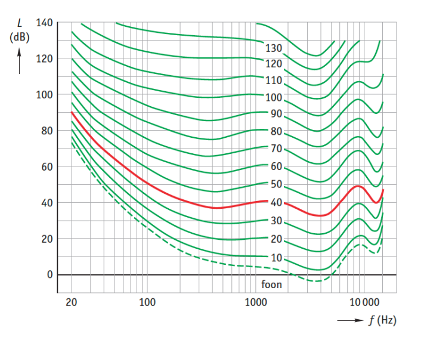
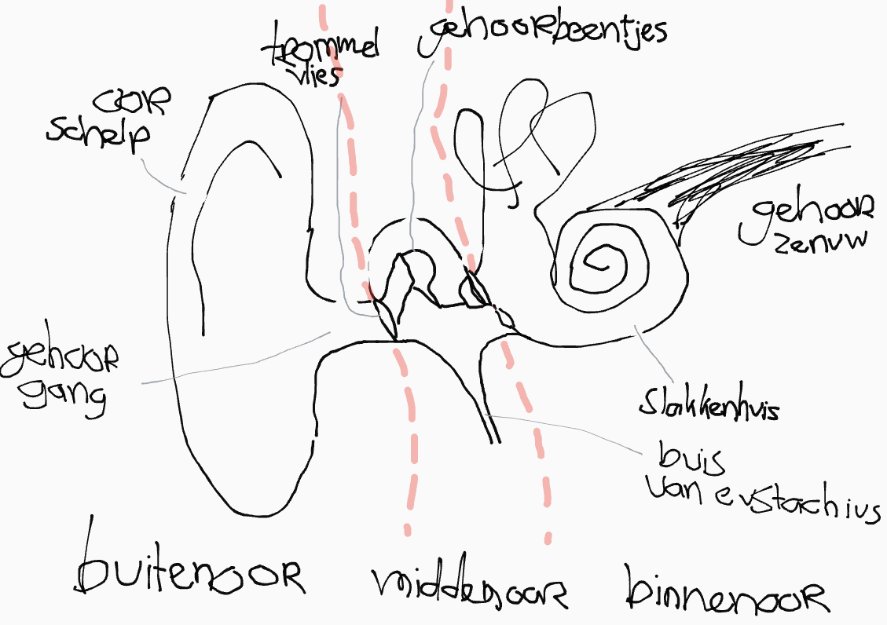

## Gehoor

We hebben vorig hoofdstuk les gehad over [geluid en golven](https://school.geheimesite.nl/5VWO/TW1/Natuurkunde). Het deel over staande golven in buizen en interferentie zijn bij dit hoofdstuk misschien ook relevant.

### Decibel

Geluid bestaat uit trillingen. Het volume van een geluid noemen we ookwel geluidsintensiteit. De geluidsintensiteit is de energie die de trillingen per seconde over een oppervlakte verdelen:

\\[I = \frac{P}{A}\\]

In een situatie van een puntbron is de oppervlakte waarover de energie zich verspreidt dus een bol. Daarom geldt:

\\[A = 4 \pi r^2\\]

\\[I = \frac{P}{4 \pi r^2}\\]

Je kan dus zien dat de geluidsintensiteit kwadratisch afneemt hoe verder je van de bron af staat. Als je x verder van de bron staat is de geluidsintensiteit x² kleiner.

\\[I_{\text{gehoordrempel}} = 10^{-12} W/m^2\\]
\\[I_{\text{pijngrens}} = 10 W/m^2\\]

Aangezien ons oor een hele grote range aan geluidssterktes kan waarnemen gebruiken we een logaritmische schaal genaamd decibel (dB). Hiervoor geldt: 

\\[I_{0} = I_{\text{gehoordrempel}}\\]

\\[L_{b} = 10 \cdot \log{\frac{I}{I_{0}}}\\]

Je doet in de onderste formule *10 omdat je de geluidssterkte in **deci**bel wil en niet in **bel**.
Voor een geluidssterkte in decibel geldt dat een verdubbeling van het aantal geluidsbronnen zorgt voor een toename van 3dB, en een verdubbeling van de afstand tot de geluidsbron voor een afname van 6dB (door het kwadraat onder de deelstreep).

### Gehoorcurve

Niet elke geluidsintensiteit klinkt even hard, omdat het oor gevoeliger is voor sommige frequenties dan voor andere. Daarom hebben we een grafiek genaamd de gehoorcurve. Dit is een grafiek waarin de geluidssterkte in dB is afgezet tegen de frequentie van het geluid.

De lijnen in de grafiek noem je foonlijnen. Alle punten op een lijn klinken even hard. De onderste lijn (0 foon) zijn de zachste geluiden die we kunnen horen, en de bovenste (120 foon) lijn is de pijngrens.

### Het oor

Het oor bestaat uit:

De functie van het buitenoor is:

- Het versterken van geluiden: de gehoorgang heeft een lengte van ~30mm. Dat is precies goed voor een resonantie bij 2000-3000Hz -- de frequentie van menselijke spraak.
- Richting van geluid bepalen: mensen kunnen de richting van een geluidsbron bepalen omdat we twee oren hebben. De vorm van de oorschelp zorgt ervoor dat we ook kunnen horen of een geluid van boven/beneden of voor/achter komt.
- Beter horen in de wind dankzij de oorschelp.

Het buiten- en middenoor worden gescheiden door het trommelvlies. Het trommelvlies vangt de trillingen op en gaat trillen. De buis van eustachius zorgt ervoor dat de luchtdruk in het middenoor gelijk is aan die in het buitenoor. Daardoor kan het trommelvlies beter trillen. Oorsmeer zorgt ervoor dat het trommelvlies soepel blijft. Het trommelvlies geeft de trillingen door aan de gehoorbeentjes.

De gehoorbeentjes, van links naar rechts, hamer, aambeeld en stijgbeugel, versterken het geluid voordat ze het aan het slakkenhuis meegeven. Dat doen ze zo:

- Focussering: de oppervlakte van het trommelvlies is groter dan die van het ovale venster (de ingang van het slakkenhuis). 

- Hefboomwerking

De gehoorbeentjes gebruiken hiervoor geen energie. Dat noemen we een passief systeem.

Het midden- en binnenoor worden gescheiden door het ovale venster, wat de ingang van het slakkenhuis (cochlea) is. Het slakkenhuis is gevuld met vloeistof die gaat trillen als de gehoorbeentjes het ovale venster indrukken. Vloeistof kan niet (zoals lucht) samengedrukt worden. Daarom is er aan de andere kant van het slakkenhuis het ronde venster, dat naar binnen en buiten kan bewegen.

Het slakkenhuis bevat drie buizen:

- voorhofstrap
- middentrap
- trommelholtetrap

De middentrap bevat het basilair membraan. Op dat membraan liggen haartjes die gaan meebewegen in de vloeistof als die trilt. De frequentie van de toon bepaalt welke haartjes resoneren, en welke impulsen dus via de gehoorzenuw naar het brein gestuurd worden.

|                     | Hoog        | Laag       | Hard     | Zacht |
|---------------------|-------------|------------|----------|-------|
| Geluidsgolven       | f⇡          | f⇣         | A⇡       | A⇣    |
| Vloeistoftrillingen | Kortstondig | Langgolvig | Krachtig | Zwak  |
| Impulsen            | -           | -          | f⇡       | f⇣    |

# Zicht

## Lenzen

Misschien is het handig om de [derdeklas stof over lenzen](/3VWO/TW4/Natuurkunde#lenzen) nog even te herhalen. Voor deze toets hoeven we geen negatieve lenzen te gebruiken (volgensmij). In het kort: 

Een lens is een stuk glas dat lichtstralen vervormt. Een lens heeft een brandpunt (F) dat op de brandpuntsafstand (f) van de lens ligt op de as van het optisch midden. Als het brandpunt dichter bij de lens ligt is de lens sterker.

Je hebt twee soorten lenzen:

- Positief: Convergeert straling
- Negatief: Divergeert straling

> Bij een positieve lens is [het brandpunt] waar de lichtstralen na de lens terechtkomen.  
> Bij een negatieve lens is [het] waar de lichtstralen van de divergente bundel vandaan lijken te komen (achter de lens dus).

Een lens maakt een beeld aan de andere kant van de lens, dat je bijvoorbeeld kan projecteren. Het beeld is:

- Omgekeerd
- Verkleind of vergroot

Je kan dit beeld tekenen met drie constructiestralen:

- Loodrecht voor de lens gaat na de lens door het brandpunt.
- Door het brandpunt voor de lens gaat na de lens loodrecht.
- Door het optisch midden gaat overandered door.

### Rekenen met lenzen

- Voorwerpsgrootte (Lv): grootte van het voorwerp.
- Beeldgrootte (Lb): grootte van het beeld.
- Voorwerpsafstand (v): afstand tussen het voorwerp en het beeld
- Beeldafstand (b): afstand tussen de lens en het beeld.
- Vergrotingsfactor (N): hoeveel keer groter of kleiner het beeld is tenopzichte van het voorwerp. Dit geldt alleen bij lineare vergroting (maar dat is in bijna alle opgaven zo).
- Lenssterkte (S): hoe sterk de lens is in dioptrie (D of dpt).

\\[N = \frac{L_{b}}{L_{v}} = \frac{b}{v}\\]

\\[S = \frac{1}{f} = \frac{1}{b} + \frac{1}{v}\\]

Omdat dit allemaal verhoudingen zijn kan je in principe elke eenheid voor b, v, L<i>x</i> gebruiken (behalve als je S probeert uit te rekenen, dan moet je wel echt meters gebruiken).

In geval van een oog:

\\[S \simeq 60 dpt\\]
\\[b \simeq 17 mm\\]

## Slechtziendheid

Normaal als iets scherp wil stellen stel je de beeldafstand (b) af op de voorwerpsafstand (v). In ons oog is b echter constant, namelijk de afstand vanaf de ooglens tot het netvlies. Daarom maken we met spieren in ons oog de lens boller of minder bol om scherp te stellen. Dit noem je accomoderen.

Als je je oog accomodeert maak je de lens boller. Een bolle lens is nodig om dichtbij goed te kunnen zien. De afstand die je scherp kan zien bij maximale accomodatie noem je de nabijheidsafstand. 

Je hebt drie soorten van slechtziendheid:

- **Oudziend**: de spieren in je ogen worden slecht waardoor de nabijheidsafstand groter wordt. Dit los je op met een positieve lens. Je vervangt eigenlijk de bolheid die het oog zelf niet meer kan maken met een bril.

- **Verziend**: de ooglens is te zwak (of de oogbol te lang). Veraf is scherp maar in tegenstelling tot een normaal oog moet het oog ook voor veraf accomoderen. Dit los je ook op met een bolle (= sterke) lens.

- **Bijziend**: de ooglens is te sterk (of de oogbol te kort). Dichtbij is scherp maar veraf niet. Dit los je op met een negatieve bril.

_Het deel voor "ziend" is waar je **wel** goed in bent._

Bij bijziendheid is de verteafstand (maximale afstand die je kan zien) niet oneindig, zoals bij een normaal oog. Je kan aan de hand van de verteafstand de sterkte van de bril berekenen:

\\[S = -1 / s_{\text{verte}}\\]

## Hefbomen

Om een hefboom te bewegen zijn drie dingen van belang:

- De grootte van de kracht (F)
- Het aangrijpingspunt
- De richting van aangrijpen

Samen bepaalt dit of de hefboom wel of niet beweegt. Dat noemen we het (kracht)moment (ik snap ook niet waarom...).

Het moment bereken je zo:

\\[M = F \cdot r\\]

Waarbij de arm (r) de loodrechte afstand van de kracht naar het draaipunt is (in meters).

Als de momenten aan beide kanten van de hefboom gelijk zijn is de hefboom in evenwicht, en beweegt hij dus niet. Dit noem je de hefboomwet.

