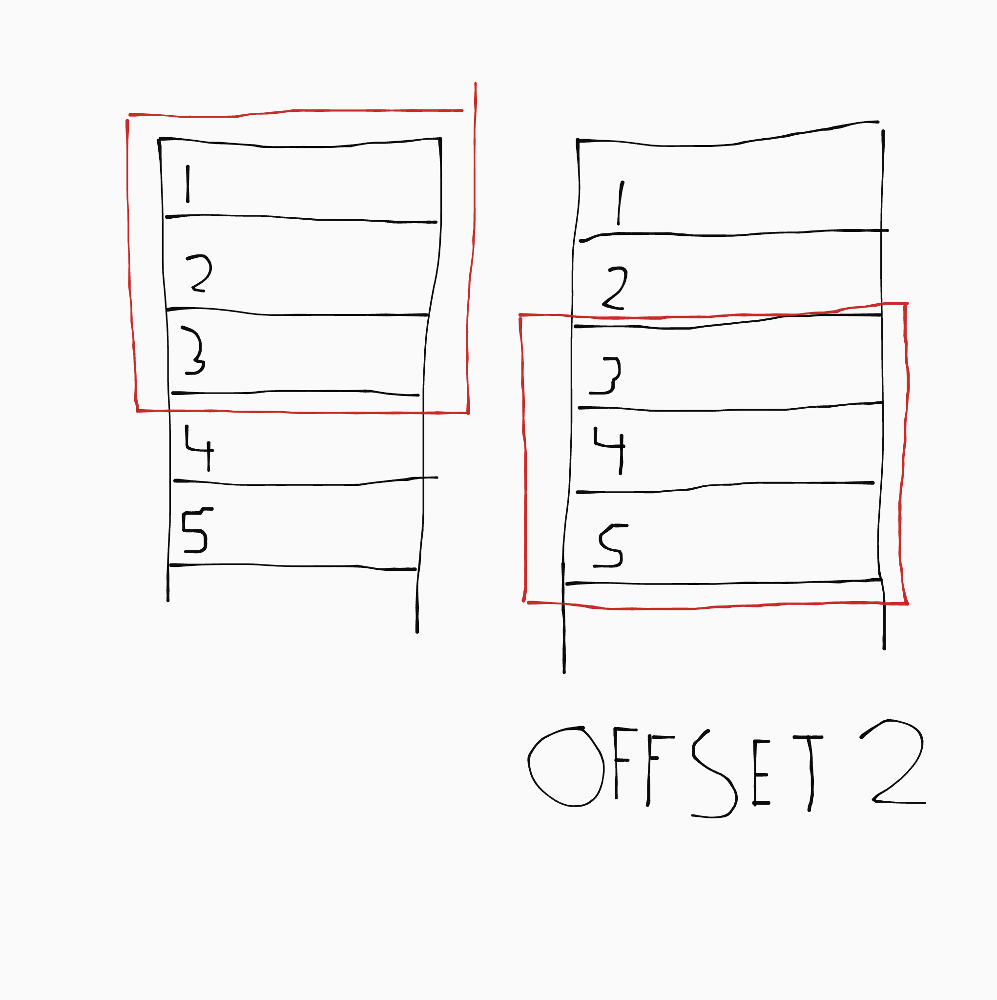
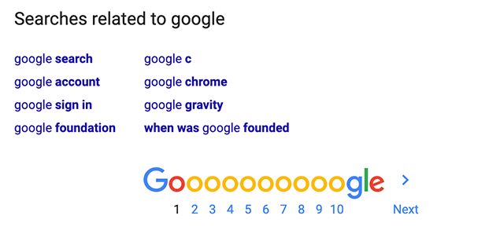

# SQL

SQL staat voor _Structured Query Language_. Het is een taal om informatie in en uit databases te halen. Een database is te vergelijken met een spreadsheet (omdat spreadsheets eigenlijk gebaseerd zijn op databases). Het is een collectie tabellen. Een tabel heeft kolommen, zoals "Naam", "Email", "Geboortedatum", "Bio" etc. en rijen. 

De rijen noem je soms entities of results. De kolommen noem je soms keys of velden. 

## Opbouw van een query

SQL code noem je een query (opvraag). De meest simpele query is:

```sql
SELECT * FROM `employees`;
```

Er zijn hier een aantal dingen:

- Keywords zoals `SELECT` en `FROM` vertellen de computer wat hij moet doen. Deze schrijven we met hoofdletters. (Technisch gezien zijn de hoofdletters optioneel, maar sommige oude systemen werken niet met kleine letters en hoofdletters zorgen ervoor dat je duidelijk kan zien dat het keywords zijn.)

- Verwijzingen naar kolommen, tabellen of variabelen zetten we in backticks (`). Dit is technisch gezien ook optioneel, maar soms krijg je hele rare errors als je het niet doet. (Het doet ook iets met het voorkomen van SQL injection attacks maar ik ben vergeten wat ook alweer.)

- Een query eindigt altijd met een puntkomma (;).

Je mag een query ook over meerdere regels splitsen. Dit is vooral handig bij hele lange queries:

```sql
SELECT *
FROM `employees`;
```

## `SELECT`: velden ophalen

Om informatie uit een database te halen moet je eerst kiezen welke velden je wil zien. Het meest simpele voorbeeld zag je hiervoor al.

We selecteren daar alles (* is een joker) uit de tabel "employees". We kunnen ook iets specifieker dingen ophalen:

```sql
SELECT `first_name`, `hire_date` FROM `employees`;
```

Je scheidt de velden die je wil ophalen met een komma.

## `LIMIT`: maximale hoeveelheid rijen

Met `LIMIT` kan je opgeven hoeveel rijen je maximaal wil ophalen:

```sql
SELECT * FROM `employees` LIMIT 3;
```

Het vorige voorbeeld haalt de bovenste drie rijen op. Je kan met `LIMIT` ook `OFFSET` gebruiken. Met `OFFSET` kan je rijen overslaan. Dit voorbeeld haalt de derde, vierde en vijfde rij vanaf boven op:

```sql
SELECT * FROM `employees` LIMIT 3 OFFSET 2;
```

Je kan het zien als een soort raam dat over de tabel schuift:



<!--

`LIMIT` en `OFFSET` worden vaak gebruikt voor het maken van pagination, zoals je onderaan Google ziet:



-->

## `WHERE`: informatie filteren

Met `WHERE` kan je alleen rijnen die aan een voorwaarde voldoen ophalen:

```sql
SELECT `first_name` FROM `employees` WHERE `salary` > 1000;
```

Dit zijn de meest simpele voorwaarden:

```sql
x = y     # x same as y
x != y    # x not same as y
x > y     # x bigger than y
x >= y    # x bigger or equal to y
x < y     # x smaller than y
x <= y    # x smaller or equal to y
```

Je kan voorwaarden ook combineren:

```
a AND b
c OR d
```

### `NULL`

Als een kolom geen waarde bevat zie je `NULL` staan. `NULL` is dus eigenlijk het gebrek aan inhoud. Als je moet werken met de waarde `NULL` gebruik je `IS` (`NOT`):

```
x IS NULL
x IS NOT NULL
```

`IS` en `IS NOT` zijn dus alleen voor werken met `NULL`!!

### Lijsten

Met `IN` kan je checken of een waarde zich in een lijst bevindt:

```sql
x IN ('Appel', 'Peer', 'Banaan')
```

Dit is kort voor:

```sql
x = 'Appel' OR x = 'Peer' OR x = 'Banaan'
```

### `BETWEEN`

Met `BETWEEN` check je of een waarde tussen twee getallen ligt. Dit werkt dus alleen met getallen!

```sql
x BETWEEN y AND z
```

Dit is kort voor:

```sql
x > y AND x < z
```

## `DESCRIBE`: structuur van de tabel bekijken

`DESCRIBE` laat de structuur van de tabel zien. Je hoeft deze niet te kennen voor de toets, maar voor de volledigheid is hier een voorbeeld:

```sql
DESCRIBE `employees`;
```

## `AS`: variablen maken

Met `AS` kan je kolommen en berekeningen opslaan in een variabele. Een simpel voorbeeld:

```sql
SELECT `first_name` AS `name`, 12 * `salary` AS `year salary` FROM `employees`;
```

Je kan deze variabele pas hergebruiken **na** de `SELECT`. Dus dit kan **niet**:

```sql
SELECT 3 * `salary` AS `salaris kwartaal`, 4 * `salaris kwartaal` AS `jaarsalaris`
FROM `employees`;
# deze query is fout!
```

Maar dit wel (`ORDER BY` komt hierna):

```sql 
SELECT 12 * `salary` AS `jaarsalaris` 
FROM `employees`
ORDER BY `jaarsalaris`;
# deze query is wel goed :)
```

## `ORDER BY`: sorteren

Je kan `ORDER BY` gebruiken om het resultaat van je query te sorteren:

```sql
SELECT * FROM `employees` SORT BY `salary`;
```

Het veld waarop je sorteert hoeft niet opgehaalt te worden in de query:

```sql
SELECT `first_name` FROM `employees` SORT BY `salary`; 
# dit is een werkende query
```

Je kan bij sorteren ook een eerder berekende variable gebruiken, zoals je zag bij `AS`:

```sql 
SELECT 12 * `salary` AS `jaarsalaris` 
FROM `employees`
ORDER BY `jaarsalaris`;
```

Je kan op twee manieren sorteren: oplopend (`ASC`) en aflopend (`DESC`). Als je niet opgeeft of je `ASC` of `DESC` wil sorteren wordt `DESC` gebruikt.

## Functies

Met functies kan je een waarde veranderen. Een functie is zoals een wiskundige functie: je gooit er iets in en hij poept iets uit.

- `ROUND`, `CEIL` (omhoog), `FLOOR` (omlaag): shit afronden.
- `UPPER`, `LOWER`: maak dingen upper- of lowercase.
- `SUBSTR`: pak een gedeelte van een stuk tekst (string slice).

  ```sql
  SUBSTR('Robin', 1, 3)
  # dit wordt 'Rob'
  ```

- `YEAR`, `MONTH`, `DAY`: haal een deel uit een datum.

  ```sql
  YEAR('2007-01-13')    # 2007
  MONTH('2007-01-13')   # 01
  DAY('2007-01-13')     # 13
  ```

- `MONTHNAME`, `DAYNAME`: haal een deel uit een datum, maar dan als fancy word :D

  ```sql
  MONTHNAME('2007-01-13') # January
  DAYNAME('2007-01-13')   # Saturday (wauw ik ben op een zaterdag geboren cool)
  ```

- `TIMESTAMPDIFF`: rekent het verschil tussen twee data uit.

  ```sql
  TIMESTAMPDIFF(YEAR, '2007-01-13', '2008-03-16') # 1
  TIMESTAMPDIFF(MONTH, '2007-01-13', '2008-03-16') # 2
  TIMESTAMPDIFF(DAY, '2007-01-13', '2008-03-16') # 3
  ```

- `NOW`: poept de huidige datum uit.

  ```sql
  TIMESTAMPDIFF(YEAR, '2007-01-13', NOW()) # 16
  ```

ALLES HIERNA ZIJN RANDOM AANTEKENINGEN DIE IK NOG NIET UITGEWERKT HEB!

---

## Grouping

- `AVG`: an average.

    SELECT AVG(`salary`);

- `MIN` and `MAX`: the min and max (duh).

    SELECT MIN(`salary`);
    SELECT MAX(`salary`);

- `SUM`: the sum of everything in an column.

    SELECT SUM(`salary`);

- `GROUP BY`: groups for grouping functions

    SELECT `department_id`, AVG(`salary`) AS `average salary` FROM `employees` GROUP BY `department_id`;

- `DISTINCT`: filter out duplicates.

    SELECT DISTINCT `department_id` FROM `users`

`WHERE` is for individual entries; `HAVING` is for a grouping:

... WHERE `salary` > 1000 (only counts employees with a high salary in the grouping)
... HAVING AVG(`salary`) > 1000 (only returns groupings with an high salary)

# CASE

Basically een case statement zoals elke taal.

```sql
SELECT CASE `manager_id` 
	WHEN 100 THEN 'Steven King'
    WHEN 101 THEN 'Nina Kochar'
    WHEN 102 THEN 'Lex de Haan'
    WHEN 103 THEN 'Alexander Hunold' 
 	WHEN 124 THEN 'Kevin Mourgos'
    WHEN 149 THEN 'Eleni Zlotkey'
    WHEN 201 THEN 'Micael Hartstein'
    WHEN 203 THEN 'Shelley Higgins'
 END AS `manager`, COUNT(*) AS `total people`, SUM(`salary`) AS `total salary` FROM `employees` GROUP BY `manager_id`;
```

## Types

- `INT`: can be SIGNED (-128-127) or UNSIGNED (0-255)
- `FLOAT`: small floating point.
- `DOUBLE`: big floating point.

- `CHAR`: static length string; max 255 chars.
- `TINYTEXT`, `VARCHAR`: string of max 255 chars.
- `TEXT`: max ~6000 chars string.

- `DATE`
- `TIME`
- `DATETIME`

## Example queries

```sql
SELECT
  CONCAT(`first_name`, ' ', `last_name`) AS `volledige naam`,
  CONCAT('$', `salary`) AS `maandsalaris`,
  CONCAT('$', `salary` * 12 + 1.8 * `salary` * 12) AS `jaarsalaris`
FROM `employees`
WHERE 
	(`first_name` LIKE '%a' OR `last_name` LIKE 'de%')
    AND (
        	(`salary` BETWEEN 4000 AND 7000 
         	AND `bonus` IS null)
    		OR `salary` > 10000
        );

SELECT CONCAT(`first_name`, ' ', `last_name`) AS `personeelslid`, `department_id` AS `afdeling`
FROM `employees`
WHERE MOD(`department_id` / 10, 2) = 0
ORDER BY `afdeling` DESC,
		 `last_name` ASC;

SELECT CONCAT(SUBSTR(`first_name`, 1, 1), '. ', `last_name`) AS `medewerker`, `hire_date` AS `datum in dienst`
FROM `employees`
WHERE DAY(`hire_date`) = 17
ORDER BY `hire_date`;

SELECT CONCAT('company bv.  ', `street_address`, '  ', `postal_code`, ' ', UPPER(`city`), ' ', CASE `country_id`
	WHEN 'US' THEN 'United States'
    WHEN 'UK' THEN 'United Kingdom'
    WHEN 'GER' then 'Germany'
    WHEN 'CA' THEN 'Canada'
END) AS `address`
FROM  `locations`;

SELECT CASE `department_id` 
	     WHEN 10 THEN 'Administration'
         WHEN 20 THEN 'Marketing'
         WHEN 50 THEN 'Shipping'
         WHEN 60 THEN 'IT'
         WHEN 80 THEN 'Sales'
         WHEN 90 THEN 'Executive'
         WHEN 110 THEN 'Accounting'
         WHEN 190 THEN 'Contracting'
         ELSE 'Onbekend'
	   END AS `afdeling`,
	   CONCAT('$', ROUND(AVG(`salary`), 2)) AS `gemiddeld salaris`,
       CONCAT('$', ROUND(SUM(`salary`), 2)) AS `totaal salaris`,
	   COUNT(`employee_id`) AS `aantal personeelsleden`
FROM `employees`
GROUP BY `department_id`
HAVING `gemiddeld salaris` < 10000 AND `aantal personeelsleden` > 3;
```

