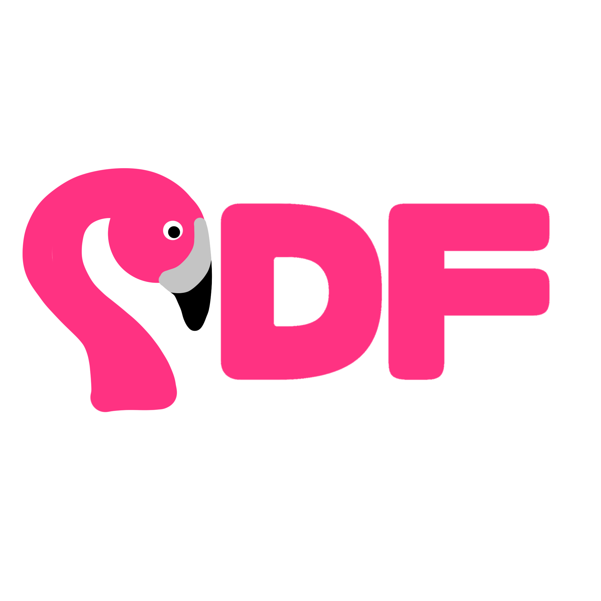
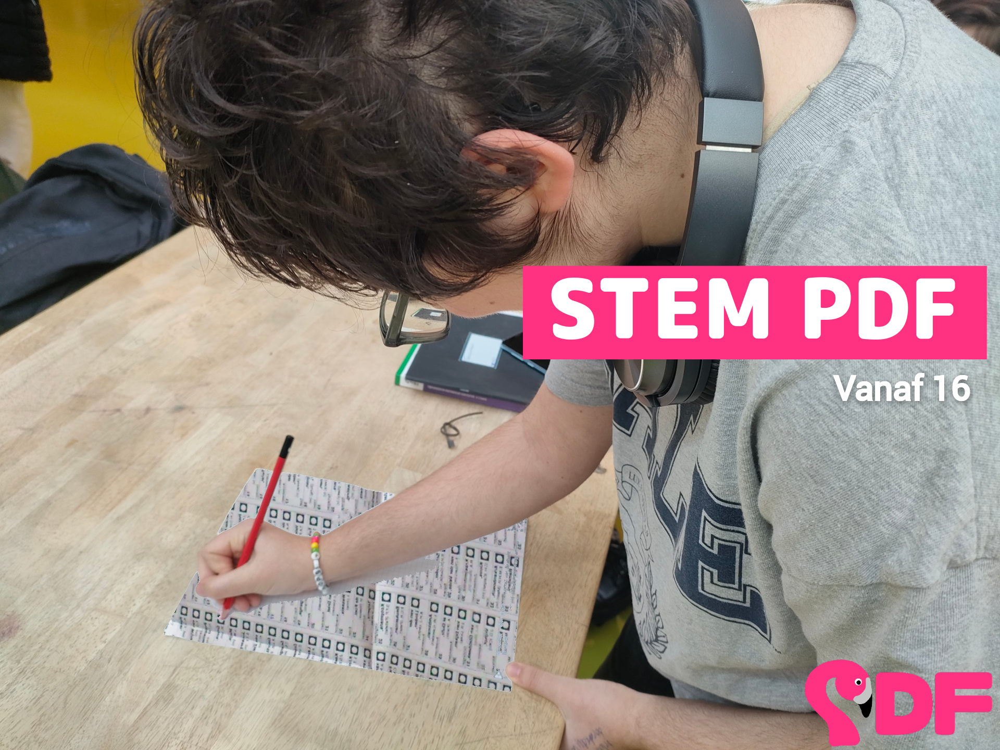

<hgroup>
  <h1>Partij der Future</h1>
  
Totaal serieuze politieke partij van Robin en Sean

</hgroup>

## Inleiding

Dit verslag beschrijft de Partij der Future, een politieke partij die Sean Ham en Robin Boers hebben bedacht voor een praktische opdracht maatschappijleer, waarin we een politieke partij moeten oprichten. Hier is een smiley =)

## Opdracht 1: Stemwijzer

Als voorbereiding op de opdracht moesten we de stemwijzer invullen, zodat we een beetje een beeld kregen van onze standpunten en in welke stromingen die het beste pasten. Hieronder zie je de resultaten van het invullen van de stemwijzer voor de Tweede Kamerverkiezingen van 2023.

| Robin                                                   | Sean                                                   |
| ------------------------------------------------------- | ------------------------------------------------------ |
|  |  |

<small>De resultaten zien er anders uit omdat de ene op een laptop en de ander op een telefoon gemaakt is :)</small>

## Opdracht 2: Partij en ideologie

Onze partij is sociaal-democratische, en ligt het meest in de buurt van de andere linkse partijen in de kamer, zoals GL-PvdA, Volt, PvdD (wat goed overeenkomt met de uitkomsten van onze stemwijzer).

We vinden dat de overheid een actieve rol moet hebben bij het oplossen van maatschappelijke vraagstukken. Zo willen we bijvoorbeeld dat de overheid de economie beter reguleert met als doel het aanpakken van ongelijkheid en het beter verdelen van de welvaart. We willen kwetsbare groepen in onze samenleving beschermen en gelijke kansen voor iedereen realiseren. We zijn uiteindelijk allemaal gewoon mensen; we vinden dat iedereen dus ook zo behandeld moet worden. Verder hebben we een progressieve, vooruitstrevende visie op het gebied van bijvoorbeeld medisch-ethische kwesties, seksuele diversiteit en morele vraagstukken. Ook zijn we een partij die het klimaat erg belangrijk vindt; we willen onze planeet in goede staat aan de volgende generaties kunnen overdragen.

## Opdracht 3: Het logo van onze partij

Onze partij heet de Partij der Future (PDF), omdat we een vooruitstrevende visie hebben voor de toekomst van ons land. Hieronder zie je ons logo.

<small style="text-align: center">Met dank aan onze goede mattie Eoin :)</small>

In ons logo komt de partijmascotte Frederico terug, onze geliefde flamingo. De partij heette origineel de Partij der Fredericanen, maar dat sloot niet helemaal lekker aan bij onze standpunten. Daarom hebben we besloten te rebranden. Maar we wilden Frederico toch in ons logo voort laten leven. En leden van onze partij heten ook nog steeds Fredericanen :)

We wilden eerst het logo rood maken, omdat dat de kleur is die in de logo's van veel sociaal-democratische partijen terugkomt. Maar we vonden dat we het logo ook een beetje onze eigen stijl moesten geven. Daarom hebben we besloten het logo roze te maken. En het sluit ook goed aan bij onze flamingo :)

## Opdracht 4: Standpunten

We willen de levenskwaliteit voor iedereen verbeteren. Om dit te realiseren wordt de belasting voor inkomens boven de €57.000 een stuk hoger.

### Stemrecht voor jongeren

Jongeren hebben momenteel geen kiesrecht waardoor de politiek geen goede afspiegeling van de maatschappij is. Ze betalen wel belasting, maar mogen niet meedenken over het doel van dat belastinggeld. Ze mogen ook niet meebeslissen over belangrijke onderwerpen zoals klimaat en onderwijs, die een grote invloed op hun leven en toekomst hebben. En dat onder het mom dat ze geen goed doordachte en inhoudelijke beslissingen zouden kunnen maken wat betreft politiek, terwijl de praktijk (in andere landen) uitwijst dat dat helemaal niet waar is.

Als we de leeftijd waarop burgers kiesrecht krijgen verlagen tot 16, zorgen we voor een grotere politieke diversiteit, verminderen we de kans op radicalisering en verhogen we de opkomst bij toekomstige verkiezingen.

Zie <https://school.geheimesite.nl/5VWO/stermrecht-voor-jongeren> voor meer informatie.

### Klimaat

De klimaatdoelen voor 2030 en 2050 zijn niet voldoende om onder de 1.5 graad opwarming te blijven (Kuiper, 2022), en we halen ze ook nog eens niet (PBL, 2024). Om een leefbaar klimaat te behouden vinden we dat de klimaatdoelen moeten worden aangescherpt en behaald. Hieronder valt ook het halen van de Europese klimaatdoelen met betrekking tot stikstofuitstoot, terwijl we ook boeren voldoende compenseren, en subsidies bieden voor de boeren die hun bedrijf willen omvormen tot een biodynamisch landbouwbedrijf.

Daarnaast willen we kerncentrales bouwen in Nederland. We denken dat hernieuwbare energie alleen op de korte termijn niet toereikend zal zijn om te kunnen stoppen met het gebruik van fossiele brandstoffen. Daarom willen we voor in ieder geval de komende 30 à 50 jaar kerncentrales gebruiken voor het aanvullen van de energie uit duurzame bronnen. Ook willen we geld investeren in het onderzoeken naar het efficiënt en schoon opslaan van energie, zodat het in de toekomst mogelijk wordt om piek-opwekking op zonnige of winderige dagen op te slaan voor later.

Ook willen we investeren in openbaar groen. Dit is goed voor de opslag van CO2, en uit onderzoek is gebleken dat het een stressverminderend effect op omwonenden heeft (Ravesloot et al., 2019). Daarnaast kan openbaar groen voor recreatie gebruikt worden.

### Negatieve BTW op groenten en fruit

We willen een veel hogere BTW op frisdrank, koek, snoep en gebak. We willen daarmee een negatieve BTW op groente en fruit mogelijk maken. Dat zorgt ervoor dat armere gezinnen beter rond kunnen komen en komt ook de volksgezondheid ten goede.

### Onderwijs

We willen investeren in het onderwijs – met name een verhoging van de lonen voor leraren (in het basisonderwijs) en onderzoek naar verbeterde lesmethodes. Ook willen we de administratieve last van leraren in het basisonderwijs verminderen. Dat is een prima manier om al die hoogopgeleide "influencers", "communicatie-experts" en "adviseurs" voor iets nuttigs in te zetten.

### Vervoer

We willen de grote steden op lange termijn zo veel mogelijk autovrij maken, bijvoorbeeld door het versmallen van wegen en het aanleggen van fietsstraten. We willen ook een veel hogere wegenbelasting, om autorijden te ontmoedigen, en flink investeren in het OV. We willen metronetwerken in grote steden naast Den Haag en Rotterdam (die momenteel al een goed metronetwerk hebben). Ook willen we de metro veel goedkoper (of misschien zelfs gratis maken). Ten slotte willen we alle subsidies op vliegen stoppen en de vliegbelasting een stuk hoger maken. Het is absurd dat de trein duurder is dan het vliegtuig.

### Medisch-ethische kwesties

We vinden dat iedereen de vrijheid moet hebben om zelf te kunnen beslissen over medisch-ethische kwesties. Dat betekent dat het plegen van abortus of euthanasie een grondrecht moet worden, en uit het wetboek van strafrecht gehaald moet worden.

We willen ook betere seksuele voorlichting op middelbare scholen en het hoger onderwijs. Hiermee hopen we dat minder vrouwen daadwerkelijk in de positie komen dat ze moeten kiezen voor een abortus, door voorlichting te geven over de risico's van seksuele interactie, het hebben van veilige seks en het gebruik van anticonceptie. Ook willen we dat er meer aandacht komt voor onder andere genderdiversiteit, seksuele diversiteit, consent en grensoverschrijdend gedrag. We willen dat deze onderwerpen worden vastgelegd in de kerndoelen voor het middelbaar en hoger onderwijs en dat scholen verplicht worden voldoende vrij te maken voor de doelen.

### Verantwoordelijk omgaan met AI

We vinden dat de overheid strenge regels moet maken over het inzetten van AI. We willen voorkomen dat AI en machine learning (zoals we dat al jaren kennen) de maatschappij verder ontwrichten door middel van algoritmes die polarisatie als effect hebben. Juist in een nieuw en opkomend werkveld is het belangrijk om direct risico's te identificeren, om ervoor te zorgen dat de invloed van de technologie op onze samenleving positief is. We moeten ook goed kijken naar de belangen van bedrijven die AI modellen trainen. Om een model te trainen is namelijk een gigantische hoeveelheid computerkracht nodig–en dus geld. Dit betekent dat alleen overheden en miljardairs de mogelijkheid hebben om zo'n model te trainen. Hebben zij dezelfde belangen als de rest van de bevolking?

Met betrekking tot de huidige modellen zoals GPT-4, Google Gemini en Microsoft Bing, vinden we het belangrijk dat mensen kunnen zien of informatie door een mens is geschreven of door een LLM is gegenereerd.

Ten slotte vinden we het belangrijk dat het gebruik van generative AI geen negatief effect op de schrijfvaardigheid van jongeren zal hebben. We willen dit niet bereiken met een verbod op gebruik van AI op scholen, aangezien een verbod in vele gevallen een minder gewenst effect heeft dan goed onderwijs. We willen daarom investeren in de ontwikkeling van lesmethodes met betrekking tot het verantwoordelijk inzetten van AI. Niet als een manier om een tekst voor je te genereren ("schrijf een recensie over X voor me van Y woorden") maar als tool om leerlingen te helpen hun schrijfvaardigheid te verbeteren ("een alternatief voor deze zin die niet helemaal lekker loopt").

Zie <https://roblog.nl/blog/gpt> voor meer informatie.

## Opdracht 5: Woordweb

Ik heb geen zin om ze te copy-pasten.

## Opdracht 6: Poster

Hieronder zie je onze verkiezingsposter. Als het nog niet duidelijk was, zie je een jongere die stemt. Want dat is wat we willen :D

## Bronvermelding

Kuiper, E.-J. (2022) Zijn de Nederlandse klimaatdoelen in lijn met de 1.5°C van Parijs? <i>VRPO tegenlicht</i>. <https://www.vpro.nl/programmas/tegenlicht/lees/artikelen/2022/ernst-jan-kuiper-koolstofbudget-nederlandse-doelen-klimaatakkoord.html>

Planbureau voor de Leefomgeving. (2024) Stikstof- en natuuraanpak toont vooruitgang richting 2030, maar doelen zijn buiten bereik. <i>PBL</i>. <https://www.pbl.nl/actueel/nieuws/stikstof-en-natuuraanpak-toont-vooruitgang-richting-2030-maar-doelen-zijn-buiten-bereik>

Ravesloot, M. & de Rooij, B. (2019) Groen: goed voor de gezondheid. <i>Wageningen University & Research</i>. <https://www.wur.nl/nl/show-longread/groen-goed-voor-de-gezondheid.htm>

Ham, S. & Boers, R. (2023) Stemrecht voor jongeren. <i>School shtuff</i>. <https://school.geheimesite.nl/5VWO/stermrecht-voor-jongeren>

Boers, R. (2024) The role of generative AI in writing. <i>lil notes</i>. <https://roblog.nl/blog/gpt>
