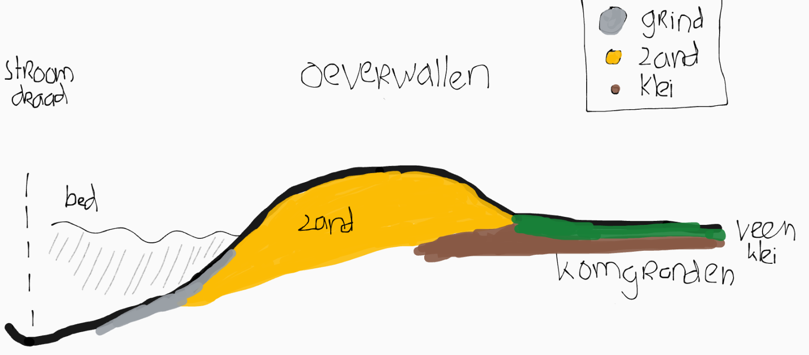
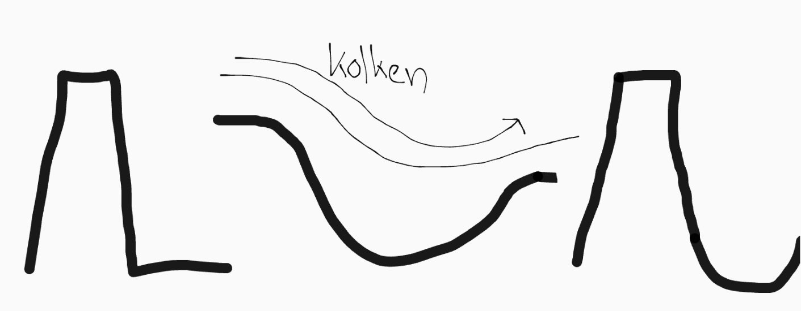
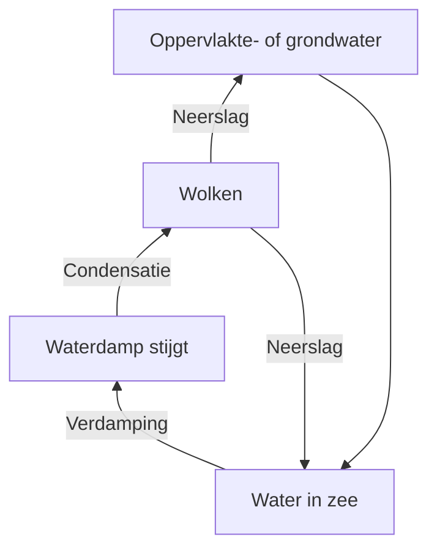
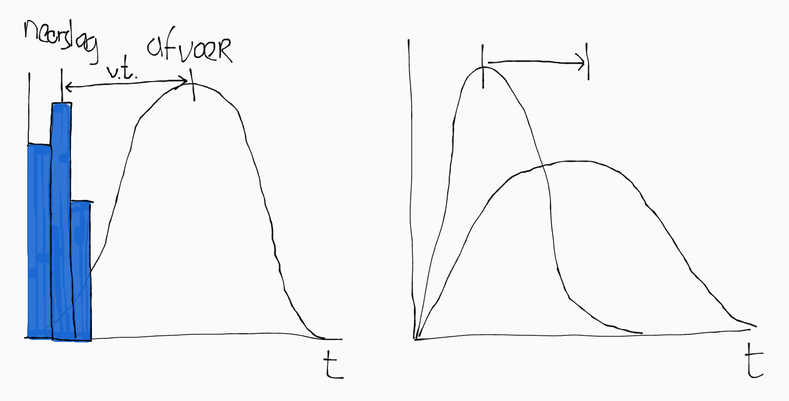

Nederland heeft twee grote rivieren:

- **De Maas**: een regenrivier. Het **stroomgebied** van zo'n rivier is de oppervlakte van het land waarvan de rivier het water afvoert. Stroomgebieden van rivieren worden meestal gescheiden door waterscheidingen (reliëf).

- **De Rijn**: een gemengde rivier. Een deel van het water komt van smeltwater van sneeuw en gletsjers, en de rest van regenwater. De Rijn voert ongeveer 10x zoveel water af.

Het **debiet** van een rivier is de waterafvoer in een dwarsdoorsnede van een rivier in m³/s. Het **regiem** is hetzelfde, maar dan in m³/jaar.

Het **verhang** van een rivier is hoe steil hij is: het hoogteverschil per afstandseenheid. Het **verval** is het totale hoogteverschil tussen bron en monding.

Hieronder zie je een schematische weergave van het rivierengebied met mijn fantastische tekenkunsten:

## Functies van rivieren

- Vervoeren van water
- Drinkwaterbron
- Sediment afvoeren
- Scheepvaart
- Visserij
- Recreatie
- Koelwater
- Irrigatie
- Verdediging (Hollandse Waterlinie):
  - Door land onderwater te zetten (= inunderen) onbegaanbaar maken.
  - Tegenwoordig nutteloos vanwege vliegtuigen.

## Rivierlandschap

Het dieptste punt van de rivier, waar de watersnelheid het grootst is, noem je de **stroomdraad**.

Een rivier neemt sediment mee en zet het weer af (sedimentatie). De rivier legt dit sediment gesorteerd neer: hoe groter de sedimentdeeltjes, hoe makkelijker ze afgezet kunnen worden, dus grote sedimentdeeltjes, zoals zand en kiezels, worden dus dichtbij de stroomdraad al afgezet, terwijl kleine sedimentdeeltjes, zoals klei, pas worden afgezet als de stroomsnelheid veel lager is.

Er zijn in Nederland twee soorten rivierlandschappen:

- **Westelijk rivierkleilandschap**: in de buurt van de kust speelt het getij van de zee een rol. Het water staat er meer stil, waardoor klei en zand sedimenteert aan de oevers. Verder weg vindt je veen (half verteert plantmateriaal).

- **Oostelijk rivierkleilandschap**: ver weg van de zee is deze invloed afwezig. Daardoor sedimenteert hier alleen zand aan de oevers. Klei vindt je alleen verderop (komgronden), waar het sedimenteert als de rivier overstroomt en buiten haar oevers treedt.

### Delta

Een delta is een stuk door neergelegd sediment ontstaan land (in zee). Delta's zijn net als de gebieden rond de rivier erg vruchtbaar, vanwege het sediment.

### Meanderen

In een rivier is de stroomsnelheid in de buitenbocht het snelst en in de binnenbocht het kleinst. Daardoor is er erosie in de buitenbocht en sedimentatie in de binnenbocht, en worden de bochten dus steeds scherpen. Op den duur snijden ze hierdoor af en wordt de rivier weer een (enigzins) rechte lijn. De hoefijzervorm die overblijft noem je een _verlaten meander_.

In een meanderende rivier hangt de vorm van de bedding af van:

- Het gemiddelde debiet (meer afvoer ⇒ bredere bedding).
- De variaties in het debiet (dus het regiem).

### Vlechten

Een rivier kan ook vlechten. Dan heeft de rivier meerdere (paralelle) beddingen. Dat is momenteel niet het geval in Nederland, maar was tijdens de ijstijd door de onregelmatige waterafvoer en grote hoeveelheden sediment (die de bedding konden verstoppen) wel zo.

### Gereguleerde rivieren

Door het meanderen verlegt de rivier zichzelf. Dit was zo tot ongeveer het jaar 1000, toen we dijken begonnen te bouwen. Voor die tijd leefde mensen op terpen (= woonheuvels).

Kribben zijn een soort uitstekeingen vanaf de oever. Ze:

- voorkomen erosie.
- zorgen ervoor dat de stroomdraad in het midden blijft.

Een andere manier om rivieren te regulieren is het kanaliseren (rechttrekken). Hierdoor voeren ze sneller water af en zijn ze beter bevaarbaar.

#### Stuwen

De stuwen (in de Nederrijn) kunnen ook gebruikt worden voor de regulatie van water. In de zomer, als er veel verdamping is, en dus weinig water, worden ze gesloten, zodat het water naar onze drinkwatervoorraad in het IJselmeer stroomt. In de winter, als het veel regent, staan ze juist open, om zo snel mogelijk het water af te voeren.

Een stuw bestaat uit het stuw zelf, dat het water tegenhoudt, een sluis voor het vaarverkeer en een vistrap voor onze onderwatervrienden.

In andere landen worden stuwmeren gebruikt voor hydroelectriciteit, maar in Nederland is het verhang van de rivieren niet groot genoeg. Een stuwmeer kan ook voor problemen zorgen:

- Stuwmeren houden sediment tegen waardoor er minder deltaopbouw is.
- Stuwmeren hopen water op waardoor er stroomafwaarts minder water beschikbaar is (als stroomafwaarts in een ander land is, kan dit voor geopolitieke conflicten zorgen--wateroorlog).

### Dijkdoorbraak

Als een dijk doorbreekt komt er veel water door een kleine opening en begint het te kolken (hard stromen). Daardoor maakt het een groot gat in de grond. Dat noemen we een wiel of kolkgat.

Meestal laten ze het zitten en bouwen ze de nieuwe dijk er in een bocht omheen.

## Hydrologische kringloop

In de hydrologische kringloop vinden er steeds faseovergangen plaats tussen de _aggregatietoestanden_ van water:

- Vast
- Vloeibaar
- Gas

## Bescherming tegen overstroming

### Paradigmaverschuiving

Na het hoogwater in 1995 moest er iets gedaan worden, maar we wilden niet de dijken blijven verhogen. Er vondt toen een paradigma (= zienswijze/perspectief) wisseling plaats van mitigatie naar adaptatie:

- **Mitigatie**: water wordt gezien als de vijand. Om ervan af te komen moeten we het zo snel mogelijk afvoeren. We gaan uit van maakbaarheid van het landschap.

- **Adaptatie**: we omarmen het water; het biedt mogelijkheden. We kijken naar opties voor dynamisch waterbeheer.

Vanuit adaptatie is het plan _Ruimte voor de Rivier_ ontstaan, waar deze NLT module naar vernoemd is.

Hierin combineren we verschillende aspecten (integraal waterbeheer):

- Veiligheid
- Wateroverlast
- Verdroging
- Watervervuiling
- Verzilting

### Maatregelen

- Kribverlaging
- Uiterwaardvergraving (zeer effectief)
- Verdiepen zomerbed (zeer effectief)
- Aanleg nevengeul (bypass)
- Obstakelverwijdering (zoals dichte bruggen 🠆 pijlers)
- Verwijderen zomerdijk
- Verwijderen terpen (etc.)
- Dijkverlegging
- Dijkverhoging
- Toevoer water naar rivier beperken
- Natuurontwikkeling (vergroot vertragingstijd)

### Vertragingstijd

De piekafvoer van een rivier is het moment dat het debiet het grootst is. Als de piekafvoer te groot is kunnen de rivieren het water niet snel genoeg afvoeren en overstromen ze. Daarom willen we de piekafvoer beperken.

Dit doen we door de vertragingstijd te vergroten. De vertragingstijd is de tijd tussen het moment van neerslag en het moment dat het water door de rivier wordt afgevoerd. Daardoor komt het water niet allemaal tegelijk in de rivier.

De vertragingstijd wordt beïnvloed door:

- **Verstening**: door verstedelijking is er steeds minder mogelijkheid voor water om te infiltreren in de grond, waardoor het via het riool direct wordt afgevoerd.

- **Ontbossing**: hierdoor neemt het sponskarakter van een (natuur)gebied af en houdt het dus minder lang water vast.

- **Aanpassen grondwaterspiegel** (ivm landbouw) zorgt voor inklinking waardoor het sponskarakter van veen afneemt en water minder lang wordt vastgehouden

- **Drainage**: afvoersystemen voor overtollig water in de grond. Al infiltreert het water in de grond, wordt het dan alsnog afgevoerd.

- **Kanalisatie**: door het aanleggen van kanalen wordt het water juist sneller afgevoerd.

### Drietrapsstrategie

Om de vertragingstijd zo groot mogelijk te maken en daarmee de rivier te ontlasten gebruik je deze stappen:

1. **Vasthouden** in/op de bodem door het te laten infiltreren. Bijvoorbeeld in een wadi: een kuil met planten die regen vasthoudt (er was een filmpje over in de les).

2. **Bergen** (= opslaan) op een andere plek (oppervlaktewater), zoals sloten of plassen. De opslagplek noem je een **retentiegebied**.

3. **Afvoeren**/lozen in de rivier. Dit wil je zo lang mogelijk uitstellen om de rivier te ontlasten.

> **LET OP: KOMT IN DE TOETS.**

### Zeespiegelstijging

De zeespiegel stijgt door klimaatverandering. Dat noem je transgressie.

- **Absolute zeespiegelstijging** (E) is dus de afstand die de zeespiegel omhoog gaat.
- **Relatieve zeespiegelstijging** (R) is de afstand die de zeespiegel omhoog gaat _plus de afstand die de grond omlaag of omhoog gaat (b)_.

\\[R = E + b\\]

In Nederland daalt de grond namelijk door inklinking. Het grootste deel van onze grond is veen, en omdat we een verlaagde grondwaterspiegel hebben ivm landbouw, is het bovenste deel van het veen blootgesteld aan zuurstof. Het veen (halfverteerd plantenmateriaal) zal daardoor verder verteren en compacter worden, waardoor de bodem daalt.

In Scandinavië is het juist andersom: daar is \\(b\\) negatief. De bodem gaat daar dus omhoog, vanwege platentectoniek.
