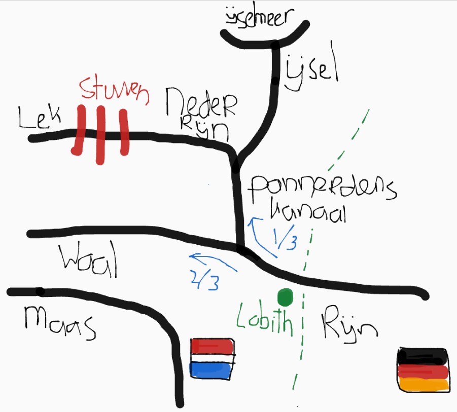
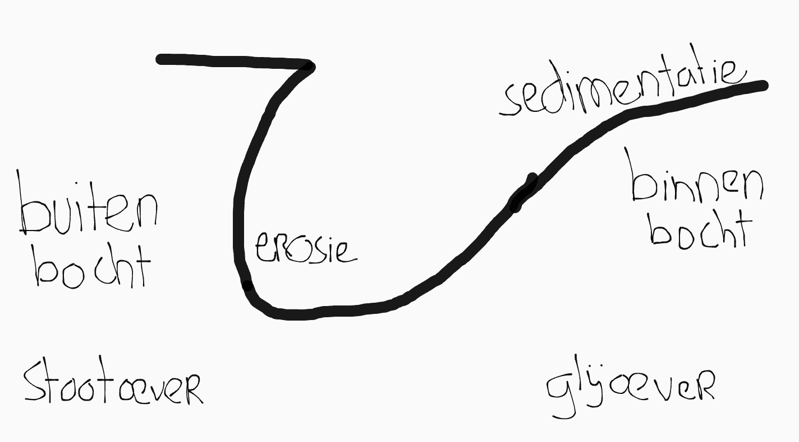
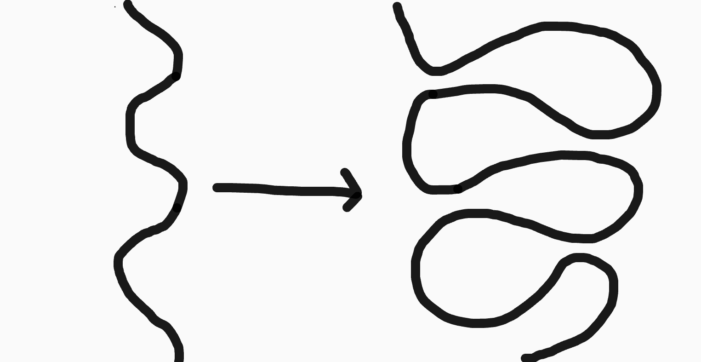
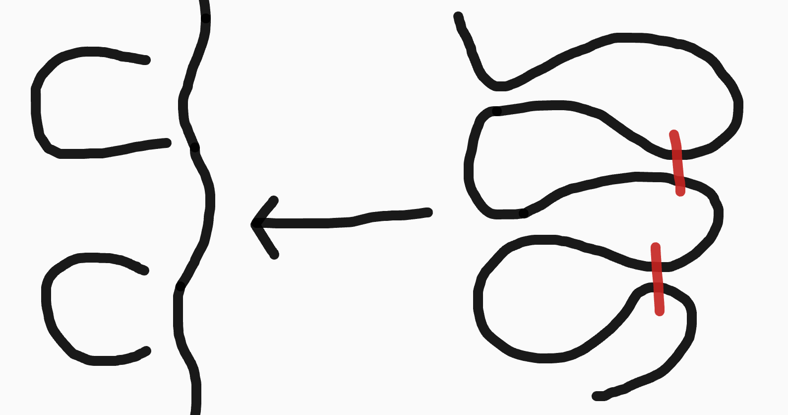
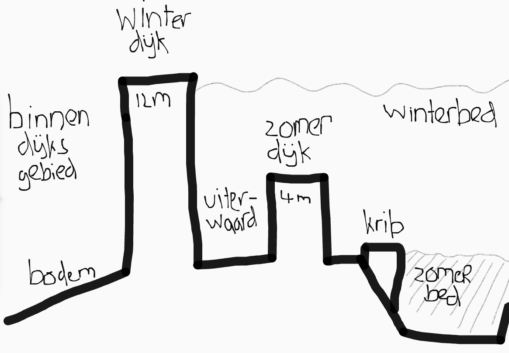
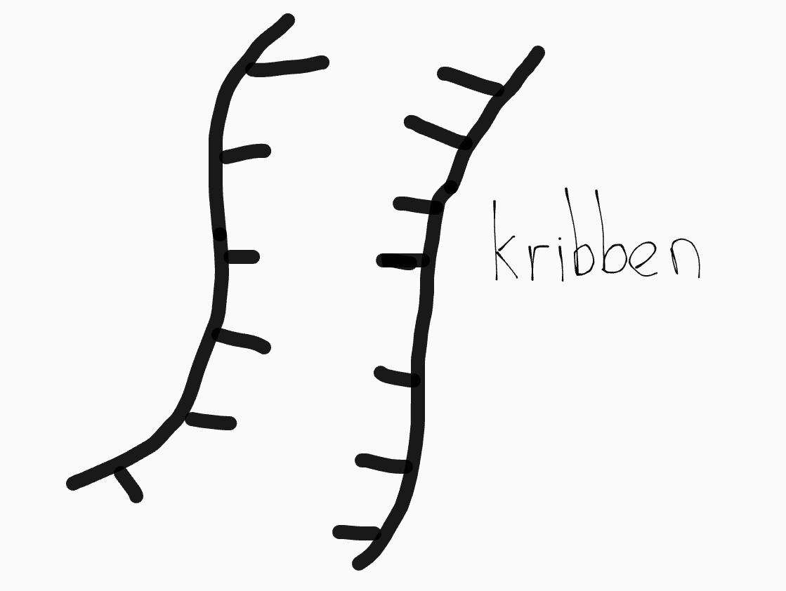
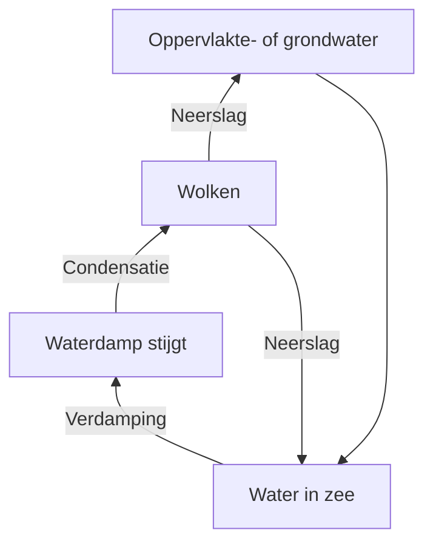

## Rivieren

Nederland heeft twee rivieren:

- **De Maas**: een regenrivier. Het stroomgebied van zo'n rivier is de oppervlakte van het land waarvan de rivier het water afvoert. Stroomgebieden van rivieren worden meestal gescheiden door waterscheidingen (reliëf).

- **De Rijn**: een gemengde rivier. Een deel van het water komt van smeltwater van sneeuw en gletsjers, en de rest van regenwater. De Rijn voert ongeveer 10x zoveel water af.

Hieronder zie je een schematische weergave van het rivierengebied met mijn fantastische tekenkunsten:

**Het debiet** van een rivier is de waterafvoer in een dwarsdoorsnede van een rivier in m³/s. **Het regiem** is hetzelfde, maar dan in m³/jaar.

### Delta

Een delta is een stuk door neergelegd sediment ontstaan land (in zee). Delta's zijn net als de gebieden rond de rivier erg vruchtbaar, vanwege het sediment.

### Functies van rivieren

- Vervoeren van water
- Drinkwaterbron
- Sediment afvoeren
- Scheepvaart
- Visserij
- Recreatie
- Koelwater
- Irrigatie
- Verdediging (Hollandse Waterlinie):
  - Door land onderwater te zetten (= inunderen) onbegaanbaar maken.
  - Tegenwoordig nutteloos vanwege vliegtuigen.

### Meanderen

In een rivier is de stroomsnelheid in de buitenbocht het snelst en in de binnenbocht het kleinst. Daardoor is er erosie in de buitenbocht en sedimentatie in de binnenbocht, en worden de bochten dus steeds scherpen. Op den duur snijden ze hierdoor af en wordt de rivier weer een (enigzins) rechte lijn. De hoefijzervorm die overblijft noem je een _verlaten meander_.

### Gereguleerde rivieren

Door het meanderen verlegt de rivier zichzelf. Dit was zo tot ongeveer het jaar 1000, toen we dijken begonnen te bouwen. Voor die tijd leefde mensen op terpen (zelfgemaakte heuvels).

Kribben zijn een soort uitstekeingen vanaf de oever. Ze:

- voorkomen erosie.
- zorgen ervoor dat de stroomdraad (watersnelheid en diepte) in het midden blijft.

Een andere manier om rivieren te regulieren is het kanaliseren (rechttrekken). Hierdoor voeren ze sneller water af en zijn ze beter bevaarbaar.

#### Stuwen

De stuwen (in de Nederrijn) kunnen ook gebruikt worden voor de regulatie van water. In de zomer, als er veel verdamping is, en dus weinig water, worden ze gesloten, zodat het water naar onze drinkwatervoorraad in het IJselmeer stroomt. In de winter, als het veel regent, staan ze juist open, om zo snel mogelijk het water af te voeren.

Een stuw bestaat uit het stuw zelf, dat het water tegenhoudt, een sluis voor het vaarverkeer en een vistrap voor onze onderwatervrienden.

In andere landen worden stuwmeren gebruikt voor hydroelectriciteit, maar in Nederland is het verhang van de rivieren niet groot genoeg. Een stuwmeer kan ook voor problemen zorgen:

- Stuwmeren houden sediment tegen waardoor er minder deltaopbouw is.
- Stuwmeren hopen water op waardoor er stroomafwaarts minder water beschikbaar is (als stroomafwaarts in een ander land is, kan dit voor geopolitieke conflicten zorgen--wateroorlog).

### Hydrologische kringloop

In de hydrologische kringloop vinden er steeds faseovergangen plaats tussen de _aggregatietoestanden_ van water:

- Vast
- Vloeibaar
- Gas

### Paradigmaverschuiving

Na het hoogwater in 1995 moest er iets gedaan worden, maar we wilden niet de dijken blijven verhogen. Er vondt toen een paradigma (= zienswijze/perspectief) wisseling plaats van mitigatie naar adaptatie:

- **Mitigatie**: water wordt gezien als de vijand. Om ervan af te komen moeten we het zo snel mogelijk afvoeren. We gaan uit van maakbaarheid van het landschap.

- **Adaptatie**: we omarmen het water; het biedt mogelijkheden. We kijken naar opties voor dynamisch waterbeheer.

Vanuit adaptatie is het plan _Ruimte voor de Rivier_ ontstaan, waar deze NLT module naar vernoemd is.
