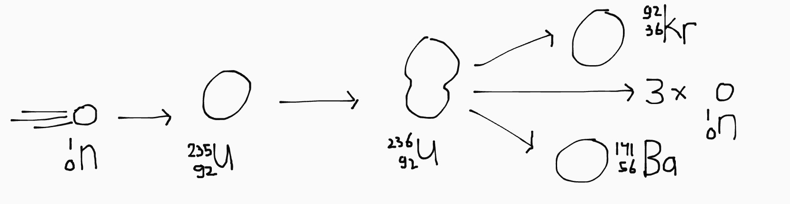

**NOG NIET AF**

## Atomen

Een atoom bestaat uit:

- Protonen <small>(positief geladen)</small>
- Neutronen <small>(neutraal; ongeladen)</small>
- Elektronen <small>(negatief geladen)</small>

De kern van een atoom bestaat uit de protonen en neutronen. De elektronen zweven daar in een wolk omheen. Atomen zijn altijd elektrisch neutraal (want als ze wel geladen zijn noemen we het ionen). Dat betekent dat het aantal protonen gelijk is aan het aantal elektronen.

Een atoom heeft de volgende eigenschappen:

- **Atoomnummer**: het aantal protonen is het atoomnummer, en bepaalt de stof.
- **Atoommassa**: de som van het aantal protonen en neutronen. <small>(We rekenen elektronen niet mee omdat ze een verwaarloosbaar kleine massa hebben)</small>

Het aantal neutronen verschilt soms per deeltje; verschillende aantallen neutronen noem je isotopen.

## Kerndeeltjes

Een kerndeeltje heeft de volgende eigenschappen:

- Massa (A)
- Lading (Z)
- Soort (X)
- Leptongetal (L)

Je noteert een kerndeeltje zo: \\(\ce{^{A}_\{Z}X}\\).

### Atoomkernen

We gaan het vooral hebben over atoomkernen. Dat zijn atomen zonder de elektronenwolk. Omdat het aantal protonen en elektronen niet meer gelijk is (er zijn geen elektronen), is de lading van een kern gelijk aan het atoomnummer.

Daarmee kan je vervolgens het symbool (X) van de atoomsoort opzoeken in Binas.

### Soorten deeltjes

| Symbool                              | Deeltje               |
|--------------------------------------|-----------------------|
| \\(\ce{^{A}_\{Z}X}\\)                | Atoomkern             |
| \\(\ce{^1_0n}\\)                     | Losse neutronen       |
| \\(\ce{^1_1p}\\) of \\(\ce{^1_1H}\\) | Losse protonen        |
| \\(\ce{^0_{-1}e}\\) of \\(\beta^-\\) | Elektronen            |
| \\(\ce{^0_1e}\\) of \\(\beta^+\\)    | Positronen            |
| \\(\ce{^0_0\nu}\\)                   | Elektron-neutrino     |
| \\(\ce{^0_0\bar{\nu}}\\)             | Elektron-antineutrino |

### Pick-me deeltjes <small>(aka speciale symbolen voor veelvoorkomende deeltjes)</small>

| Symbool      | Deeltje               |
|--------------|-----------------------|
| \\(\alpha\\) | \\(\ce{^4_2He}\\)     |
| \\(\ce{D}\\) | \\(\ce{^2_1H}\\)      |
| \\(\ce{T}\\) | \\(\ce{^3_1H}\\)      |

### Neutrino's

Neutrino's zijn deeltjes met (bijna) geen massa, geen lading en geen interactie met andere materie. Ze dragen energie met zich mee. (Bye bye energie...)  
Je kan aan het einde van je vergelijkingen een neutrino toe voegen om het leptop-getal compleet te maken.

| Deeltje                                 | Leptongetal |
|-----------------------------------------|-------------|
| Elektron (\\(\beta^-\\))                | 1           |
| Elektron-neutrino (\\(\nu\\))           | 1           |
| Positron (\\(\beta^+\\))                | -1          |
| Elektron-antineutrino (\\(\bar{\nu}\\)) | -1          |

## Kernreacties

In een kernreactie gelden een aantal regels:

- Behoudt van massagetal
- Behoudt van lading
- Behoudt van leptongetal

Dat betekent dat de som van deze eigenschappen voor en achter de pijl gelijk moet zijn. Soms zie je leptopgetal over het hoofd, omdat het niet in de notatie van kerndeeltjes staat.

### Soorten

- Vervalreactie
- Splijtingsreactie
- Fusiereactie

### Kernsplijting

Bij kernsplijting bekogel je een atoom met neutronen, waardoor de atoomkernen uit elkaar vallen:

\\[\ce{^1_0n + ^{235}\_{92}U -> ^{92}\_36Kr + ^{141}\_{56}Ba + 3 ^1_0n}\\]

Zoals je ziet komen hier ook weer op hoge snelheid neutronen vrij, die vervolgens nóg meer kernsplijtingen veroorzaken; de reactie is exponentiëel. Helemaal toppie in bijvoorbeeld in een kernbom--in een energiecentrale *not so much*.

### Kernfusie

In een fusiereactie schiet je twee waterstofatomen met grote snelheid op elkaar af, zodat de kernen samensmelten tot één kern:

\\[\ce{^1_1H + ^1_1H -> ^2_1H + ^0_1e + ^0_0\nu}\\]

<small>De neutrino zorgt ervoor dat het leptopngetal aan beide kanten van de reactie nul is; de positron heeft namelijk een leptongetal van 1.</small>

## Bindingsenergie

- **Chemisch**: houdt de atomen in een molecuul bij elkaar.  
  Basically gwn [de \\(\Delta E\\) van scheikunde](/5VWO/TW1/Scheikunde.md).

- **Nucleair**: houdt de kerndeeltjes in een atoomkern bij elkaar,  
  door middel van een aantal krachten.

### Krachten binnen een atoomkern

- **Coulombkracht**: tussen geladen deeltjes; gelijke ladingen stoten elkaar af.
- **Sterke kernkracht**: aantrekkende kracht tussen alle subatomaire deeltjes--houdt de deeltjes in een kern bij elkaar; iets met quarks en gluonen.
- **Zwakke kernkracht**: zorgt voor instabiliteit...?

# Energieverlies bij fusiereacties

- Neutrino's
- Warmte