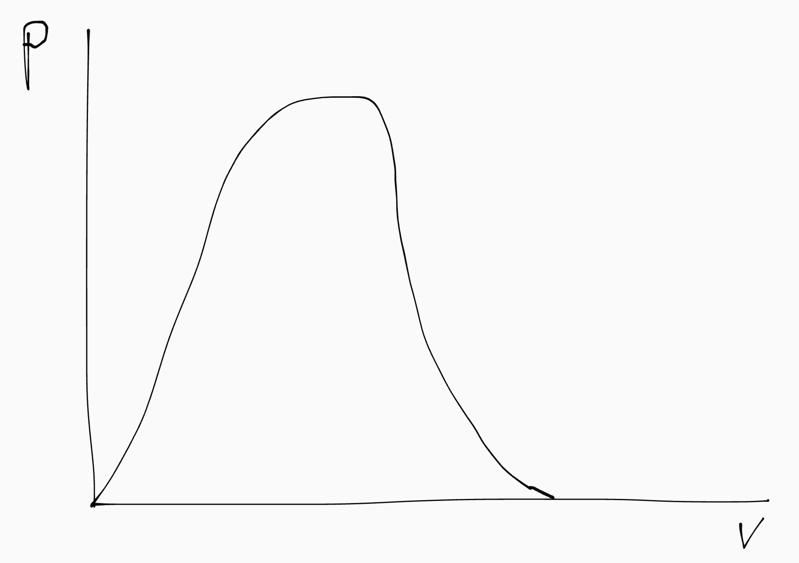
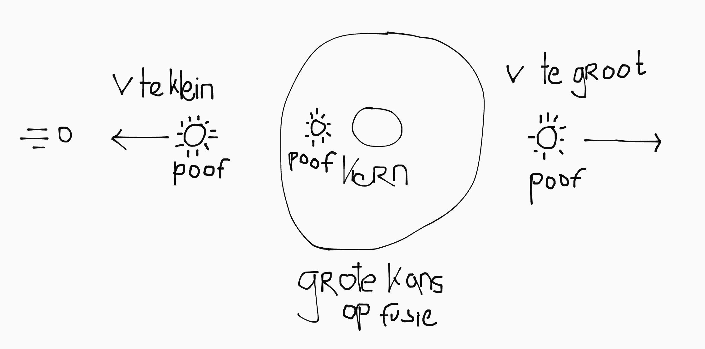
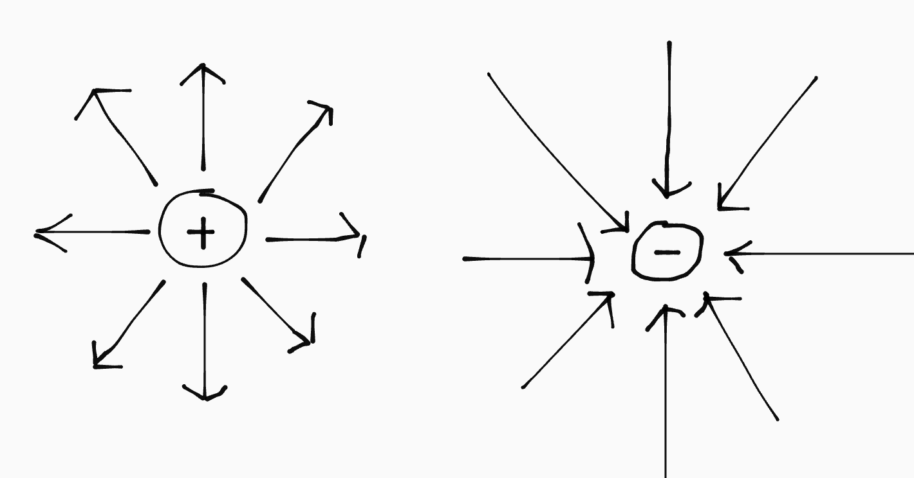
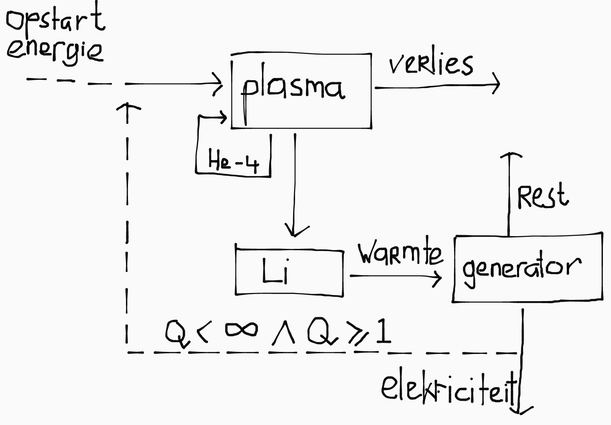

## Atomen

Een atoom bestaat uit:

- Protonen <small>(positief geladen)</small>
- Neutronen <small>(neutraal; ongeladen)</small>
- Elektronen <small>(negatief geladen)</small>

De kern van een atoom bestaat uit de protonen en neutronen. De elektronen zweven daar in een wolk omheen. Atomen zijn altijd elektrisch neutraal (want als ze wel geladen zijn noemen we het ionen). Dat betekent dat het aantal protonen gelijk is aan het aantal elektronen.

Een atoom heeft de volgende eigenschappen:

- **Atoomnummer**: het aantal protonen is het atoomnummer, en bepaalt de stof.
- **Atoommassa**: de som van het aantal protonen en neutronen. <small>(We rekenen elektronen niet mee omdat ze een verwaarloosbaar kleine massa hebben)</small>

Het aantal neutronen verschilt soms per deeltje; verschillende aantallen neutronen noem je isotopen.

## Kerndeeltjes

Een kerndeeltje heeft de volgende eigenschappen:

- Massa (A)
- Lading (Z)
- Soort (X)
- Leptongetal (L)

Je noteert een kerndeeltje zo: \\(\ce{^{A}_\{Z}X}\\).

### Atoomkernen

We gaan het vooral hebben over atoomkernen. Dat zijn atomen zonder de elektronenwolk. Omdat het aantal protonen en elektronen niet meer gelijk is (er zijn geen elektronen), is de lading van een kern gelijk aan het atoomnummer.

Daarmee kan je vervolgens het symbool (X) van de atoomsoort opzoeken in Binas.

### Kernkrachten

Atoomkernen worden met de volgende krachten bij elkaar gehouden:

- **Coulombkracht**: tussen geladen deeltjes; gelijke ladingen stoten elkaar af.
- **Sterke kernkracht**: aantrekkende kracht tussen alle subatomaire deeltjes--houdt de deeltjes in een kern bij elkaar; iets met quarks en gluonen.
- **Zwakke kernkracht**: zorgt voor instabiliteit bij radioactief verval.

### Soorten deeltjes

| Symbool                              | Deeltje               |
|--------------------------------------|-----------------------|
| \\(\ce{^{A}_\{Z}X}\\)                | Atoomkern             |
| \\(\ce{^1_0n}\\)                     | Losse neutronen       |
| \\(\ce{^1_1p}\\) of \\(\ce{^1_1H}\\) | Losse protonen        |
| \\(\ce{^0_{-1}e}\\) of \\(\beta^-\\) | Elektronen            |
| \\(\ce{^0_1e}\\) of \\(\beta^+\\)    | Positronen            |
| \\(\ce{^0_0\nu}\\)                   | Elektron-neutrino     |
| \\(\ce{^0_0\bar{\nu}}\\)             | Elektron-antineutrino |

### Pick-me deeltjes <small>(aka speciale symbolen voor veelvoorkomende deeltjes)</small>

| Symbool      | Deeltje               |
|--------------|-----------------------|
| \\(\alpha\\) | \\(\ce{^4_2He}\\)     |
| \\(\ce{D}\\) | \\(\ce{^2_1H}\\)      |
| \\(\ce{T}\\) | \\(\ce{^3_1H}\\)      |

### Neutrino's

Neutrino's zijn deeltjes met (bijna) geen massa, geen lading en geen interactie met andere materie. Ze dragen energie met zich mee. (Bye bye energie...)  
Je kan aan het einde van je vergelijkingen een neutrino toe voegen om het leptop-getal compleet te maken.

| Deeltje                                 | Leptongetal |
|-----------------------------------------|-------------|
| Elektron (\\(\beta^-\\))                | 1           |
| Elektron-neutrino (\\(\nu\\))           | 1           |
| Positron (\\(\beta^+\\))                | -1          |
| Elektron-antineutrino (\\(\bar{\nu}\\)) | -1          |

## Kernreacties

In een kernreactie gelden een aantal regels:

- Behoudt van massagetal
- Behoudt van lading
- Behoudt van leptongetal

Dat betekent dat de som van deze eigenschappen voor en achter de pijl gelijk moet zijn. Soms zie je leptopgetal over het hoofd, omdat het niet in de notatie van kerndeeltjes staat.

### Soorten

- Vervalreactie
- Splijtingsreactie
- Fusiereactie

### Kernsplijting

Bij kernsplijting bekogel je een atoom met neutronen, waardoor de atoomkernen uit elkaar vallen:

\\[\ce{^1_0n + ^{235}\_{92}U -> ^{92}\_36Kr + ^{141}\_{56}Ba + 3 ^1_0n}\\]

Zoals je ziet komen hier ook weer op hoge snelheid neutronen vrij, die vervolgens nóg meer kernsplijtingen veroorzaken; de reactie is exponentiëel. Helemaal toppie in bijvoorbeeld in een kernbom--in een energiecentrale *not so much*.

### Kernfusie

In een fusiereactie schiet je twee waterstofatomen met grote snelheid op elkaar af, zodat de kernen samensmelten tot één kern:

\\[\ce{^1_1H + ^1_1H -> ^2_1H + ^0_1e + ^0_0\nu}\\]

<small>De neutrino zorgt ervoor dat het leptopngetal aan beide kanten van de reactie nul is; de positron heeft namelijk een leptongetal van 1.</small>

### Annihilatie

Bij annihilatie heffen een elektron en positron elkaar op. Het massadeffect is dan \\(2 \cdot \Delta m_{\text{e}}\\).

\\[\ce{\beta^+ + \beta^- -> 2 \gamma}\\]

### Reactieproducten

Bij een fusiereactie wordt de vrijgekomen energie zo verdeelt over de reactieproducten dat de lichtste deeltjes de meeste energie krijgen. Dit heeft te maken met impuls, maar dat hoef je niet te kennen voor de toets.

Je kan zo de vrijgekomen energie per reactieproduct berekenen (waarbij \\(m_n\\) de relatieve atoommassa van het deeltje, in kg, is):

\\[E_n = \frac{E_{tot} m_n}{m_{tot}}\\]

## Bindingsenergie

- **Chemisch**: houdt de atomen in een molecuul bij elkaar.  
  Basically gwn [de \\(\Delta E\\) van scheikunde](/5VWO/TW1/Scheikunde.md).

- **Nucleair**: houdt de kerndeeltjes in een atoomkern bij elkaar.  
  Is gelijk aan de energie van het massadefect.

### Massadefect

\\[m_{\text{atoom}} < \\Sigma \text{ } m_{\text{deeltjes}}\\]

Het massadefect is het verschil tussen de atoommassa en de som van de subatomaire deeltjes (protonen, neutronen, elektronen):

\\[\Delta m = \\Sigma \text{ } m_{\text{deeltjes}}\\ - m_{\text{atoom}}\\]

Het wordt veroorzaakt omdat bij het vormen van een atoom, een deel van de massa wordt omgezet in energie. Die energie is de nucleaire bindingsenergie en komt weer vrij bij het afbreken van de atoomkern (in de vorm van bewegingsenergie). Je berekent hem zo (\\(c\\) is de lichtsnelheid):

\\[E = \Delta mc^2\\]

De lichtste deeltjes krijgen de meeste snelheid.

### Activeringsenergie

Je kan massa en energie niet zomaar in elkaar omzetten. Daar is eerst een (hoge) activatie-energie voor nodig. Dat noem je de energiebarriëre.

Bij kernsplijting is dat omdat het neutron een minimale snelheid nodig heeft voordat hij een kern kan instabiliseren.

Bij kernfusie is dat omdat de coulombkracht aanvankelijk de kernen van elkaar zal stoten, voordat (bij een minimale afstand, en dus energie), de sterke kernkracht groter wordt dan de coulombkracht en de atoomkernen fuseren.

De activeringsenergie van fusie is daarom veel groter dan die van splijting; véél te hoog. Maar gelukkig worden we gesaved door moeder natuur met gestoorde quantum *magic* genaamd tunneling. YAY!

## Botsingskans

De kans op successvolle fusie hangt af van:

- het soort deeltjes
- hun snelheid

De snelheid van de deeltjes wordt aangegeven door de temperatuur. Als je daar een grafiek van maakt krijg je zoiets:

De top van de grafiek is de optimale temperatuur voor fusie. De grafiek ziet er zo uit vanwege de tunneling. Als de deeltjes niet snel genoeg gaan, tunnelen ze niet of komen ze nog *voor* de kern terecht, waardoor er geen fusie plaatsvindt. Gaan ze te snel, dan komen ze *achter* de kern terecht, en worden ze aan de andere kant door de coulomkracht weggeduwd.

## Plasma

We hebben normaliter drie fases: vast, vloeibaar en gas. Maar in extreme omstandigheden kunnen extra fases ontstaan:

- Extreem koud \\(\implies\\) supergeleider
- Extreem heet \\(\implies\\) plasma

Voor kernfusie is plasma relevant. In een plasma worden de elektronen losgerukt van de atoomkernen, waardoor er een mengsel van losse elektronen en positief geladen ionen ontstaat. Als 1% van een gas is geioniseerd heeft het de eigenschappen van een plasma:

- Het is **elektrisch neutraal**, <small>omdat het evenveel positief als negatief geladen deeltjes bevat</small>.
- Het **geleidt stroom**, <small>omdat er vrije elektronen en ionen in zitten</small>.
- Het **reageert sterk op magnetische velden**, <small>vanwege de vrije elektronen</small>.
- Het **straalt licht uit**, <small>omdat elektronen licht kunnen invangen en uitstralen</small>.

Voorbeelden van een plasma zijn bliksem en het noorderlicht.

### Verhitting

- **Ohmse verhitting**: door de weerstand van het plasma zelf.
- **Microgolf verhitting**: door resonantie tussen de cyclotronfrequentie van de elektronen en microgolfstraling.
- **Neutrale bundel verhitting**: door extra geladen deeltjes met hoge snelheid het plasma in te schieten.

## Velden

### Elektrisch veld

De veldlijnen van een elektrisch veld geven de richting aan waarin een positief geladen deeltje zou bewegen. Het is een manier om de coulombkracht te visualiseren.

De elektrische energie van een deeltje wordt bepaald door de lading (\\(q\\)) en de hoeveelheid energie die de lading meedraagt (\\(U\\)):

\\[E_{\text{deeltje}} = q \cdot U\\]

Als je voor \\(q\\) de lading van een elektron neemt, en \\(U = 1.0 \text { V}\\), krijg je \\(E = 1.0 \text{ eV}\\).

### Magnetisch veld

In een magnetisch veld lopen de veldlijnen van de noord- naar de zuidpool. Een geladen deeltje in een elektrisch veld ervaart de Lorentzkracht. De Lorentzkracht staat loodrecht op de snelheid van het deeltje en loodrecht op het magneetveld. [<small>(Zie rechterhandregels)</small>](/5VWO/TW4/Natuurkunde.md#rechterhandregels).

Let op!
Een geladen deeltje in een elektrisch veld beweegt dus met de veldlijnen mee, maar *dat is niet zo in een magnetisch veld*!

De beweging van een geladen deeltje in een magneetveld is zo uit te leggen:

- De stroom loopt van + naar -
- Elektronen lopen van - naar +
- Dus negatief geladen deeltjes lopen tegen de richting van de stroom in
- Dus positief geladen deeltjes lopen met de richting van de stroom mee

Is het deeltje positief, dan is de richting van de stroom met de beweging van het deeltje mee. Voor negatieve deeltjes is het tegen de beweging van het deeltje in. Je kan met vervolgens met de recherhandregel voor stroomdraden (de richting van) de Lorentzkracht bepalen.

Je kan de grootte van de Lorentzkracht ook berekenen met de volgende formule, <small>waar \\(q\\) de lading van het deeltje is, \\(B\\) de sterkte van het magneetveld, en \\(v\\) de snelheid van het deeltje.</small>

\\[F_l = qBv\\]

### Larmorstraal

In een magneetveld gaan geladen deeltjes rondjes draaien, danzij de Lorentzkracht. De straal van die rondjes noem je de larmorstraal, en kan je herleiden door de formules van \\(F_{mpz}\\) en \\(F_l\\) te combineren:

\\[F_{mpz} = F_l\\]
\\[\frac{mv^2}{r} = qBv\\]
\\[r = \frac{mv^2}{qBv}\\]
\\[r = \frac{mv}{qB}\\]

## Fusiereactoren

Er zijn twee belangrijke modellen:

- **Tokamak**: een torus (donut) met twee spoelen
- **Stellarator**: één set super ingewikkelde spoelen

### Tokamak

Op de torus (donut) heb je twee richtingen:

- **Toroïaal**: rond de donut
- **Poloïdaal**: door de donut

Als je magneetvelden in beide richtingen optelt, krijg je een spiraalvorming magneetveld. Dat is nodig omdat anders de deeltjes in het plasma naar buiten gedrukt worden.

Omdat het plasma stroom geleidt, is het eigenlijk zelf ook een grote "spoel". <!--Als de stroom door de "spoel" groot is \\(\implies\\) deeltjes hebben grote \\(E_{kin} \implies\\) hoge temperatuur.--> Als je daarin langzaam de stroom van 0 naar 40 kA brengt (met de Lorentzkracht van het gecombineerde toro- en poloïdale veld), en dan ineens de magneetvelden weghaalt, krijg je een gigantische inductie in het plasma.

### Lithiumwand

In de fusiereactor vindt deze fusiereactie plaats:

\\[\ce{D + T -> \alpha \text{} + n}\\]

Het neutron is lichter dan de helium-4 kern, dus de neutron krijgt de meeste energie (in de vorm van snelheid) mee. Het probleem is dat de neutron geen geladen deeltje is, en dus niet door magneetvelden in het plasma wordt gehouden. Er vliegen dus allemaal neutronen op hoge snelheid uit het plasma: gevaarlijk!

Daarom zit er aan de binnenkant van de reactor een wand van Lithium. Die heeft drie functies:

- Afscherming van neutronen
- Productie van tritium (\\(\ce{^1_0n + ^6_3Li -> T + \alpha}\\))
- Opwekken warmte (kan worden omgezet in elektriciteit)

De Lithium remt de neutronen af, en na het afremmen worden de neutronen ingevangen in de kern. De kern wordt daardoor instabiel, en de wand wordt radioactief (alfaverval), waardoor hij tritium en alphadeeltjes uitzendt. Ook wordt de wand warm (de bewegingsenergie van de neutronen) wordt overgedragen aan de deeltjes van de wand) en dat wordt gebruikt voor het opwekken van elektriciteit.

## Q-factor

De Q-factor geeft de verhouding tussen hoeveel een fusiereactor kost aan energie om te draaien, en hoeveel energie hij genereert:

\\[Q = E_{uit} / E_{in}\\]

Met \\(Q < 1\\) verlies je energie.

Met \\(Q = 1\\) genereer je genoeg om de kernreactor zelf in stand te houden, maar kan je nog geen energiecentrale oprichten (want een energiecentrale die niks oplevert heb je niks aan).

Als \\(Q > 1\\), kan je succesvol energie opwekken. Yay!

### Lawson-criterium

Het tripelproduct (\\(nT\tau\\)) is het product van drie eigenschappen van een fusiereactor:

- Deeltjesdichtheid (\\(n\\)) in \\(\text{m}^3\\)
- Temperatuur (\\(T\\)) in keV
- Opsluittijd (\\(\tau\\)) in seconden

Het Lawson-criterium bepaald welke tripelwaarde nodig is voor een bepaalde Q-factor. Het Lawson-criterium voor \\(Q = 1\\) is \\(5.0 \cdot 10^{20}\\).

### Brandend plasma

Hieronder zie je de energiestromen in de fusiereactor:

Er ontstaan bij de fusiereactie twee deeltjes:

- Een helium-4 kern
- Een neutron

De energie van de neutron wordt mbv een generator omgezet in elektrische energie. Die energie wordt teruggepompt in het plasma (om de reactie aan de gang te houden), en alles dat overblijft is energie die we kunnen houden.

Als \\(Q < 1\\), moeten we continue (linksboven) energie toevoeren. Als \\(Q = 1\\), wordt alle elektriciteit weer terug het plasma ingevoerd. Als \\(Q > 1\\), is de fusiereactor rendabel en houden we (rechtsonder) elektriciteit over. 

De energie van de helium-4 kern wordt ook teruggevoerd naar het plasma. Als de energie van de heliumkernen genoeg is om het plasma op temperatuur te houden, houdt de reactie *zichzelf in stand*, en hoeft er geen energie meer toegevoerd te worden. Alle gegenereerde elektriciteit is dan voor ons.

Je spreekt in dat geval van een brandend plasma. In een brandend plasma geldt \\(E_{in} = 0 \implies Q = \infty\\). Het Lawson-criterium voor \\(Q = \infty\\) is \\(3.0 \cdot 10^{21}\\).

 
----------
         

Also dit moet je kennen, maar je weet het probs al want het is basisshit:

### Energiesoorten

- Straling
- Kinetisch
- Warmte
- Chemisch
- Gravitatie
- Nucleair
- Elektriciteit

### Formules

\\[E = P \cdot t\\]
\\[W = F \cdot s\\]
\\[E_{kin} = \frac{1}{2}mv^2\\]
\\[E_{z} = mg \Delta h\\]
\\[\eta = \frac{P_{nut}}{P_{tot}} \cdot 100 \%\\]

### Energietransitie

- Fossiele brandstoffen vervangen (want eindig)
- Minder energie gebruiken
- Energie opslaan
- Lokaal produceren