Een voorwerp heeft heel veel kleine magnetische gebiedjes. Normaal staan die in random richtingen, waardoor ze elkaar opheffen. Als alle magnetische gebiedjes in dezelfde richting staan, is een voorwerp magnetisch.

Een magneet heeft een noord- en een zuidpool. Noord-zuid trekt elkaar aan en noord-noord of zuid-zuid stoten elkaar af. De noordpool van een magneet wordt vaak aangegeven met rood, en de zuidpool met blauw.

## Veldlijnen

Een kompasnaald is een kleine magneet die altijd (met zijn noordpool) naar de zuidpool van een andere magneet wijst. Magnetische veldlijnen geven aan in welke richting een kompasnaald zou wijzen op bepaalde punten.

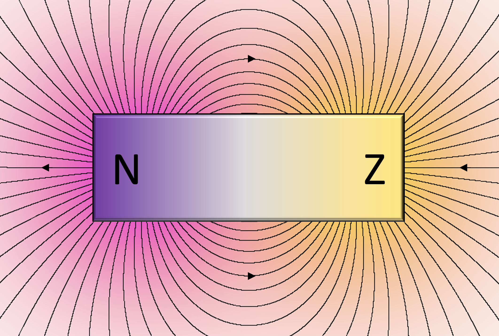

Buiten de magneet lopen de veldlijnen van noord naar zuid en binnen de magneet van noord naar zuid.

Hoe dichter de lijnen bij elkaar lopen, hoe sterker de magneet is.

## Magnetiseren

Als je een magneet bij een niet-magnetisch metaal houdt, gaan de gebiedjes in dat materiaal met de magneet meewijzen, waardoor het metaal ook magnetisch wordt. 

<small>(Dit geldt alleen voor metalen, omdat moleculaire stoffen geen rooster hebben, en ion-roosters anders werken).</small>

Als je de magneet weghaalt zal het metaal nog even magnetisch blijven, maar na verloop van tijd zullen de magnetische gebiedjes weer random kanten op gaan wijzen door de trillingen van atomen in het metaalrooster, waardoor het metaal niet meer magnetisch is.

Je kan dit proces versnellen door het metaal op te warmen, omdat de atomen dan sneller gaan trillen (want temperatuur is de maat voor de bewegingsenergie van deeltjes).

## Soorten magneten

- Een **tijdelijke magneet**, zoals weekijzer. Een metaal dat makkelijk wordt gemagnetiseerd, maar het magnetisme ook snel weer kwijt raakt.

- Een **permanente magneet**, vaak gemaakt van legeringen, zijn en blijven magnetisch. De werking kost geen energie, en de magneet staan altijd "aan".

- Een **elektromagneet** wekt een magneetveld op door het lopen van stroom in een spoel of draad. Dit kost energie, maar je kan deze magneet dus wel aan en uit zetten

## Aardmagnetisch veld

De aarde heeft een magnetisch veld dat waarschijnlijk wordt veroorzaakt door de ijzeren kern.

De magnetische zuidpool bevindt zich in de buurt van de geografische noordpool en andersom. Daardoor wijst een magneet die zich vrij kan bewegen altijd met zijn noordpool naar het noorden.

## Magnetische velden

De magnetische veldsterkte (B) bepaalt hoe een magneet aan andere magneten trekt.

Veldsterkte is net als bijvoorbeeld kracht (F) een vectorgrootheid. Dat betekent dat als je twee magneten naast elkaar hebt, je hun veldsterktes bij elkaar optelt om de richting van het gecombineerde magneetveld te bepalen.

## Elektromagneten

### Spoel

Als je stroom door een spoel laat lopen wekt die een magnetisch veld op. 

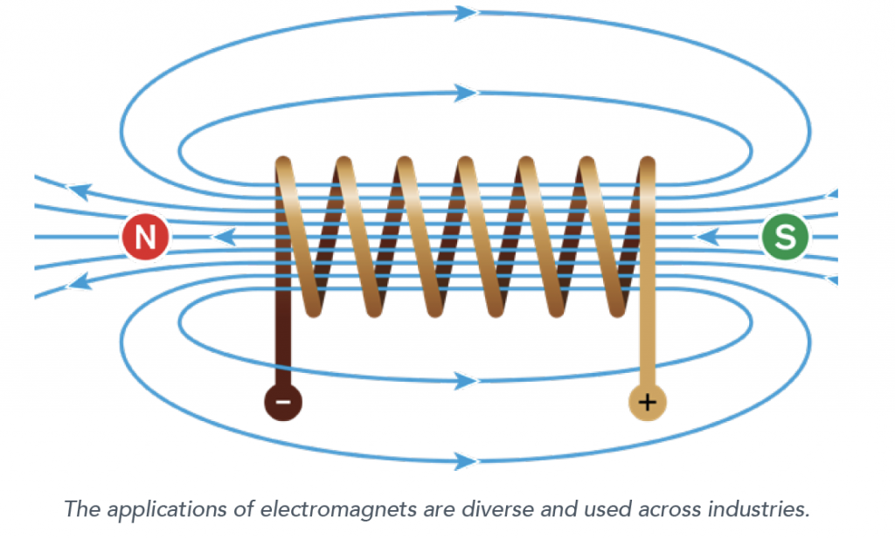

Boven en onder de spoel liggen de veldlijnen verder uit elkaar, en is het veld dus zwakker.

Voor het magneetveld van een spoel geldt:

\\[B = \mu_0 \cdot \frac{NI}{l_{\text{spoel}}}\\]

Waarin N het aantal windingen van de spoel is, en I de stroomsterkte door de spoel. Je hoeft deze formule niet uit je hoofd te kennen, maar het is wel verdomd handig als je hem toch kent. De waarde van \\(\mu_0\\) krijg je.

### Stroomdraad

Als je stroom door een rechte stroomdraad laat lopen wekt die ook een magnetisch veld op. Alleen een dat veld heeft geen noord- of zuidpolen. De lijnen lopen in oneindige cirkels op een vlak dat loodrecht op de stroomdraad staat.

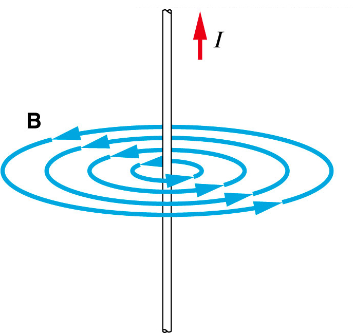

Hoe verder van de stroomdraad, hoe verder ze uit elkaar liggen, en dus hoe zwakker het magneetveld.

## Lorentzkracht

Een stoomdraad in een magnetisch veld ondervindt een kracht genaamd de Lorentzkracht. Die kracht staat loodrecht op zowel de stroomrichting als de veldlijnen.

Als de stroomsterkte en magnetische veldsterkte evenwijdig zijn, is er geen Lorentzkracht.

## Homogeen vs inhomogeen

In een homogeen magneetveld lopen de veldlijnen evenwijdig en even ver van elkaar. Dat is bijvoorbeeld binnen een spoel zo.

Lopen de lijnen niet evenwijdig, of is de afstand tussen de veldlijnen niet consistent? Dan is het veld inhomogeen.

## Rechterhandregels

Je kan de richting van een magneetveld dat wordt opgewekt door een spoel of stroomdraad bepalen aan de hand van de richting van de stroom. Dit doe je met twee *rechterhandregels*:

### Voor spoelen

- **Gekromde vingers**: geven de richting van de stroomsterkte (I) aan. Gaan de stroom van voor-achter, dan gaat je hand van je af, en van achter-voor naar je toe.
- **Duim**: de richting van het magneetveld (B) binnen de spoel, wijst naar de noordpool van de magneet.

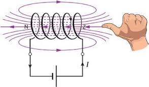

### Voor stroomdraden

- **Duim**: geeft de richting van de stroomsterkte (I) aan.
- **Gekromde vingers** beschrijven de draaiing van de veldlijnen  (B) rondom de stroomdraad.

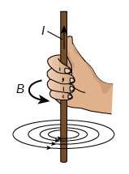

### Voor de Lorentzkracht

- **Gestrekte vingers** geven de richting van het magneetveld (B) aan.
- **Duim** geeft de richting van de stroomsterkte (I) aan.
- Loodrecht uit je **handpalm** komt nu de Lorentzkracht.

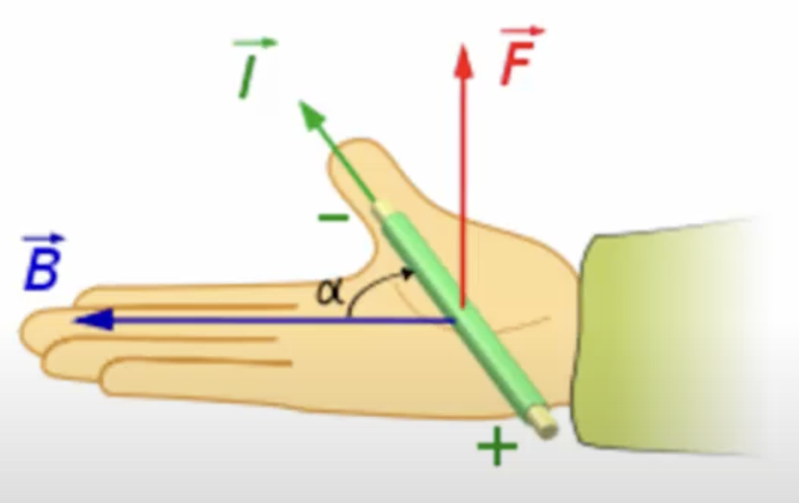

## Rekenen

Je kan de Lorentzkracht met de volgende formule berekenen:

\\[F_l = BIl\\]

Hierin is B de component van de magnetische veldsterkte die loodrecht op de stroomdraad staat. Stel je hebt dus de volgende situatie:

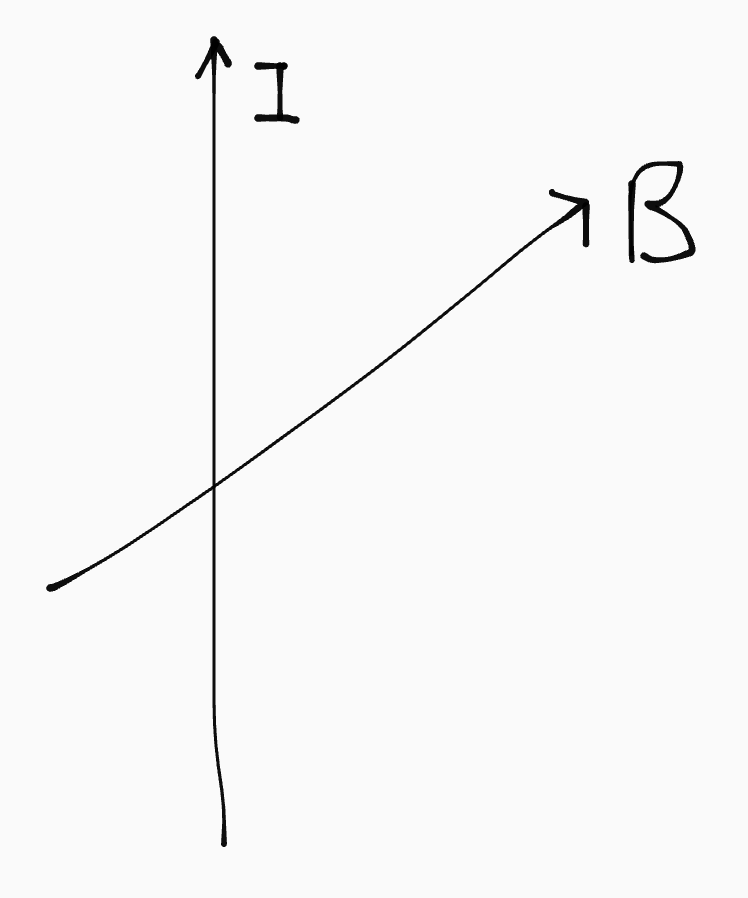

Je moet dan alleen de loodrechte component van de magnetische veldsterkte nemen. Dit doe je door hem te ontleden, net als een kracht (want het is een vectorgrootheid):

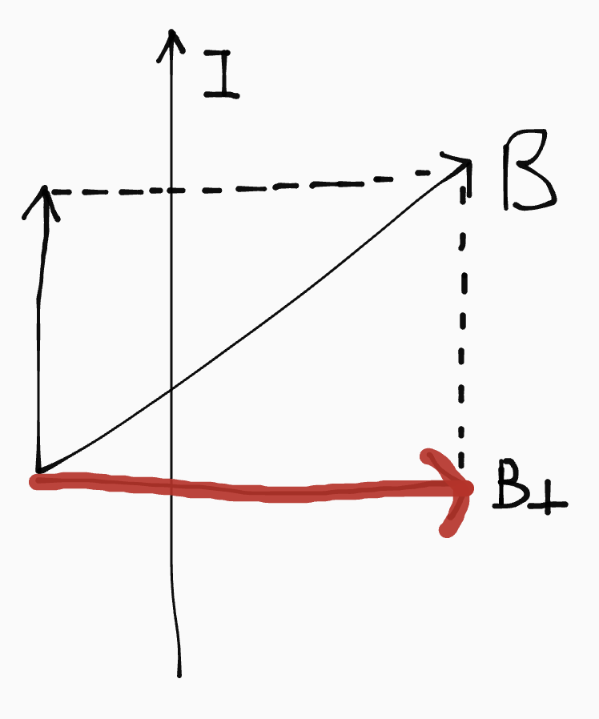

In het geval van een spoel kan je ook de volgende formule gebruiken:

\\[F_l = NBIl\\]

Daarin is N het aantal windingen. Op elke winding oefent zich namelijk een Lorentzkracht uit. Je moet daarom de Lorentzkracht keer het aantal windingen van de spoel doen, om de totale Lorentzkracht op de spoel te berekenen.

## Inductie

Je kan met stroom een magneetveld opwekken (bijvoorbeeld met een spoel). Maar het kan ook andersom: door de verandering van een magneetveld kan je spanning opwekken en dus stroom laten lopen. Dat noem je inductie.

Die verandering van het magneetveld kan je uitdrukken met de flux. De magnetische flux is het aantal veldlijnen dat door een denkbeeldige cirkel gaat. In het geval van inductie is die cirkel het midden van de spoel.

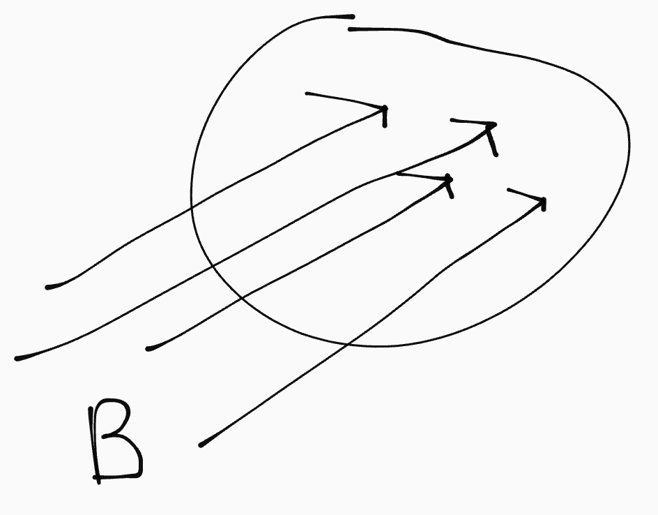

Je kan de flux (in Wb) zo berekenen:

\\[\phi = B_{\bot} \cdot A\\]

Als de flux groter of kleiner wordt, veranderd het magneetveld en vindt er inductie plaats. De inductiespanning (Uind) is dus evenredig met de *afgeleide van de flux*. Daaruit volgt de volgende formule:

\\[U_{\text{ind}} \propto N \cdot \frac{d\phi}{dt}\\]

<small>Wiskundig gezien kan je er ook een vergelijking met een factor <i>p</i> van maken: \\(U_{\text{ind}} = p \cdot N \cdot \frac{d\phi}{dt}\\)</small>

### Wet van Lenz

Als je een magneet beweegt en op die manier de flux veranderd, reageert de spoel door of een *meeflux* of een *tegenflux* op te wekken. De spoel wordt dus tijdelijk ook een magneet.

Of het een mee- of tegenflux wordt kan je bepalen aan de hand van de *Wet van Lenz*:

1. Bepaal de richting van het uitwendige magneetveld (het magneetveld van de magneet die je beweegt) door de spoel.

2. Kijk of er een toename of afname van de flux is (beweegt de magneet van de spoel af of er naartoe?)

3. Bij een toename van de flux wordt een tegenflux opgewekt. Het opgewekte magneetveld is dus tegengesteld aan de richting van het uitwendige magneetveld.

4. Bij een afname van de flux wordt een meeflux opgewekt. Het opgewekte magneetveld heeft dus dezelfde richting als het uitwendig magneetveld.

Doordat hij een magneet wordt gaat er stroom lopen. De spoel wordt dus een *spanningsbron*. De richting van de stroom kan je vervolgens bepalen met de rechterhandregel voor spoelen.

Je kan vervolgens bepalen welke kant van de spoel de plus- en welke kant de minpool wordt (van de spanningsbron). De stroom loopt binnen de spanningsbron van - naar +.

## Toepassingen

### Luidspreker

Een luidspreker is een E-vormige magneet met daarin een spoel:

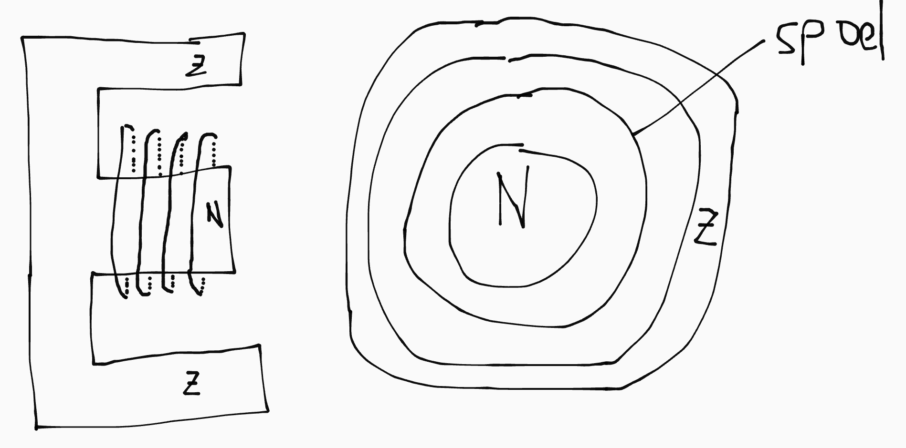

Als we daarin de veldlijnen intekenen ziet dat er zo uit:

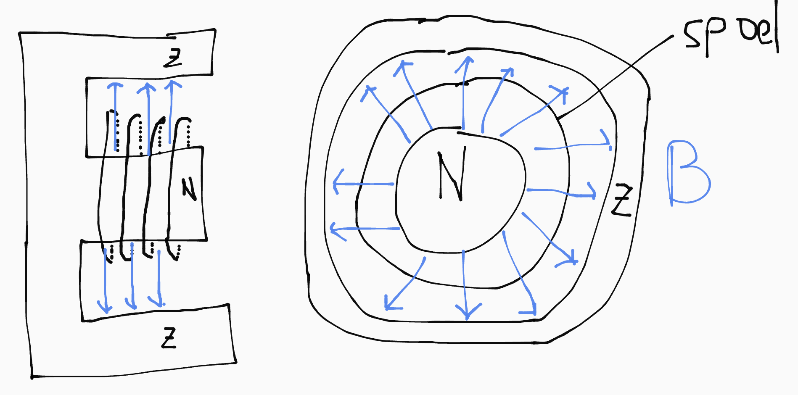

En dan vervolgens een uitsnede van het bovenaanzicht maken en daarin de Lorentzkracht intekenen (afhankelijk van de stroomrichting):

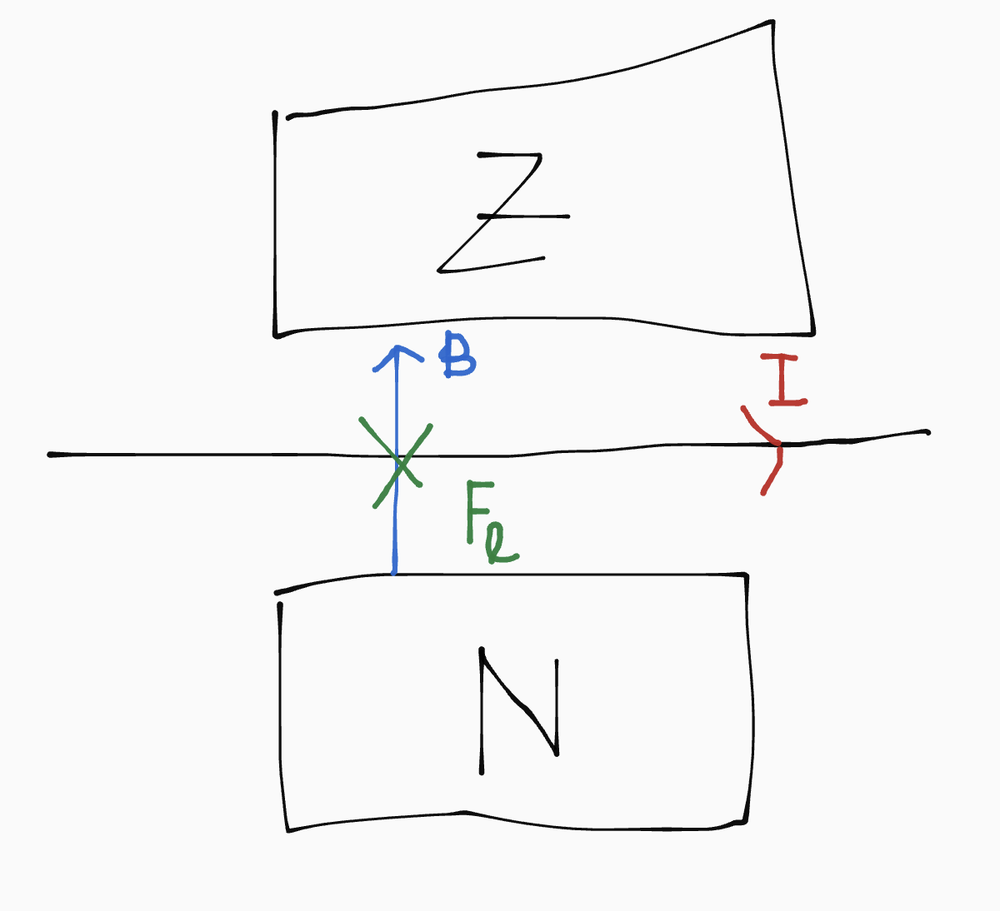
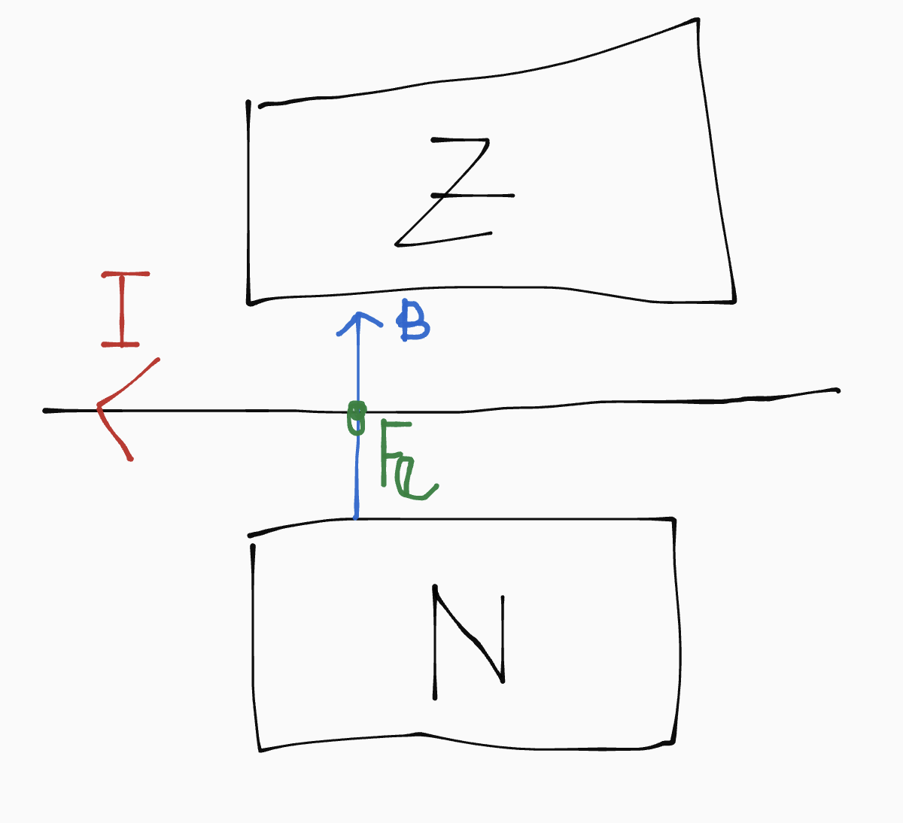

De spoel zal dus naar voren of achter bewegen, afhankelijk van de stroomrichting:

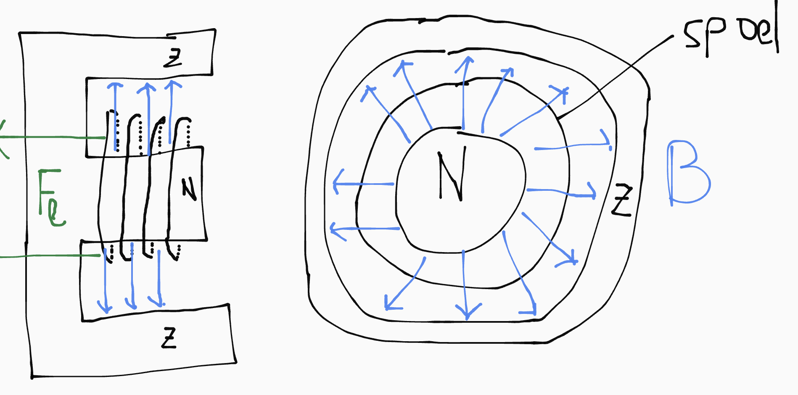
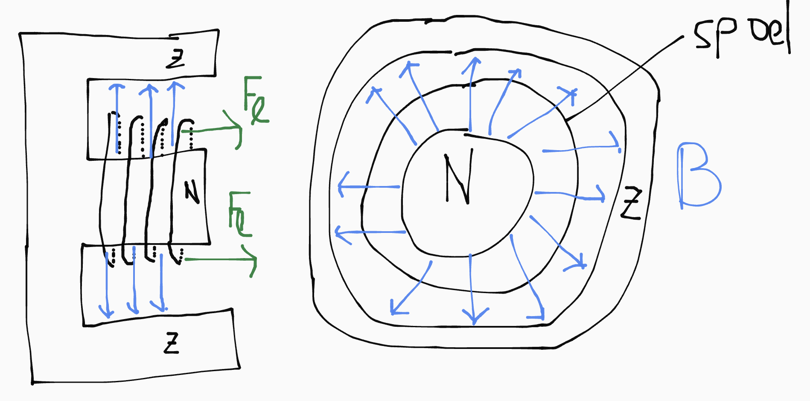

Door de stroomrichting dus om te draaien (mbv wisselspanning), kan je de spoel laten trillen en op die manier geluidsgolven maken.
