

  
<h3>Table of contents</h3>

  <ul>
    <li><a href="#elektriciteit">Elektriciteit</a></li>
    <li><a href="#krachten-en-beweging">Krachten en beweging</a></li>
    <li><a href="#materialen">Materialen</a></li>
    <li><a href="#straling">Straling</a></li>
    <li><a href="#energie">Energie</a></li>
    <li><a href="#golven">Golven</a></li>
    <li><a href="#magnetisme">Magnetisme</a></li>
  </ul>
  
<strong>NOG NIET AF!!</strong>

# Elektriciteit

## Basisbegrippen

### Lading

Elektriciteit bestaat uit geladen deeltjes die bewegen. Een deeltje kan positief of negatief geladen zijn. Positief-positief of negatief-negatief stoten elkaar af, en positief-negatief trekken elkaar aan.

Lading wordt aangegeven met de letter Q en wordt gemeten in Coulomb (C).

In een stroomkring bewegen negatief geladen (vrije) elektronen.

### Stroomkring

Een stof geleidt stroom als er geladen deeltjes vrij doorheen kunnen lopen. In veel metalen zijn dit vrije elektronen (in het metaalrooster), maar sommige (zout-)oplossingen zijn het ionen.

Als er een gesloten stroomkring met spanningsbron is, lopen er vrije elektronen van de min- naar pluspool. Dat begrepen natuurkundigen eerst niet, en is daarom de regel dat de *elektronen van min naar plus lopen*, maar de *stroom van plus naar min* (andersom).

### Stroomsterkte

De stroomsterkte (I) is hoeveel lading er per seconde langs een punt in de stroomkring loopt. Dus eigenlijk gewoon hoeveel elektronen er langs komen.

\\[I = Q/t\\]

Een stroommeter plaats je altijd in de stroomkring:

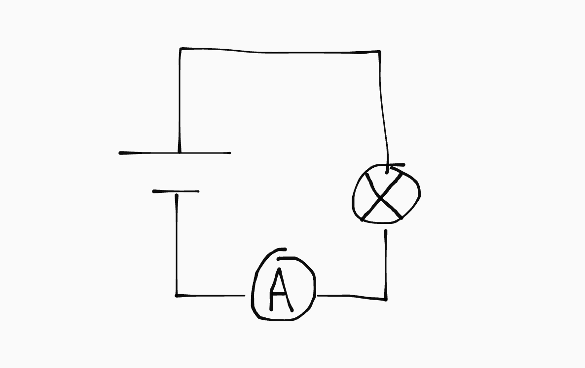

We meten I in Ampère (A), wat gelijk is aan Coulomb per seconde (C/s).

### Spanning

De spanning (U) is hoeveel energie de lading (in dit geval de elektronen) meedraagt. Je meet spanning altijd door het energieverschil tussen twee punten te vergelijken:

\\[U = \Delta E/Q\\]

Een spanningsmeter staat om die reden altijd *buiten* de stroomkring:

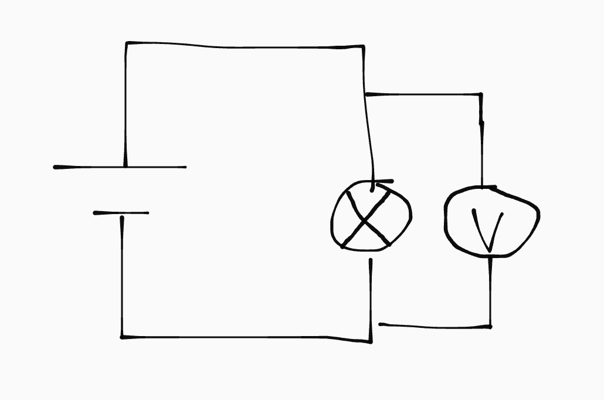

We meten spanning in Volt (V), wat gelijk is aan Joule per Coulomb (J/C).

### Vermogen

Elektrische schakelingen zetten elektrische energie om in andere soorten energie. Het vermogen (P) van een schakeling is de hoeveelheid energie die per seconde wordt omgezet:

\\[P = E/t\\]

We meten vermogen in Watt (W), wat gelijk is aan Joule per seconde (J/s).

Je kan het vermogen ook berekenen door de stroomsterkte en spanning te vermenigvuldigen. Dat is ook best logisch:

\\[P = U \cdot I = \frac{E}{Q} \cdot \frac{Q}{t} = \frac{EQ}{tQ} = E / t\\]

## Weerstand

De weerstand (R) bepaalt goed een voorwerp stroom geleidt. Hoe hoger de weerstand, hoe minder goed het geleidt. Stroom zoekt altijd de weg van de minste weerstand.

De weerstand van een voorwerp wordt grotendeels bepaald door het materiaal (de soortelijke weerstand, \\(\rho\\)). Ook temperatuur speelt een rol: sommige materialen geleiden beter als ze verhit worden, terwijl anderen juist slechter gaan geleiden.

Als een materiaal altijd dezelfde weerstand heeft, ongeacht temperatuur, noemen we dat een Ohmse weerstand. Daarvoor geldt:

\\[R = U / I\\]

Bij een Ohmse weerstand is het U,I-diagram dus een rechte lijn door de oorsprong.

### Weerstand van een draad

De weerstand van een draad hangt af van:

- De dikte (diameter) van de draad (d)
- De lengte van de draad (l)
- Het materiaal van de draad (\\(\rho\\))
- De temperatuur van de draad (T)

\\[R_{\text{draad}} = \rho \frac{l}{A} \text{ met } A = \frac{1}{4}\pi d^2\\]

Je ziet in de formule geen T, omdat het per materiaal verschilt hoe de draad op temperatuur reageert. Dit is meegenomen in de soortelijke weerstand (\\(\rho\\)). Let dus wel op dat je de soortelijke warmte van de juiste temperatuur neemt.

### Halfgeleiders

Halfgeleiders zijn materialen die uit zichzelf weinig vrije elektronen hebben en dus slecht geleiden, maar met bepaalde aanpassingen meer vrije elektronen krijgen en dus wel goed geleiden.

- **Diode**: heeft in de doorlaatrichting (de richting van het pijltje) een hele lage weerstand, mits er een minimale spanning (de doorlaatspanning) overheen staat. In de andere richting is de weerstand juist heel hoog.

- **LED**: staat voor *Light-Emitting Diode*. Het is een diode die licht geeft als er stroom doorheen loopt. Is verder hetzelfde.

- **LDR**: als er licht op een LDR valt, wordt de weerstand kleiner (omdat er meer elektronen vrijkomen), waardoor de LDR beter stroom doorlaat.

- **NTC** (Negative Temperature Coefficient): de weerstand wordt kleiner als de temperatuur hoger wordt. Een hogere temperatuur betekent dus dat de NTC beter stroom doorlaat.

- **PTC** (Positive Temperature Coefficient): precies andersom: de weerstand wordt groter als de temperatuur hoger wordt. Een hogere temperatuur betekent dus dat de PTC minder goed stroom doorlaat.

### Variabele (schuif)weerstand

Met een schuifweerstand kan je zelf de weerstand van de weerstand bepalen (ja ik vind het ook kut dat ze voor die twee dingen hetzelfde woord hebben gekozen). Alleen door het stuk tussen de pijl en de "uitgang" van de schuifweerstand loopt stroom. 

Door de schuifweerstand kleiner te maken verlaag je dus de weerstand.

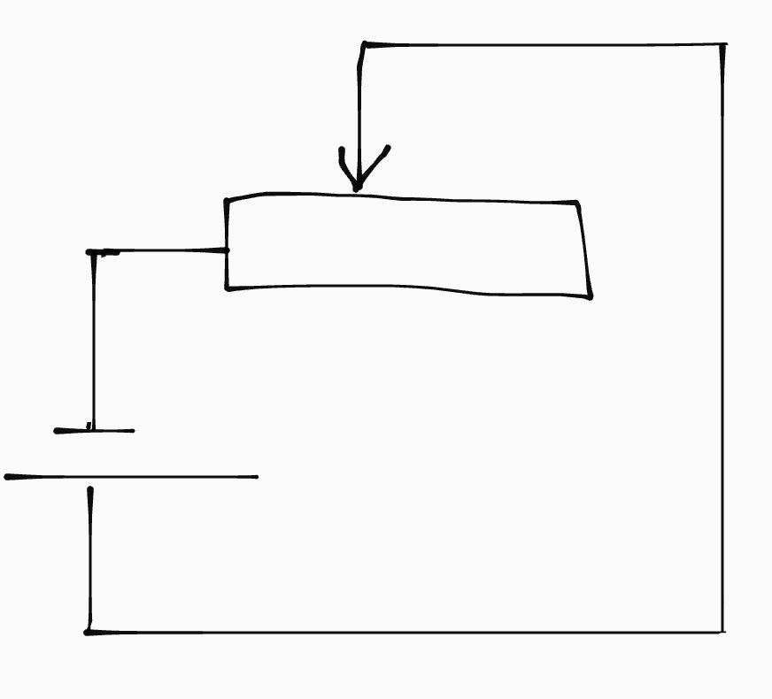

<!--#### Als spanningsregelaar

Je kan een variable weerstand als spanningsregelaar gebruiken. Stel je hebt een spanningsbron met een vermogen van 18W (9V op 2A), maar je lampje kan maar maximaal 6V aan. Je kan dan de schuifweerstand instellen op \\(1.5 \Omega\\) (want \\(R = U / I = 3 / 2 = 1.5\\)).-->

## Schakelingen

### Serie (spanningsdeling)

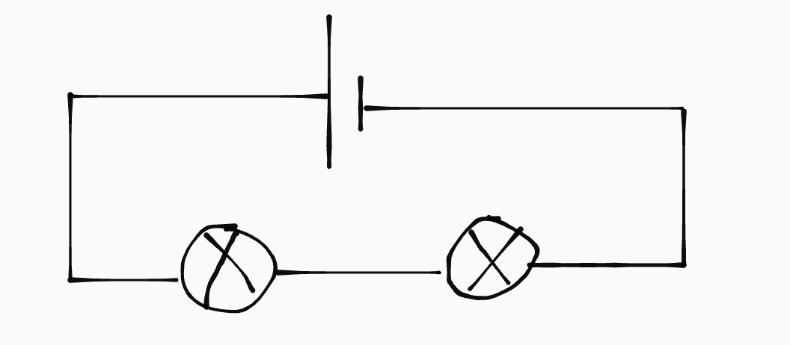

In een serieschakeling worden de onderdelen achter elkaar gekoppeld. Daardoor gaat de volledige stroom van de spanningsbron door alle onderdelen, maar krijgt elk onder deel maar een deel van de spanning.

Door elk onderdeel gaan dus alle elektronen, maar de onderdelen krijgen maar een deel van de energie die de elektronen meedragen.

\\[U_{tot} = U_1 + U_2 + ... + U_N\\]
\\[I_{tot} = I_1 = I_2 = ... = I_N\\]
\\[R_{tot} = R_1 + R_2 + ... + R_N\\]

### Parallel (stroomdeling)

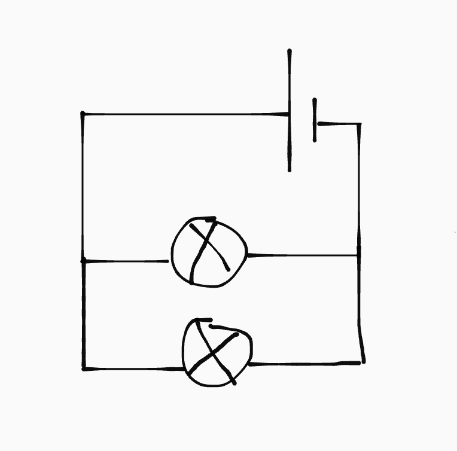

In een parallelschakeling heeft elk onderdeel een eigen aftakking. De stroom wordt dus verdeeld, maar elk onderdeel krijgt wel de volledige spanning van de spanningsbron.

In dit geval gaat maar een deel van de elektronen door elk onderdeel, maar elk onderdeel krijgt wel alle energie die die elektronen meedragen.

\\[U_{tot} = U_1 = U_2 = ... = U_N\\]
\\[I_{tot} = I_1 + I_2 + ... + I_N\\]
\\[R^{-1}_{tot} = R_1^{-1} + R_2^{-1} + ... + R_N^{-1}\\]

De tak met de minste weerstand krijgt de meeste stroom.

### Gemengd

Je kan een gemengde schakeling hebben. Daar gedraagt elke subschakeling zich als een onderdeel. Stel je hebt dit:

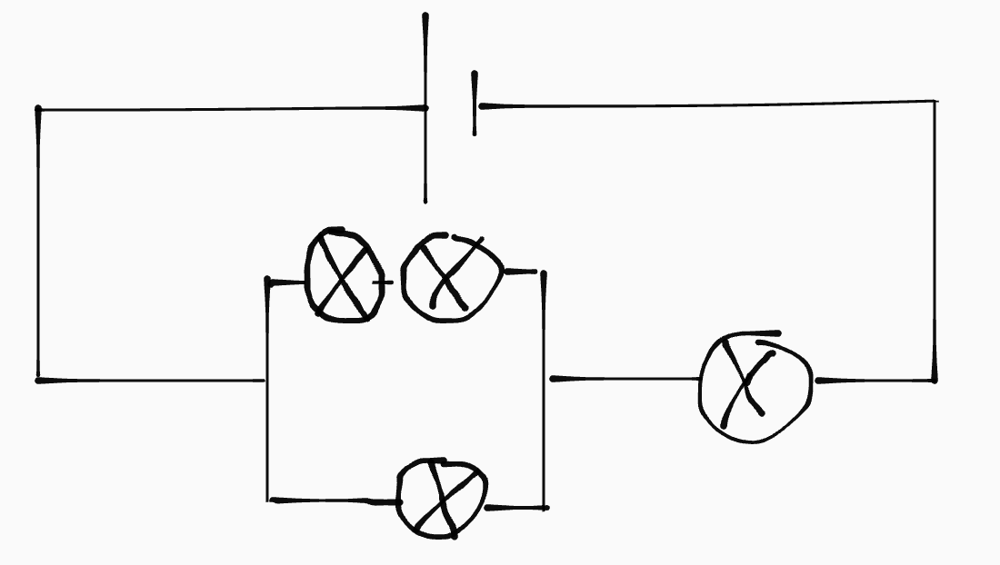

  
Uitleg

  
De hoofdschakeling is een serieschakeling. Dat betekent dat de stroomsterkte overal even groot is. Het rechterlampje en de parallelschakeling krijgen dus beide de volledige stroom van de spanningsbron. De spanning wordt echter verdeeld over beide.

  
In de parallelschakeling wordt de stroom verdeeld. De onderste tak heeft de minste weerstand (want minder onderdelen), dus krijgt de meeste stroom. De spanning over de hele parallelschakeling is gelijk, namelijk dat deel van de spanning dat de parallelschakeling gekregen heeft.

  
In de serieschakeling in de bovenste tak van de parallelschakeling, is de stroomsterkte overal gelijk (namelijk dat deel dat de parallelschakeling aan deze tak geeft). Maar beide lampjes krijgen een deel van de spanning.

## Veiligheid

Overbelasting is een stroom van groter dan 16A door een groep gaat (en dat is niet goed want.... *you know*, 🔥🔥). Het kan ontstaan door:

- Kortsluiting
- 20 tosti-apparaten op één groep

Als er kortsluiting is gaat de stroom direct terug naar de spanningsbron, zonder door het apparaat te gaan. Daardoor is de weerstand heel laag \\(\implies\\) grote stroom.

Als bescherming zitten er zekeringen (stoppen) in de meterkast, die de elektriciteit uitschakelen als de stroom te groot wordt.

Het is ook gevaarlijk als je onder stroom komt te staan. De stroom loopt dan door jou lichaam naar de grond. Een stroom van 0.1 A is al dodelijk. Om dat te voorkomen hebben we twee oplossingen:

- **Aardlekschakelaar**. Meet \\(\Delta I\\) van je huis. Als \\(I_{in} - I_{uit} > 30 \text{ mA}\\), "lekt" er ergens stroom (aka gaat door iemand naar de grond), en wordt de elektriciteit uitgezet.

- **Geaarde stopcontacten en apparaten**. De meeste stopcontacten en apparaten zijn geaard. Dat betekent dat er een draad met hele lage weerstand direct naar de grond loopt (via het stopcontact dan), waardoor, als er kortsluiting is en een (metalen) apparaat onder stroom komt te staan, die stroom direct via de aarddraad loopt en niet via een mens (want een mens heeft een veel hogere weerstand).

# Krachten en beweging

## Krachten

Krachten (F) zijn een vector-eenheid. Dat betekent dat ze precies werken zoals vectoren bij wiskunde. Ze hebben drie eigenschappen:

- Een aangrijpingspunt
- Een richting
- Een grootte (in N)

Let op!
Je mag het aangrijpingspunt van een vector vrij bewegen. Bij een kracht mag je het aangrijpingspunt alleen verplaatsen langs de richting waarin de kracht werkt.

Als je alle krachten op een voorwerp bij elkaar optelt (zoals je vectoren ook zou optellen), krijg je de resulterende kracht.

### Wetten van Newton

- Als de resulterende kracht op een voorwerp nul is, is het in rust of beweegt het met een constante snelheid in een rechte lijn.

- \\(F_{res} = ma\\)

- Krachten zijn een wisselwerking: als een voorwerp een actiekracht uitoefent op een ander voorwerp oefent dat voorwerp een even grote, maar tegengestelde, reactiekracht uit op het eerste voorwerp.

### Soorten

- **Zwaartekracht**: \\(F_z = m \cdot g\\)
- **Gravitatiekracht**: \\(F_g = G \frac{m_1 m_2}{r^2}\\)
- **Gewicht**: de kracht die jij uitoefent op de ondergrond;  
  in de meeste gevallen geldt \\(F_z = \text{gewicht}\\).
- **Normaalkracht**: de (reactie)kracht van een voorwerp,  
  loodrecht op de oppervlakte; let op de hoek!
- **Veerkracht**: \\(F_v = C \cdot u\\)  
  waar \\(C =\\) veerconstante  
  en \\(u =\\) uitzetting in m  
- **Luchtweerstandskracht**: \\(F_{w,l} = \frac{1}{2} \rho \cdot C_W \cdot A \cdot v^2\\)  
  waar \\(\rho =\\) luchtdichtheid  
  \\(C_W =\\) weerstandscoëfficient (krijg je)  
  \\(A =\\) frontaal oppervlakte
- **Schuifweerstandkracht**: \\(F_{w,s,max} = f \cdot F_n\\),  
  waar \\(f =\\) wrijvingscoëfficient (ruwheid ondergrond)

Maximale schuifweerstandskracht

De schuifweerstandkracht is een reactiekracht op het de spierkracht die een voorwerp verschuift. Hij is tot op de maximumwaarde (\(F_{w,s,max}\)) gelijk en tegengesteld aan de actiekracht. Vanaf de maximumwaarde blijft de hij constant:

\[F_{w,s} = F_{\text{actie}} \text{ mits } F_{\text{actie}} < F_{w,s,max}\]

Dat is waarom een boek niet verschuif als je er maar een beetje tegen duwt, maar het wel verschuift als je harder duwt.

Middelpuntzoekende kracht

De middelpuntzoekende kracht is geen losse kracht, maar een rol die een kracht kan vervullen. Net als dat de resulterende kracht geen echte kracht is, maar een rol die meerdere krachten samen vervullen.

De middelpuntzoekende kracht is een kracht die loodrecht op de bewegingsrichting staat:

\[F_{mpz} = \frac{mv^2}{r}\]

Door de middelpuntzoekende kracht is er een versnelling loodrecht op de snelheid. Daardoor veranderd de grootte van de snelheid niet, maar de richting wel.

## Snelheid en versnelling

De snelheid (\\(v\\)) is de verandering van de plaats (\\(x\\)) per seconde. De versnelling  (\\(a\\)) is de verandering van de snelheid per seconde.

Met andere woorden: de snelheid is de eerste en de versnelling de tweede afgeleide van de plaats.

### Soorten bewegingen

<strong>Eenparig</strong>: \(v \text{ is constant} \implies a = 0 \text{ en dus ook } F_{res} = 0\)
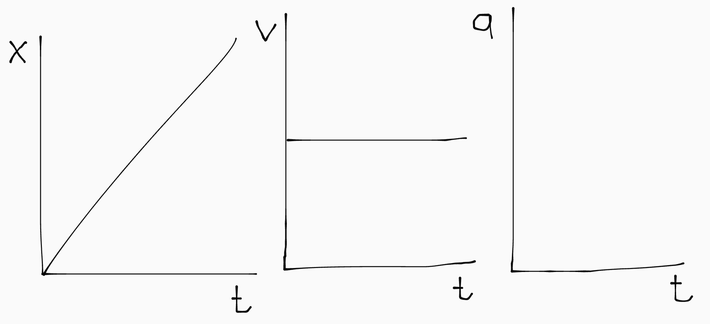

<strong>Eenparig versneld</strong>: \(v \text{ neemt constant toe} \implies a = c \text{ en dus ook } F_{res} = c\)
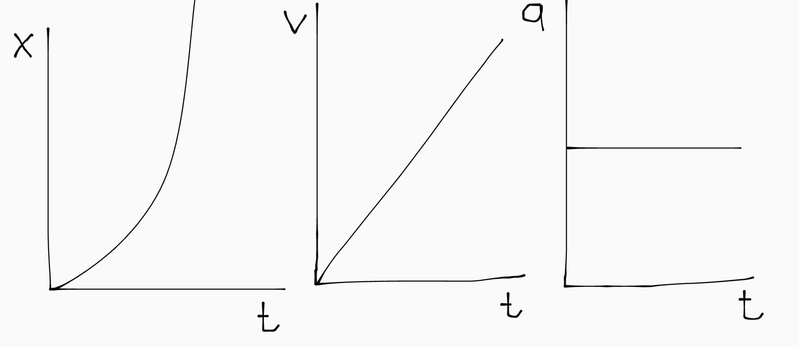

<strong>Eenparige cirkelbeweging</strong>: grootte van \(v\) is constant, maar de richting veranderd continue; \(F_{res}\) is constant en loodrecht op de bewegingsrichting.
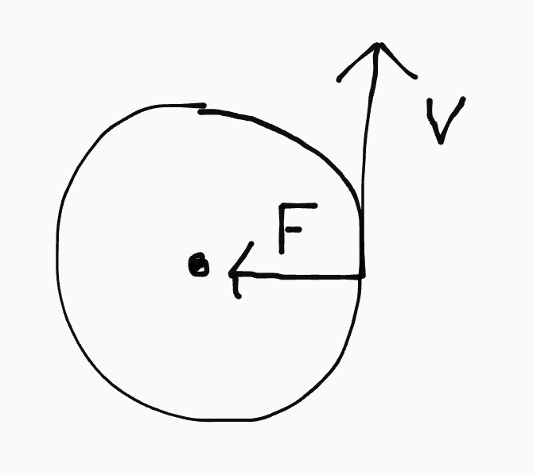

<strong>Vrije val</strong>: \(F_z\) is de enige kracht; daardoor geldt \(a = 9.81 \text{ m/s}^2\).
sorry, geen plaatje :(

### Cirkelbewegingen

In een cirkelbeweging kan je aan de hand van de omlooptijd (T) en straal (r) de snelheid berekenen:

\\[v = \frac{\Delta x}{\Delta t} = \frac{2\pi r}{T}\\]

De omlooptijd is de tijd die nodig is voor één rondje.

## Zonnestelsel

### Gravitatiekracht

De gravitatiekracht is een wisselwerking tussen twee massa's. Hij werkt op afstand en de krachten van de massa’s op elkaar zijn even groot. Het aangrijpingspunt van de kracht is het zwaartepunt van de massa. Bij een bol is dat het middenpunt.

### Planeetbanen

Voor planeten in een baan rond de zon gelden de drie wetten van Kepler:

1. Ze bewegen in een ellipsbaan en de zon ligt op één van de brandpunten.
2. Planeten hebben een grotere snelheid als ze dichter bij de zon zijn.
3. De derde wet van Kepler: \\[\frac{r^3}{T^2} = \frac{GM}{4\pi^2}\\]

### Ontsnappingssnelheid

De ontsnappingsnelheid is de snelheid waarmee je een voorwerp moet wegschieten om volledig aan de gravitatiekracht van het hemellichaam te ontsnappen. De formule kan herleidt worden met:

\\[E_{kin,0} + E_{g,0} = E_{kin,\infty} = E_{g,\infty}\\]
\\[E_{kin,0} + E_{g,0} = 0 \implies v_0 = \sqrt{\frac{2GM}{R}}\\]

### Geostationaire baan

Een geostationaire baan is een satellietbaan waarin de satelliet op een vast punt boven de aarde blijft hangen. Dan:

- is de omlooptijd gelijk aan de omlooptijd van de aarde.
- is het middenpunt van de cirkelbaan het middenpunt van de aarde.
- moet de baan loodrecht op de as van de aarde staan.

Daarom is een geostationaire baan alleen mogelijk op één hele specifieke snelheid en hoogte, recht boven de evenaar.

### Polaire baan

In een polaire baan vliegt een satelliet op relatief kleine hoogte in 1 tot 2 uur over beide polen. Doordat de aarde ook draait “ziet” de satelliet dus elk stukje aarde.

# Materialen

## Basisbegrippen

### Dichtheid

De dichtheid (\\(\rho\\)) bepaalt de massa van een voorwerp per volume-eenheid; met andere woorden: hoe zwaar een voorwerp is.

\\[\rho = m / V\\]

### (Gas)druk

Druk (p) geeft de kracht aan die een gas of vloeistof over \\(1 \text{ m}^2\\) uitoefent:

\\[p = F/A\\]

We meten druk in Pascal (Pa), wat gelijk is aan Netwon per vierkante meter (\\(\text{N/m}^2\\)). Daarnaast wordt voor luchtdruk vaak bar gebruikt: \\(1 \text{  bar} = 1 \cdot 10^5 \text{ Pa}\\). De atmosferische luchtdruk is (op aarde) 1 bar.

### Spanning

Spanning (\\(\sigma\\)) is de verdeling van een kracht over een oppervlakte *binnen een materiaal* (zelfde vorm en eenheden als de drukformule).

\\[\sigma = F / A\\]

### Relatieve rek

Als een materiaal uitgerekt wordt wordt het langer (duh!). De relatieve rek (\\(\epsilon\\)) is de lenteverandering van het materiaal tenopzichte van de originele lengte:

\\[\epsilon = \Delta l / l_0\\]

## Deeltjesmodel

Alle stoffen bestaan uit deeltjes die trillen. De temperatuur (T) is de maat voor de gemiddelde bewegingsenergie van de deeltjes (hoe hard ze trillen).

### Fasen

Naarmate de temperatuur stijgt krijgen de deeltjes een hogere snelheid waardoor ze verder uit elkaar verspreiden. Daardoor heb je drie fasen:

- **Vast**: de deeltjes trillen dicht op elkaar in een vast rooster.
- **Vloeibaar**: de deeltjes bewegen verder van elkaar, maar worden nog steeds door elkaar aangetrokken en blijven daardoor bij elkaar.
- **Gas**: de deeltjes zweven vrij rond.

De laagst mogelijke temperatuur is als de deeltjes niet bewegen maar stilstaan. Dat absolute nulpunt ligt op 0 Kelvin (\\(= -273 \text{ } ^{\circ}C\\)).

### Verdampen en condenseren

In een vloeistof worden de deeltjes bij elkaar gehouden door onderlinge aantrekkingskracht. Als een deeltje te snel beweegt ontsnapt het aan de aantrekkingskracht van de andere deeltjes en komt het dus "vrij". Dat verschijnsel noemen we verdamping.

Andersom kan een gasdeeltje dat vrij rondzweeft ook "gevangen" worden in de vloeistof. Dat noemen we condensatie.

De hoeveelheid verdamping is afhankelijk van de temperatuur (snelheid van de deeltjes) van de vloeistof. De condensatie is afhankelijk van de concentratie gasdeeltjes in de ruimte.

## Gassen

- Een gas bestaat uit verwaarloosbaar kleine deeltjes met daartussen niks.
- De deeltjes bewegen vrij en botsen daarbij tegen elkaar en de wand.
- Door botsingen schommelt de snelheid van elk deeltje rond een gemiddelde.

Die gemiddelde snelheid is de temperatuur van het gas. De botsingen (met de wand) veroorzaken de gasdruk. De druk wordt groter als:

- meer deeltjes \\(\implies\\) meer botsingen
- hogere temperatuur \\(\implies\\) hardere botsingen
- kleiner volume \\(\implies\\) meer botsingen

Let op!

Als een materiaal makkelijk vervormbaar is (zoals een ballon of fietsband), moet de luchtdruk binnen hetzelfde als buiten zijn, omdat anders het materiaal uit elkaar springt of implodeert:

\[p_{\text{binnen}} = p_{\text{buiten}}\]

Bij een steviger volume, zoals een ijzere doos, is dit niet het geval.

Dus als je deeltjes toevoegt of de temperatuur verhoogt:

<ul><li>bij een ballon: de ballon wordt groter.</li><li>bij een ijzere doos: de druk aan de binnenkant neemt toe.</li></ul>

### Algemene gaswet

De algemene gaswet is opgebouwd uit twee componenten:

- **Wet van Gay-Lussac**: de gasdruk is evenredig met de temperatuur, mits het volume gelijk blijft: \\(p = c \cdot T\\)

- **Wet van Boyle**: de gasdruk is omgekeerd-evenredig met het volume, mits de temperatuur constant blijft: \\(p = \frac{c}{V}\\)

Samen geeft dat de algemene gaswet, waarin \\(R\\) de gasconstante is (\\(R = 6.02 \cdot 10^{23}\\) voor alle gassen) en \\(n\\) het aantal deeltjes gas (in mol):

\\[\frac{pV}{T} = nR\\]

Als je twee gassen met elkaar moet vergelijken kan je \\(R\\) wegdelen. <small>(Omdat de formule die je overhoudt een verhouding is, maakt de eenheid die je gebruikt niet uit, als hij maar aan beide kanten hetzelfde is.)</small>

\\[\frac{p_1 V_1}{T_1 n_1} = \frac{p_2 V_2}{T_2 n_2}\\]

### Ideaal gas

De algemene gaswet geldt alleen voor ideale gassen. Dat zijn gassen waarin de deeltjes elkaar niet kunnen aantrekken. In de praktijk is dat geen enkel gas, maar in veel gassen(mengsels), zoals bijv. lucht, is de afstand tussen de deeltjes zo groot dat het eigenlijk niet uitmaakt.

## Warmte

### Warmtetransport

- **Geleiding**: in een vaste stof trillen de deeltjes zo dicht tegen elkaar dat ze hun trillingsenergie aan hun buren kunnen doorgeven.

- **Stroming**: in vloeistoffen en gassen kunnen de deeltjes met extra trillingsenergie die meenemen door ergens anders heen te bewegen.

- **Straling**: warmde voorwerpen stralen warmtestraling (IR) uit. De fotonen dragen dan de warmte-energie mee, en geven die af als ze botsen met andere deeltjes. Er is geen tussenstof (medium) nodig.

#### Isolatoren

Bij sommige stoffen zijn de krachten tussen de deeltjes klein, waardoor trillingsenergie slecht wordt doorgegeven. Dit noemen we isolatoren.

#### Metalen

Metalen zijn hele goede warmtegeleiders omdat de vrije elektronen (die ook voor goede stroomgeleiding zorgen), de trillingsenergie kunnen vervoeren.

### Soortelijke warmte

Warmte (Q) is een vorm van energie die nodig is om de temperatuur te veranderen. Hoeveel energie dit kost verschilt per stof. De soortelijke warmte is de energie die nodig is om 1 kg van een stof 1 graden Kelvin <small>(of Celcius; de stapgrootte is gelijk en het nulpunt is irrelevant bij veranderingen)</small> op te warmen.

\\[Q = cm \cdot \Delta T \text{ met } Q = E_{\text{warmte}}\\]

De soortelijke warmte is omgekeerd evenredig met de dichtheid
<ul>
<li>In een mengsel van stoffen hebben alle deeltjes ongeveer dezelfde <em>bewegingsenergie</em></li>
<li>Een zwaarder deeltje gaat slomer dan een lichter deeltje bij dezelfde bewegingsenergie.</li>
<li>Stoffen met lichte deeltjes hebben meer deeltjes nodig voor dezelfde massa.</li>
<li>Het opwarmen van een stof is het verhogen van de gemiddelde bewegingsenergie van de deeltjes.</li>
<li>Je moet daarvoor aan elk deeltje een beetje bewegingsenergie toevoegen. \(\implies E_{\text{tot}} = n \cdot \Delta E\)</li>
<li>Het verhogen van de bewegingsenergie van veel (lichte) deeltjes kost meer energie dan bij weinig (zwaardere) deeltjes.</li>
<li>Dus het verwarmen van een stof met een hoge dichtheid kost minder energie.</li>
<li>De soortelijke warmte is omgekeerd evenredig met de dichtheid.</li>
</ul>

### Warmtestroom

Warmte wil altijd naar een plek met een lagere temperatuur. Het is dus relatief; een object met een hogere temperatuur dan je eigen temperatuur voelt warm aan omdat er warmte van het object naar jou wordt getransporteerd. De hoeveelheid warmte die per seconde wordt getransporteerd noem je de warmtestroom:

\\[P = \lambda \cdot A \cdot \Delta T \cdot \frac{1}{d}\\]

De warmtegeleidingscoëfficient (\\(\lambda\\)) geeft aan hoe groot P is bij een oppervlakte (A) van \\(1 \text{ m}^2\\), een dikte van \\(1 \text{ m}\\) en een temperatuurverschil (\\(\Delta T\\)) van 1 graden Kelvin.

## Vervorming

<!--De deeltjes in stoffen oefenen onderling krachten op elkaar uit. Normaal stoten de deeltjes elkaar even hard af als ze elkaar aantrekken.

Als je een materiaal uitrekt, komen de deeltjes in de uitrekrichting verder uit elkaar te liggen, waardoor de aantrekkende kracht van de deeltjes in die riching groter wordt. Hetzelfde geldt voor indrukken; dan wordt de afstotende kracht in de indrukrichting groter.

In stuggere materialen zoals metaal of steen neemt die tegenwerkende kracht snel toe. In een flexibeler materiaal, zoals rubber, is dat niet zo.-->

Je hebt twee soorten vervorming:

- **Elastisch**: na vervormen neemt het materiaal zijn originele vorm weer aan.
- **Plastisch**: het materiaal blijft permanent vervormd na het wegnemen van de vervormende kracht, omdat de deeltjes een nieuwe structuur hebben gevormd.

### Uitrekken

In een \\(\sigma\\),\\(\epsilon\\)-diagram zijn twee belangrijke grenzen:

- **Elasticiteitsgrens**: tot dit punt is de grafiek nagenoeg linear en geldt de elasticiteitmodulus.
- **Treksterkte**: de maximale spanning die een materiaal aankan; de top van een \\(\sigma\\),\\(\epsilon\\)-diagram.

In de onderstaande grafiek zie je eerst elastische vervorming (E), dan, vanaf de elasticiteitsgrens, plastische vervorming (P) en tenslotte, nadat de treksterkte is bereikt, insnoering (I). De grafiek stop op het moment dat de stof breekt.

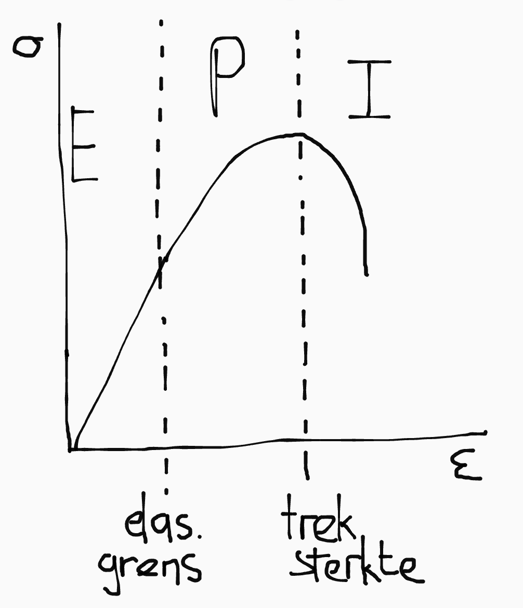

In het elastisch gebied van de diagram geldt de volgende formule, waarin de elasticiteitsmodulus (E), verschilt per stof; eenheid is Pa.

\\[\sigma = E \cdot \epsilon\\]

### Uitzetten

Als een materiaal verhit wordt kan het uitzetten. Hierbij is het uitzettingscoëfficient (\\(\alpha\\)) in \\(\text{K}^{-1}\\).

\\[\Delta l = \alpha \cdot l_0 \cdot \Delta T\\]

# Straling

## Radioactiviteit

Radioactieve stoffen zijn isotopen waarvan de kernen instabiel zijn omdat er teveel of te weinig neutronen aanwezig zijn. Die kernen kunnen uit elkaar vallen en zenden daarbij straling uit.

Omdat de kernen steeds uit elkaar vallen blijft er steeds minder van de radioactieve stof over. Na de halveringstijd (\\(t_{1/2}\\)) is de helft van de kernen vervallen.

Het aantal vervallen kernen per seconde noem je de activiteit (A) in Bq. Die kan je voor een een bepaald tijdstip uitrekenen:

\\[A = A_0 \cdot (\frac{1}{2})^{t/t_{1/2}}\\]

De activiteit neemt door verloop van de tijd af, omdat er steeds minder kernen over zijn (en dus ook minder kernen tegelijk vervallen).

Het aantal overgebleven kernen bereken je zo:

\\[N = N_0 \cdot (\frac{1}{2})^{t/t_{1/2}}\\]

Massa berekenen
Aan de hand van het aantal kernen (N), kan je de massa te berekenen door te vermenigvuldigen met de atoommassa (in u) van het isotoop. Je kan dat dan omrekenen naar kilogram.

## Vervalkromme

Een vervalkromme is een N,t-diagram. De helling op elk punt in de grafiek is de activiteit op dat moment. Je kan ook de gemiddelde activiteit berekenen <small>(de min is omdat de lijn daalt)</small>:

\\[A_{gem} = - \frac{\Delta N}{\Delta t}\\]

Met fancy wiskunde differentiatie magie kan je deze formule ombouwen naar een formule om de activiteit te berekenen aan de hand van het aantal deeltjes en de halveringstijd:

\\[A = \frac{N \cdot \ln(2)}{t_{1/2}}\\]

## Soorten straling

<table><thead>
  <tr>
    <th rowspan="2">Soort straling</th>
    <th colspan="2">Deeltjes</th>
    <th colspan="2">Elektromagnetisch </th>
  </tr>
  <tr>
    <th>α</th>
    <th>β</th>
    <th>𝛾 </th>
    <th>röntgen</th>
  </tr></thead>
<tbody>
  <tr>
    <td>Soort deeltje</td>
    <td>\(\ce{He-4}\) kern</td>
    <td>\(e^-\) of \(e^+\)</td>
    <td>foton</td>
    <td>foton</td>
  </tr>
  <tr>
    <td>Doordringend vermogen</td>
    <td>klein </td>
    <td>matig </td>
    <td>groot</td>
    <td>groot </td>
  </tr>
  <tr>
    <td>Ioniserend vermogen</td>
    <td>groot</td>
    <td>matig</td>
    <td>klein</td>
    <td>klein</td>
  </tr>
</tbody>
</table>

### Deeltjesstraling

- Deeltjes worden uitgezonden op hoge snelheid.
- Als de deeltjes botsen raken ze hun (bewegings)energie kwijt en stoppen ze.
- Hoe ver de deeltjes komen noem je de dracht.

### EM-straling

Elektromagnetische straling bestaat uit energiepakketjes (fotonen) die met de lichtsnelheid (\\(c\\)) bewegen. De energie van een foton is:

\\[E_{\text{foton}} = h \cdot f\\]

Waarbij \\(f\\) de frequentie van de straling in Hz is en \\(h\\) de planckconstante (zie Binas).

Als fotonen door een stof heen gaan kunnen de atomen van die stof de energie van het foton opnemen. Dan verdwijnt het foton. Dat noemen we absorptie. Als de fotonen door de stof gaan zonder geabsorbeerd te worden, noemen we dat transmissie.

De transmissie meten we met de intensiteit: de hoeveelheid energie die per \\(\text{m}^2\\) wordt doorgelaten. Hangt af van:

- Soort materiaal
- Dikte van het materiaal

De halveringsdikte (\\(d_{1/2}\\)) is de dikte waarop de intensiteit van de transmissie gehalveerd is (verschilt per materiaal):

\\[I = I_0 \cdot (\frac{1}{2})^{d/d_{1/2}}\\]

## Bestraling vs besmetting

Bij bestraling wordt je blootgesteld aan radioactieve straling. Je wordt daar zelf niet radioactief van, maar het is wel schadelijk. Maatregelen:

- neem afstand van de bron
- gebruik afschermende materialen zoals lood
- tijd van blootstelling beperken

Bij besmetting komt er een radioactief isotoop op of in je lichaam. Daardoor wordt je zelf een soort radioactieve bron. Maatregelen:

- Wassen
- Isolatie
- Evacuatie (in geval van nuclaire ramp)

## (Equivalente) dosis

Het ioniserend vermogen van straling hangt af van:

- de hoeveelheid deeltjes
- de deeltjesgrootte
- de (bewegings)energie van de deeltjes
- hoe veel deeltjes geabsorbeerd worden

De dosis (in Gy) is de hoeveelheid energie die per lichaamseenheid wordt geabsorbeerd:

\\[D = \frac{E_{abs}}{m_{\text{lichaam}}}\\]

Niet alle soorten straling zijn even schadelijk, waardoor de dosis soms een slechte indicatie van gevaar of schade kan zijn. Daarom hebben we de equivalente dosis (in Sv), die corrigeert voor de schadelijkheid van de straling:

\\[H = W_R \cdot D\\]

Waarbij de weegfactor \\(W_R = 20\\) voor \\(\alpha\\)-straling, en 1 voor alle andere soorten straling.

#### Achtergrondstaling

Ook moet je soms nog corrigeren voor achtergrondstraling uit:

- de ruimte
- deeltjes in de lucht
- bouwmaterialen
- ons eigen lichaam
- de bodem

# Energie

## Basisbegrippen

### Arbeid

Arbeid (W) is een energieomzetting of overdracht over een afstand veroorzaakt door een kracht:

\\[W = F \cdot s\\]

We meten arbeid in Newtonmeter (Nm), wat gelijk is aan Joule (J).

### Mechanische energie

De mechanische energie is de som van kinetische en zwaarte-energie:

\\[E_m = E_{kin} + E_z\\]

### Vermogen

Het vermogen (P) dat iets levert is de arbeid (W) per seconde (t):

\\[P = \frac{W}{t} = \frac{F \cdot s}{t} = F \frac{s}{t} = F \cdot v\\]

### Verbrandingswarmte

De verbrandingswarmte (\\(r_v\\)) is de hoeveelheid (chemische) energie die vrijkomt bij het verbranden van 1 \\(\text{m}^3\\) of 1 L van een brandstof.

We meten de verbrandingswarmte in \\(\text{J/kg}\\) (voor vaste stoffen), \\(\text{J/m}^3\\) (voor gassen) of \\(\text{J/L}\\) (voor vloeistoffen).

## Energie

### Wet van behoud van energie

Volgens de wet van behoud van energie kan er geen energie ontstaan of afgebroken worden; het kan alleen van vorm veranderen. De som van alle energie aan het begin is dus gelijk aan de som van de energie op het eind:

\\[\Sigma E_{\text{begin}} = \Sigma E_{\text{eind}}\\]

<small>De hoofdletter sigma (\\(\Sigma\\)) is een opsommingsteken. Hier staat dus: alle energie aan het begin is gelijk aan alle energie aan het eind.</small>

### Soorten

- Elektrische energie <small>(bewegende lading)</small>
- Warmte <small>(verschil in temperatuur)</small>
- Chemische energie <small>(opgeslagen in atoombindingen)</small>
- Kernenergie <small>(opgeslagen in atoomkernen)</small>
- Kinetische energie <small>= bewegingsenergie</small>
- Gravitatie-energie <small>= arbeid van de gravitatiekracht</small>
- Zwaarte-energie <small>= arbeid van de zwaartekracht</small>
- Veerenergie <small>= arbeid van de veerkracht</small>
- Trillingsenergie, <small>waaronder geluid</small>
- Stralingsenergie, <small>waaronder licht</small>

\\[E_{ch} = r_v V\\]
\\[E_{ch} = r_v m\\]
\\[E_{kin} = \frac{1}{2}mv^2\\]
\\[E_z = F_z \cdot s = mg\Delta h\\]
\\[E_g = -G \frac{m_1 m_2}{r}\\]
\\[E_v = \frac{1}{2}Cu^2\\]

  
Let op!
De bovenstaande formule voor veerenergie geldt alleen bij een ideale veer.

### Nulpunt van de gravitatie-energie

Bij de meeste energiesoorten mag je het nulpunt zelf besluiten. Bij de gravitatie-energie hebben we afgesproken dat het nulpunt op oneindig grote afstand ligt. De gravitatie-energie is dus altijd negatief, en naarmate hij groter wordt nadert hij nul (wordt hij minder negatief).

# Golven

Een golf heeft een aantal eigenschappen:

- **Frequentie** (f): aantal trillingen per seconde.
- **Periode / trillingstijd** (T): de tijd waarin precies 1 trilling plaatsvindt.
- **Amplitude** (A): de maximale uitwijking van een golf.
- **Golflengte** (\\(\lambda\\)): de afstand die de golf in 1 trilling aflegt.
- **Golfsnelheid** (\\(v_{golf}\\)): de snelheid waarmee de golf zich voortplant.

Bij geluidsgolven noemen we de amplitude ookwel het volume en de frequentie die toonhoogte. De golfsnelheid van geluidsgolven is de geluidssnelheid. In lucht is dat \\(343 \text{ m/s}\\).

\\[f = 1/T\\]
\\[\lambda = v_{golf} \cdot T \text{ } \text{ want } \text{ } s = vt\\]
\\[\implies v_{golf} = f \cdot \lambda\\]

## Diagrammen

### u,t-diagram <small>= oscillogram</small>

In een u,t-diagram zet je de uitwijking (u) uit tegen de tijd. Je krijgt dan een grafiek waarin je de uitwijking van *een punt op de lijn* door de tijd ziet veranderen.

De formule voor een u,t-diagram is een sinus met amplitude A en periode T:

\\[u(t) = A \cdot sin(\frac{2\pi}{T}\cdot t)\\]

De maximale snelheid van het punt <small>(let op: *het punt*, niet *de golf*)</small>, is als hij door de evenwichtsstand gaat (want daar is de helling het stijlst):

\\[v_{max} = \frac{2\pi A}{T}\\]

### u,x-diagram

In een u,x-diagram zet je de uitwijking (u) af tegen een punt op de lijn (x). Je krijgt dan een soort *snapshot van de lijn op dat vaste tijdstip*, waarop je de uitwijking van elk punt (op dat tijdstip) kan aflezen.

  
Haal deze concepten niet door elkaar!

  Een u,t-diagram en u,x-diagram zien er misschien hetzelfde uit, maar het zijn <strong>twee verschillende concepten</strong>. Een u,t-diagram laat zien hoe <strong>één punt op en neer beweegt</strong> door de tijd, terwijl een u,x-diagram laat zien <strong>waar alle punten zich op één specifiek tijdstip bevinden</strong>.

## Zuivere en samengestelde tonen

Een zuivere of harmonische trilling is een golf met één vaste periode en steeds dezelfde amplitude. Het u,t-diagram is dan een sinus:

Een samengestelde golf bestaat uit een optelling van andere (zuivere) golven. Een samengestelde golf zou er bijvoorbeeld zo uit kunnen zien:

De frequentie van een samengestelde toon wordt bepaald door de frequentie van de laagste toon die er in voorkomt, die je de grondtoon noemt.

## Fase

De fase (\\(\varphi\\)) van een golf is het aantal afgelegde trillingen sinds het beginpunt van de golf.

De gereduceerde fase (\\(\varphi_{red}\\)) is de fase vanaf het begin van de huidige trilling. Je telt dus alle volledige trillingen niet mee:

\\[\varphi_{red} < 1\\]

Het faseverschil (\\(\Delta \varphi\\)) is het verschil in fase tussen twee trillingen. Het gereduceerde faseverschil (\\(\Delta \varphi_{red}\\)) is het verschil in gereduceerde fase.

\\[\Delta \varphi = \frac{\Delta t}{t}\\]
\\[\Delta \varphi = \frac{\Delta x}{\lambda}\\]

### In fase en tegenfase

Als \\(\varphi_{red} = 0\\), zijn de golven in fase. Als je ze dan optelt versterken ze elkaar. Als \\(\varphi_{red} = \frac{1}{2}\\), zijn de golven in tegenfase. Bij optellen heffen ze elkaar dan op.

Bij elk ander faseverschil versterken de golven elkaar soms en heffen ze elkaar soms op. Dat noem je zwevingen.

## Soorten golven

- Longitudinaal: beweegt door het samenpersen en uitrekken van het medium (een drukgolf). De trillingsrichting is hetzelfde als de voortplantingsrichting. Een voorbeeld is een geluidsgolf.

- Transversaal: beweegt op en neer. De trillingsrichting is loodrecht op de voorplantingsrichting. Een voorbeeld zijn golven in water.

Dit zijn beide voorbeelden van lopende golven. Dat zijn volgen waarbij de maxima bewegen:

Als je twee lopende golven met gelijke frequentie en amplitude tegen elkaar in laat lopen krijg je op vaste punt volledige uitdoving en maximale versterking:

De maxima blijven nu op een vaste plaats. Daarom noemen we dit een staande golf (want hij "staat stil").

# Magnetisme

# Toepassingen

## Stroboscoop

Met een stroboscoop kan je de verandering van de snelheid zien. Het is een soort camera die met gelijke tussenpozen de lens exposed en daardoor meerdere foto's op elkaar layered:

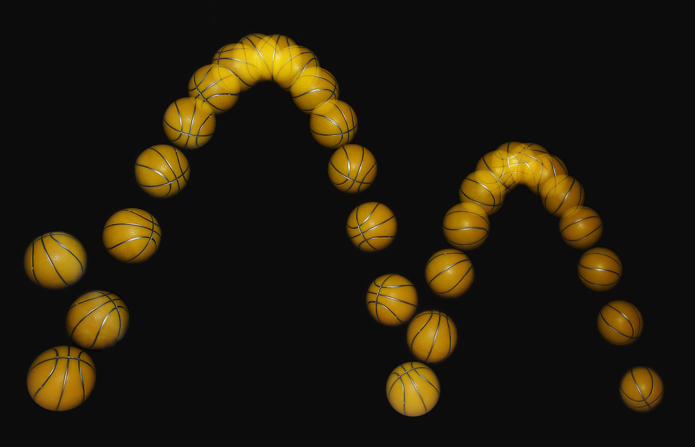

## Maximale snelheid in val

Als je valt en de luchtweerstandskracht niet verwaarloost:

- In het begin neemt je snelheid snel toe, omdat er weinig weerstand. Je versnelt dan met ongeveer de valversnelling (\\(9.81 \text{ m/s}^2\\)).

- Naarmate je snelheid toeneemt neemt \\(F_{w,l}\\) ook toe, omdat \\(F_{w,l}\\) evenredig is met \\(v^2\\).

- Op den duur bereik je een evenwicht waar \\(F_z = F_{w,l}\\). Daarmee kan je de maximale snelheid in een val berekenen.

\\[F_z = F_{w,l}\\]
\\[mg = kv_{\text{max}}^2\\]
\\[v_{\text{max}} = \sqrt{\frac{mg}{k}}\\]

<!-- ## Omhoog gooien

Als je iets omhoog gooit zonder luchtweerstand en daar v,t- en h,t-diagrammen van maakt:

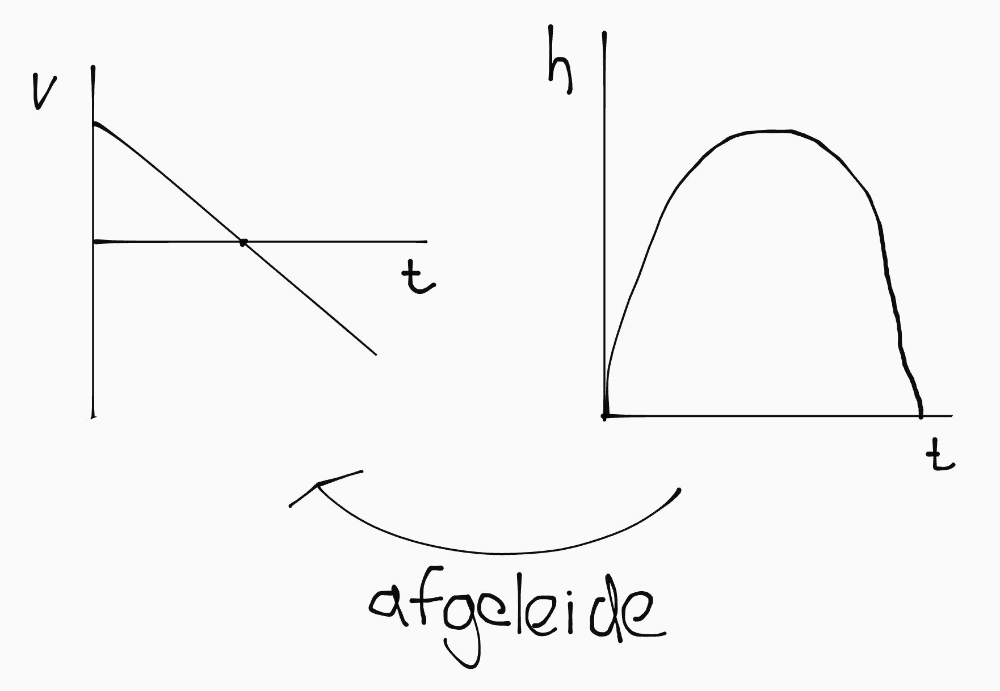 -->

## Vloeistofmanometer

Met een vloeistofmanometer kan je gasdruk meten. Het werkt zo: er vormt zich in de manometer een evenwicht waarin \\(p_{\text{gas}} = p_{\text{vloeistof}} + p_{\text{buiten}}\\).

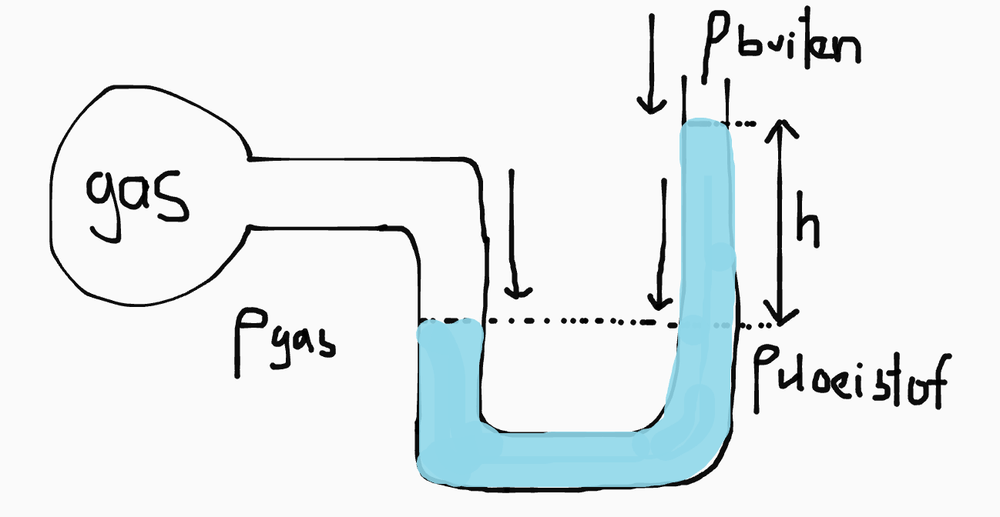

---

# HELP

- Wat is een spanningsdeler? Wat is het verschil tussen het gebruiken van een schuifweerstand als variable weerstand vs spanningsdeler?

- Waarom loopt stroom altijd naar de aarde? Wat aan de aarde maakt dat elektronen er door worden aangetrokken? Is de aarde positief geladen?

- Wat maakt dat een component meer stroom "trekt"? Heeft het dan juist niet een grotere weerstand?

- Als een deeltje tegen de wand van het gasvolume botst, raak het dan zijn energie niet kwijt? En zo ja, hoe komt het dan dat het gas niet de hele tijd afkoelt en uiteindelijk vloeistof wordt? Wat zorgt ervoor dat de deeltjes weer meer bew. energie krijgen?

- Is luchtvochtigheid belangrijk?

- Waarom is lucht een slecht opslagmedium voor warmte?

- Mag warmtestroom in Watt?

- Hoe leg je het verschil tussen druk en spanning uit?

- Moeten we alle verschillende vormen van medische beeldvorming + kenmerken ook kennen?

- Is de Fmpz altijd Fres, of is het toeval dat dat in alle situaties die ik tot nu toe heb gezien zo is?