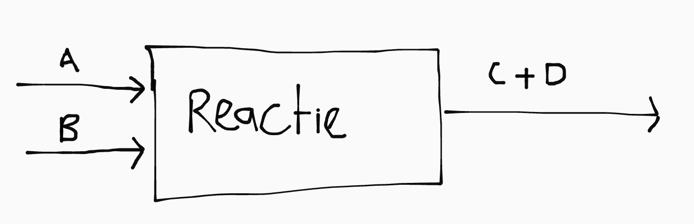

## Polymeren

Een polymeer is een hele lange koolstofketen.

<table><thead>
  <tr>
    <th>Thermoplast</th>
    <th>Thermoharder</th>
  </tr></thead>
<tbody>
  <tr>
    <td>Ketens bij elkaar gehouden door VDW (zwak) \(\implies\) smelt bij verhitten</td>
    <td>Ketens aan elkaar gekoppeld met covalente bindingen \(\implies\) smelt niet</td>
  </tr>
  <tr>
    <td></td>
    <td></td>
  </tr>
</tbody>
</table>

### Kookpunt en fase

Polymeren bestaan uit gigantische moleculen, dus de onderlinge VDW is relatief groot. Daarom zijn ze vast bij kamertemperatuur.

Het kookpunt van een polymeer hangt af van (minst naar meest belangrijk):

- Grootte van het molecuul (VDW-kracht)
- Dipool-dipool interactie
- Waterstofbruggen
- Covalente bindingen (crosslinks)

### Weekmakers

Je kan een plastic zachter (kneedbaar) maken met een weekmaker zoals aceton:

De aceton neemt de plek van lucht in beslag, waardoor de VDW-kracht kleiner wordt. Daardoor wordt het plastic kneedbaar.

### Oplosbaarheid in water

- Polaire stoffen lossen meestal goed op (mits de apolaire staart niet te lang is)
- Stoffen die waterstofbruggen kunnen vormen lossen goed op

## Groene chemie

### Atoomeconomie

De atoomeconomie bepaalt hoe efficiënt een reactie is. Stel je hebt de reactie \\(\ce{A + B -> C + D}\\) om \\(\ce{C}\\) te produceren. Er blijft altijd rest \\(\ce{A}\\) en \\(\ce{B}\\) over, omdat geen enkele reactie 100% verloopt. Ook ontstaat er \\(\ce{D}\\), wat voor ons een afvalstof is. Om de efficiënte te berekenen gebruik je de formule:

\\[\text{atoomeconomie} = \frac{m_{\text{gewenste eindproducten}}}{m_{\text{beginstoffen}}} \cdot 100\% \\]

\\[= \frac{m_C}{m_A + m_B} \cdot 100\%\\]

### E-factor

Een andere manier om de impact van een reactie op het milieu te meten is met de E-factor. De E-factor geeft aan hoeveel kg afval ontstaat per kg gewenst reactieproduct:

\\[E = \frac{m_{\text{beginstoffen}} - m_{\text{gewenste eindproducten}}}{m_{\text{gewenste eindproducten}}}\\]

In de ideale situatie is de E-factor zo laag mogelijk. Hoe laag "goed" precies is verschilt per situatie. Er is geen harde grens tussen een "groene" en "niet groene" reactie, het is altijd een tradeoff tussen de verschillende regels uit B99.

## Koolstofchemie & naamgeving

### Isomeren

- **structuurisomeer**: zelfde formule, andere structuur
- **stereoisomeer**: zelfde formule en structuur, andere ruimtelijke bouw

Je herkent een stereoisomeer aan een koolstofatoom met vier verschillende groepen. Je kan dan twee mogelijke spiegelbeelden hebben:

| Spiegelbeeld                                     | \\(180 ^{\circ}\\) gedraaid                                                    |
| ------------------------------------------------ | ------------------------------------------------------------------------------ |
|  |  |

Met meerdere stereocentra krijg je nóg meer mogelijke spiegelbeelden:

\\[\text{mogelijke spiegelbeelden} = 2^{\text{aantal stereocentra}}\\]

### Functionele groepen

<table><thead>
  <tr>
    <th>Naam</th>
    <th>Structuur</th>
    <th>Voorvoegsel</th>
    <th>Achtervoegsel</th>
  </tr></thead>
<tbody>
  <tr>
    <td>Alcohol</td>
    <td>\(\ce{R}-\ce{OH}\)</td>
    <td>hydroxy-</td>
    <td>-ol</td>
  </tr>
  <tr>
    <td>Amine</td>
    <td>\(\ce{R}-\ce{NH2}\)</td>
    <td>amino-</td>
    <td>-amine</td>
  </tr>
  <tr>
    <td>Zuur</td>
    <td>\(\begin{array}{c}
\ce{O}\text{ }\\
\|\text{ }\\
\text{ }\text{ }\ce{R}-\ce{C} - \ce{OH}
\end{array}\)</td>
    <td style="opacity: .3">-</td>
    <td>-zuur</td>
  </tr>
  <tr>
    <td>Ether</td>
    <td>\(\begin{array}{c}
\small|\text{ }\text{ }\text{ }\text{ }\text{ }\text{ }\text{ }\text{ }\text{ }\text{ }\text{ }\text{ }\text{ }\text{ }\text{ }\text{ }\text{ }\small|\\
\ce{R}-\ce{C}-\ce{O}-\ce{C}-\ce{R}\\
\small|\text{ }\text{ }\text{ }\text{ }\text{ }\text{ }\text{ }\text{ }\text{ }\text{ }\text{ }\text{ }\text{ }\text{ }\text{ }\text{ }\text{ }\small|\\
\end{array}\)</td>
    <td>[alk]oxy-</td>
    <td style="opacity: .3">-</td>
  </tr>
  <tr>
    <td>Keton</td>
    <td>\(\begin{array}{c}
\ce{O}\\
\|\\
\ce{R}-\ce{C}-\ce{R}\\
\end{array}\)</td>
    <td>oxo-</td>
    <td style="opacity: .3">-</td>
  </tr>
  <tr>
    <td>Aldehyde</td>
    <td>\(\begin{array}{c}
\small |\\
\ce{R}-\ce{C} = \ce{O}
\end{array}\)</td>
    <td>oxo-</td>
    <td style="opacity: .3">-</td>
  </tr>
  <tr>
    <td>Ester</td>
    <td>\(\begin{array}{c}
\ce{O}\text{ }\text{ }\text{ }\text{ }\text{ }\text{ }\\
\|\text{ }\text{ }\text{ }\text{ }\text{ }\text{ }\\
\text{ }\text{ }\ce{R}-\ce{C} - \ce{O} - \ce{C}
\end{array}\)</td>
    <td colspan="2">-oaat <small>(naamgeving afwijkend)</small></td>
  </tr>
  <tr>
    <td>Peptide</td>
    <td>\(\begin{array}{c}
\ce{O}\text{ }\text{ }\text{ }\text{ }\text{ }\text{ }\text{ }\text{ }\text{ }\\
\|\text{ }\text{ }\text{ }\text{ }\text{ }\text{ }\text{ }\text{ }\text{ }\\
\text{ }\text{ }\ce{R}-\ce{C} - \ce{NH} - \ce{C}
\end{array}\)</td>
    <td colspan="2">??</td>
  </tr>
</tbody>
</table>

### Estervorming

De naamgeving van esters is afwijkend: de stamnaam is niet de langste koolstofketen, maar de koolstofketen van het originele zuur. Je gebruikt het achtervoegsel -oaat.

## Triviale namen voor zuren en zouten

| Triviale naam | Formule               |
| ------------- | --------------------- |
| Zwavelzuur    | \\(\ce{H2SO4}\\)      |
| Salpeterzuur  | \\(\ce{HNO3}\\)       |
| Azijnzuur     | \\(\ce{CH3COOH}\\)    |
| Zoutzuur      | \\(\ce{H3O+ + Cl-}\\) |
| Soda          | \\(\ce{Na2SO4}\\)     |
| Natronloog    | \\(\ce{Na+ + OH-}\\)  |
| Kaliloog      | \\(\ce{K+ + OH-}\\)   |
| Kalkwater     | \\(\ce{Ca+ + 2OH-}\\) |

Let op:

| Naam     | Formule                        |
| -------- | ------------------------------ |
| Ammoniak | \\(\ce{NH3 \_{\text{(g)}}}\\)  |
| Ammonia  | \\(\ce{NH3 \_{\text{(aq)}}}\\) |
| Ammonium | \\(\ce{NH4+}\\)                |

## Zoutformules

<table><thead>
  <tr>
    <th>Lading</th>
    <th>Naam</th>
    <th>Formule</th>
  </tr></thead>
<tbody>
  <tr>
    <td>1+</td>
    <td>Ammonium</td>
    <td>\(\ce{NH4+}\)</td>
  </tr>
  <tr>
    <td rowspan="5">1-</td>
    <td>Hydroxide</td>
    <td>\(\ce{OH-}\)</td>
  </tr>
  <tr>
    <td>Nitraat</td>
    <td>\(\ce{NO3-}\)</td>
  </tr>
  <tr>
    <td>Nitriet</td>
    <td>\(\ce{NO2-}\)</td>
  </tr>
  <tr>
    <td>Waterstofcarbonaat</td>
    <td>\(\ce{HCO3-}\)</td>
  </tr>
  <tr>
    <td>Acetaat/ethanoaat</td>
    <td>\(\ce{CH3COO-}\)</td>
  </tr>
  <tr>
    <td rowspan="3">2-</td>
    <td>Carbonaat</td>
    <td>\(\ce{CO3^2-}\)</td>
  </tr>
  <tr>
    <td>Sulfaat</td>
    <td>\(\ce{SO4^2-}\)</td>
  </tr>
  <tr>
    <td>Sulfiet</td>
    <td>\(\ce{SO3^2-}\)</td>
  </tr>
  <tr>
    <td rowspan="2">3-</td>
    <td>Fosfaat</td>
    <td>\(\ce{PO4^3-}\)</td>
  </tr>
  <tr>
    <td>Fosfiet</td>
    <td>\(\ce{PO3^3-}\)</td>
  </tr>
</tbody></table>

## Indicatoren

| Indicator | Voor           |
| --------- | -------------- |
| Kalkwater | \\(\ce{CO2}\\) |
| Kalkwater | \\(\ce{CO2}\\) |

## Blokschema's

In een blokschema heb je verschillende ruimtes (blokken) waarin een chemisch process plaatsvindt en pijpleidingen daartussen (pijlen), waarin je de stofstromen kan zien.

### Reactie

Je herkent een reactie aan een stofomzetting:

### Scheiding

Je herkent een scheiding aan een mengsel dat via één stofstroom binnenkomt en via gescheiden stofstromen het blok weer verlaat:

#### Stofstromen bij destilleren

Bij een destillatie is de bovenste pijl de stof met het hoogste kookpunt.
