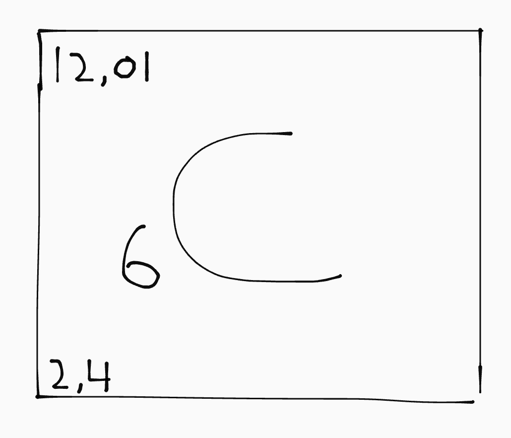
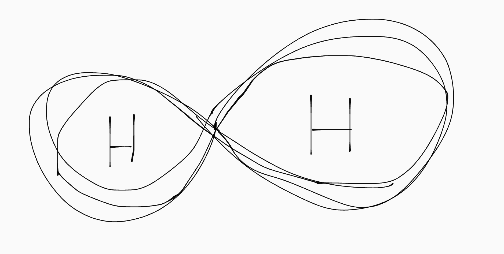
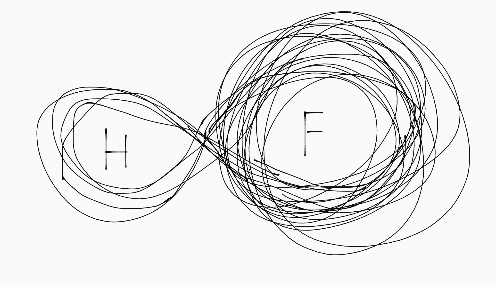
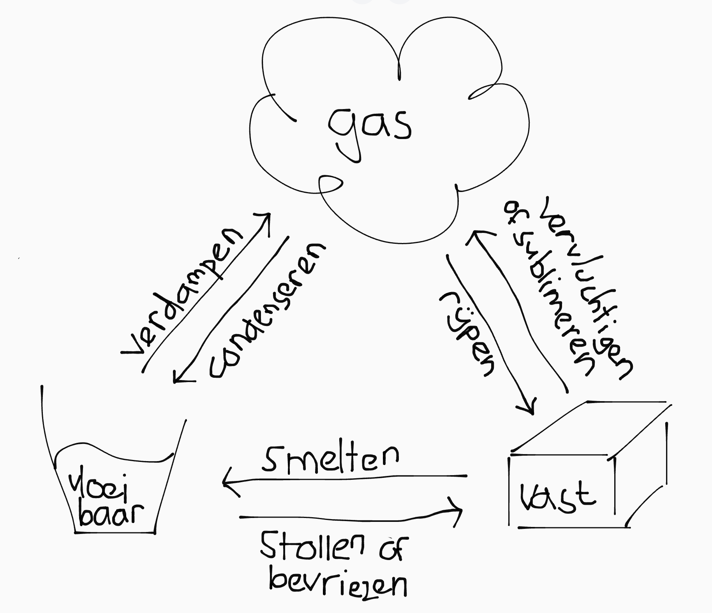
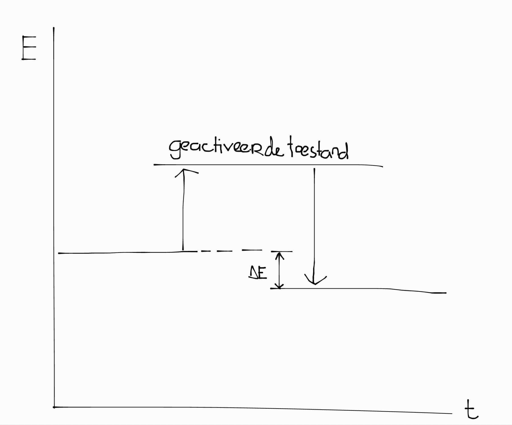
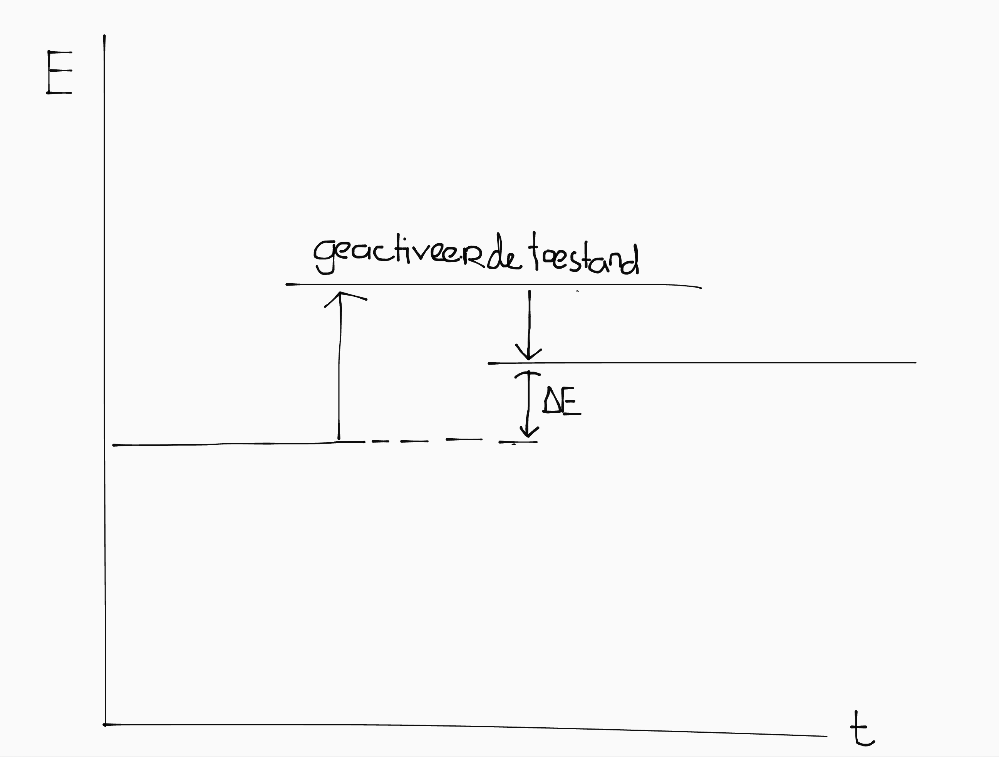
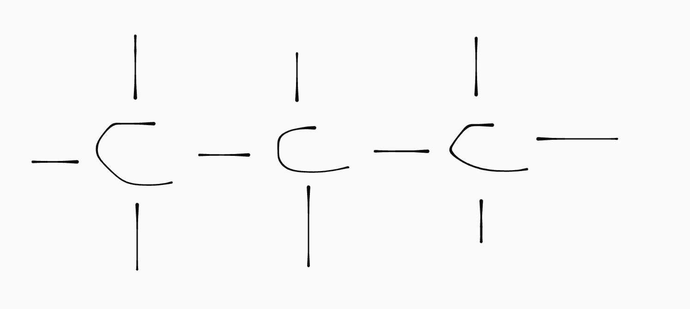
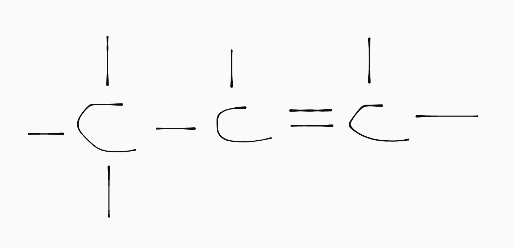
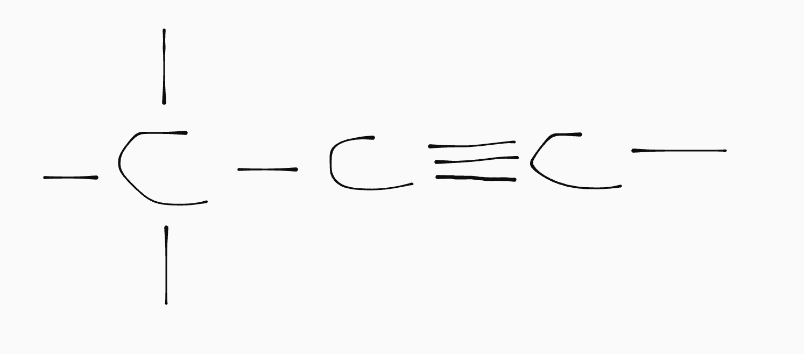
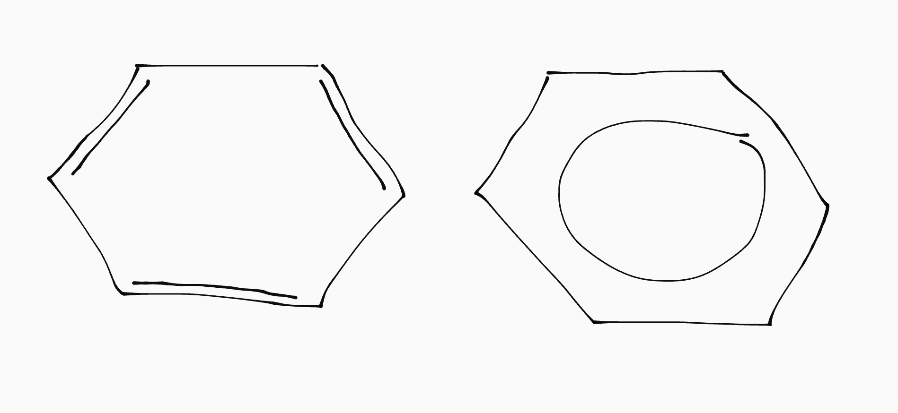

## Atomen

Atomen zijn de bouwblokken van stoffen. Ze bestaan uit:

- Protonen (+)
- Neutronen (0)
- Elektronen (-)

Het aantal protonen (aka **atoomnummer**) bepaald om welke soort atoom het gaat.

In de kern van een atoom zitten de protonen en neutronen. Daaromheen bewegen de elektronen in orbitalen. Er zijn evenveel elektronen als protonen, waardoor een atoom ongeladen is.

In het periodiek systeem staan drie belangrijke getallen:

- **De relatieve atoommassa** (rechtsboven) is de som van het aantal protonen en neutronen.
- **Het atoomnummer** (naast de letter) is het aantal protonen.
- **De elektronenconfiguratie** (linksonder) geeft het aantal elektronen per orbitaal aan.

Er zijn twee soorten atomen: metalen en niet-metalen. Met uitzondering van koolstof geleiden niet-metalen geen stroom.

<!-- Er zijn twee variaties op atomen: isotopen (m. +- neutronen) en ionen (m. +- elektronen).-->

### Periodiek systeem

Het periodiek systeem is een stelsel om atoomsoorten mee te categoriseren. Het is opgedeeld in rijen (periodes) en kolomen (groepen). Atoomsoorten die in het periodiek systeem onder elkaar staan lijken chemisch op elkaar.

- **Akalimetalen** (groep 1) reageren heftig met water.
- **Halogenen** (groep 17) komen veel voor als negatief geladen ionen.
- **Edelgassen** (groep 18) zijn saai en reageren nooit (boring!)

### Isotopen (<small>overschot of tekort aan neutronen</small>)

De atoomkern (protonen + neutronen) vormt het grootste deel van de massa van een atoom, omdat elektronen een bijna verwaarloosbaar kleine massa hebben.

Voor een atoomsoort is het atoomnummer (aantal protonen) altijd constant, maar het aantal neutronen kan variëren. Daardoor kunnen er verschillende **isotopen** zijn van een stof, met elk een net andere atoommassa.

De relatieve atoommassa in het periodiek systeem is een gewogen gemiddelde van alle natuurlijk voorkomende isotopen.

### Ionen (<small>overschot of tekort aan elektronen</small>)

Een ion is een geladen atoom. Ionisatie is alleen mogelijk door het toevoegen of wegnemen van elektronen, want het aantal protonen in een atoom is (zonder kernreacties) onveranderlijk.

Als je energie toevoert aan een atoom kan je elektronen uit de buitenste orbitaal vrijmaken. Hoe voller de buitenste schil, hoe moeilijker het is om een atoom te ioniseren, en hoe hoger de ionisatie-energie dus.

- Bij een **edelgas** is de buitenste schil verzadigd, dus is ionisatie moeilijk, en daarom zijn edelgassen niet reactief.
- De **halogenen** hebben missen één elektron in de buitenste schil, en komen daarom vooral als negatief geladen ionen voor.
- De **akalimetalen** hebben maar één elektron is de buitenste schil, dus zijn makkelijk te ioniseren en dus zeer reactief.

De valentie-elektronen (val-e-) van een atoom zijn de elektronen in de buitenste schil. Dit zijn de elektronen die bindingen vormen. Stoffen die onder elkaar staan in het periodiek systeem hebben evenveel val-e-.

De lading die wordt veroorzaakt door het toevoeren of afnemen van elektronen noemen we **formele lading**. Je berekent deze door:

\\[\text{lading} = \text{val } e^- - \text{niet-bindende } e^- - \text{aantal bindingen}\\]

## Moleculen en bindingen

Atomen 'streven' naar edelgasconfiguratie omdat die het meest stabiel is. Om hun buitenste orbitaal volledig te vullen gaan ze reacties aan. Daardoor worden moleculen gevormd.

Stoffen blijven bij elkaar door bindingen:

| Soort stof       | Naam binding                      | bestaat uit                     |
| ---------------- | --------------------------------- | ------------------------------- |
| Moleculaire stof | Covalente binding of atoombinding | niet-metalen                    |
| Metaalrooster    | Metaalbinding                     | metaalionen                     |
| Zoutrooster      | Ionbinding                        | niet-metaalionen en metaalionen |

### Moleculaire stoffen

Bij een moleculaire stof is er sprake van **gemeenschappelijke elektronenparen**. Daarbij delen atomen de elektronen in hun buitenste schil. Daardoor hebben ze beide een edelgasconfiguratie.

Stel je hebt water (\\(\ce{H2O}\\)). Het zuurstofatoom heeft 6 val-e-. De waterstoffen hebben allebei 1 val-e-. Waterstof heeft één elektron te weinig voor edelgasconfiguratie, en zuurstof heeft er twee te weinig:

Deze stoffen kunnen hun elektronen 'delen'; dan doen de elektronen mee in beide buitenste schillen. Dit noemen we **covalentie** (het delen van lading). De elektronen vormen dan een **covalente** binding tussen de atomen.

Het aantal covalente bindingen die een stof aan kan gaan hangt dus af van het aantal val-e- in de buitenste orbitaal. Voor veelvoorkomende stoffen is dat:

| Atoom            | C   | N   | O   | F   | H   |
| ---------------- | --- | --- | --- | --- | --- |
| aantal bindingen | 4   | 3   | 2   | 1   | 1   |

### Metalen

- **Edele** metalen zijn weinig reactief en kunnen dus zuiver in de bodem voorkomen.
- **Onedele** metalen komen alleen voor als bindingen of ionen; je hebt een reactie nodig om het metaal uit een erts te krijgen.

Metaalatomen kunnen metaalroosters vormen. In een rooster zijn alle metaalatomen volledig geioniseerd, en kunnen de elektronen zich vrij bewegen. De ionen blijven bij elkaar doordat de lading van de vrije elektronen de positief geladen atoomkernen aantrekt.

De vrije elektronen kunnen kinetische energie en lading verplaatsen; metalen geleiden dus stroom en warmte.

### Zouten

Zouten zijn roosters gevormd uit ionen van metalen en niet-metalen, waarbij typisch de metalen positief en de niet-metalen negatief geladen zijn<small>\*</small>. De ionen blijven bij elkaar door de elektrostatische interactie tussen de ionen (aka gelijke tegengestelde lading trekt elkaar aan).

| Metaal           | Lading   |
| ---------------- | -------- |
| \\(\ce{KNaAg}\\) | 1+       |
| \\(\ce{Fe}\\)    | 2+ of 3+ |
| \\(\ce{Al}\\)    | 3+       |
| De rest          | 2+       |

Zouten zelf zijn altijd elektrisch neutraal. Daarom kunnen twee stoffen altijd maar in één vaste verhouding een zout vormen, en laten we in systematische namen de voorvoegsels mono-, di-, tri-, tetra-, penta-, en hexa- weg.

Zouten zijn bij kamertemperatuur vast, en de ionen zitten dan op een vaste plaats in het ionrooster. Daardoor geleiden zouten in vaste vorm geen stroom.

In zoutoplossingen kunnen de ionen wel vrij bewegen. Opgelost in water geleiden zouten dus wel stroom.

<table><thead>
  <tr>
    <th>Lading</th>
    <th>Naam</th>
    <th>Formule</th>
  </tr></thead>
<tbody>
  <tr>
    <td>1+</td>
    <td>Ammonium</td>
    <td>\(\ce{NH4+}\)</td>
  </tr>
  <tr>
    <td rowspan="5">1-</td>
    <td>Hydroxide</td>
    <td>\(\ce{OH-}\)</td>
  </tr>
  <tr>
    <td>Nitraat</td>
    <td>\(\ce{NO3-}\)</td>
  </tr>
  <tr>
    <td>Nitriet</td>
    <td>\(\ce{NO2-}\)</td>
  </tr>
  <tr>
    <td>Waterstofcarbonaat</td>
    <td>\(\ce{HCO3-}\)</td>
  </tr>
  <tr>
    <td>Acetaat/ethanoaat</td>
    <td>\(\ce{CH3COO-}\)</td>
  </tr>
  <tr>
    <td rowspan="3">2-</td>
    <td>Carbonaat</td>
    <td>\(\ce{CO3^2-}\)</td>
  </tr>
  <tr>
    <td>Sulfaat</td>
    <td>\(\ce{SO4^2-}\)</td>
  </tr>
  <tr>
    <td>Sulfiet</td>
    <td>\(\ce{SO3^2-}\)</td>
  </tr>
  <tr>
    <td rowspan="2">3-</td>
    <td>Fosfaat</td>
    <td>\(\ce{PO4^3-}\)</td>
  </tr>
  <tr>
    <td>Fosfiet</td>
    <td>\(\ce{PO3^3-}\)</td>
  </tr>
</tbody></table>

<small>\*\\(\ce{NH4+}\\) is een uitzondering.</small>

### Polariteit

Polariteit is een verschijnsel dat zich voordoet bij covalentie. In een apolaire covalente binding draaien de gedeelde elektronen afwisselend mee in de buitenste orbitaal van beide stoffen:

In een polaire binding (aka een <em>dipool</em>) ziet dat er meer zo uit:

De ‘gedeelde’ elektronen bevinden zich voornamelijk in de orbitalen van \\(\ce{F}\\) en slechts af en toe in de buitenste schil van het \\(\ce{H}\\)-atoom.

**Electronegatieve** atomen zoals \\(\ce{F}\\) trekken de covalentebinding naar zichzelf toe. Daardoor wordt het electronegatieve atoom _een beetje negatief geladen_ (\\(\ce{\delta-}\\)), en het andere atoom _een beetje positief geladen_ (\\(\ce{\delta+}\\)). We noemen dit **partiële lading**.

De electronegatieve atomen kan je onthouden met het ezelsbruggetje \\(\ce{FONClBrI}\\).

#### Oplosbaarheid

De oplosbaarheid van stoffen wordt bepaald door de polariteit. Apolaire stoffen lossen goed op met andere apolaire stoffen, en polaire stoffen met andere polaire stoffen.

Water is een polaire stof (\\(\ce{O}\\) is elektronegatief), dus apolaire stoffen lossen slecht op in water, en polaire stoffen juist goed.

## Stoffen en mengsels

<h3 id="fases" style="margin-bottom: -0.8em">Fases en faseovergangen</h3>

Stoffen kunnen afhankelijk van de temperatuur in drie fases voorkomen:

| Fase      | Deeltjesmodel                                                  |
| --------- | -------------------------------------------------------------- |
| Vast      | Statisch, op een vaste plek.                                   |
| Vloeibaar | Vrij, maar deeltjes hebben onderling een aantrekkende werking. |
| Gas       | Grotere tussenliggende ruimte en weinig onderlinge invloed.    |

<h3 id="stofeigenschappen" style="margin-bottom: -0.5em">Stofeigenschappen</h3>

- Fase bij kamertemperatuur
- Dichtheid
- Oplosbaarheid
- Aanhechtingsvermogen
- Kleur
- Geur

#### Micro- en macroniveau

Je kan stofeigenschappen op twee niveaus indelen:

- **Micro**: eigenschappen van en interacties tussen de deeltjes waaruit een stof bestaat.
- **Macro**: eigenschappen en processen die wij zintuigelijk kunnen waarnemen. Het gedrag op macroniveau is altijd een voortvloeistof van stofeigenschappen op microniveau.

### Mengsels

| Naam      | mengsel van                                                | helder? |
| --------- | ---------------------------------------------------------- | ------- |
| Oplossing | Goed oplosbare vaste stof in een vloeistof.                | helder  |
| Suspensie | Slecht oplosbare vaste stof in een vloeistof.              | troebel |
| Legering  | Twee of meer verschillende metalen.                        | troebel |
| Schuim    | Kleine gasbelletjes in een vaste stof.                     | troebel |
| Rook      | Vaste stoffen in een gas.                                  | troebel |
| Mist      | Vloeistoffen in een gas.                                   | troebel |
| Emulsie   | Slecht mengbare stoffen (langdurig dankzij een emulgator). | troebel |

Een mengsel heeft smelt- en kooktrajecten, een zuivere stof heeft smelt- en kookpunten (te herkennen aan een horizontaal stuk in de grafiek).

| Mengsel                                              | Zuivere stof                                   |
| ---------------------------------------------------- | ---------------------------------------------- |
|  |  |

### Scheidingsmethodes

| Naam                  | mengsel                                | berust op                                |
| --------------------- | -------------------------------------- | ---------------------------------------- |
| Filtreren             | suspensie                              | deeltjesgrootte                          |
| Adsorberen            | oplossing of gasmengsel                | aanhechtingsvermogen                     |
| Indampen              | oplossing of suspensie                 | kookpunt                                 |
| Extraheren            | mengsel van vaste stoffen              | oplosbaarheid                            |
| Zeven                 | suspensie of mengsel van vaste stoffen | deeltjesgrootte                          |
| Destilleren           | goed mengbare vloeistoffen             | kookpunt                                 |
| Centrifugeren         | suspensie of emulsie                   | dichtheid                                |
| Bezinken & afschenken | suspensie of emulsie                   | dichtheid                                |
| Chromatografie        | oplossing of suspensie                 | aanhechtingsvermogen en oplosbaarheid |

## Krachten

Bindingen zorgen ervoor dat atomen in moleculen bij elkaar blijven. De krachten tussen de moleculen zorgen ervoor dat moleculen in stoffen bij elkaar blijven.

Als de krachten te zwak zijn om een stof bij elkaar te houden vindt er een faseovergang plaats. Dus, hoe groter de onderlinge krachten tussen moleculen, hoe hoger de smelt- en kookpunten.

Er zijn drie, steeds sterkere, krachten die stoffen bij elkaar houden: VDW, dipool-dipool en \\(\ce{H}\\)-bruggen.

### Vanderwaals

De vanderwaalskracht is een aantrekkende kracht tussen _alle_ moleculen. Hoe groter de molecuulmassa, hoe groter de aantrekkende kracht. Van de drie krachten is dit de zwakste.

### Polariteit (<small>aka dipool-dipoolinteractie</small>)

Atomen met een tegengestelde partiële lading trekken elkaar aan. Dat noemen we dipool-dipoolinteractie. Deze aantrekkende kracht houdt polaire moleculen bij elkaar.

### Waterstofbruggen

De \\(\ce{H}\\)-brug is een sterke variant van dipool-dipoolinteractie. Waterstofbruggen kunnen ontstaan bij moleculen met een \\(\ce{OH}\\)- of \\(\ce{NH2}\\)-groep.

Waterstofbruggen vormen door de aantrekking tussen het \\(\ce{\delta+}\\)-geladen \\(\ce{H}\\)-atoom van de \\(\ce{OH}\\)- of \\(\ce{NH2}\\)-groep en de ongebonden elektronenparen van een willekeurige \\(\ce{O}\\) of \\(\ce{N}\\). Een \\(\ce{O}\\)-atoom heeft twee ongebonden elektronenparen en kan dus twee waterstofbruggen hebben; een \\(\ce{N}\\)-atoom maar één.

> Er kunnen ook waterstofbruggen vormen vanaf de \\(\ce{H}\\) van \\(\ce{HF}\\).

## Reacties

### Reactie-energie (<small>aka energie-effect</small>)

Het kost een bepaalde energie om een binding tussen moleculen te maken of af te breken.

Als er een reactie tussen stoffen plaatsvindt, moeten alle bindingen links van de pijl afgebroken worden, en rechts van de pijl gevormd worden. Daaruit volgt:

\\[\Delta E = -E_{\text{beginproducten}} + E_{\text{eindproducten}}\\]

<small>De \\(E\\) van de begin- of eindproducten bereken je door de som te nemen van de vormingswarmten uit Binas 57A.</small>

| Exotherm: \\(\Delta E < 0\\) | Endotherm: \\(\Delta E > 0\\) |
| ---------------------------- | ----------------------------- |
|             |             |
| Er komt energie vrij.        | Je moet energie toevoeren.    |

### Reactiesnelheid

De snelheid waarmee een reactie verloopt kan je beredeneren aan de hand van het botsende deeltjesmodel: reacties verlopen als deeltjes effectief botsen. Voor een effectieve botsing moet de botsingsenergie een bepaalde drempelwaarde (de activeringsenergie) overstijgen, anders gebeurt er niks.

Er is dus alleen een reactie als deeltjes vaak en hard genoeg botsen. Als de deeltjes zacht of helemaal niet botsen is er geen reactie. Er zijn een aantal factoren die hier invloed op hebben:

- **Hogere concentratie**: er zijn meer deeltjes, dus er zijn meer botsingen.
- **Verdelingsgraad**: er is een groter contactoppervlak, dus er zijn meer botsingen.
- **Hogere temperatuur**: de deeltjes bewegen sneller, dus ze botsen vaker en harder.
- **Katalysator**: de activeringsenergie wordt lager, dus botsingen hoeven minder hard.

> Een katalysator is een stof die wel wordt **ge**bruikt maar nooit **ver**bruikt. Een homogene katalysator heeft dezelfde fase als de reactieproducten; een heterogene katalysator niet.

### Evenwichten

Een evenwichtsreactie is een reactie die beide kanten op verloopt. We geven die aan met een dubbele pijl:

\\[\ce{2A + B <=> C + 3D}\\]

Het evenwicht verschuift (of loopt af) bij het toevoegen of wegnemen van producten:

- Als je links een product weghaalt kan de reactie naar rechts niet meer verlopen en zal het evenwicht naar links verschuiven.
- Als je links een product toevoegt kan de reactie naar rechts juist beter verlopen en zal het evenwicht dus naar rechts verschuiven.

De evenwichtsvoorwaarde (\\(k\\)) is een breuk met daarin de reactieproducten, die je kan gebruiken voor berekeningen aan evenwichten. In de evenwichtsvoorwaarden veranderen de coëfficienten in machten en worden alleen producten in gasvorm of \\((\text{aq})\\) meegenomen.

\\[\ce{k = \frac{[C][D]^3}{[A]^2[B]}}\\]

\\(k\\) is constant als het evenwicht ingesteld is, en de waarde van \\(k\\) hangt af van de temperatuur.

Als je het evenwicht verschuift duurt het even voordat het nieuwe evenwicht ingesteld is. Als je een katalysator gebruikt is deze insteltijd korter.

## Reactiemechanismes

### Structuurformules

De formules die we tot nu toe gebruikt hebben geven uit welke atomen een molecuul is opgebouwd. We noemen dit molecuulformules:

\\[\ce{C3H8}\\]

Deze formules geven echter geen inzicht in _op welke manier_ de atomen gekoppeld zijn. Hiervoor gebruiken we structuurformules:

In een structuurformule worden de atomen aangegeven met hun letters en worden atoombindingen aangegeven met streepjes. We hebben afgesproken dat voor een C-H binding de H weggelaten mag worden.

<!--**Dit geldt uitsluitend voor C-H bindingen. N- is dus hartstikke fout!**-->

Voor één molecuulformule zijn verschillende structuren mogelijk. Dat noemen we isomerie.

### Lewisstructuren

<b style="color:#82c996">Ongebonden elektronenparen</b> zijn val-e- in het buitenste orbitaal van een atoom die niet onderdeel van een <b style="color:#c996f8">covalente binding</b> zijn:

Reacties tussen stoffen verlopen door het verschuiven van elektronen. Een Lewisstructuur is een notatie om ongebonden elektronenparen weer te geven, om beter te kunnen redenederen over de bewegingen van elektronen:

### Mechanismes

Reactiemechanismes zijn schema's waarin de elektronenstroom die plaatsvindt bij een bepaalde reactie is gevisualiseerd. Hierbij gaan altijd pijlen _van_ een binding of ongebonden elektronenpaar _naar_ een atoom of andere binding.

In mechanismes heb je vaak nucleofiele en elektrofiele deeltjes. Een nucleofiel deeltje wordt aangetrokken door een positieve lading (\\(\delta^+\\)), en een elektrofiel deeltje door een negatieve lading (\\(\delta^-\\)).

## Koolstofchemie

### Alkanen, alkenen en alkynen

Alkanen zijn koolwaterstoffen bestaand uit een koolstofketen volledig omringd met waterstoffen. Ze hebben de algemene formule \\(\ce{C_nH\_{2n+2}}\\).

Bij alkanen bevatten alle koolstofatomen het maximale aantal waterstoffen. Daarom noemen we alkanen **verzadigd**.

Als de koolstofketen een dubbele binding spreken we van een alkeen. Voor elke dubbele binding kunnen er volgens de regels van covalentie twee waterstoffen minder aan de koolstofketen zitten. Daarom noemen we alkenen **onverzadigd**.

Je kan het aantal dubbele bindingen berekenen aan de hand van de algemene formule.

Voorbeeld

Stel je hebt \(\ce{C6H8}\). De gebruikelijke formule voor hexaan is \(\ce{C6H14}\). Dat betekent dat er \(14 - 8 = 6\) waterstoffen missen; twee per dubbele binding geeft \(3\) dubbele bindingen.

Koolstofketens met een driebubbele binding noemen we alkynen. Dan missen per binding vier waterstoffen. Het berekenen van het aantal bindingen is verder hetzelfde als bij alkenen.

### Cycloverbindingen

Als een koolstofketen een ring vormt met zichzelf, noemen we dat een cycloverbinding. Een speciale daarvan is benzeen (\\(\ce{C6H6}\\)).

In een benzeenring zitten drie dubbele bindingen die zich continue over de ring verplaatsen. Stoffen met een benzeenring erin noemen we aromaten.

### Systematische naamgeving

Om verschillende structuren van elkaar te kunnen onderscheiden gebruiken we systematische naamgeving.

De stamnaam van een stof is altijd de lengte langste koolstofketen. Daarbij krijgen alkaan de uitgang -aan, alkenen -een, en alkynen -yn.

| Stamnaam             | meth- | eth- | prop- | but- | pent- | hex- |
| -------------------- | ----- | ---- | ----- | ---- | ----- | ---- |
| lengte koolstofketen | 1     | 2    | 3     | 4    | 5     | 6    |

Alle aftakkingen van de hoofdketen noemen we **functionele groepen**. Voor alle functionele groepen hebben we voor- en achtervoegsels. Je geeft met een getal aan aan welke koolstof de functionele groep vast zit.

| Naam         | binding                                                      | voorvoegsel | achtervoegsel |
| ------------ | ------------------------------------------------------------ | ----------- | ------------- |
| (Carbon)zuur | \\(\ce{-COOH}\\)                                             | -           | -zuur         |
| Ester        | \\(\ce{-C=OCO}\\)                                            | -           | -oaat         |
| Peptide      | \\(\ce{-C=OCNH}\\)                                           | -           | ??            |
| Aldehyde     | \\(\ce{=O}\\) (einde keten)                                  | oxo-        | -al           |
| Keton        | \\(\ce{=O}\\) (midden keten)                                 | oxo-        | -on           |
| Alcohol      | \\(\ce{-OH}\\)                                               | hydroxy-    | -ol           |
| Amine        | \\(\ce{-NH2}\\)                                              | amino-      | -amine        |
| Ether        | \\(\ce{-O-R}\\)                                              | [alk]oxy-   | -             |
| Akyl         | \\(\ce{-C_nH\_{2n + 1}}\\)                                   | [alk]yl-    | -             |
| Halogeen     | \\(\ce{-F}\\), \\(\ce{-Cl}\\), \\(\ce{-Br}\\), \\(\ce{-I}\\) | [halogeen]- | -             |
| Nitro        | \\(\ce{-NO2}\\)                                              | nitro-      | -             |

Je kan dit overzicht ook vinden in Binas 66D. De eerst voorkomende groep (hoogste prioriteit) krijgt het achtervoegsel. De rest van de groepen krijgen voorvoegsels.

#### Afwijkende naamgeving esters

Esters hebben afwijkende systhematische naamgeving. Estervorming is een reactie waarbij een alcohol met een zuur met een alcohol reageert, waarbij een ester en water ontstaan:

In plaats van de langste koolstofketen, wordt de lengte van de koolstofketen van het originele zuur gebruikt.

### Ruimtelijke bouw

In werkelijkheid zijn moleculen natuurlijk niet tweedimensionale structuren. Voor de ruimtelijke bouw (aka VSEPR) zijn drie regels, op basis van het aantal buren dat een atoom heeft. Ongebonden elektronenparen tellen ook mee als buren.

| Aantal buren | naam       | bindingshoeken | voorbeeld                     |
| ------------ | ---------- | -------------- | ----------------------------- |
| 2            | linear     | 180&deg;       |      |
| 3            | vlak       | 120&deg;       |        |
| 4            | tetra-eder | 109.5&deg;     |  |

### Structuur- en stereosomerie

Er zijn twee soorten isomeren:

- **Structuurisomeer**: zelfde molecuulformule, verschillende structuur.
- **Stereoisomeer** zelfde structuurformule, andere ruimtelijke bouw.

Stereoisomeren komen voor als er een tetra-eder is met vier verschillende zijgroepen of een dubbele binding met twee aan beide kanten twee verschillende groepen (cis-transisomerie).

**Stereocentra** worden in de structuurformule aangegeven met een \* op het betreffende atoom of de dubbele binding.

\\[\text{aantal mogelijke structuren} = 2^{\text{aantal stereocentra}}\\]

Isomeren waarbij de moleculen elkaars gespiegelde komen voor bij tetra-eders met vier verschillende groepen. We noemen dit spiegelbeeldisomeren:

| Spiegelbeeld                            | 180&deg; gedraaid                                |
| --------------------------------------- | ------------------------------------------------ |
|  |  |

In medicijnen is het vaak zo dat de werkzame stof twee spiegelbeeldisomeren heeft: één heeft de geneeskrachtige werking, terwijl het spiegelbeeld juist voor de bijwerkingen zorgt.

## Polyverbindingen

### Polymeren

Een polymeer is een hele lange koolstofketen opgebouwd uit herhalingen van kleinere stukjes genaamd **monomeren**. De vorming van een polymeer noemen we **condensatie polymerisatie**, en verloopt via een estervormingsreactie:

> TODO(robin): add image!!

#### Weekmakers

Je kan plastic zachter maken door middel van een weekmaker zoals aceton. De aceton neemt dat de plaats van lucht tussen de koolstofketens in, waardoor de onderlingen vanderwaalskrachten kleiner worden. Daardoor wordt het plastic kleedbaar.

| Thermoplast <small>(smelt bij verhitten)</small>                          | Thermoharder <small>(smelt niet bij verhitten)</small>                  |
| ------------------------------------------------------------------------- | ----------------------------------------------------------------------- |
| Ketens bij elkaar gehouden door relatief zwakke&nbsp;vanderwaalskrachten. | Ketens bij elkaar gehouden door covalente bindingen genaamd crosslinks. |
|                                             |                                          |

#### Kookpunt

Omdat polymeren bestaan uit lange koolstofketens, is de onderlinge vanderwaalskracht relatief groot en zijn ze vast bij kamertemperatuur. Vedere invloed op kookpunt (klein naar groot):

- Lengte keten (vanderwaalskrachten)
- Polariteit (dipool-dipoolinteracties)
- \\(\ce{OH}\\)- of \\(\ce{NH2}\\)-groepen (waterstofbruggen)
- Crosslinks (covalente bindingen)

### Koolhydraten

Koolhydraten zijn gehydrateerde ringverbindingen van koolstof. Ze kunnen voorkomen als monosachriden of ketens daarvan, genaamd polysachriden.

De monosachriden kan je vinden in Binas 67F. Het zijn allemaal stereoisomeren met de molecuulformule \\(\ce{C6H12O6}\\). De richting van de \\(\ce{OH}\\)-groepen aan de roodgekleurde \\(\ce{C}\\)'s bepaalt wat voor soort koolhydraat het is.

Door de **condensatie** van twee of meer monosachriden kan je een disachride of zelfs polysachride krijgen. De omgekeerde reactie heet **hydrolyse** (een ontleding waarbij water verbruikt wordt).

Bij het maken van een keten van \\(n\\) monosachriden, komen \\((n - 1)\\) watermoleculen vrij.

De reactie vindt meestal plaats tussen C1 en C4, geteld met de klok mee vanaf de ether. Een polysachride mag ook uit verschillende soorten monosachriden bestaan.

Voor zowel condensatie als hydrolyse zijn enzymen als katalysator nodig. Enzymen werken het best (als katalysator) bij een bepaalde temperatuur en bepaalde pH. Dit verschilt per enzym en stof die moet worden afgebroken of gevormd. Als je zo'n enzym niet hebt, kan je de koolhydraat niet afbreken, zoals bijvoorbeeld bij lactose-intolerantie.

De bekenste polysachride is zetmeel. In planten wordt verder cellulose gemaakt, en in dieren glycogeen.

### Vetten en oliën

Vetten en oliën (aka glycerides) bestaan uit glycerol (propaan-1,2,3-triol) en drie vetzuren. Een vetzuur (Binas 67G) is een lange koolstofketen met een zuurgroep op het einde.

De glycerol en vetzuren vormen via een estervorming (\\(\ce{\text{alcohol} + \text{zuur} -> \text{ester} + \text{water}}\\)) een triglyceride. De omgekeerde reactie heet (net als bij suikers) hydrolyse.

Er zijn 3 soorten vetzuren, gebaseerd op het aantal dubbele bindingen in de koolstofketen:

| Naam                    | Aantal dubbele bindingen |
| ----------------------- | ------------------------ |
| Verzadigd               | 0                        |
| Enkelvoudig onverzadigd | 1                        |
| Meervoudig onverzadigd  | 2+                       |

Het aantal dubbele bindingen in de staarten van een triglyceride bepaalt of het om een vet of olie gaat. Een verzadigd vetzuur heeft een hoger kookpunt.

- **Vetten** bestaan uit uitsluitend verzadigde vetzuren en zijn daarom bij kamertemperatuur vast.
- **Oliën** hebben één of meer onverzadigde vetzuren en zijn daarom bij kamertemperatuur vloeibaar.

Deze grens tussen vetten en oliën is puur theoretisch. In de praktijk heb je een grijze zone waarin je een soort puddingprut hebt die geen vaste stof (vet) is, maar ook niet echt een vloeistof (olie).

Berekenen hoeveel dubbele bindingen een vetzuur heeft

De staart van een vetzuur (dus zonder zuurgroep) volgt de formule \(\ce{C_nH_{2n + 1}}\).

Per dubbele binding verdwijnen er twee \(\ce{H}\)'s. Dus stel \(\ce{C35H65}\). Dit vetzuur heeft drie dubbele bindingen, omdat er \((35 * 2 + 1) - 65 = 6\) \(\ce{H}\)'s missen.

### Eiwitten

Eiwitten (aka polypeptides) bestaan uit aminozuren. Een aminozuur heeft altijd een basisstructuur met een restgroep. De restgroep bepaalt welk aminozuur het is. Je kan ze vinden in Binas 67H.

Door de **condensatie** van twee of meer aminozuren kan je een di-, tri- of zelfs polypeptide krijgen. Dit gaat door middel van peptidevorming (\\(\ce{\text{amine} + \text{zuur} -> \text{peptide} + \text{water}}\\)). De omgekeerde reactie heet (net als bij suikers _en_ vetten) hydrolyse.

Aminozuren worden nergens opgeslagen, maar afgebroken in de lever. Hierbij ontstaat ureum, zie Binas 67J voor de structuurformule.

#### Mogelijkheden met verschillende aminozuren

Als je twee verschillende aminozuren als bouwstenen hebt, kan je in totaal 8 verschillende eiwitten met ketenlengte drie maken. Je kan dit berekenen:

\\[\text{aantal mogelijke eiwitten} = \text{aantal bouwstenen}^\text{ketenlengte}\\]

#### Mogelijkheden met ruimtelijke bouw

Als je aminozuur een stereocentrum heeft en rekening gehouden moet worden met ruimtelijke bouw, telt het aminozuur mee als meerdere mogelijke bouwstenen in de bovenstaande formule:

\\[\text{aantal bouwstenen (per aminozuur)} = 2^\text{aantal stereocentra}\\]

#### Mogelijkheden met alle aminozuren één keer

Als alle aminozuren exact één keer moeten voorkomen in een eiwit, en ruimtelijke bouw geen rol speelt, bereken je het aantal mogelijke eiwitten met de volgende formule:

\\[\text{aantal mogelijke eiwitten} = \text{aantal bouwstenen}!\\]

<small>De \(!\) is een wiskundig symbol genaamd faculteit: \(5! = 5 \cdot 4 \cdot 3 \cdot 2 \cdot 1\)</small>

## Biochemie

### Eiwitten 'opvouwen' <small>(zie ook Binas 67H)</small>

- **Primaire structuur**: de normale hoofdketen van animozuren gekoppeld met peptidebindingen.
- **Secondaire structuur**: waterstofbruggen zorgen ervoor dat de keten wordt 'opgevouwen' tot \\(\alpha\\)-helix of \\(\beta\\)-sheet.
- **Tertiare structuur**: de \\(\alpha\\)-helix of \\(\beta\\)-sheet wordt verder ‘opgevouwen’ door dipool-dipool interactie en/of zwavelbruggen.
- **Quaternaire structuur**: de eiwitten wrappen in elkaar, we hoeven niet te weten hoe of waarom dit gebeurt.

### Puntmutaties

DNA bevat instructies voor het bouwen van eiwitten. Het DNA is een \\(\alpha\\)-helix bestaand uit twee strengen: de coderende streng en de matrijsstreng. De strengen bevatten basenparen:

- A-T (verbonden met drie waterstofbruggen)
- G-C (verbonden met twee waterstofbruggen)

Het DNA zit vast in de celkern, maar de eiwitten worden elders in de cel gebouwd. Daarom wordt de coderende streng gekopieerd naar zogenaamd mRNA. Dat is een soort 'recept' voor het bouwen van eiwitten.

Het mRNA wordt per codon (drie basen) afgelezen. Op mRNA bestaat de base T niet, en wordt daarom U gebruikt. Elk codon komt overeen met een aminozuur dat ingebouwd kan worden. In Binas 71G staat een overzicht.

In het geval van een puntmutatie is een base in een codon veranderd naar een andere base, waardoor er een ander animozuur geplaatst wordt. Dit kan leiden tot het vroegtijdig afbreken van het eiwit, of de productie van een compleet ander eiwit.

### Essentiële vetten & eiwitten

Essentiële vetten en eiwitten kunnen mensen niet zelf maken en moet je dus binnenkrijgen via voeding. Hieronder vallen onder andere meervoudig onverzadigde vetzuren.

## Groene chemie

### Atoomeconomie

De atoomeconomie (Binas 37H) laat zien hoe efficiënt een reactie is. Om de efficiëntie te berekenen gebruik je deze formule:

\\[\text{atoomeconomie} = \frac{m_\text{gewenste eindproducten}}{m_\text{beginproducten}} \cdot 100\%\\]

Voorbeeld

Stel je hebt de reactie \(\ce{A + B -> C + D}\) om C te produceren. Er blijft altijd A en B over, omdat geen enkele reactie voor 100% verloopt. Er ontstaat ook D, wat voor ons een afvalstof is. De atoomeconomie is dus:
\[\text{atoomeconomie} = \frac{m_C}{m_A + m_B} \cdot 100\%\]

### E-factor

De E-factor (ook Binas 37H) is een manier om de impact van een reactie op het milieu te quantificeren. De E-factor geeft aan hoeveel kilogram afval er ontstaat per kilogram gewenst eindproduct.

\\[E = \frac{m_\text{beginstoffen} - m_\text{gewenst eindproduct}}{m_\text{gewenst eindproduct}}\\]

Hoe lager de E-factor, hoe beter. In de ideale situatie (\\(E = 0\\)) ontstaat er helemaal geen afval. Vanaf welke E-factor een reactie "groen" beschouwd kan worden verschilt per situatie. De E-factor wordt dan ook vooral gebruikt voor het vergelijken van productiemethodes.

## Zuur-base

Een zuur-base reactie is een reactie waarbij sprake is van waterstofoverdracht. Daarbij kunnen stoffen reageren als zuur of als base. Een zuur geeft \\(\ce{H+}\\) af, een base neemt \\(\ce{H+}\\) op.

\\[\ce{HZ + B- -> Z- + HB}\\]

### Sterke en zwakke zuren

Als je een zuur \\(\ce{HZ}\\) oplost in water, ioniseert deze in \\(\ce{H3O+}\\) en zijn geconjungeerde base \\(\ce{Z-}\\).

- Een **sterk zuur** ioniseert volledig bij oplossen in water.

  
  \\(\ce{HCl\_\text{(aq)} + H2O\_\text{(l)} -> H3O+\_\text{(aq)} + Cl-\_\text{(aq)}}\\)

- Een **zwak zuur** (of geconcentreerd zuur) gaat een evenwicht aan.

  
  \\(\ce{HF\_\text{(aq)} + H2O\_\text{(l)} <=> H3O+\_\text{(aq)} + F-\_\text{(aq)}}\\)

In Binas 49 staan alle zuren en basen. Geconjungeerde zuren en basen staan op dezelfde regel. Als een zuur boven \\(\ce{H3O+}\\) staat, is het sterk. Als een base onder \\(\ce{OH-}\\) staat, is het ook sterk.

De sterke zuren noteren we als \\(\ce{H3O+ + Z-}\\) en zwakke zuren als \\(\ce{HZ\_\text{(aq)}}\\). Basen zijn altijd zouten, en een zout kan niet onvolledig ioniseren; het is oplosbaar of niet. Er is daarom geen onderscheid tussen de notatie van sterke of zwakke basen.

### Reacties opstellen

Begin met het noteren van de beginstoffen en vindt het zuur en de base. Zoek deze op in Binas&nbsp;49. Je hebt nu drie mogelijke situaties:

- Het zuur staat boven de base. Er vindt een **aflopende** reactie plaats.
- Het zuur staat onder de base. Er vindt **geen** reactie plaats.
- Het zuur en de base zijn geconjungeerd. Er ontstaat een **evenwicht**.

Een evenwicht kan alleen ontstaan als oplossing in water.

### pH berekenen

(Bij een molariteit van \(\ce{0.100 M}\))

#### Sterk zuur <small>(\\(\ce{H3O+ + Br}\\))</small>

1. \\(\ce{pH = -log [H3O+] = -log(0.100) = 1.000}\\)
2. Er is geen stap twee.

Significantie

Het aantal significante cijfers van de molariteit is het aantal decimalen van de pH.

#### Zwak zuur <small>(\\(\ce{HF\_\text{(aq)}}\\))</small>

1. Stel de oplosvergelijking op: \\(\ce{HF + H2O <=> H3O+ + F-}\\)
2. Stel de evenwichtsvoorwaarde op: \\(k_Z = \ce{\frac{[H3O+][F-]}{[HF]}}\\)
3. Als er \\(x\\) mol \\(\ce{HF}\\) reageert, ontstaat er \\(x\\) mol \\(\ce{H3O+}\\) en \\(\ce{F-}\\)
4. Vul in en los op: \\(k_Z = \frac{x^2}{0.100 - x}\\)
5. \\(\ce{pH = -log [H3O+]} = -\log(x)\\)

#### Base <small>(\\(\ce{SO3^2-}\\))</small>

1. Stel de reactievergelijking op: \\(\ce{SO3^2- + H2O <=> OH- + HSO3-}\\)
2. Stel de evenwichtsvoorwaarde op: \\(k_B = \ce{\frac{[OH-][HSO3-]}{[SO3^2-]}}\\)
3. Als er \\(x\\) mol \\(\ce{SO3^2-}\\) reageert, ontstaat er \\(x\\) mol \\(\ce{OH-}\\) en \\(\ce{HSO3-}\\)
4. Vul in en los op: \\(k_B = \frac{x^2}{0.100 - x}\\)
5. \\(\ce{pOH = -log [OH-]} = -\log(x)\\)
6. Omrekenen naar pH: \\(\ce{pH = 14 - pOH}\\)

### Omzettingspercentage bij ingesteld pH

1. Bereken \\(\ce{[H3O+] = 10^{-pH}}\\)
2. Stel de reactievergelijking op: \\(\ce{HF + H2O <=> H3O+ + F-}\\)
3. Stel de evenwichtsvoorwaarde op: \\(k_Z = \ce{\frac{[H3O+][F-]}{[HF]}}\\)
4. Omschrijven naar: \\(\frac{k_Z}{\ce{[H3O+]}} = \ce{\frac{[F-]}{[HF]}}\\)

Als naar een verhouding gevraagd wordt ben je klaar. Voor een omzettingspercentage moet je nog één stap doen. Een percentage bereken je met \\(\frac{\text{deel}}{\text{geheel}} \cdot 100\%\\) en het geheel is \\(\ce{[F-] + [HF]}\\).

- Als wordt gevraagd hoeveel er is omgezet: \\(\text{omz}\% = \ce{\frac{[F-]}{[F-] + [HF]}} \cdot 100\%\\)
- Als wordt gevraagd hoeveel er overblijft: \\(\text{omz}\% = \ce{\frac{[HF]}{[F-] + [HF]}} \cdot 100\%\\)

### Buffers

Een buffer is een geconjungeerde oplossing waarbij \\(\ce{[HZ] \simeq [Z-]}\\). Als aan een buffer zuren of basen worden toegevoegd verandert het pH van de oplossing nauwelijks. Hoe dichter de concentraties bij elkaar liggen, hoe beter de bufferwerking. De bekendste buffer is bloed.

#### pH berekenen

1. \\(k_Z = \ce{\frac{[H3O+][Z-]}{[HZ]}}\\)
2. \\(\ce{[H3O+]} = k_Z \ce{\frac{[HZ]}{[Z-]}}\\)
3. \\(\ce{pH = -log [H3O+]}\\)

### Titraties

Met een titratie kan je de molariteit van een oplossing bepalen.

1. Pak met een pipet een beetje van de oplossing (bijvoorbeeld 10mL).
2. Gooi hier een indicator bij. Indicatoren vindt je in Binas XXX.
3. Druppel met een buret de geconjungeerde in de oplossing.
4. Doe dit tot de kleur van de oplossing begint met omslaan.
5. Lees op de buret af hoeveel mL geconjungeerde je hebt toegevoegd.

Van de geconjungeerde weet je de molariteit: \\(\ce{[OH-]}\\) of \\(\ce{[H3O+]}\\). Aan de hand daarvan kan je berekenen hoeveel mol van de geconjungeerde je hebt toegevoegd (we gebruiken als voorbeeld een base):

\\[n\_\text{base} = \ce{[OH-]} \cdot V\_\text{afgelezen op buret}\\]

Op het omslagpunt geldt \\(n\_\text{zuur} = n\_\text{base}\\), omdat \\(\ce{H3O+ + OH- -> H2O}\\). Aan de hand daarvan bereken je de molariteit van de originele oplossing (we gebruiken als voorbeeld een zuur):

\\[\ce{[H3O+]} = n\_\text{zuur} / V\_{pipet}\\]

#### Herhalen

Één keer meten is niet meten. Daarom moet je een titratie altijd meerdere keren uitvoeren en het gemiddelde nemen. De buretstanden mogen daarbij niet meer dan 2.5% verschillen. Je berekent de procentuele afwijking zo:

\\[\text{afwijking}\% = \frac{\text{verschil}}{\text{totaal}} \cdot 100\% = \frac{\|I - II\|}{I + II} \cdot 100\%\\]

### Terugtitraties

Een terugtitratie gebruik je als je te maken hebt met een instabiele stoffen die tijdens de reactie zouden kunnen wegreageren of verdampen (zoals \\(\ce{NH3}\\)).

1. Je voegt een overmaat zuur toe: \\(\ce{NH3 + H3O+ -> NH4+ + H2O}\\)
2. Het grootste deel van het zuur is weggereageerd, maar er blijft een klein deel over: \\(n\_\ce{NH3} = n\_\text{overmaat} - n\_\text{over}\\)
3. Bereken hoeveel mol overmaat je hebt toegevoegd: \\(n\_\text{overmaat} = \ce{[H3O+]} \cdot V\_\text{overmaat}\\)
4. We gaan \\(n\_\text{over}\\) berekenen door terug te titreren. Gooi een indicator in de oplossing.
5. Voeg met een buret \\(\ce{OH-}\\) toe tot de indicator omslaat.
6. Bereken hoeveel mol \\(\ce{OH-}\\) je hebt toegevoegd: \\(n\_\text{base} = \ce{[OH-]} \cdot V\_\text{buret}\\)
7. Je weet dat \\(n\_\text{over} = n\_\text{base}\\). Bereken hiermee \\(n\_\ce{NH3}\\)

## Redox

Een redoxreactie is een reactie waarbij sprake is van elektronenoverdracht. Daarbij kunnen stoffen reageren als oxidator of reductor. Een oxidator neemt elektronen af, een reductor staat elektronen af.

In Binas 48 staan alle oxidators (links) en reductors (rechts) als **halfreacties** met in de rechterkolom het voltage of **standaardelektrodepotentiaal**. Dit voltage geeft aan hoe graag een stof elektronen wil afgeven of opnemen.

Hoe hoger een oxidator, hoe sterker. Hoe lager een reductor, ook hoe sterker.

### Reacties opstellen

- Begin met het noteren van de beginstoffen en zoek de sterkste oxidator en reductor in Binas 48. Redoxreacties zijn altijd aflopend en verlopen alleen als \\(V\_{red} < V\_{ox}\\).

- Vermigvuldig beide halfreacties zodat het aantal elektronen in beide reacties gelijk is.

- Tel de reacties bij elkaar op. Hierbij zouden de elektronen aan beide kanten van de reactiepijl moeten wegvallen. Als dat niet het geval is heb je iets fout gedaan.

### Batterij <small>(aka Danielcel)</small>

Een batterij is een redoxreactie op afstand, en zet daarmee chemische energie om in elektrische energie. Een Danielcel bestaat uit:

- Twee zoutoplossingen
- Twee elektrodes
- Een zoutbrug

De sterkste oxidator reageer met de sterkste reductor, zolang \\(V\_{red} < V\_{ox}\\). Alle elektrodes mogen meereageren, behalve koolstof (\\(\ce{C}\\)) en platina (\\(\ce{Pt}\\)).

Elektronen worden afgegeven door de reductor en opgenomen door de oxidator. We hebben afgesproken dat stroom van plus naar min loopt, maar de elektronen van min naar plus. De reductor is dus de minpool (aka anode) en de oxidator fungeert als pluspool (aka kathode).

> De zoutbrug zorgt ervoor dat er ionen uit de zoutoplossingen mee kunnen bewegen met de elektronen, zodat de lading aan beide kanten van de batterij gelijk blijft.

Bij het opladen van de reactie vindt dezelfde reactie plaats, maar lopen de elektronen de tegengestelde richting op. Daarom zijn dan de anode en kathode ook omgedraaid.

#### Elektroliet

In andere soorten batterij (zoals bijvoorbeeld knoopcellen) wordt vaak elektroliet gebruikt. Dat heeft drie functies:

- Het scheidt de elektrodes van elkaar.
- Het fungeert als zoutbrug.
- Het kan meereageren in de redoxreactie.

## De Rest(TM)

- hydratie
- meerwaardigheid bij zuur-base
- hydrofieliteit + fosfolipide + apolaire staart
- emulgators
- materialen
- reacties: ontleding, vorming, synthese, oxidatie, estervorming, additie, substitutie, polymeercondensatie, ontleding (hydrolyse), vetharding, verzeping, omesteren, fosfolipden
- aantonen stoffen
- neerslag...?

## Vragen

- waarom geleidt koolstof stroom?
- gezondheidseffecten verzadigd vs onverzadigd?
- dna/puntmutaties oefeningen?
- zwavelbruggen..?
- naamgeving peptides?
- prioriteit methylen etc? (en volgorde in naamgeving?)
- er was iets met kookpunten en pijlen in blokjesschema's?
