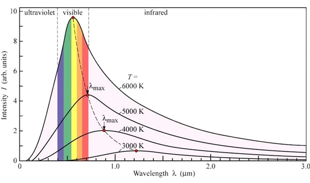
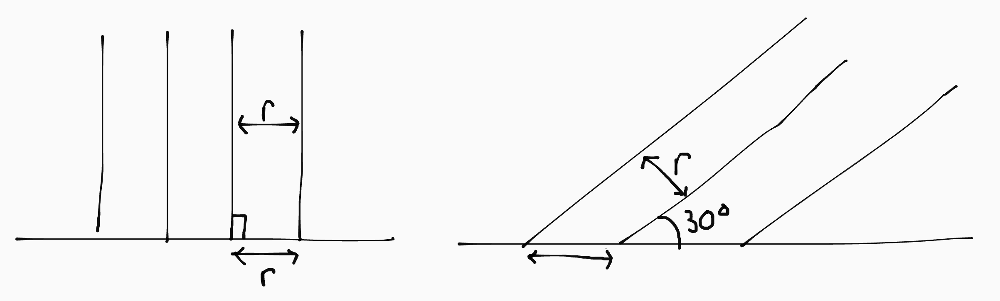
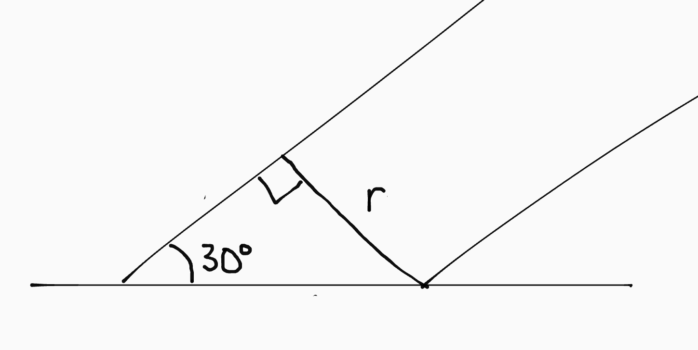
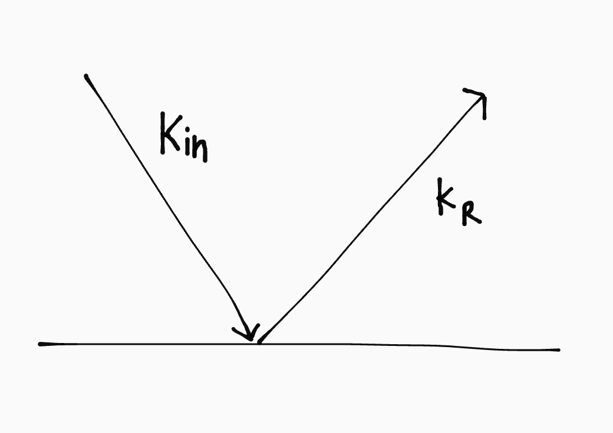
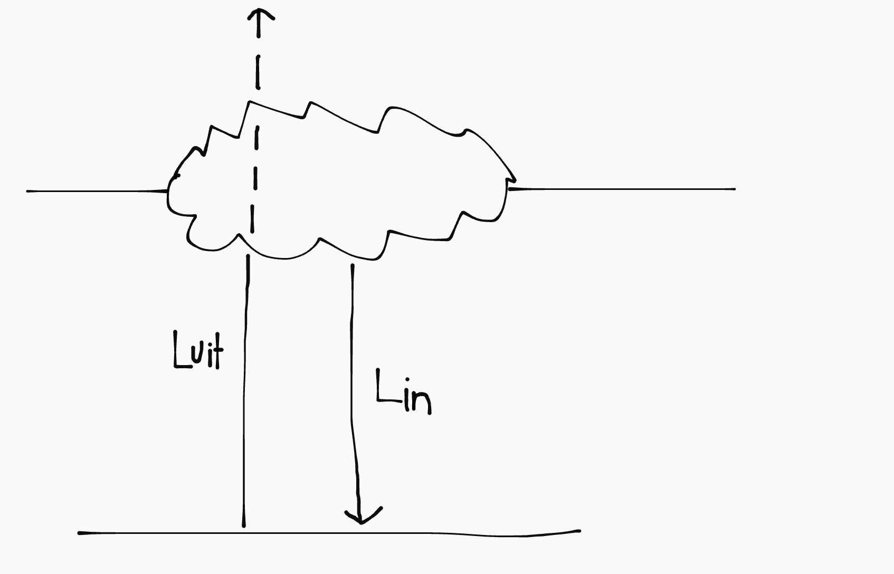
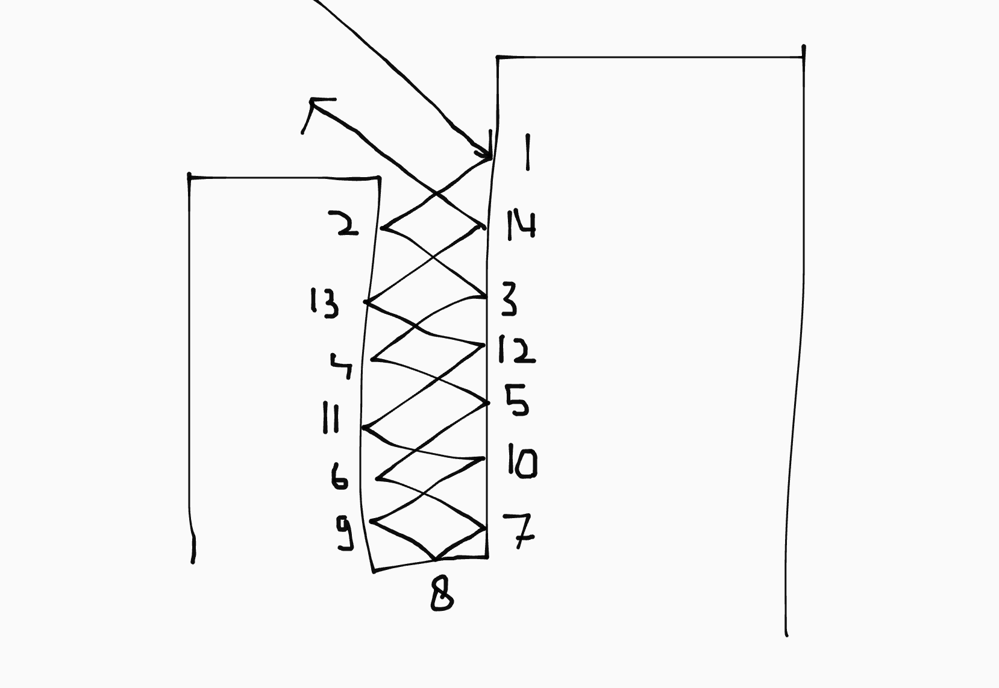

In steden is het op warme dagen een aantal graden hoger dan op het platte land. Dit noemen we het **Urban Heat Island** effect (UHI).

## Straling

De zon zend drie soorten EM-straling uit die er toe doen voor het klimaat: zichtbaar licht, IR-straling en UV-straling. Als er straling op een voorwerp valt:

- **Transmissie** (t): een deel gaat door het voorwerp heen.
- **Reflectie** (r): een deel wordt teruggekaatst.
- **Absorptie** (a): een deel wordt opgenomen.

Samen moeten de transmissie, reflectie en absorptie op 100% van de straling uitkomen (we werken in factoren):

\\[t + r + a = 1\\]

Alle voorwerpen met een temperatuur boven het absolute nulpunt zenden warmte-straling (IR) uit. Dat noemen we **emissie**. Als de absorptie even groot is als de emissie blijft het object dus dezelfde temperatuur. Dan is er een stralingsevenwicht.

### Zwarte straler

Een zwarte straler is een theoretisch object dat alle EM-straling die het ontvangt absorbeert. Daardoor stijgt de temperatuur snel, en er is dus maximale emissie. Alle sterren zijn zwarte stralers.

Het vermogen van een zwarte straler bereken je zo:

\\[P = A \sigma T^4\\]

Waarin \\(A\\) het oppervlakte van de straler is, \\(T\\) zijn temperatuur in K en \\(\sigma\\) de constante van Stefan Boltzman (zie Binas 7A).

De uitgezonden straling is verdeeld over het hele EM-spectrum, maar er is afhankelijk van \\(T\\) een piek. Waar dat maximum zich bevindt kan je bepalen aan de hand van Planckkrommen:



Het verband uit de bovenstaande figuur is vastgelegd door de **Wet van Wien**:

\\[T = k_{w} / \lambda_{max}\\]

In deze formule is \\(\lambda\_{max}\\) de golflengte van de de piek en \\(T\\) de temperatuur waarbij de piek op die golflengte ligt. De constante van Wien (\\(k_w\\)) vindt je in Binas 7A.

### Zonnestraling

De intensiteit van de zon aan de rand van de atmosfeer noemen we de **zonneconstante**. Die berekenen we aan de hand van de oppervlaktevergroting van een puntbron (waarbij \\(r\\) de afstand tussen de aarde en zon is):

\\[I = \frac{P_{zon}}{4\pi r^2}\\]

De intensiteit van de straling op het aardoppervlakte hangt af van de **zonnehoogte**/**zonnehoek** (tussen de 0&deg; en 90&deg;), die afhangt van de **breedtegraad** van de locatie (aka hoe noordelijk het is):



De intensiteit van de straling is te zien aan de onderlinge afstand tussen de stralen. <!-- Aan de rand van de atmosfeer is dit \\(r\\). --> Hoe groter de zonnehoek, hoe meer de straling wordt verspreidt over het aardoppervlak, dus hoe lager de intensiteit.



De afstand tussen de stralen op het aardoppervlak is in dit geval \\(r/\sin(30^{\circ}) = 2\\)x zo groot. Dat betekent dat de intensiteit 2x zo klein is. Daaruit volgt (waarbij \\(I_0\\) de zonneconstante is):

\\[I_{grond} = I_{0} \cdot \sin(\alpha) \implies I_{grond} = \frac{P_{zon}}{4 \pi \cdot s_{zon}^2} \sin(\alpha) \\]

### Lang- en kortgolvige straling

- **Kortgolvige straling** (\\(\lambda < 300 \text{ nm}\\)) bevat veel energie en wordt door de zon uitgezonden.
- **Langgolvige straling** (\\(\lambda > 300 \text{ nm}\\)) bevat minder energie en wordt door oa. de atmosfeer van de aarde uitgezonden.

**Directe straling** komt direct vanaf de zon op het aardoppervlak. **Diffuse straling** is eerst in de atmosfeer verstrooid en daarom minder geconcentreerd. Samen vormen ze de inkomende kortgolvige straling (\\(K\_{in} \text{ in } \text{W}/\text{m}^2\\)).

Het aardoppervlakte weerkaatst een deel van de straling weer (\\(K_r\\)). Hoeveel er gereflecteerd wordt hangt af van het **albedo** van de ondergrond. Een grondsoort met een _hoog_ albedo (zoals sneeuw) reflecteerd _veel_ straling:

\\[A = K_r / K_{in}\\]
\\[\Delta K = K_{in} - K_r = K_{in} (1 - A)\\]



De planeet als geheel heeft ook een albedo: het **planitair** albedo. Dat is hoger dan het albedo van de ondergrond alleen, omdat de wolken en atmosfeer ook veel straling reflecteren.

Kortgolvige straling komt dus van de zon. Langgolvige straling komt van:

- Warmtestraling uit het **aardoppervlak** (\\(L_{uit}\\)). Een deel van die straling wordt weer geabsorbeerd door de atmosfeer. (Op een bewolkte dag zelfs 100%)
- Doordat de **atmosfeer** opwarmt (door het absorberen van \\(L_{uit}\\)-straling), zend die ook warmtestraling terug (\\(L_{in}\\)).



\\[\Delta L = L_{in} - L_{uit}\\]

\\(\Delta L\\) is afhankelijk van: temperatuur, bewolking, luchtvochtigheid.

- **Op een bewolkte dag**: \\(\Delta L \simeq 0 \implies\\) er is een balans tussen in- en uitgaande straling.
- **Op een heldere dag**: \\(\Delta L \le 0 \implies\\) de aarde zendt meer langgolvige straling uit dan hij ontvangt (uit de atmosfeer).

In steden is (de naar beneden-gerichte component van) de langgolvige straling van hoge gebouwen en bomen ook een factor. Hoe minder van de hemel zichtbaar is, hoe meer langgolvige straling er dus is. Je kan dit zien met een fisheye-lens.

### Stralingsbalans

De stralingsbalans is het evenwicht tussen in- en uitgaande straling _aan het aardoppervlak_:

\\[\Delta Q = \Delta K + \Delta L = K_{in} - K_r + L_{in} - L_{uit}\\]

- **Overdag** is de stralingsbalans _positief_, omdat \\(K_{in}\\) dan groot is. Dat betekent dat het aardoppervlak opwarmt. 

- **Gedurende de nacht** is de stralingsbalans _negatief_. Er is dan geen kortgolvige straling (want de zon schijnt niet), en \\(\Delta L\\) is meestal negatief. Als het erg bewolkt is (\\(\Delta L \simeq 0\\)), koelt het minder snel af.

### Energiebalans

De energie van het aardoppervlak wordt gebruikt voor drie warmtestromen (in \\(\text{W}/\text{m}^2\\)):

- **Opwarming lucht** (H), dit noemen we de voelbare warmtestroom.
- **Verdamping** (L<sub>v</sub>E), dit noemen we de latente warmtestroom.
- **Opwarming bodem** (G), dit noemen we de bodem warmtestroom.

Er geldt de volgende formule:

\\[\Delta Q = H + L_v E + G\\]

<table><thead>
  <tr>
    <th>&nbsp;&nbsp;&nbsp;&nbsp;&nbsp;&nbsp;&nbsp;&nbsp;&nbsp;&nbsp;&nbsp;&nbsp;&nbsp;</th>
    <th>Overdag</th>
    <th>Gedurende de nacht</th>
  </tr></thead>
<tbody>
  <tr>
    <td>\(\Delta K\)</td>
    <td>\(\gt 0\)</td>
    <td>\(\simeq 0\)</td>
  </tr>
  <tr>
    <td>\(\Delta L\)</td>
    <td colspan="2">\(\le 0\)</td>
  </tr>
  <tr>
    <td>\(\Delta Q\)</td>
    <td>Positief</td>
    <td>Negatief</td>
  </tr>
  <tr>
    <td>H</td>
    <td>Positief (de lucht warmt op)</td>
    <td>Negatief (de lucht koelt af)</td>
  </tr>
  <tr>
    <td>L<sub>v</sub>E</td>
    <td>Positief (er is veel verdamping)</td>
    <td>\(\simeq 0\)</td>
  </tr>
  <tr>
    <td>G</td>
    <td>Positief (de bodem warmt op)</td>
    <td>Negatief (de bodem koelt af)</td>
  </tr>
</tbody>
</table>

### Bowen-verhouding

De Bowen-verhouding (\\(\beta\\)) is \\(H / L_v E\\) en hangt af van de vochtigheid van de grond. Hoe droger de grond, hoe hoger \\(\beta\\), en hoe meer energie er zal gaan naar het opwarmen van de lucht (in plaats van het verdampen van water).

Je moet maar een beetje gokken welke waarde je moet hebben want NLT is een kutvak volledig gebaseerd op emperische bullshit.

<!-- De opwarming van lucht zorgt voor een verticale luchtstroom (convectie), omdat warme lucht stijgt. Daardoor mengt de warme lucht met de koude lucht erboven, waardoor er een grenslaag ontstaat (tussen de grond en de koude lucht hoog in de atmosfeer). De hoogte van die grenslaag wordt bepaald door de grootte van \\(H\\). -->

<!--### Grondgebruik

De energiebalans is erg afhankelijk van grondgebruik, want:

- De soortelijke warmte van de grond bepaald hoe groot G is.
- De begroeiing is belangrijk omdat vegatatie zorgt voor meer verdamping.
- De vochtigheid van de grond is ook belangrijk (Bowen-verhouding).

```huh
dus LvE => meer verdamping => minder T stijging (want H lager)
                (maar ook) => hogere luchtvochtigheid => hogere gevoelstemperatuur

meer planten => meer verdamping => hogere of lagere temperatuur?
  (maar ook) => minder wind => minder verdamping??
  (maar ook) => meer schadow => lagere temperatuur
```
-->

### Urban Canyon



In een stad komt inkomende (kortgolvige) straling niet direct op de grond, maar wordt eerst tussen de zijkanten van gebouwen weerkaatst. De gebouwen absorberen een deel van de straling en reflecteren de rest. In de situatie hierboven wordt de straling 14x weerkaatst tussen de gebouwen voordat deze terug de atmosfeer in gaat.

De grond en gebouwen absorberen telkens 60% van de straling. Dat betekent dat \\(0.4^{14} \cdot 100 \% = 0.0002 \%\\) van de straling uiteindelijk wordt gereflecteerd. De Urban Canyon als geheel absorbeert dus bijna alle straling; veel meer straling dan de losse muren.

Hoe dieper de canyon, hoe meer warmte er geabsorbeerd wordt.

## Wind

Hoe dichter bij de grond, hoe meer wrijving van de grond de wind ondervindt. Daardoor waait het op grotere hoogte harder. Daarbij maakt de soort ondergrond natuurlijk ook uit; we drukken dit uit met de **ruwheidslengte** (\\(z_0\\)).

<details open>
<summary>Ruwheidslengte</summary>
Dit is een lengte omdat natuurkundigen weird zijn en geen eenheden in een logaritme willen. Het heeft verder <em>helemaal niks</em> met lengte te maken.
</details>

Voor de windsnelheid (\\(U\\)) op hoogte \\(z\\), gebruiken we het **windprofiel**:  
<small>(de tweede formule is met letters die ik logischer vind)</small>

\\[U = \frac{u_*}{k} \ln(\frac{z}{z_0}) \ \ \text{ of } \ \ v_{wind} = \frac{v_w}{k} \ln(\frac{h}{l_r})\\]

In de formule, is de Von Karman constante (\\(k\\)) \\(\simeq 0.4\\). De wrijvingssnelheid (\\(u_*\\)) hangt af van de wrijvingskracht van de wind. De formule geldt niet tussen bomen of gebouwen.

## Luchtvochtigheid

Water bevindt zich in de vorm van een waterdamp (g) in de lucht. Waterdamp is een gas en oefent dus een druk uit op de omgeving. Dit noemen we de **dampdruk** (\\(e\\)). Hoe meer water er in de lucht zit, hoe hoger de dampdruk.

Er is een limiet aan de hoeveelheid water die zich in de lucht kan bevinden. Als de maximale hoeveelheid water is verdampt, noemen we de lucht **verzadigd**. Als er meer water verdampt, condenseert het gelijk. De dampdruk bij deze maximale hoeveelheid waterdamp noemen we de **verzadigingsdampdruk** (\\(e_s\\)).

De relatieve luchtvochtigheid (\\(RV\\)) geeft aan hoeveel water er zich in de lucht bevindt, tenopzichte van de maximale hoeveelheid:

\\[RV = \frac{e}{e_s} \cdot 100 \%\\]

Bij een hogere temperatuur, wordt de verzadigingsdampdruk hoger. Er kan dan dus meer waterdamp in de lucht zitten.

<details>
<summary>Let op!</summary>
Het verband tussen \(T\) en \(e_s\) wordt volgens de module gegeven door de (foutieve) formule 16. We mogen die formule niet gebruiken, dus je moet de waarde uitlezen uit figuur 3.10.
</details>

## Gevoelstemperatuur

De gevoelstemperatuur is hoe het klimaat aanvoelt. Dit verschilt van de "echte" (lucht)temperatuur vanwege **warmtestromen**.

Onze lichaamstemperatuur is zo'n 37 graden. Als we verder opwarmen moeten we die extra warmte afvoeren, en als het koud is moeten we onszelf op temperatuur houden. De hoeveelheid warmte die we daarbij afstaan aan de omgeving bepaalt de gevoelstemperatuur.

Er zijn drie belangrijke warmtestromen:

- Warmtetransport naar de lucht rondom het lichaam
- Verdamping via zweet
- Uitstraling via langgolvige straling

Deze hangen af van:

- (Lucht)temperatuur
- Luchtvochtigheid
- Windsnelheid
- Inkomende (kortgolvige) straling

### Koudestress of wind chill

Als het koud is geeft de gevoelstemperatuur aan hoeveel energie het lichaam kwijtraakt aan de omgeving. Daarop hebben vooral de (lucht)temperatuur en windsnelheid invloed:

- Hoe kouder het is, hoe sneller het lichaam energie verliest, omdat de \\(\Delta T\\) de grootte van de warmtestroom bepaalt.
- Als het hard waait wordt de opgewarmde lucht rondom het lichaam constant weggeblazen. Daardoor is er geen isolerende luchtlaag.

Verdamping via zweet en langgolvige straling zijn beide irrelevant, omdat het lichaam volledig bedekt is met kleding.

<small>(In de module staat een formule om de gevoelstemperatuur aan de hand van de wind chill te berekenen.)</small>

### Hittestress

Als het warm is geeft de gevoelstemperatuur aan hoe makkelijk het lichaam zijn overtollige warmte kwijt kan aan de omgeving. Daarop heeft vooral de luchtvochtigheid, windsnelheid en inkomende straling invloed:

- Om warmte kwijt te raken is het lichaam afhankelijk van verdamping via zweten. Als de luchtvochtigheid hoog is, kan er minder verdamping plaatsvinden. Daardoor kan het lichaam minder warmte kwijt, en voelt het dus warmer.

- De windsnelheid kan ervoor zorgen dat de (verzadigde) lucht rondom het lichaam sneller wordt afgevoerd, waardoor er meer verdamping kan plaatsvinden. Ook kan het waterdamp van de huid wegblazen.

- In de schaduw is het minder warm, omdat het lichaam niet verder wordt opgewarmd door de zon. Daardoor hoeft het dus minder (extra) warmte af te voeren. (Dit is in de kou een minder grote factor, omdat dan de extra toegevoerde energie relatief weinig is in vergelijking met de (grote) warmtestroom naar de lucht.)

## Luchtkwaliteit