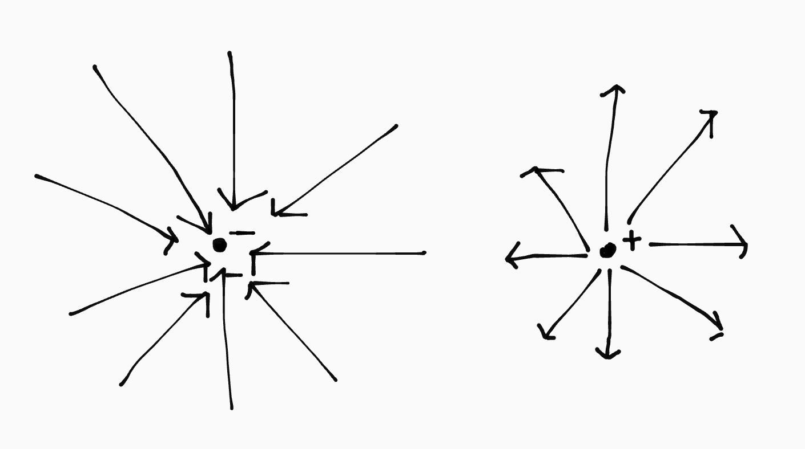
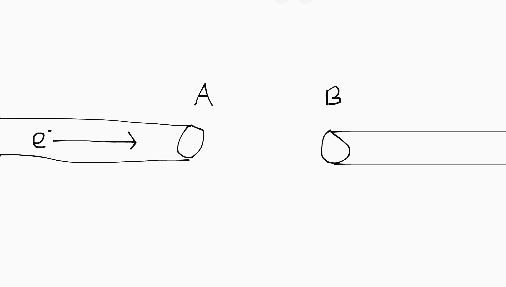

## Elektrische velden

Geladen deeltjes met tegengestelde ladingen trekken elkaar aan. Deeltjes met gelijke ladingen stoten elkaar af. Die aantrekking/afstoting kan je uitbeelden met een elektrisch veld, vergelijkbaar met hoe we dat ook doen met magnetische velden.

De veldlijnen geven aan welke kant een positief geladen deeltje zich op zou bewegen. Je kan ook onthouden dat de veldlijnen van + naar - lopen. In een elektrisch veld hoeven de veldlijnen niet gesloten te zijn. Een elektrisch veld kan dus een monopool hebben:

Als een elektrisch veld geconcentreerd is in een punt (zoals hierboven), noemen we het radiaal. Als de veldlijnen evenwijdig lopen (bijv. tussen twee platen), noemen we het homogeen.

### Influentie

Lading kan op twee manieren bewegen:

- Door contact tussen tegengestelde ladingen "stromen" ze. Bijvoorbeeld in een stroomkring. De ladingen worden dan samen elektrisch neutraal.
- Door het elektrisch veld kunnen ladingen elkaar ook op afstand beinvloeden. Dat noem je influentie.

## Elektrische kracht

Hoe dichter de veldlijnen bij elkaar lopen, hoe sterker het elektrisch veld. De veldsterkte geeft aan hoe groot de elektrische kracht op een geladen deeltje op dat punt in het veld zou zijn. We meten dat in \\(\text{N}/\text{C}\\):

\\[\vec{E} = F_{el} / q\\]

De elektrische kracht op twee deeltjes bereken je met de Coulombwet. Hij werkt eigenlijk hetzelfde als de formule van de gravitatiekracht (heeft ook dezelfde vorm): de deeltjes oefenen een gelijke en tegengestelde kracht op _elkaar_ uit.

\\[F_{el} = f \frac{qQ}{r^2}\\]

De \\(r\\) drukt de afstand tussen de _middenpunten_ van de ladingen uit (in het kwadraat omdat de kracht twee kanten op gaat). De \\(f\\) in \\(\text{N} \text{m}^2 \text{C}^{-2}\\) <small>(credits: Tuur)</small> is een constant die je kan vinden in Binas 7A.

Je kan deze formules ook combineren. Je krijgt dan een formule waarmee je gegeven een afstand \\(r\\) tot het middenpunt van een radiaal elektrisch veld, de veldsterkte in een punt kan berekenen:

\\[\vec{E} \cdot q = f \frac{qQ}{r^2}\\]
\\[\implies \vec{E} = f \frac{Q}{r^2}\\]

## Deeltjesversnellers

In een elektrisch veld kan je deeltjes versnellen. Er is namelijk een constante elektrische kracht op deeltjes in een elektrisch veld. Elektronen versnellen richting de pluspool en protonen riching de minpool. De spanning tussen de + en - polen noemen we de versnelspanning (\\(U_v\\)).

Bij het versnellen van geladen deeltjes zetten we hun elektrische energie om in kinetische energie. Elektrische energie is een vorm van potentiële energie, omdat het net als gravitatie-energie een gevolg is van de werking van een krachtveld <small>(@Tuur ja ik weet het gravitatie is geen veld maar whatever)</small>.

\\[\Delta E_{kin} = - \Delta E_{el}\\]

\\[\frac{1}{2}mv^2 = -qU_v\\]

Let op

De bovenstaande formule geldt alleen als de eindsnelheid van het deeltje niet groter dan \(\simeq 10%\) van de lichtsnelheid (\(c\)) is ivm weirde relativiteit dingen.

> Uit de formule van de elektrische energie volgt ook de eenheid elektronvolt (eV). Dan neem je de lading niet in Coulomb (C), maar in elektronladingen (\\(e = 1.602 \cdot 10^{-19} \text{ C}\\)).
> \\[E_{el} = qU_v = 1 \text{ e} \cdot 1 \text{ V} = 1 \text{ eV}\\]

De maximale waarde van \\(U_v\\) ligt rond de 1 MV. Als je een deeltje verder dan dat wil versnellen, moet je het meerdere keren achter elkaar versnellen. Dit wordt vaak gedaan door de deeltjes door buizen heen te laten bewegen. Tussen de buizen in bevindt zich dan een elektrisch veld.

Stel dat je een negatief deeltje wil versnellen:

Als het deeltje nog in de buis is, wil je het naar het einde van de buis versnellen, dus moet A positief geladen zijn, zodat A het deeltje aantrekt. Zodra het deeltje door gat A heen beweegt, moet A negatief geladen worden, zodat A het deeltje juist afstoot. Tegelijkertijd moet B positief geladen worden, zodat die het deeltje juist aantrekt.

Zodra het deeltje dan door gat B beweegt, moet B positief geladen worden, zodat het het deeltje wegduwt en niet terugtrekt (en daardoor afremt). Om dit te bereiken, wissel je dus de hele tijd de stroomrichting op A en B om met wisselspanning.

Het deeltje gaat steeds sneller, dus de tijd die het tussen in/tussen de buizen doorbrengt wordt steeds kleiner. Daarvoor zijn twee oplossingen:

- Onregelmatige wisselspanning: je past dan de frequentie van het wisselen van A en B aan op de snelheid van het deeltje.
- Geleidelijk afstanden verlengen: de buizen en elektrische velden langer maken naarmate de lengte van de versneller toeneemt.

> In een stroomdraad worden deeltjes ook versneld, door het elektrische veld van de draad zelf. Maar ze botsen ook continu tegen andere ionen, dus behouden ze een min of meer constante snelheid.

## Magnetische velden

Geladen deeltjes in een magnetisch veld worden afgebogen door de Lorentzkracht. De formule van \\(F_l\\) op een deeltje kunnen we afleiden met de formule voor \\(F_l\\) op een draad:

\\[Fl = BIl \text{ met } I = q/t\\]
\\[Fl = Bq\frac{l}{t} \implies Fl = Bqv\\]

De richting van de Lorentzkracht kan je ook bepalen aan de hand van de rechterhandregel voor stroomdraden. De stroomrichting gelijk is aan de richting van een positief deeltje, en dus tegengesteld aan de richting van een negatief deeltje.

De Lorentzkracht werkt alleen op _bewegende_ deeltjes en staat loodrecht op de snelheid van het deeltje. Daardoor maakt het deeltje een eenparige cirkelbeweging, waarbij geldt:

\\[F_l = F_{mpz}\\]
\\[Bqv = \frac{mv^2}{r} \implies Bqr = mv\\]

De \\(r\\) van de cirkelbeweging noemen we de Larmorstraal.

### Verschillen tussen magnetische (B) en elektrische (E) velden:

- Een elektrisch veld kan een monopool hebben, een magnetisch veld niet.
- \\(F_l\\) werkt alleen op _bewegende_ lading, \\(F_{el}\\) werkt op _alle_ lading.
- \\(F_{el}\\) werkt in de richting van de snelheid, \\(F_l\\) loodrecht daarop. Daardoor kan een elektrisch veld deeltjes versnellen, maar een magnetisch veld alleen deeltjes afbuigen.

## Toepassingen

### Elektroscoop

In een elektroscoop heb je twee metalen plaatjes tegen elkaar hangen, verbonden zijn met een metalen bol. Door een negatief geladen voorwerp bij de bol te houden, stoot je de vrije elektronen uit de bol af. Beinvloeden op afstand noemen we influentie.

Door de inluentie bewegen de vrije elektronen naar beneden. Daardoor worden beide plaatjes negatief geladen en zullen ze dus elkaar afstoten (aka uit elkaar bewegen). Aan de hand van de uitwijking van de plaatjes kan je de lading die je bij de bol houdt bepalen.

### Röntgenbuis

In een röntgenbuis worden elektronen versneld en tegen een (tref)plaatje aan gesmasht, waardoor röntgenstraling ontstaat.

De elektronen komen vrij door het verhitten van de minpool, en worden versneld richting de pluspool. Hoe harder ze botsen met het trefplaatje, hoe groter de fotonenergie van de röntgen.

Je hebt "harde" en "zachte" röntgen. De "hardheid" van röntgenstraling is evenredig met de fotonenergie, en dus ook evenredig met de versnelspanning.

| **Hardheid**              | zacht | hard  |
| **Versnelspanning**       | 10 kV | 1 MV  |
| **Fotonenergie**          | klein | groot |
| **Doordringend vermogen** | klein | groot |

### Lineare versneller

In een lineare versneller wordt een proton versneld in een aantal cilindervormige buizen met daartussen elektrische velden. De velden zijn aangesloten op een wisselspanningsbron, en de afstand/lengte van de buizen wordt evenredig groter met de snelheid van het proton.

**Nadeel**: als je een hoge snelheid wil bereiken moet de versneller ook heel lang worden.

> Er zijn ook lineare versnellers die in cirkels staan. Dan "drift" het proton door de buizen heen. Daarbij kan de hoek tussen de buizen natuurlijk niet te groot zijn (credits: Tuur).

### Cyclotron

Een cyclotron bestaat uit twee halve cirkels (vacuum) met daarin een spiraalvormige baan voor de deeltjes. Tussen de halve cirkels bevindt zich een elektrisch veld om de deeltjes te versnellen. Door het cyclotron heen gaat een homogeen magnetisch veld dat ervoor zorgt dat de deeltjes in een cirkelbaan blijven.

De deeltjes beginnen in het midden en behalen hun maximale snelheid aan de rand van het cyclotron. Tijdens het versnellen krijgen ze een steeds grotere baanstraal (de baanstraal is de Larmorstraal in dit geval), want:

\\[r = \frac{mv}{Bq}\\]

\\(B\\), \\(q\\) en \\(m\\) zijn constant. Het deeltje versnelt, dus \\(v\\) neemt toe. Hieruit volgt dat \\(r\\) ook toeneemt. Doordat de straal toeneemt kan er een wisselspanning met vaste frequentie gebruikt worden (omdat de afstand die het deeltje in de halve cirkels maakt steeds groter wordt).

Met cyclotrons kunnen bijvoorbeeld radioactieve stoffen voor tracers geprodceerd worden in ziekenhuizen.

### Massaspectrometer

Met een massaspectrometer kan je de samenstelling van een gas bepalen. Hij werkt zo:

1. De deeltjes uit het gas worden geioniseerd, met allemaal dezelfde lading.
2. De deeltjes worden dan versneld door een elektrisch veld.
3. De deeltjes worden afgebogen door een magnetisch veld (in een halve cirkel).
4. De deeltjes botsen op een detector.

Hoe sterk de deeltjes worden afgebogen (dus de grootte van de Larmorstraal) hangt af van de massa van het deeltje, want:

\\[r = \frac{mv}{Bq}\\]

\\(B\\) en \\(q\\) constant. \\(v\\) is ook constant, want er zijn geen weerstandskrachten (want vacuum). De Larmorstraal is dus evenredig met de massa van het deeltje: zwaardere deeltjes worden sterker afgebogen.

Door de afstand tussen het deeltjeskanon en de botsing op de detector te meten, kan je bepalen wat de massa van het deeltje was. Daarmee kan je vervolgens de samenstelling van het gasmengsel bepalen.

### Noorderlicht

Het noorderlicht ontstaat door het afbuigen van \\(\alpha\\)- en \\(\beta\\)-straling naar de noordpool door het aardmagnetisch veld.
