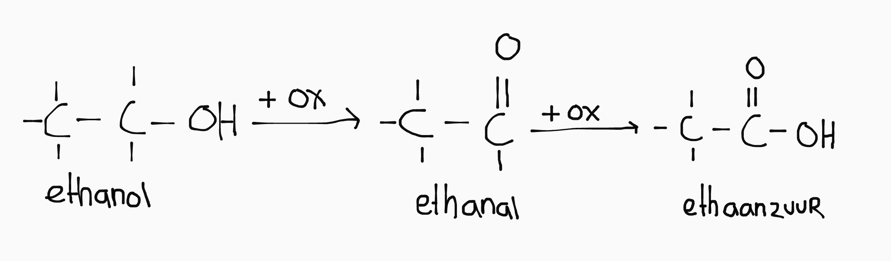
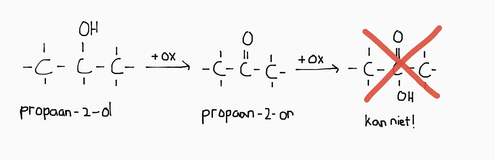
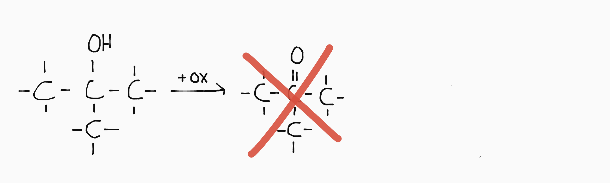

## Sterke vs zwakke zuren

- Een **sterk zuur** ioniseert volledig. Alle zuren boven \\(\ce{H3O+}\\) in B48 zijn sterk.  
  De notatie van sterke zuren is \\(\ce{H3O+ + Cl-}\\)

- Een **zwak zuur** (of geconcentreerd zuur) ioniseert juist niet.  
  De notatie van zwakke zuren is \\(\ce{HF_{(aq)}}\\)

  <small>(eigenlijk is er een evenwicht, zoals dit: \\(\ce{HF_{(aq)} + H2O_{(l)} <=> H3O+ + F-}\\))</small>

Basen zijn altijd zouten, en een zout lost op (en ioniseert volledig) of niet. Er is daar geen onderscheid tussen sterke en zwakke basen.

<!--De zuur en base die tegenover elkaar staan op één regel in B48 zijn **geconjungeerd**.-->

## pH berekenen

(Bij een molariteit van \(\ce{0.100 M}\))

### Sterk zuur (<small>\\(\ce{H3O+ + Br-}\\)</small>)

1. \\(\ce{pH = -\log{\ce{[H3O+]}} = -\log{0.100} = 1.000}\\)
2. Er is geen stap twee

Let op!

Het aantal sc. van de molariteit is het aantal decimalen van de pH. (De pH heeft dan dus altijd minstens 1 sc. meer)

### Zwak zuur (<small>\\(\ce{HF_{(aq)}}\\)</small>)

1. Stel de reactievergelijking op: \\(\ce{HF_{(aq)} + H2O_{(l)} <=> H3O+ + F-}\\)
2. Stel de evenwichtsvoorwaarde op: \\(K_z = \frac{\ce{[H3O+][F-]}}{\ce{[HF]}}\\)
3. Stel er wordt \\(x \text{ mol } \ce{HF}\\) omgezet: los op voor \\(K_z = \frac{x^2}{0.100 - x}\\)
4. \\(\ce{pH = -\log{\ce{[H3O+]}} = -\log{x}}\\)

### Zwakke base (<small>\\(\ce{SO3^{2-}}\\)</small>)

1. Stel de reactievergelijking op: \\(\ce{SO3^{2-} + H2O_{(l)} <=> OH- + HSO3+}\\)
2. Stel de evenwichtsvoorwarde op: \\(K_B = \frac{\ce{[OH-][HSO3+]}}{\ce{[SO3^{2-}]}}\\)
3. Stel er wordt \\(x \text{ mol } \ce{H3O+}\\) omgezet: los op voor \\(K_B = \frac{x^2}{0.100 - x}\\)
4. \\(\ce{pOH = -\log{\ce{[OH-]}} = -\log{x}}\\)
5. Reken om naar pH: \\(\ce{pH = 14 - pOH}\\)

## Oxidatie van alcoholen

<!--
De oxidatie van een alcohol werkt dus zo:

- -OH vervangen door =O (aka aldehyde)
- -OH erbij aan de C waaraan de O gebonden is (aka zuur)
-->

### Primair alcohol

Een primair alcohol heeft de OH-groep aan het uiteinde van de koolstofketen.

Een primair alcohol verandert altijd in een aldehyde en daarna in een zuur als het volledig oxideert. Dat is de reden dat een wijnfles op moet nadat hij geopend is; de alcohol veranderd anders in azijnzuur (door de zuurstof in de fles).

### Secondair alcohol

Een secondair alcohol heeft de OH-groep ergens in het midden van de koolstofketen.

Zoals je ziet kan er geen zuur vormen omdat daarmee de covalentie-4 van het middelste koolstofatoom zou worden overschreden. Daarom is een volledige oxidatie van een secondair alcohol een keton.

### Tertiar alcohol

Een tertiair alcohol heeft de OH-groep aan de tegengestelde kant van een methylgroep. Bij een tertiar alcohol kan helemaal geen oxidatie plaatsvinden.

## Batterij <small>(aka Danielcel)</small>

Een batterij is een redox-reactie op afstand, en zet op die manier chemische energie om in elektrische energie. Een Danielcel bestaat uit:

- Twee zoutoplossingen
- Twee elektroden
- Een zoutbrug

De sterkste oxidator reageert met de sterkte reductor, zolang \\(V_{ox} > V_{red}\\). Alle elektrodes kunnen meereageren, behalve koolstof (\\(\ce{C}\\)) en platina (\\(\ce{Pt}\\)).

De reductor is de minpool (anode) van de batterij, omdat daar de elektronen vandaan komen (elektronen lopen van - &rarr; +). De oxidator is dan dus de pluspool (kathode).

> De zoutbrug zorgt ervoor dat er ionen uit de zoutoplossingen mee kunnen bewegen met de elektronen, zodat de lading aan beide kanten van de batterij gelijk blijft.

Bij het opladen van de batterij vindt dezelfde reactie plaats, maar dan precies andersom (dus de kathode en anode zijn dan omgedraaid).

### Andere soorten batterijen

In andere soorten batterijen wordt vaak een electroliet gebruikt. Dat heeft drie functies:

- De elektrodes van elkaar scheiden (isolatie).
- Fungeert als zoutbrug.
- Kan meereageren in de redox-reactie.

## Tips

- "Vochtig" betekent dat er \\(\ce{H2O}\\) aanwezig is.
- "Opgeloste \\(\ce{CO2}\\)" betekent dat het om \\(\ce{H2O_{(l)} + CO2_{(aq)} -> H2CO3_{(aq)}}\\) gaat.
