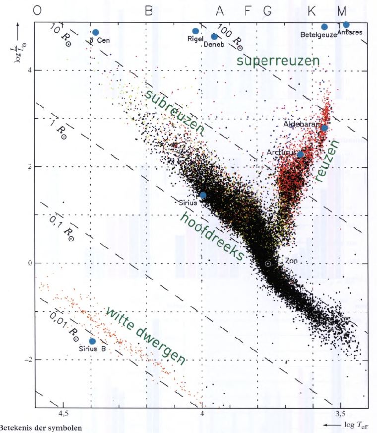
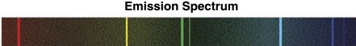

## Stralings- & planckkrommen

De fotosfeer (buitenste laag van de zon) zendt EM-straling uit. Niet van alle golflengtes wordt evenveel straling uitgezonden. In een **stralingskromme** kan je voor elke golflengte (\\(\lambda\\)) de stralingsintensiteit (I) zien:

<!-- De bovenste grafiek is de uitgezonden stralingsintensiteit (gemeten buiten de atmosfeer van de aarde), de onderste de gemeten stralingsintensiteit op het aardoppervlak. -->

De oppervlakte onder de grafiek is de totale stralingsintensiteit.

De **oppervlaktetemperatuur** van een ster kan je vinden aan de hand van de kleur van de ster. De kleur wordt bepaald door het stralingsmaximum (de piek in de stralingskromme). Hoe warmer de ster, hoe meer blauw licht hij uitzendt, hoe verder de piek naar links ligt.

De exacte temperatuur bepaal je door een planckkromme te vinden die past bij je stralingskromme. Een **planckkromme** is de stralingskromme die een ster met een bepaalde oppervlaktetemperatuur theoretisch gezien zou moeten hebben.

> Dus: stel dat de piek van de experimenteel bepaalde stralingskromme ligt op ~500 nm, zoek je een planckkromme in Binas 22A met een piek op ook ~500nm, en lees je de temperatuur af (in dit geval ~5700K).

Soms noemen we de oppervlaktetemperatuur de **effectieve temperatuur**.

Voor de planckkrommen geldt de wet van Wien: 
<small>(Hoe warmer, hoe lager de \\(\\lambda\_{max}\\), hoe blauwer, hoe verder de piek naar links.)</small>

\\[\lambda_{max} = \frac{k_W}{T_{eff}}\\]

<small>\(k_W\) staat in Binas 7A</small>

## Vermogen & intensiteit

Het **stralingsvermogen** (P) van een ster is de stralingsenergie die hij per seconde uitzendt. Dit hangt af van de oppervlakte en temperatuur van de ster:

\\[P = \sigma \cdot A \cdot T_{eff}^4\\]

<small>\(\sigma\) staat in Binas 7A</small>

De **stralingsintensiteit** (I) is de ontvangen stralingsenergie die wij per vierkante meter kunnen waarnemen op het aardoppervlak. Deze neemt kwadratisch af met de afstand tot de ster (r):

\\[I = \frac{P}{4 \pi r^2}\\]

## HRD

In een HRD-diagram (Binas 33A) wordt de lichtkracht (L) van een ster uitgezet tegen zijn effectieve temperatuur. De lichtkracht is het vermogen van de ster tov dat van de zon:

\\[L = \frac{I}{I_{\text{zon}}}\\]

In het HDR liggen de sterren op drie diagonale assen ('reeksen'), die straal tov van de straal van de zon (R) aangeven.

- **Hoofdreeks** (1R): stabiele sterren zoals de zon
- **Rode reuzen** (10-100R): gigantisch en relatief koud
- **Witte dwergen** (0.01R): grote dichtheid en heel heet (supernova's, zwarte gaten etc.)

Als je de oppervlaktetemperatuur van een ster weet, en in welke reeks hij ligt (je mag uitgaan van de hoofdreeks als dit niet gespecificeerd wordt), kan je bepalen wat het stralingsvermogen van de ster is:

\\[P = P_{\text{zon}} \cdot 10^n\\]

<small>waarbij \(n\) de afgelezen waarde is op \(\log(T_{eff})\)</small>

Als je de stralingsintensiteit op aarde (I) weet, kan je ook de afstand tot de ster (r) bepalen:

\\[r = \sqrt{\frac{4\pi \cdot I}{P}}\\]

## Spectraalanalyse

Een spectrum (zoals de stralingskromme aan het begin) laat zien welke golflengtes er in straling voorkomen. Je hebt drie soorten:

- **Continuspectrum**: alle golflengtes komen voor.
- **Absorptiespectrum**: er missen banden van golflengtes.
- **Emissiespectrum**: er zijn alleen banden van golflengtes (de rest ontbreekt).

 

Een gloeidraad of ster zend normaliter een continuspectrum uit, waarin alle kleuren (golflengtes) voorkomen.

 

Een emissiespectrum wordt veroorzaakt door hete gassen. Daarin worden alleen specifieke golflengtes uitgezonden. De golflengtes die worden uitgezonden hangen af van de samenstelling van het gasmengsel.

 

Een absorptiespectrum wordt veroorzaakt door koude gassen. Als daar straling door heen gaat, wordt een deel geabsorbeerd (de golflengtes die het gas normaal zou uitzenden als het heet zou zijn). Daardoor hou je een spectrum over waarin alle golflengtes voorkomen, behalve een aantal.

## Atoommodel van Bohr

Volgens het atoommodel van Bohr (dat we ook van scheikunde kennen) is de elektronenwolk in rond een atoomkern opgedeeld in (KLM-)schillen.

De binnenste schil noemen we de grondtoestand. Dat is het niveau waar de elektronen het liefst willen zijn (zo dicht mogelijk bij de kern, want + en - lading trekken elkaar aan). Als de binnenste schil vol is, wordt die daarboven gevuld, en die daarboven enzovoort.

### Absorptie

Een elektron kan naar een hoger energieniveau (KLM-schil) 'springen' door het absorberen van een foton. Dit kan alleen als de fotonenergie (\\(E_f\\)) exact gelijk is aan het verschil tussen de energieniveaus:

\\[E_f = \Delta E_{\text{niveaus}}\\]

Dit verklaart de absorptielijnen in het spectrum. De atomen in het gasmengsel absorberen alleen de fotonen waarvan de fotonenergie precies genoeg is om een elektron naar een ander energieniveau te tillen. De fotonenergie is afhankelijk van de golflengte:

\\[E_f = hf = h \frac{\lambda}{c}\\]

Dus deze golflengtes worden geabsorbeerd en 'missen' dan in het spectrum.

### Emissie

Elektronen kunnen ook naar een hogere schil springen bij een botsing met een ander deeltje. Het deeltje wil liever in een lagere schil zitten en zal dus na verloop van tijd terugvallen.

Hierbij zend het een foton uit, waarbij weer geldt \\(E_f = \Delta E_{\text{niveaus}}\\). Dit veroorzaakt de emissielijnen in het emissiespectrum.

### Ionisatie

Als een elektron te ver van de kern afkomt, ondervindt het geen aantrekkingskracht meer, en komt het los van het atoom. Daardoor wordt het atoom positief geladen. We noemen dit ionisatie. De minimaal benodigde energie voor ionisatie heet de ionisatiegrens.
