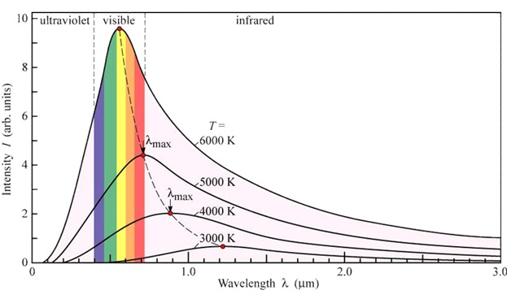

## Stralings- & planckkrommen

De fotosfeer (buitenste laag van de zon) zendt EM-straling uit. Niet van alle golflengtes wordt evenveel straling uitgezonden. In een **stralingskromme** kan je voor elke golflengte (\\(\lambda\\)) de stralingsintensiteit (I) zien:

<!-- De bovenste grafiek is de uitgezonden stralingsintensiteit (gemeten buiten de atmosfeer van de aarde), de onderste de gemeten stralingsintensiteit op het aardoppervlak. -->

De oppervlakte onder de grafiek is de totale stralingsintensiteit.

De **oppervlaktetemperatuur** van een ster kan je vinden aan de hand van de kleur van de ster. De kleur wordt bepaald door het stralingsmaximum (de piek in de stralingskromme). Hoe warmer de ster, hoe meer blauw licht hij uitzendt, hoe verder de piek naar links ligt.

De exacte temperatuur bepaal je door een planckkromme te vinden die past bij je stralingskromme. Een **planckkromme** is de stralingskromme die een ster met een bepaalde oppervlaktetemperatuur theoretisch gezien zou moeten hebben.

> Dus: stel dat de piek van de experimenteel bepaalde stralingskromme ligt op ~500 nm, zoek je een planckkromme in Binas 22A met een piek op ook ~500nm, en lees je de temperatuur af (in dit geval ~5700K).

Soms noemen we de oppervlaktetemperatuur de **effectieve temperatuur**.

Voor de planckkrommen geldt de wet van Wien: 
<small>(Hoe warmer, hoe lager de \\(\\lambda\_{max}\\), hoe blauwer, hoe verder de piek naar links.)</small>

\\[\lambda_{max} = \frac{k_W}{T_{eff}}\\]

<small>\(k_W\) staat in Binas 7A</small>

## Vermogen & intensiteit

Het **stralingsvermogen** (P) van een ster is de stralingsenergie die hij per seconde uitzendt. Dit hangt af van de oppervlakte en temperatuur van de ster:

\\[P = \sigma \cdot A \cdot T^4\\]

<small>\(\sigma\) staat in Binas 7A</small>

De **stralingsintensiteit** (I) is de ontvangen stralingsenergie die wij per vierkante meter kunnen waarnemen op het aardoppervlak. Deze neemt kwadratisch af met de afstand tot de ster (r):

\\[I = \frac{P}{4 \pi r^2}\\]
