## Koolhydraten

Koolhydraten (aka suikers of sachriden) heten zo omdat men vroeger dacht dat het lange, gehydrateerde (omringd door \\(\ce{OH}\\)-groepen) koolstofketens waren:

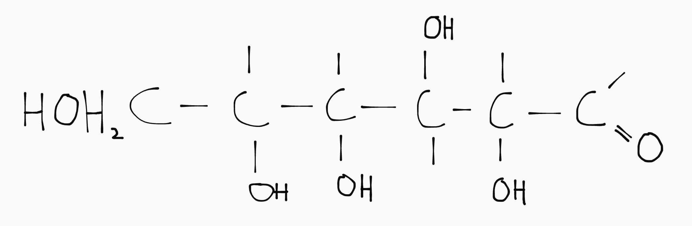

Eigenlijk zijn koolhydraten ringverbindingen, zoals je hieronder ziet:

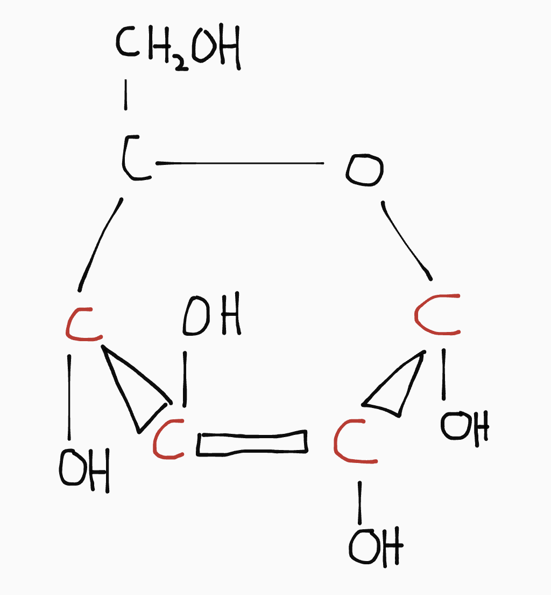

Je kan ze vinden in Binas 67F. De sachriden die je daar vindt zijn stereoisomeren: zelfde molecuulformule, andere ruimtelijke bouw.

In het bovenstaande plaatje bepaalt de richting van de \\(\ce{OH}\\)-groepen aan de roodgekleurde C's wat voor soort koolhydraat het wordt.

  
Let op!

  Er staat twee keer D-glucose in Binas 67F, een \(\alpha\) en een \(\beta\) variant. 
  <strong>Het zijn verschillende koolhydraten, die toevallig dezelfde naam hebben.</strong>

### Disachrides

Door de **condensatie** van twee monosachriden, kan je een disachride krijgen. Hiervoor zijn enzymen als katalysator nodig.

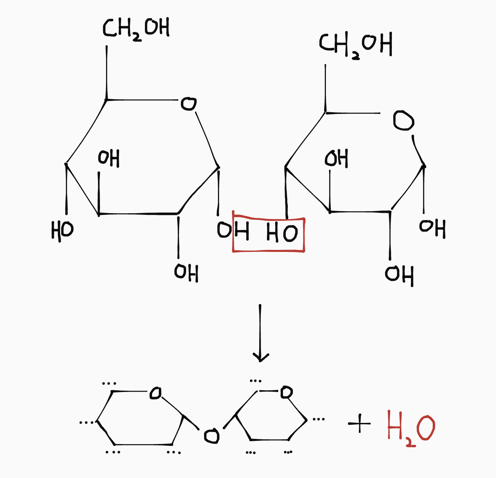

<small>Condensatie van twee D-glucose (\(\alpha\)-variant) koolhydraten</small>.

De reactie vindt meestal plaats tussen C1 en C4, geteld met de klok mee vanaf de ether (\\(\ce{O}\\) in de koolstofketen). De monosachriden mogen verschillende soorten koolhydraten zijn.

De omgekeerde reactie noem je **hydrolyse** (omdat er water gebruikt wordt). Voor de afbraak van polysachrides zijn enzymen als katalysator nodig. Als je zo'n enzym niet hebt, kan je de koolhydraat niet afbreken, zoals bijvoorbeeld bij lactose-intolerantie.

Enzymen werken het best (als katalysator) bij een bepaalde temperatuur en bepaalde pH. Dit verschilt per enzym en stof die moet worden afgebroken of gevormd.

### Polysachrides

Je kan ketens van meer dan twee suikers maken. Dit noem je polysachrides, en ze zijn in zekere zin vergelijkbaar met polymeren. Bij het maken van een keten van \\(n\\) monosachriden, komen \\((n - 1)\\) watermoleculen vrij.

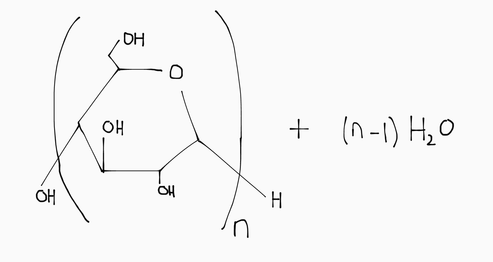

De bekenste polysachride is zetmeel. In planten wordt verder cellulose gemaakt, en in dieren glycogeen.

## Vetten & Oliën

Vetten en oliën (aka glycerides) worden gevormd uit glycerol (propaan-1,2,3-triol) en drie vetzuren. Een vetzuur is een lange koolstofketen met een zuurgroep op het uiteinde. Zie Binas 67G.

Er zijn 3 soorten, gebaseerd op het aantal dubbele bindingen in de koolstofketen:

| Naam                    | Aantal dubbele bindingen |
| ----------------------- | ------------------------ |
| Verzadigd               | 0                        |
| Enkelvoudig onverzadigd | 1                        |
| Meervoudig onverzadigd  | 2+                       |

<small>
  Geen dubbele bindingen \\(\implies\\) alle C's hebben H's \\(\implies\\) de keten is *verzadigd* met waterstoffen.
</small>

### Vetvorming

De glycerol en vetzuren vormen via een estervorming (\\(\ce{\text{alcohol} + \text{zuur} -> \text{ester} + \text{water}}\\)) een triglyceride. De omgekeerde reactie heet (net als bij suikers) **hydrolyse**.

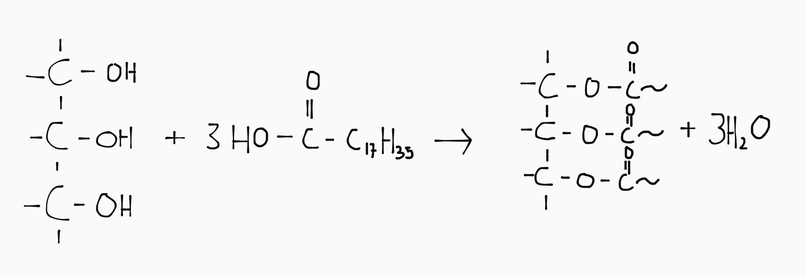

Een triglyceride kan een vet of olie zijn:

- **Vet**: vast bij kamertemperatuur
- **Olie**: vloeibaar bij kamertemperatuur

Dit heeft te maken met het aantal dubbele bindingen in de staarten. Het is een vet als alle drie de vetzuren verzadigd zijn. Als één of meer vetzuren onverzadigd is (aka dubbele bindingen heeft), is het een olie.

Deze grens tussen vetten en oliën is puur theoretisch. In de praktijk heb je een grijze zone waarin je een soort puddingprut hebt die geen vaste stof (vet) is, maar ook niet echt een vloeistof (olie).

### Berekenen hoeveel dubbele bindingen een vetzuur heeft

De staart van een vetzuur (dus zonder de zuurgroep vooraan) volgt de (verzadigdheid)formule \\(\ce{C*nH*{2n + 1}}\\).

Per dubbele binding in het vetzuur verdwijnen er twee H' s. Dus stel \\(\ce{C*{35}H*{65}}\\). Dit vetzuur heeft drie dubbele bindingen, omdat er \\((2 \cdot 35 + 1) - 65 = 6\\) H's missen.

### Vetharding

Je kan een olie in een vet veranderen door de dubbele C=C bindingen weg te halen met een additiereactie. Je voegt per dubbele binding \\(1 \cdot \ce{H2}\\) toe.

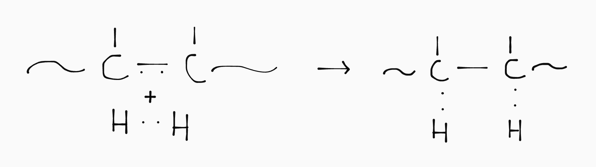

### Verzeping

Voor het maken van de zeep natriumstearaat (\\(\ce{Na+C17H35COO-}\\)) neem je glyceryltristaraat en voeg je natronloog toe:

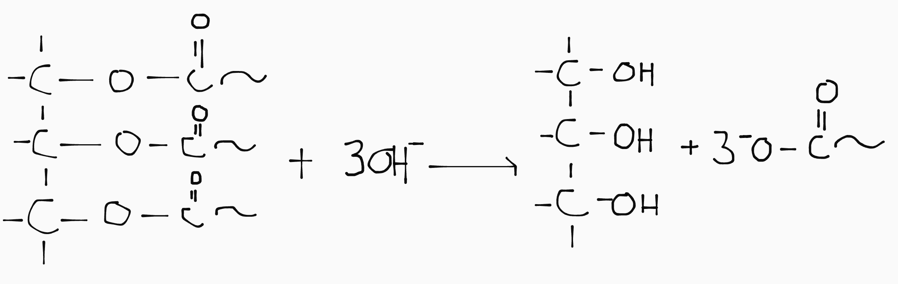

### Omesteren

Een triglyceride is een te groot molecuul om makkelijk te kunnen verbranden. Omesteren is een reactie waarbij je de vetzuren veresterd met \\(\ce{CH3}\\), in plaats van glycerol. Daardoor kan je een vet/olie (zoals gebruikt frituurvet) dus omzetten in biodiesel.

Voor omesteren heb je eerst \\(3 \cdot \ce{CH3O-}\\) nodig:

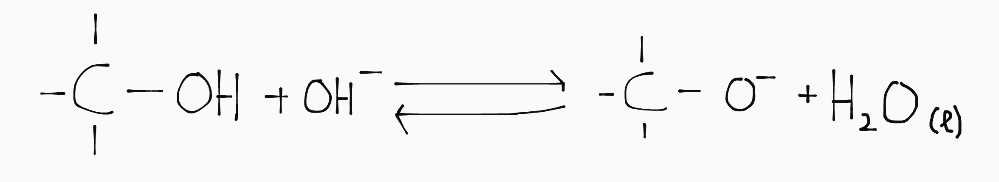

Je bewaart de onstane \\(\ce{H2O}\\), omdat je die aan het eind van de reactie nog nodig hebt. Met de onstane \\(\ce{CH3O-}\\) doe je een zuur-base reactie met de triglyceride:

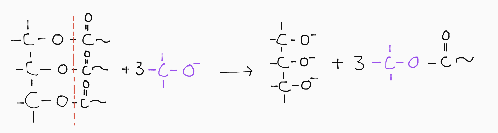

Hierbij worden dus de staarten losgemaakt van de glycerol. De afgesplitste staarten zijn _geen_ vetzuren, want ze eindigen niet op een zuurgroep.

Door nu nog de drie eerder opgevangen watermoleculen te laten reageren met het restmolecuul krijg je weer een glycerol terug:

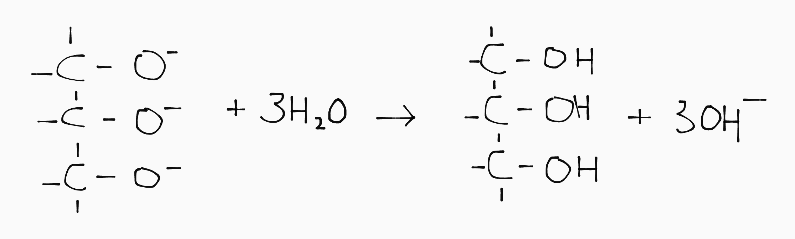

Hierbij krijg je ook weer \\(3 \cdot \ce{OH-}\\), wat betekent dat \\(\ce{OH-}\\) dus als katalysator werkt: hij wordt wel gebruikt, maar niet verbruikt.

### Fosfolipiden

Fosfolipiden worden door je lichaam gemaakt voor celwanden. Een fosfolipide is een soort triglyceride waarbij één vetzuur is vervangen door een fosfaatgroep.

De fosfaatgroep is polair en is daarom hydrofiel. De twee (overgebleven) vetzuren vormen lange apolaire staarten, en zijn dus hydrofoob. Daardoor vormen ze automatisch een soort dubbele laag (met koppen bij elkaar en staarten bij elkaar).

Er moeten stoffen door de celwand kunnen. Als de vetzuren aan de fosfolipiden volledig verzadigd zijn liggen ze te dicht tegen elkaar en gaat dit moeilijk. Bij onverzadigde vetzuren is er een net grotere hoek tussen de (dubbele) C=C bindingen, waardoor er meer ruimte is en de stofuitwisseling dus beter verloopt. Daarom zijn onverzadigde vetzuren beter voor je.

### Emulgators

Een triglyceride lost slecht op in water omdat het een apolaire stof is (door de lange koolstofstaarten van de vetzuren). Polair lost op met polair en apolair met apolair.

Om een polaire stof in water op te lossen heb je daarom een emulgator nodig. Dat is een stof die zowel een polair als apolair gedeelte heeft en daarom goed oplost met zowel water als apolaire stoffen.

Het polaire deel herken je aan een FONClBrI-atoom of NH- of OH-groep. Het apolaire deel is meestal een lange koolstofstaart. Een voorbeeld is de fosfolipide (de fosfaatgroep is polair en de vetzuren zijn apolair) of \\(\ce{C17H35COOH}\\) (stearaat), waarbij \\(\ce{COO-}\\) de polaire groep is.

## Eiwitten

Eiwitten bestaan uit aminozuren. Een aminozuur heeft altijd een bepaalde basisstructuur met een restgroep. De restgroep bepaalt welk aminozuur het is. Je kan aminozuren vinden in Binas 67H.

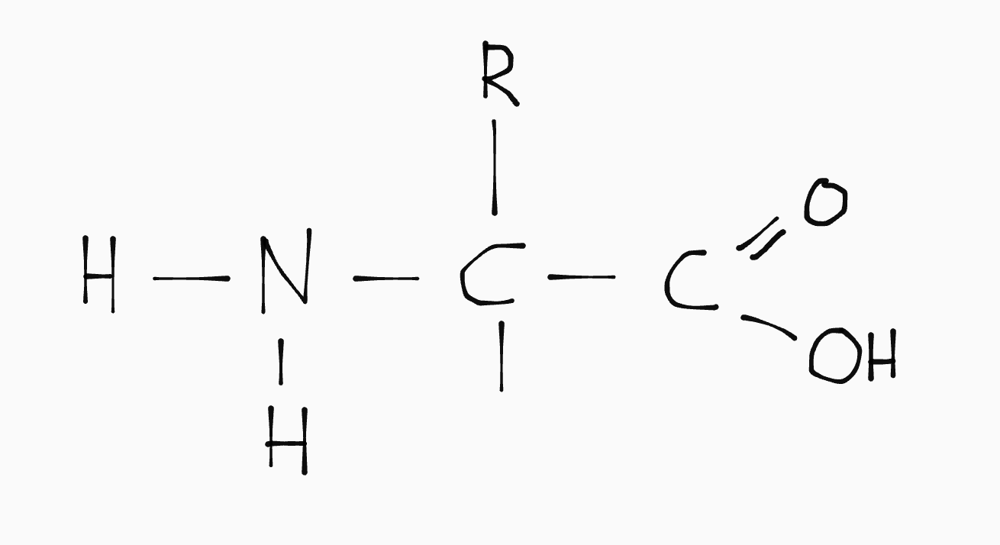

### Iso-elektrisch punt (IEP)

Het iso-elektrisch punt is de pH-waarde waarbij het aminozuur ongeladen is. Bij een hogere pH is het aminozuur negatief geladen, en bij een lagere pH positief.

| pH = IEP           | pH > IEP                  | pH < IEP                  |
| ------------------ | ------------------------- | ------------------------- |
|  | 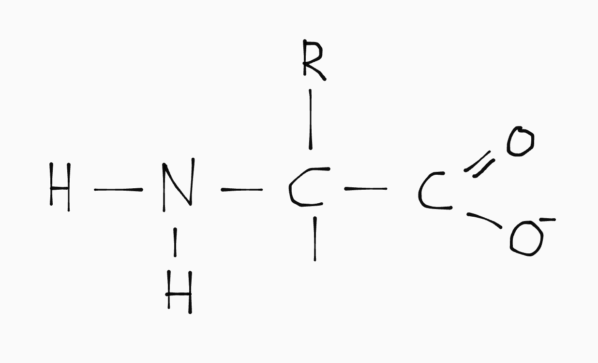 | 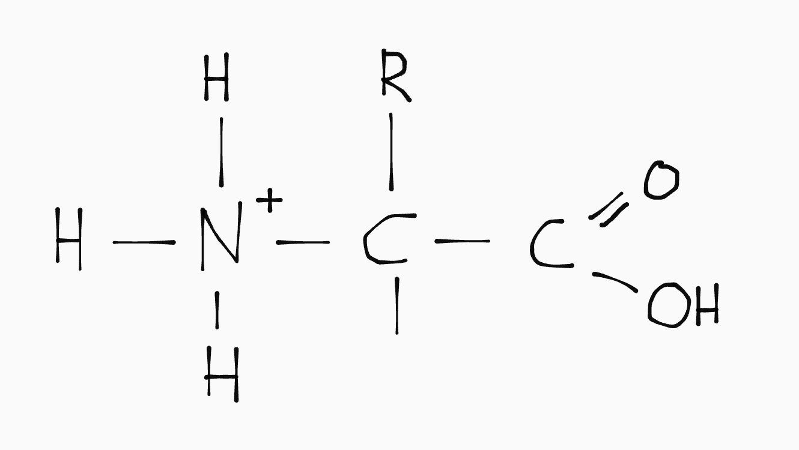 |

### Di-, tri & polypeptides

Je kan aminozuren aan elkaar koppelen om eiwitten (aka polypeptides) te creeëren. Dit gaat door middel van peptidevorming (\\(\ce{\text{amine} + \text{zuur} -> \text{peptide} + \text{water}}\\)). Deze reactie noemen we **condensatie polymerisatie**.

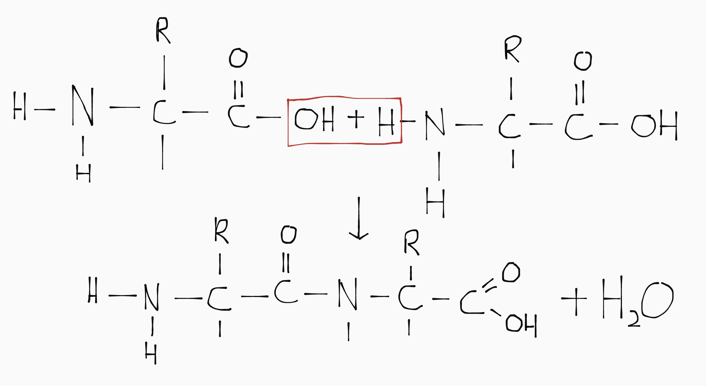

De omgekeerde reactie heet (net als bij suikers _en_ vetten) **hydrolyse**. Aminozuren worden nergens opgeslagen, maar afgenbroken in de lever. Hierbij ontstaat ureum, zie Binas 67J voor de structuurformule.

### Aantal mogelijke eiwitten

#### Met verschillende aminozuren

Als je 2 verschillende aminozuren als bouwstenen hebt, kan je in totaal 8 verschillende eiwitten met een ketenlengte van 3 maken. Je kan dit berekenen:

\\[\text{aantal mogelijke eiwitten} = \text{aantal bouwstenen}^{\text{ketenlengte van eiwit}}\\]

#### Met ruimtelijke bouw

Als je een aminozuur met een stereocentrum hebt en rekening moet houden met ruimtelijke bouw, telt dat aminozuur als meerdere mogelijke bouwstenen in de bovenstaande formule:

\\[\text{aantal bouwstenen (per aminozuur)} = 2^\text{aantal stereocentra}\\]

#### Alle aminozuren 1x

Als alle verschillende aminozuren exact 1x moeten voorkomen in het eiwit, en stereochemie geen rol speelt, geldt:

\\[\text{aantal mogelijke eiwitten} = \text{aantal aminozuren}!\\]

  <small>De \(!\) is een wiskundig symbol genaamd <df>faculteit</df>: \(5! = 5 \cdot 4 \cdot 3 \cdot 2 \cdot 1\)</small>

### Eiwitten 'opvouwen'

- **Primaire structuur**: dit is de normale hoofdketen van aminozuren met peptidebindingen.

- **Secondaire structuur**: waterstoffenbruggen zorgen ervoor dat de keten wordt 'opgevouwen' tot \\(\alpha\\)-helix of \\(\beta\\)-sheet.

- **Tertiaire structuur**: de \\(\alpha\\)-helix of \\(\beta\\)-sheet wordt verder 'opgevouwen' door dipool-dipool interactie en/of zwavelbruggen. <small>(Fun fact: dit is ook hoe een krultang werkt volgens meneer Pappers.)</small>

- **Quaternaire structuur**: de eiwitten wrappen in elkaar, we hoeven niet te weten hoe/waarom dit gebeurt.

Je kan deze stappen ook vinden in Binas 67H.

### Puntmutaties

DNA zit in de celkern bevat de instructies voor het opbouwen van eiwitten. DNA bestaat uit twee strengen: de matrijsstreng en de coderende streng. Deze strengen bevatten de basenparen A-T (verbonden met 3 H-bruggen) en C-G (verbonden met 2 H-bruggen).

De coderende streng wordt gekopieerd naar het mRNA, dat gebruikt wordt als 'recept' om eiwitten te bouwen. In mRNA bestaat de base T niet, en wordt dus een U gebruikt.

De basen op het mRNA worden per drie afgelezen (3 basen = 1 codon). Elk codon komt overeen met een aminozuur, die je kan vinden in Binas 71G.

Als er een puntmutatie is, is een base in een codon veranderd naar een andere base, waardoor er een ander aminozuur geplaatst wordt, en dus een ander eiwit gemaakt wordt.

### Essentiële vetten & eiwitten

Essentiële vetten & eiwitten kunnen mensen niet zelf maken en moet je dus binnenkrijgen via voeding. Hieronder vallen oa. meervoudig onverzadigde vetzuren.
