**Hello.. (: dit is nog een beetje een WIP. Sowwy!**

Ionisatie-energie is de energie die nodig is om een elektron vrij te maken. Hoe voller de buitenste schil, hoe moeilijker het is om een atoom te ioniseren (aka toevoegen of wegnemen van elektronen), en hoe hoger de ionisatie-energie dus.

- Bij een **edelgas** is de buitenste schil verzadigd, dus is ionisatie moeilijk, en daarom zijn edelgassen niet reactief.
- Bij **akalimetalen** hebben maar één elektron is de buitenste schil, dus zijn makkelijk te ioniseren en dus zeer reactief.

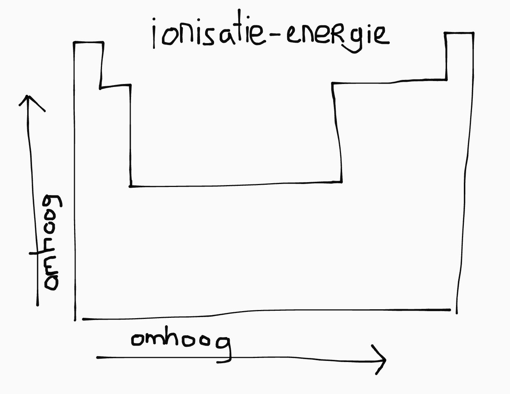

<small>De KLM-schillen van het Bohr-model hebben 2,8,8,18,... elektronen.</small>

De **valentie-elektronen** (val-e-) van een atoom zijn de elektronen in de buitenste schil. Dit zijn de elektronen die bindingen vormen. Stoffen die onder elkaar staan in het periodiek systeem hebben evenveel val-e-.

## Lewisstructuren

Stel je hebt water (\\(\ce{H2O}\\)). Het zuurstofatoom heeft 6 val-e-. De waterstoffen hebben allebei 1 val-e-. Waterstof heeft één elektron te weinig voor edelgasconfiguratie, en zuurstof heeft er twee te weinig:

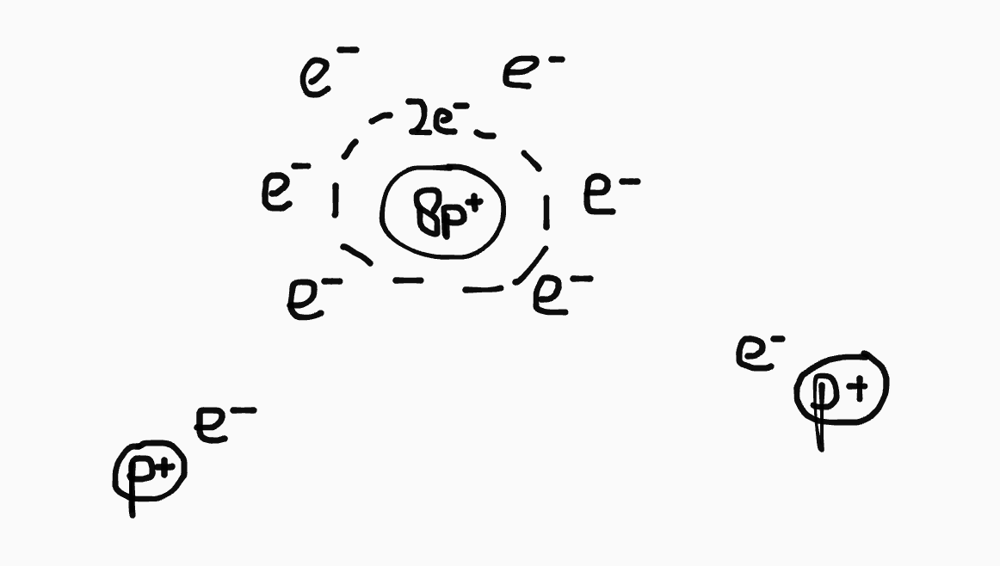

Daardoor ontstaan twee <b style="color:#c996f8">covalente bindingen</b>: de waterstoffen en zuurstof delen hun elektronen, waardoor ze allemaal een gevulde buitenste schil hebben:

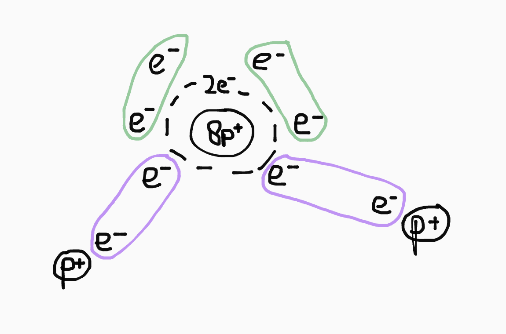

Zoals je ziet heeft zuurstof daarna nog twee <b style="color:#82c996">ongebonden elektronenparen</b> over. Een Lewisstructuur is een notatie om die ongebonden elektronenparen weer te geven:

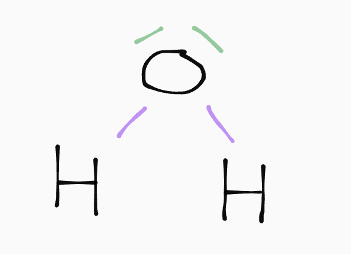

### Lewisstructuur opstellen

Om een Lewisstructuur te tekenen van een molecuul:

- Bereken het totaal aantal val-e- in het molecuul.
- Dit door twee delen geeft het aantal elektronenparen.
- Als je hier het aantal bindingen vanaf haalt houdt je het aantal ongebonden elektronenparen over.

Je kan de ongebonden elektronenparen intekenen met de octetregel: elk atoom (behalve \\(\ce{H}\\), want die is quirky) is omringd door vier paren (bindingen of ongebonden).

### Ionen

In een ion staat het minst elektronegatieve atoom altijd in het midden (elektronegatieve atomen zijn \\(\ce{FONClBrI}\\)). Een ion kan twee soorten lading hebben:

- **Formele lading**: hoeveel elektronen heb je teveel/te weinig?
- **Partiële lading**: de \\(\delta^+\\) en \\(\delta^-\\) uit dipool-dipool interacties.

De formele lading bereken je met de volgende formule:

\\[\text{lading} = \text{val } e^- - \text{niet-bindende } e^- - \text{aantal bindingen}\\]

## VSEPR

VSEPR gaat over ruimtelijkheid bij het tekenen van structuurformules. Afhankelijk van het aantal buren (bindingen of ongebonden elektronenparen) zijn de bindingshoeken anders:

| Aantal&nbsp;buren | Naam | Bindingshoeken | Voorbeeld |
|--|--|--|--|
| 2 | linear | 180&deg; | 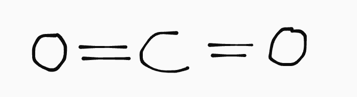 |
| 3 | vlak | 120&deg; | 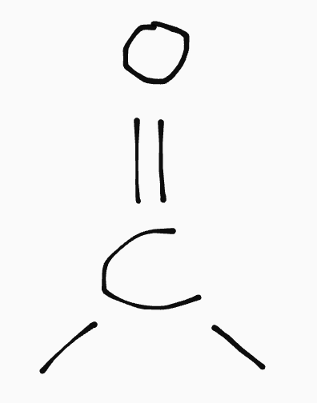 |
| 4 | tetra-eder | 109.5&deg; | 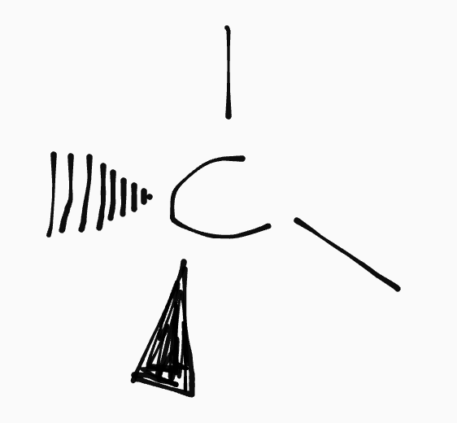 |

Een koolstof met meer dan 4 bindingen is onmogelijk, maar zwavel (\\(\ce{S}\\)) en fosfor (\\(\ce{P}\\)) kunnen wel fking veel bindingen hebben.

## Reactiemechanismes

Reactiemechanismes zijn diagrammen waarin is weergegeven hoe elektronen(paren) bewegen bij reacties. De elektronen bewegen, dus de pijlen gaan van *binding naar atoom*.

### Nucleofiele substitutie

Bij nucleofiele substitutie is er vaak een koolstofatoom met daaraan een halogeen. Dat halogeen wordt gesubstitueerd door een OH-groep:

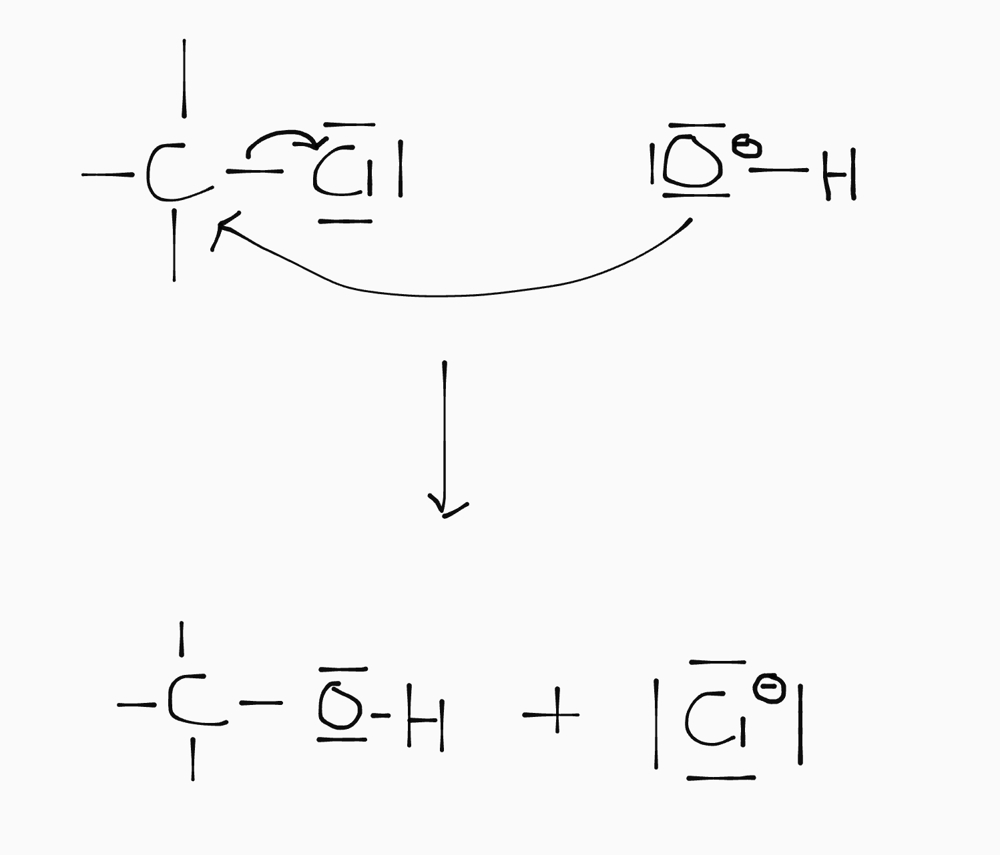

Het koolstofatoom is elektropositief en wil daarom graag een elektronegatiever deeltje; dat noem je elektrofiel. De zuurstof in de OH-groep is elektronegatief en wil graag naar de positieve kern toe; je noemt dit nucleofiel.

### Additie

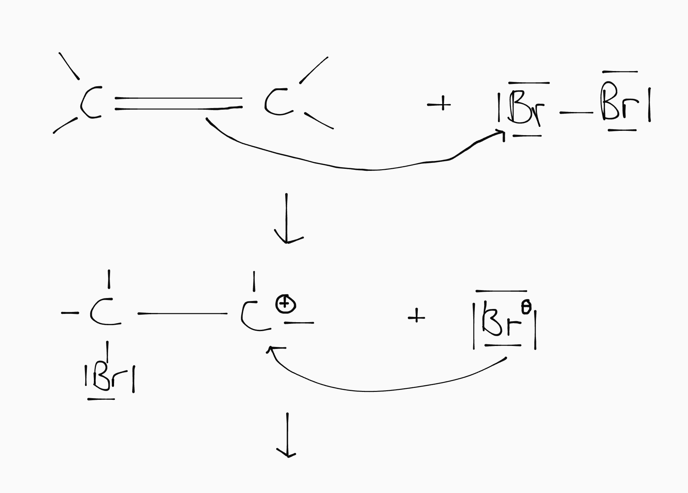
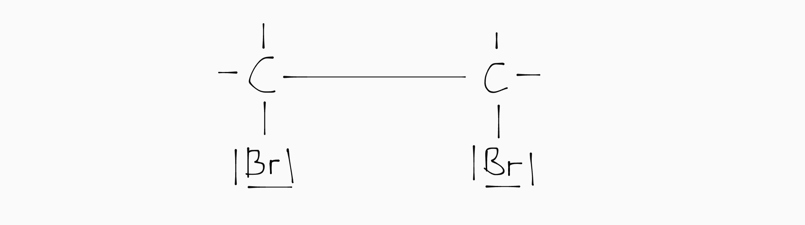

### Esterficatie (<small>zuur gekataliseerd</small>)

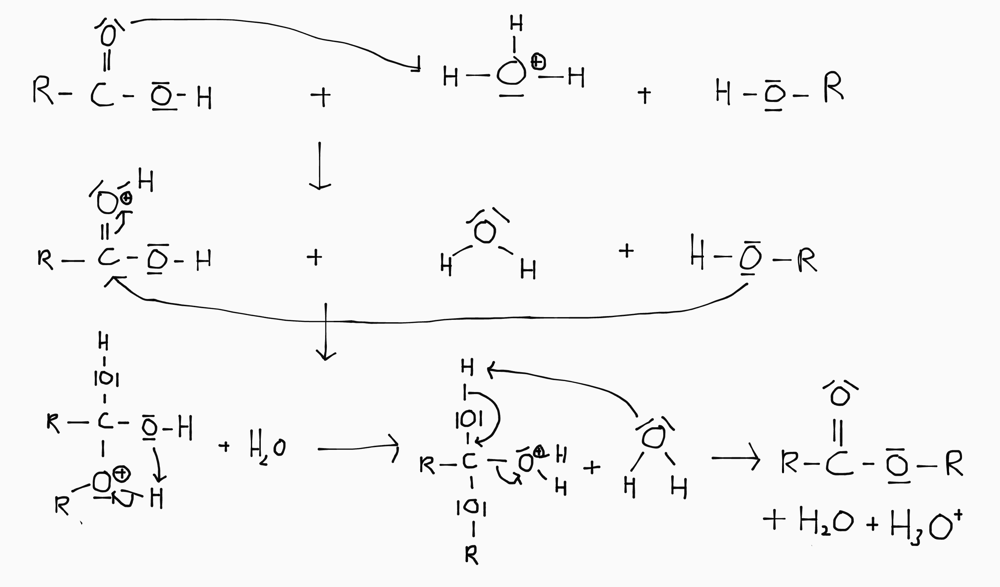

## Analysemethoden

Er zijn twee soorten analysemethoden:

- **Kwantitatief**: hoeveel heb ik van een stof?
- **Walitatief**: welke stof heb ik?

### Titratie (<small>kwantitatief</small>)

Zie [zuur-base](http://localhost:4000/5VWO/TW3/Scheikunde.html#titraties) :). Om eerlijk te zijn betwijfel ik dat we hier toetsvragen over gaan krijgen trouwens.

### Colorimetrie (<small>kwantitatief</small>)

<table style="float:right;max-width:300px;margin: 0 0 1em 2em">
  <thead>
    <tr>
      <th>Ion</th>
      <th>Kleur</th>
    </tr>
  </thead>
  <tbody>
    <tr>
      <td>\(\ce{Cu2+}\)</td>
      <td>blauw</td>
    </tr>
    <tr>
      <td>\(\ce{Fe2+}\)</td>
      <td>groen</td>
    </tr>
    <tr>
      <td>\(\ce{Cu3+}\)</td>
      <td>bruin</td>
    </tr>
  </tbody>
</table>

Bij colorimetrie wordt de concentratie van een oplossing bepaald op basis van de kleur. Een \\(\ce{Cu2+}\\)-opl. met een hogere molariteit is namelijk donkerder blauw.

Hiervoor wordt (wit) licht door een oplossing geschenen en gekeken hoeveel blauw we aan de andere kant oppikken. Hiervoor mag het licht zelf natuurlijk niet al blauw bevatten, dus wordt er een kleurfilter van tegengestelde kleur (monochromator) gebruikt.

Eerst wordt voor een reeks oplossingen met bekende concentratie de **extinctie** (aka hoeveelheid kleur) bepaald, en daarmee een ijklijn opgesteld. Met die ijklijn kan je vervolgens op basis van een gemeten extinctie, de molariteit van een onbekende oplossing bepalen.

### Gaschromatografie (<small>kwantitatief & kwalitatief</small>)

Bij gaschromatografie wordt er een gasstroom (van edelgas, want dat reageert niet) door een buis geduwd. In die gasstroom spuit je de stof in die je wil analyseren. Je sample wordt eerst verhit zodat je een gasmengsel overhoudt.

De buis waardoor je de stof duwt kan polair of apolair zijn. Je gasmengsel gaat het snelst door een kolom van tegengestelde polariteit. (Want polair-polair en apolair-apolair trekken elkaar aan en daardoor remt de buis in die gevallen het gasmengsel af.) Aan het einde van de kolom meet je de rententietijd: de tijd die je stof erover deed door de buis te gaan.

Dus als de kolom polair is en het gasmengsel apolair, is de retentietijd kort. Zelfde voor een apolaire kolom en een polair gasmengsel. Andersom is de retentietijd dus juist lang.

Je kan vervolgens een V,t-diagram maken. Daarin wordt het (deel)volume van het gasmengsel uitgezet tegen de retentietijd. De pieken geven de polariteit van de stoffen in je gasmengsel aan. <!--Als je dus een gasmengsel van twee stoffen hebt, één polair en één apolair, zie je als het goed is twee pieken.-->

Deze methoden is zowel kwalitatief als kwantitatief:

- Op basis van de retentietijd kan je de soort stof (voor een bekende kolom) bepalen.
- De oppervlakte onder de grafiek geeft aan hoeveel je hebt van die stof.

### IR-spectraalanalyse (<small>kwalitatief</small>)

Bij een IR-spectrum schijn je infraroodstraling door een stof heen. Op basis van de intensiteit IR-straling die de stof voor elke frequentie doorlaat (**transmittance**) kan je bepalen welke functionele groepen de stof bevat.

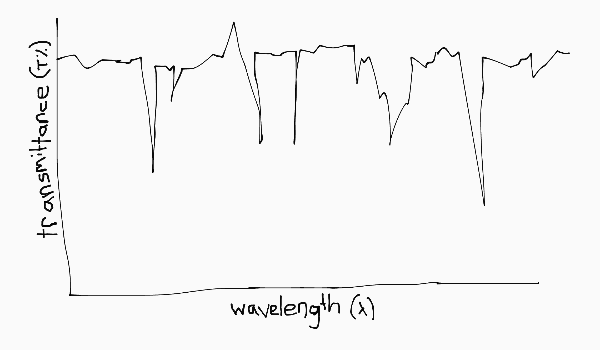

Dit heeft iets te maken met buig- en strekbindingen, maar hoe dit precies werkt hoeven we niet te weten en is ook geen examenstof. De interne werking van de apparatuur zoals die in het boek beschreven staat wordt ook niet getoetst.

### Massaspectrometrie (<small>kwalitatief</small>)

Massaspectrometrie werkt door het beschieten van een stof met deeltjes. Daardoor worden bindingen weggeschoten en wordt de stof gesplitst in een aantal ionen.

Je krijgt een spectrum met pieken bij de molecuulmassa's van de losse stukjes. De hoogte van de piek geeft aan hoeveel van die stukjes er procentueel in het sample zaten.

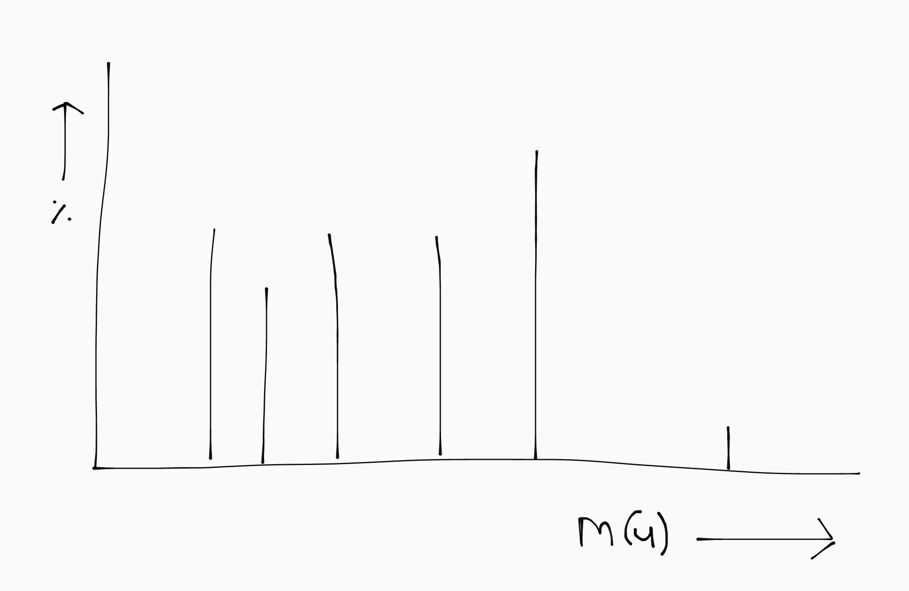

De meest rechter piek is altijd de volledige stof; die piek is klein omdat er maar weinig moleculen helemaal niet geraakt worden.

#### Isotopen

Het kan zijn dat je voor één atoomsoort meerdere pieken krijgt, vanwege isotopen. De hoogte van de piek is dan het voorkomen in de natuur.
